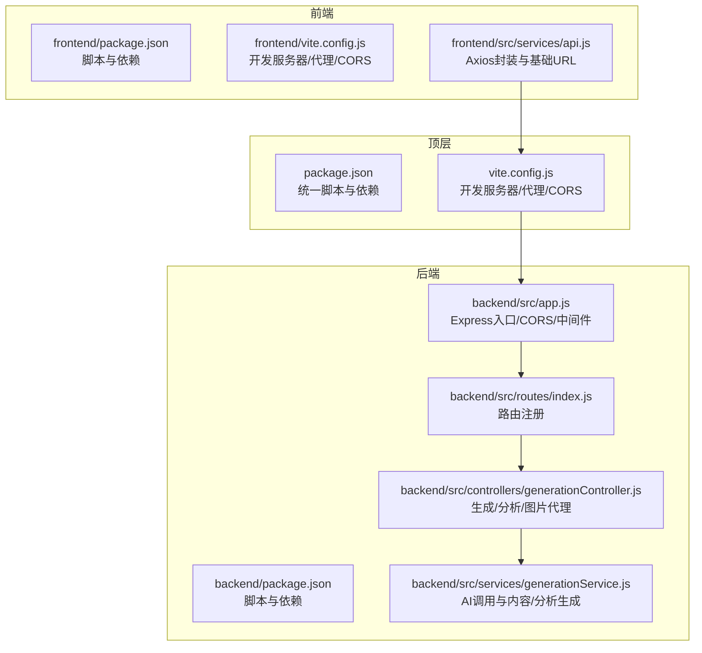
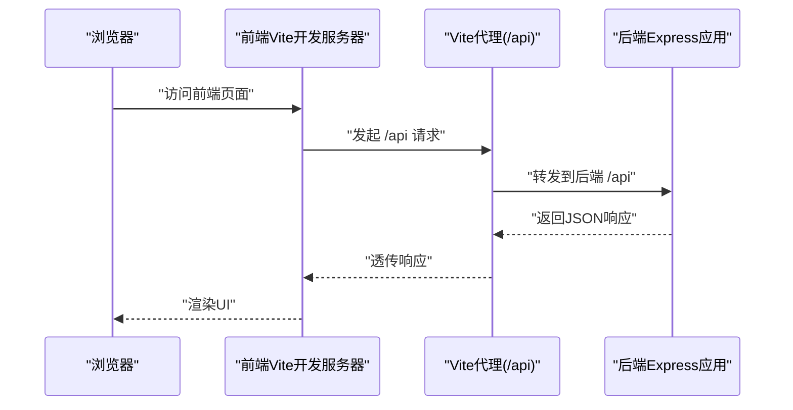
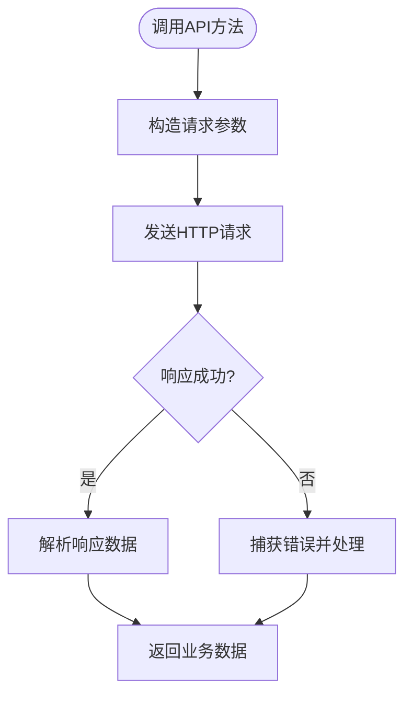
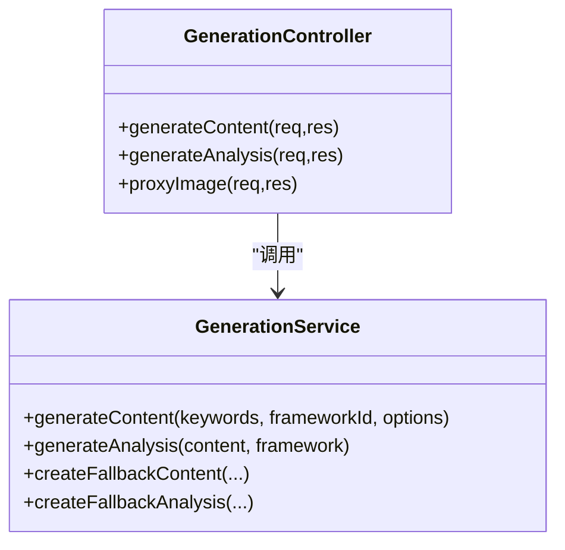
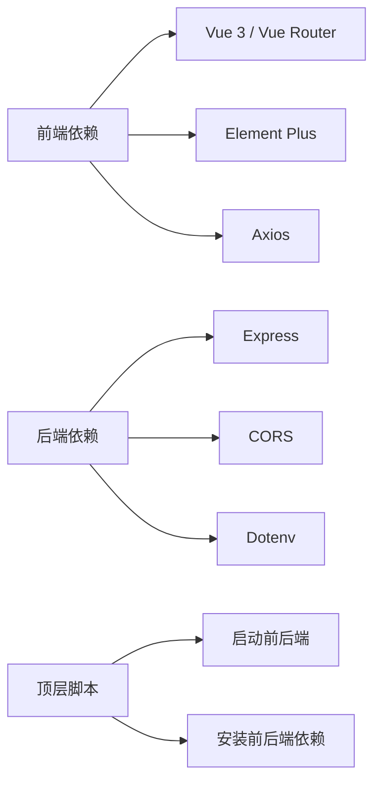

# 测试与部署

<cite>
**本文引用的文件**
- [package.json](file://package.json)
- [frontend/package.json](file://frontend/package.json)
- [backend/package.json](file://backend/package.json)
- [vite.config.js](file://vite.config.js)
- [backend/src/app.js](file://backend/src/app.js)
- [backend/src/routes/index.js](file://backend/src/routes/index.js)
- [backend/src/controllers/generationController.js](file://backend/src/controllers/generationController.js)
- [backend/src/services/generationService.js](file://backend/src/services/generationService.js)
- [frontend/src/services/api.js](file://frontend/src/services/api.js)
- [backend/.env.example](file://backend/.env.example)
</cite>

## 目录
1. [引言](#引言)
2. [项目结构](#项目结构)
3. [核心组件](#核心组件)
4. [架构总览](#架构总览)
5. [详细组件分析](#详细组件分析)
6. [依赖分析](#依赖分析)
7. [性能考虑](#性能考虑)
8. [故障排查指南](#故障排查指南)
9. [结论](#结论)
10. [附录](#附录)

## 引言
本指南面向“小红书文案生成工具”项目，提供从单元测试、集成测试到端到端测试的完整实施路径，涵盖测试框架选择与配置建议；同时给出持续集成（CI）流程设置思路，以及多种部署方案（静态网站托管、Node.js 应用部署、Docker 容器化部署），并包含部署前准备、环境配置、域名与 SSL 设置、以及部署后的监控与维护建议。

## 项目结构
该项目采用前后端分离架构：
- 前端基于 Vue 3 + Vite，通过代理访问后端接口
- 后端基于 Express，提供 REST 接口
- 顶层与前端目录均包含独立的 package.json 和脚本，便于分别开发与构建
- 顶层 vite.config.js 提供开发服务器、代理与 CORS 配置

图表来源
- [frontend/package.json](file://frontend/package.json#L1-L21)
- [frontend/vite.config.js](file://frontend/vite.config.js)
- [frontend/src/services/api.js](file://frontend/src/services/api.js#L1-L40)
- [backend/package.json](file://backend/package.json#L1-L17)
- [backend/src/app.js](file://backend/src/app.js#L1-L26)
- [backend/src/routes/index.js](file://backend/src/routes/index.js#L1-L21)
- [backend/src/controllers/generationController.js](file://backend/src/controllers/generationController.js#L1-L100)
- [backend/src/services/generationService.js](file://backend/src/services/generationService.js#L1-L194)
- [package.json](file://package.json#L1-L32)
- [vite.config.js](file://vite.config.js#L1-L37)

章节来源
- [package.json](file://package.json#L1-L32)
- [frontend/package.json](file://frontend/package.json#L1-L21)
- [backend/package.json](file://backend/package.json#L1-L17)
- [vite.config.js](file://vite.config.js#L1-L37)
- [backend/src/app.js](file://backend/src/app.js#L1-L26)
- [backend/src/routes/index.js](file://backend/src/routes/index.js#L1-L21)
- [frontend/src/services/api.js](file://frontend/src/services/api.js#L1-L40)

## 核心组件
- 前端服务层封装：通过 Axios 创建带基础 URL 的实例，集中处理请求与超时
- 后端路由层：统一暴露 /api 前缀的接口，包括框架查询、关键词分析、内容生成、内容分析、图片代理
- 控制器层：对请求参数进行校验，调用服务层并返回标准化响应
- 服务层：封装 AI 调用与内容/分析生成逻辑，包含降级策略与字段补齐
- 开发服务器与代理：前端开发服务器代理 /api 到后端本地端口，启用 CORS

章节来源
- [frontend/src/services/api.js](file://frontend/src/services/api.js#L1-L40)
- [backend/src/routes/index.js](file://backend/src/routes/index.js#L1-L21)
- [backend/src/controllers/generationController.js](file://backend/src/controllers/generationController.js#L1-L100)
- [backend/src/services/generationService.js](file://backend/src/services/generationService.js#L1-L194)
- [backend/src/app.js](file://backend/src/app.js#L1-L26)
- [vite.config.js](file://vite.config.js#L1-L37)

## 架构总览
下图展示从前端到后端的关键交互流程，包括开发环境下的代理与生产环境下的直接访问。

图表来源
- [vite.config.js](file://vite.config.js#L23-L28)
- [frontend/src/services/api.js](file://frontend/src/services/api.js#L8-L11)
- [backend/src/app.js](file://backend/src/app.js#L20-L24)

## 详细组件分析

### 前端 API 封装与测试要点
- 基础 URL 使用相对路径 /api，确保在代理与生产环境下均可正确路由
- 超时时间设置为 10 秒，避免长时间阻塞
- 建议为每个 API 方法编写单元测试，验证请求参数、响应结构与错误处理

图表来源
- [frontend/src/services/api.js](file://frontend/src/services/api.js#L13-L35)

章节来源
- [frontend/src/services/api.js](file://frontend/src/services/api.js#L1-L40)

### 后端控制器与服务层测试要点
- 控制器需覆盖参数校验、异常捕获与标准响应格式
- 服务层需覆盖 AI 调用失败时的降级逻辑与字段补齐
- 建议使用内存数据库或模拟外部服务进行集成测试

图表来源
- [backend/src/controllers/generationController.js](file://backend/src/controllers/generationController.js#L10-L94)
- [backend/src/services/generationService.js](file://backend/src/services/generationService.js#L63-L192)

章节来源
- [backend/src/controllers/generationController.js](file://backend/src/controllers/generationController.js#L1-L100)
- [backend/src/services/generationService.js](file://backend/src/services/generationService.js#L1-L194)

### 开发服务器与代理配置
- 前端开发服务器启用 CORS 并配置 /api 代理到后端本地端口
- 后端允许指定的 CORS 来源，默认指向前端开发端口
- 建议在 CI 中使用相同代理规则，保证端到端测试一致性

章节来源
- [vite.config.js](file://vite.config.js#L11-L28)
- [backend/src/app.js](file://backend/src/app.js#L14-L16)
- [backend/.env.example](file://backend/.env.example#L1-L3)

## 依赖分析
- 前端依赖 Vue 3、Vue Router、Element Plus、Axios 等，构建工具为 Vite
- 后端依赖 Express、CORS、Dotenv 等，提供 REST 接口
- 顶层 package.json 提供统一脚本，便于一键启动前后端

图表来源
- [frontend/package.json](file://frontend/package.json#L10-L19)
- [backend/package.json](file://backend/package.json#L10-L15)
- [package.json](file://package.json#L6-L13)

章节来源
- [frontend/package.json](file://frontend/package.json#L1-L21)
- [backend/package.json](file://backend/package.json#L1-L17)
- [package.json](file://package.json#L1-L32)

## 性能考虑
- 前端构建产物应启用压缩与资源优化，减少首屏加载时间
- 后端接口应限制并发与超时，避免上游 AI 服务抖动影响整体可用性
- 在 CI 中引入缓存策略（如 npm/pnpm 缓存）以缩短构建时间
- 对图片代理接口设置合理的超时与重试策略，避免阻塞主流程

## 故障排查指南
- 端口冲突：确认前端开发端口与后端监听端口未被占用
- CORS 错误：核对后端 CORS 配置与前端基础 URL
- 代理不通：检查 Vite 代理配置是否指向正确的后端地址
- 环境变量：确保后端 .env 文件存在且包含必要键值
- AI 服务不可用：服务层已内置降级逻辑，若仍失败，检查网络连通性与凭据

章节来源
- [backend/src/app.js](file://backend/src/app.js#L12-L16)
- [vite.config.js](file://vite.config.js#L23-L28)
- [backend/.env.example](file://backend/.env.example#L1-L3)
- [backend/src/services/generationService.js](file://backend/src/services/generationService.js#L90-L94)

## 结论
本项目具备清晰的前后端分离架构与完善的开发代理配置，适合采用模块化的测试策略与多样的部署方案。通过在 CI 中统一测试与构建流程，结合静态托管或容器化部署，可实现高效、稳定的交付与运维。

## 附录

### 测试与部署实施清单

- 单元测试
  - 前端：为 API 封装与 UI 组件编写单元测试，覆盖请求参数、响应结构与边界条件
  - 后端：为控制器与服务层编写单元测试，重点覆盖参数校验、异常处理与降级逻辑
  - 建议框架：Jest（Node 环境）、Vitest（前端环境）

- 集成测试
  - 前后端联调：使用代理规则与本地数据库/模拟服务，验证接口契约与数据流转
  - 关键场景：关键词分析、内容生成、内容分析、图片代理

- 端到端测试
  - 建议框架：Cypress 或 Playwright
  - 场景：登录/鉴权（如有）、生成流程全链路、导出与预览

- 持续集成（CI）
  - 步骤建议：安装依赖 → Lint 与格式检查 → 单元测试 → 集成测试 → 构建前端产物 → 部署（可选）
  - 工具：GitHub Actions、GitLab CI、Jenkins 等
  - 建议缓存：npm/pnpm 缓存、浏览器缓存

- 部署方案
  - 静态网站托管（Vercel/Netlify）
    - 前端构建产物上传，后端通过反向代理或无服务器函数提供 /api
    - 配置环境变量与 CORS
  - Node.js 应用部署
    - 后端打包为可执行包，前端构建产物作为静态资源由后端提供或单独托管
    - 配置进程管理与健康检查
  - Docker 容器化部署
    - 前后端分别构建镜像，或使用多阶段构建
    - 通过反向代理（Nginx）统一对外暴露端口与静态资源

- 部署前准备
  - 环境变量：后端端口、CORS 来源、AI 服务凭据
  - 域名与 SSL：配置 DNS、HTTPS 证书与安全头
  - 备份策略：数据库与日志备份计划

- 部署后监控与维护
  - 监控指标：响应时间、错误率、资源使用率
  - 日志聚合：统一收集前后端日志
  - 回滚策略：蓝绿/金丝雀发布与快速回滚