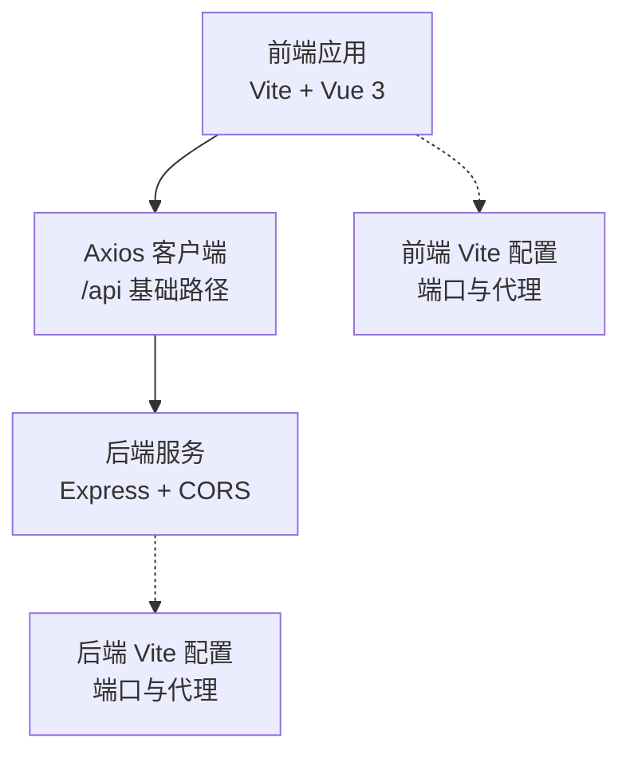
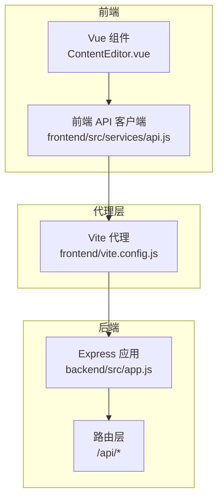
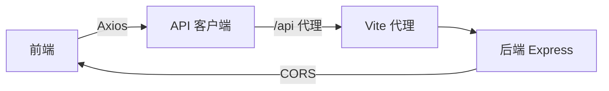

# 测试指南

<cite>
**本文引用的文件**
- [package.json](file://package.json)
- [frontend/package.json](file://frontend/package.json)
- [backend/package.json](file://backend/package.json)
- [vite.config.js](file://vite.config.js)
- [frontend/vite.config.js](file://frontend/vite.config.js)
- [backend/src/app.js](file://backend/src/app.js)
- [src/services/api.js](file://src/services/api.js)
- [frontend/src/services/api.js](file://frontend/src/services/api.js)
- [src/components/ContentEditor.vue](file://src/components/ContentEditor.vue)
- [frontend/src/components/ContentEditor.vue](file://frontend/src/components/ContentEditor.vue)
</cite>

## 目录
1. [简介](#简介)
2. [项目结构](#项目结构)
3. [核心组件](#核心组件)
4. [架构总览](#架构总览)
5. [详细组件分析](#详细组件分析)
6. [依赖分析](#依赖分析)
7. [性能考虑](#性能考虑)
8. [故障排查指南](#故障排查指南)
9. [结论](#结论)
10. [附录](#附录)

## 简介
本测试指南面向 Vue 前端应用与 Node.js 后端服务，提供系统化的测试策略与实施方法，覆盖单元测试、API 接口测试与服务层测试。文档同时给出测试框架选型建议（后端 Jest、前端 Vitest、端到端 Cypress）、测试环境配置、Mock 数据准备、测试覆盖率统计、断言与异步测试处理规范，以及在持续集成中自动化测试的流程配置思路。

## 项目结构
该项目采用前后端分离架构：
- 前端基于 Vite + Vue 3，使用 Axios 进行 API 请求，组件通过 props/emit 与父级交互。
- 后端基于 Express，提供 RESTful 接口，使用 CORS 中间件允许跨域访问。
- 两套 Vite 配置分别服务于根目录与前端子目录，前端代理指向后端服务端口。

图表来源
- [vite.config.js](file://vite.config.js#L1-L37)
- [frontend/vite.config.js](file://frontend/vite.config.js#L1-L19)
- [backend/src/app.js](file://backend/src/app.js#L1-L26)

章节来源
- [package.json](file://package.json#L1-L32)
- [frontend/package.json](file://frontend/package.json#L1-L21)
- [backend/package.json](file://backend/package.json#L1-L17)
- [vite.config.js](file://vite.config.js#L1-L37)
- [frontend/vite.config.js](file://frontend/vite.config.js#L1-L19)
- [backend/src/app.js](file://backend/src/app.js#L1-L26)

## 核心组件
- 前端 API 客户端：封装 /api 前缀的请求，便于统一 Mock 与替换。
- 后端应用入口：启用 CORS、JSON 解析与路由挂载。
- Vue 组件：负责 UI 渲染、事件处理与与父组件通信；包含图片下载、Markdown 预览、标签管理等交互逻辑。

章节来源
- [src/services/api.js](file://src/services/api.js#L1-L454)
- [frontend/src/services/api.js](file://frontend/src/services/api.js#L1-L40)
- [backend/src/app.js](file://backend/src/app.js#L1-L26)
- [src/components/ContentEditor.vue](file://src/components/ContentEditor.vue#L1-L418)
- [frontend/src/components/ContentEditor.vue](file://frontend/src/components/ContentEditor.vue#L1-L195)

## 架构总览
下图展示了前端组件、API 客户端与后端服务之间的交互关系，以及代理与跨域配置对测试的影响。

图表来源
- [frontend/src/services/api.js](file://frontend/src/services/api.js#L1-L40)
- [frontend/vite.config.js](file://frontend/vite.config.js#L1-L19)
- [backend/src/app.js](file://backend/src/app.js#L1-L26)

## 详细组件分析

### 前端 API 客户端测试（单元测试）
- 目标：验证前端 API 客户端对后端接口的封装行为，确保请求参数、URL 拼装与响应格式正确。
- 关键点：
  - 使用 Axios Mock（如 vitest-fetch-mock 或 axios-mock-adapter）拦截 /api 前缀请求。
  - 验证 GET/POST 参数传递、headers 注入、错误处理分支。
  - 对于流式响应（后端未实现）可模拟 Promise 返回值以覆盖非流式分支。
- 断言建议：
  - 使用 toHaveBeenCalledWith 验证请求参数。
  - 使用 toEqual/toHaveProperty 验证响应结构。
- 异步测试：
  - 使用 async/await 或 Promise 风格断言，确保异步调用完成后再断言。

章节来源
- [frontend/src/services/api.js](file://frontend/src/services/api.js#L1-L40)

### Vue 组件测试（单元测试）
- 目标：验证组件的渲染、事件触发、props/emit 行为与交互逻辑。
- 关键点：
  - 使用 Vitest + @vue/test-utils 或 @testing-library/vue。
  - Mock 组件外部依赖（如 API 客户端、Markdown 渲染器）。
  - 测试 props 变化、watchers、emit 事件、用户交互（点击、输入）。
- 示例关注点：
  - ContentEditor.vue 的标签增删、预览切换、重新生成、审批发布弹窗显示。
  - 图片下载流程（fetch、blob、下载链接生成）。
- 断言建议：
  - 使用屏幕查询器断言 DOM 结构与文本。
  - 使用 vi.spyOn 监控 emits 与外部函数调用。
- 异步测试：
  - 使用 flushPromises 或 nextTick 等待异步更新。

章节来源
- [src/components/ContentEditor.vue](file://src/components/ContentEditor.vue#L1-L418)
- [frontend/src/components/ContentEditor.vue](file://frontend/src/components/ContentEditor.vue#L1-L195)

### 后端服务测试（单元测试 + 集成测试）
- 目标：验证路由、中间件、CORS、JSON 解析与业务控制器的行为。
- 关键点：
  - 使用 Jest + supertest 或直接注入路由到内存应用实例。
  - 验证 /api/* 路由的请求/响应、CORS 头、错误处理。
  - 对外依赖（如 AI/图片服务）使用 Mock 或 Test Doubles。
- 断言建议：
  - 使用 expect(status).toBe(...)、expect(body).toHaveProperty(...)。
- 异步测试：
  - 使用 async/await 处理中间件与控制器异步逻辑。

章节来源
- [backend/src/app.js](file://backend/src/app.js#L1-L26)

### 端到端测试（E2E）
- 目标：验证从浏览器到后端的真实交互链路，包括登录、生成、预览、下载等完整流程。
- 工具建议：Cypress（功能丰富、调试友好）。
- 关键场景：
  - 输入关键词 -> 分析推荐 -> 生成文案 -> 预览 Markdown -> 下载图片。
  - Mock 后端接口，保证测试稳定性与速度。
- 断言建议：
  - 断言页面元素可见性、文本内容、网络请求次数与负载。

## 依赖分析
- 前端依赖 Axios 用于 HTTP 请求，需在测试中统一 Mock。
- 后端依赖 Express、CORS、dotenv，测试中可通过环境变量与中间件替换实现隔离。
- Vite 代理配置影响测试时的请求路径与跨域行为，需在测试环境中同步配置。

图表来源
- [src/services/api.js](file://src/services/api.js#L1-L454)
- [frontend/src/services/api.js](file://frontend/src/services/api.js#L1-L40)
- [vite.config.js](file://vite.config.js#L1-L37)
- [frontend/vite.config.js](file://frontend/vite.config.js#L1-L19)
- [backend/src/app.js](file://backend/src/app.js#L1-L26)

章节来源
- [src/services/api.js](file://src/services/api.js#L1-L454)
- [frontend/src/services/api.js](file://frontend/src/services/api.js#L1-L40)
- [vite.config.js](file://vite.config.js#L1-L37)
- [frontend/vite.config.js](file://frontend/vite.config.js#L1-L19)
- [backend/src/app.js](file://backend/src/app.js#L1-L26)

## 性能考虑
- 单测优先：组件与服务层测试快速反馈，减少集成成本。
- Mock 外部依赖：避免真实网络请求，缩短测试时间并提升稳定性。
- 并行执行：合理拆分测试文件，利用 Vitest/Jest 的并发能力。
- 覆盖率阈值：为关键模块设置最小覆盖率阈值，保证核心逻辑被覆盖。

## 故障排查指南
- 跨域问题（CORS）：
  - 确认后端 CORS 配置允许前端地址；测试环境可放宽 origin。
- 代理问题：
  - 前端 Vite 代理需指向正确的后端端口；若代理失效，请求会直连后端导致 404。
- 环境变量缺失：
  - AI/图片服务的 API Key、Base URL 在测试中需提供默认值或 Mock。
- 异步测试未完成：
  - 确保等待 Promise 完成（flushPromises、nextTick）再断言。

章节来源
- [backend/src/app.js](file://backend/src/app.js#L1-L26)
- [vite.config.js](file://vite.config.js#L1-L37)
- [frontend/vite.config.js](file://frontend/vite.config.js#L1-L19)

## 结论
通过明确的测试分层（单元、集成、E2E）与合适的测试框架，结合 Mock 与代理配置，可在保证质量的同时显著提升开发效率。建议在 CI 中执行全量测试并输出覆盖率报告，形成持续改进闭环。

## 附录

### 测试框架与脚本建议
- 后端测试：Jest（单元/集成测试），结合 supertest 或直接注入路由实例。
- 前端测试：Vitest（单元测试），@vue/test-utils 或 @testing-library/vue；Cypress（E2E）。
- 脚本建议：
  - 前端：test:unit、test:e2e、test:coverage。
  - 后端：test、test:watch、test:coverage。
  - 项目：dev:all（并行启动前端与后端）。

章节来源
- [package.json](file://package.json#L1-L32)
- [frontend/package.json](file://frontend/package.json#L1-L21)
- [backend/package.json](file://backend/package.json#L1-L17)

### 测试环境配置要点
- 环境变量：
  - 前端：VITE_AI_BASE_URL、VITE_AI_API_KEY、VITE_VOLCENGINE_BASE_URL 等。
  - 后端：PORT、CORS_ORIGIN。
- 代理与跨域：
  - 前端 Vite 代理将 /api 转发至后端端口。
  - 后端启用 CORS 并允许前端 origin。
- Mock 数据：
  - 使用 Mock Service Worker（MSW）或框架内置 Mock，确保稳定可重复。

章节来源
- [src/services/api.js](file://src/services/api.js#L1-L454)
- [frontend/src/services/api.js](file://frontend/src/services/api.js#L1-L40)
- [vite.config.js](file://vite.config.js#L1-L37)
- [frontend/vite.config.js](file://frontend/vite.config.js#L1-L19)
- [backend/src/app.js](file://backend/src/app.js#L1-L26)

### 测试覆盖率统计
- 建议：
  - 前端：覆盖率指标（lines、functions、statements、branches）均不低于 80%。
  - 后端：同上，重点覆盖路由与控制器逻辑。
- 工具：
  - Vitest/Jest 内置覆盖率输出；CI 中可上传至覆盖率平台（如 Codecov）。

### 测试用例编写规范与断言方法
- 规范：
  - 每个模块至少包含正常路径、边界条件与错误路径的测试。
  - 使用 describe/it/test 分组组织用例，命名清晰表达意图。
- 断言：
  - 前端：屏幕查询器断言 DOM，spyOn 监控 emits 与副作用。
  - 后端：断言状态码、响应体字段与 headers。
- 异步测试：
  - 使用 async/await 或 Promise 风格；确保等待异步操作完成。

### 持续集成中的自动化测试流程
- 建议步骤：
  - 安装依赖（前端与后端分别安装）。
  - 启动后端服务或使用 Mock。
  - 运行前端与后端测试。
  - 收集并上传覆盖率报告。
- 触发条件：
  - PR/MR 自动运行单元与 E2E 测试；主干合并前要求通过。