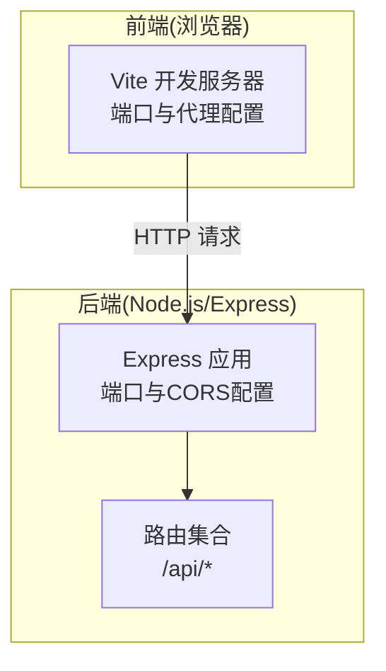
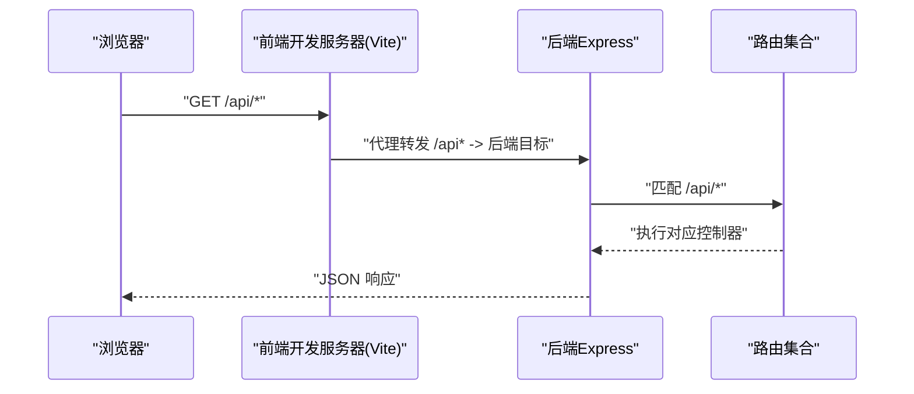
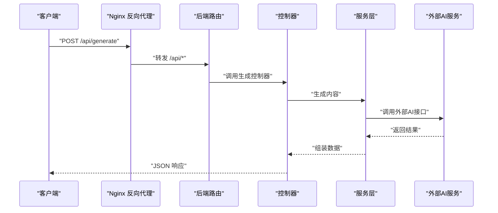
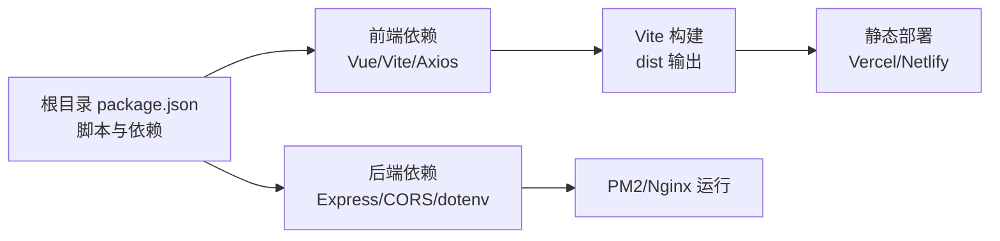

# 部署指南

<cite>
**本文引用的文件**
- [README.md](file://README.md)
- [package.json](file://package.json)
- [vite.config.js](file://vite.config.js)
- [docs/GUIDE.md](file://docs/GUIDE.md)
- [.env.example](file://.env.example)
- [backend/.env.example](file://backend/.env.example)
- [backend/.env](file://backend/.env)
- [backend/package.json](file://backend/package.json)
- [backend/src/app.js](file://backend/src/app.js)
- [backend/src/routes/index.js](file://backend/src/routes/index.js)
- [backend/src/services/aiService.js](file://backend/src/services/aiService.js)
- [backend/src/controllers/generationController.js](file://backend/src/controllers/generationController.js)
</cite>

## 目录
1. [简介](#简介)
2. [项目结构](#项目结构)
3. [核心组件](#核心组件)
4. [架构总览](#架构总览)
5. [详细组件分析](#详细组件分析)
6. [依赖关系分析](#依赖关系分析)
7. [性能考虑](#性能考虑)
8. [故障排查指南](#故障排查指南)
9. [结论](#结论)
10. [附录](#附录)

## 简介
本指南面向部署 Nixtio AI 爆款创作工作台（前后端分离的 Vue 3 + Node.js/Express 应用），提供从静态网站部署（Vercel、Netlify、GitHub Pages）、Node.js 应用部署（含 PM2 进程管理与 Nginx 反向代理）、到 Docker 容器化部署（含 Dockerfile 与 docker-compose）的完整方案，并补充生产环境 SSL、域名绑定、CDN 加速、监控与日志、性能优化等最佳实践。

## 项目结构
项目采用前后端分离架构：
- 前端：Vue 3 + Vite，开发服务器默认端口与代理配置见根目录与前端独立配置文件。
- 后端：Node.js + Express，提供 REST API，路由集中在后端 routes 目录。
- 根目录提供统一安装与开发脚本，便于一键启动前后端。

图表来源
- [vite.config.js](file://vite.config.js#L11-L29)
- [backend/src/app.js](file://backend/src/app.js#L12-L24)
- [backend/src/routes/index.js](file://backend/src/routes/index.js#L9-L18)

章节来源
- [README.md](file://README.md#L13-L22)
- [package.json](file://package.json#L6-L13)
- [vite.config.js](file://vite.config.js#L11-L29)
- [backend/src/app.js](file://backend/src/app.js#L12-L24)
- [backend/src/routes/index.js](file://backend/src/routes/index.js#L9-L18)

## 核心组件
- 前端开发服务器与代理
  - 默认开发端口与代理目标由 Vite 配置决定，开发阶段通过代理将 /api 请求转发至后端。
- 后端服务
  - Express 应用监听端口与 CORS 来源可由环境变量控制；提供 /api 路由集合。
- 构建与发布
  - 文档提供了静态构建产物 dist 的部署方式与平台命令（Vercel、Netlify）。

章节来源
- [vite.config.js](file://vite.config.js#L11-L29)
- [backend/src/app.js](file://backend/src/app.js#L12-L24)
- [backend/src/routes/index.js](file://backend/src/routes/index.js#L9-L18)
- [docs/GUIDE.md](file://docs/GUIDE.md#L364-L380)

## 架构总览
下图展示了从浏览器到后端 API 的典型请求路径，以及开发阶段的代理行为。

图表来源
- [vite.config.js](file://vite.config.js#L23-L28)
- [backend/src/routes/index.js](file://backend/src/routes/index.js#L9-L18)
- [backend/src/app.js](file://backend/src/app.js#L20-L24)

## 详细组件分析

### 静态网站部署（Vercel、Netlify、GitHub Pages）
- 构建产物
  - 使用包管理脚本构建生产版本，产物输出至 dist 目录。
- 平台部署
  - Vercel：使用 vercel CLI 一键部署。
  - Netlify：使用 netlify deploy 指定 dist 目录进行生产部署。
- 环境变量
  - 前端运行时环境变量（以 VITE_ 开头）在构建时注入，需在各平台的构建环境中配置。
  - 示例变量包括 AI API 访问密钥、基础地址、模型名称等。

章节来源
- [docs/GUIDE.md](file://docs/GUIDE.md#L350-L380)
- [.env.example](file://.env.example#L1-L9)

### Node.js 应用部署（服务器环境准备、PM2、Nginx 反向代理）
- 服务器环境准备
  - 安装 Node.js 运行时与包管理器（如 pnpm/npm）。
  - 准备系统服务账户与日志目录，确保非 root 用户权限。
- 后端启动与端口
  - 后端默认监听端口可通过环境变量配置；开发阶段默认端口与代理目标见后端配置。
- PM2 进程管理
  - 使用 PM2 启动后端服务，设置应用名称、日志路径、自动重启策略与环境变量。
  - 建议将后端脚本与环境变量写入 PM2 ecosystem 配置文件。
- Nginx 反向代理
  - 将前端静态资源指向 dist 目录；将 /api 前缀代理至后端服务端口。
  - 配置 HTTPS、缓存与安全头，启用 gzip/HTTP/2。
- 域名与 SSL
  - 通过 Nginx 配置域名与证书路径；可结合 Let’s Encrypt 自动续期。
- CDN 加速
  - 将静态资源托管于 CDN，缩短边缘节点到用户的距离；配合缓存策略与压缩。

章节来源
- [backend/src/app.js](file://backend/src/app.js#L12-L24)
- [backend/.env](file://backend/.env#L3-L4)
- [backend/package.json](file://backend/package.json#L7-L8)

### Docker 容器化部署（Dockerfile、docker-compose、镜像构建与发布）
- 多阶段构建思路
  - 基础镜像：Node.js 或官方 Node 镜像作为构建环境。
  - 构建阶段：安装依赖、执行构建，产出 dist。
  - 运行阶段：使用轻量级运行时镜像（如 node:alpine），仅复制 dist 与运行时依赖。
- Dockerfile 关键点
  - 设置工作目录与环境变量（NODE_ENV=production）。
  - 复制依赖清单与安装依赖，再复制源码与构建产物。
  - 暴露应用端口（来自后端配置）。
  - 使用非 root 用户运行。
- docker-compose
  - 定义前端与后端服务，挂载卷用于开发或持久化日志。
  - 配置网络与端口映射，连接数据库（如需要）。
- 镜像构建与发布
  - 构建镜像并推送到私有或公共仓库；在生产环境拉取并运行。

章节来源
- [backend/src/app.js](file://backend/src/app.js#L12-L24)
- [backend/package.json](file://backend/package.json#L7-L8)

### 生产环境配置要点
- 环境变量
  - 后端：PORT、CORS_ORIGIN 等。
  - 前端：VITE_AI_API_KEY、VITE_AI_BASE_URL、VITE_AI_MODEL、VITE_VOLCENGINE_* 等。
- 安全与性能
  - 启用 HTTPS、HSTS、CSP、X-Frame-Options 等安全头。
  - 启用 gzip/br 压缩、静态资源缓存策略、合理缓存控制。
- 监控与日志
  - 后端：接入日志聚合（如 ELK/Cloud Logging），记录请求链路与错误。
  - 前端：上报关键错误与性能指标（如 FCP/LCP）。
- 域名与 CDN
  - 域名解析到 CDN 或负载均衡；CDN 缓存静态资源与 API 响应（视业务而定）。

章节来源
- [.env.example](file://.env.example#L1-L9)
- [backend/.env.example](file://backend/.env.example#L1-L3)

### API 流程与数据流
- 关键接口
  - 获取框架列表与详情、关键词分析、内容生成、质量分析、图片代理下载。
- 数据流
  - 前端发起 /api 请求，经 Nginx 代理至后端；后端路由匹配控制器，调用服务层完成业务处理与外部 API 调用。

图表来源
- [backend/src/routes/index.js](file://backend/src/routes/index.js#L11-L16)
- [backend/src/controllers/generationController.js](file://backend/src/controllers/generationController.js#L10-L33)
- [backend/src/services/aiService.js](file://backend/src/services/aiService.js#L14-L53)

## 依赖关系分析
- 前端依赖
  - Vue 3、Vite、Axios、路由等，开发与生产构建由 Vite 驱动。
- 后端依赖
  - Express、CORS、dotenv、Axios，负责路由、中间件与外部服务调用。
- 构建与部署
  - 根目录脚本统一安装与启动；文档提供静态部署命令。

图表来源
- [package.json](file://package.json#L6-L13)
- [backend/package.json](file://backend/package.json#L10-L15)
- [docs/GUIDE.md](file://docs/GUIDE.md#L350-L380)

章节来源
- [package.json](file://package.json#L15-L30)
- [backend/package.json](file://backend/package.json#L10-L15)
- [docs/GUIDE.md](file://docs/GUIDE.md#L350-L380)

## 性能考虑
- 前端
  - 代码分割、懒加载组件、图片优化（格式与尺寸）、启用压缩与缓存。
- 后端
  - 合理超时与重试、连接池复用、限流与熔断、异步处理耗时任务。
- 网络与传输
  - 启用 HTTP/2、Brotli/Gzip 压缩、CDN 边缘缓存。
- 监控与观测
  - 指标采集（QPS、P95/P99、错误率）、日志聚合、分布式追踪。

## 故障排查指南
- CORS 与代理问题
  - 确认后端 CORS 来源与前端代理目标一致；开发阶段检查 Vite 代理配置。
- 端口占用与权限
  - 后端端口冲突或权限不足会导致启动失败；使用非 root 用户并调整端口。
- 环境变量缺失
  - 前端 Vite 环境变量未注入会导致运行时错误；在平台构建环境补齐。
- 外部服务调用失败
  - 检查外部 AI 服务的鉴权头、超时与重试策略；关注响应状态与错误日志。

章节来源
- [backend/src/app.js](file://backend/src/app.js#L14-L16)
- [vite.config.js](file://vite.config.js#L23-L28)
- [backend/src/services/aiService.js](file://backend/src/services/aiService.js#L45-L52)

## 结论
本指南提供了从静态部署到容器化的一站式部署方案，并结合生产环境的安全、性能与可观测性建议。建议在正式上线前完成环境变量梳理、SSL 与 CDN 配置、监控与日志体系搭建，并进行压测与回滚预案演练。

## 附录
- 快速参考
  - 前端构建与预览：使用根目录脚本一键安装与启动。
  - 后端启动：使用后端脚本启动生产模式。
  - 静态部署：使用文档提供的平台命令部署 dist 目录。
- 参考实现位置
  - 前端开发服务器与代理：[vite.config.js](file://vite.config.js#L11-L29)
  - 后端应用入口与端口：[backend/src/app.js](file://backend/src/app.js#L12-L24)
  - 后端路由集合：[backend/src/routes/index.js](file://backend/src/routes/index.js#L9-L18)
  - 构建与部署命令：[docs/GUIDE.md](file://docs/GUIDE.md#L350-L380)
  - 前端环境变量示例：[.env.example](file://.env.example#L1-L9)
  - 后端环境变量示例：[backend/.env.example](file://backend/.env.example#L1-L3)