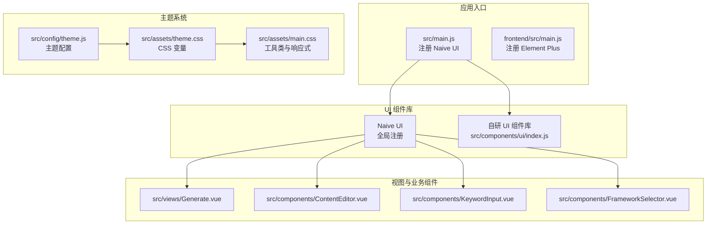
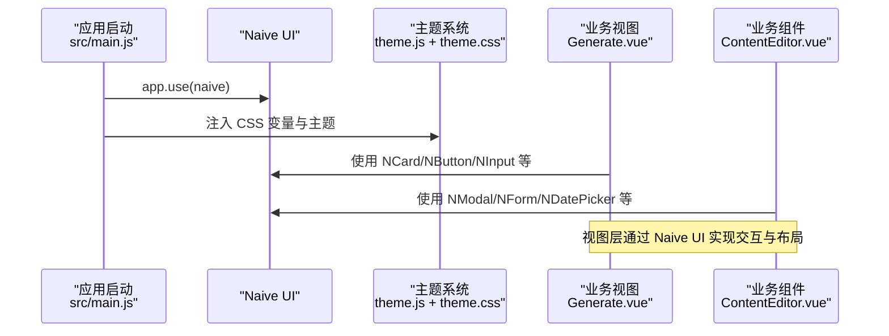
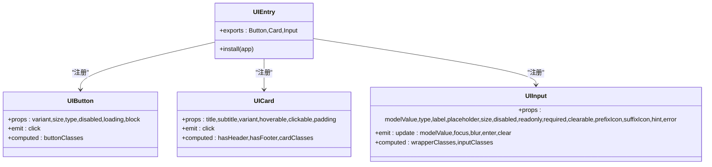
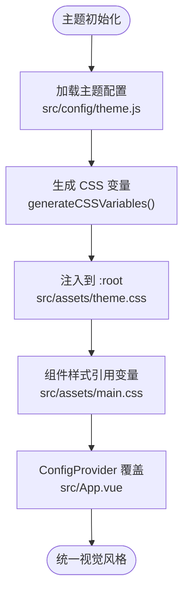
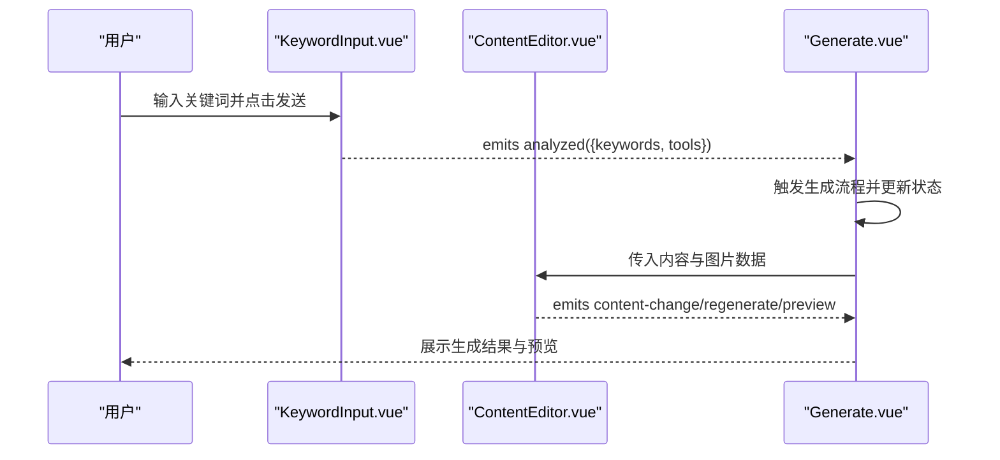
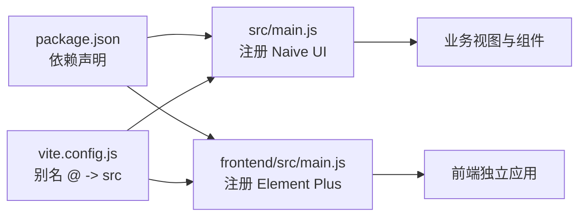

# UI组件集成

<cite>
**本文引用的文件**
- [package.json](file://package.json)
- [frontend/package.json](file://frontend/package.json)
- [vite.config.js](file://vite.config.js)
- [src/main.js](file://src/main.js)
- [frontend/src/main.js](file://frontend/src/main.js)
- [src/App.vue](file://src/App.vue)
- [src/components/ui/index.js](file://src/components/ui/index.js)
- [src/components/ui/Button.vue](file://src/components/ui/Button.vue)
- [src/components/ui/Card.vue](file://src/components/ui/Card.vue)
- [src/components/ui/Input.vue](file://src/components/ui/Input.vue)
- [src/config/theme.js](file://src/config/theme.js)
- [src/assets/theme.css](file://src/assets/theme.css)
- [src/assets/main.css](file://src/assets/main.css)
- [src/views/Generate.vue](file://src/views/Generate.vue)
- [src/components/ContentEditor.vue](file://src/components/ContentEditor.vue)
- [src/components/KeywordInput.vue](file://src/components/KeywordInput.vue)
- [src/components/FrameworkSelector.vue](file://src/components/FrameworkSelector.vue)
</cite>

## 目录
1. [简介](#简介)
2. [项目结构](#项目结构)
3. [核心组件](#核心组件)
4. [架构总览](#架构总览)
5. [详细组件分析](#详细组件分析)
6. [依赖关系分析](#依赖关系分析)
7. [性能考虑](#性能考虑)
8. [故障排查指南](#故障排查指南)
9. [结论](#结论)
10. [附录](#附录)

## 简介
本指南面向在项目中集成与使用 Naive UI 组件库，并结合项目现有的自研 UI 组件体系，提供从安装配置、按需引入到全局注册的完整实践路径；同时给出基于 Naive UI 的二次封装思路、样式覆盖与主题定制、响应式设计实现方法，并通过具体示例展示如何将第三方 UI 组件与现有组件体系融合。

## 项目结构
项目采用前后端同仓库组织，前端使用 Vite + Vue 3 技术栈，UI 层同时使用了 Naive UI 与自研 UI 组件库。关键位置如下：
- 顶层 package.json：声明了 Naive UI、Element Plus、Vue 等依赖，体现项目整体技术栈。
- frontend/package.json：前端独立应用，使用 Element Plus。
- src/main.js：在根应用中全局注册并启用 Naive UI。
- src/components/ui：自研 UI 组件库入口与实现。
- src/config/theme.js 与 src/assets/theme.css：统一的主题变量与 CSS 变量生成。
- src/views 与各业务组件：大量使用 Naive UI 组件构建页面与交互。

图表来源
- [src/main.js](file://src/main.js#L1-L16)
- [frontend/src/main.js](file://frontend/src/main.js#L1-L15)
- [src/components/ui/index.js](file://src/components/ui/index.js#L1-L23)
- [src/config/theme.js](file://src/config/theme.js#L1-L274)
- [src/assets/theme.css](file://src/assets/theme.css#L1-L207)
- [src/assets/main.css](file://src/assets/main.css#L1-L207)
- [src/views/Generate.vue](file://src/views/Generate.vue#L1-L668)
- [src/components/ContentEditor.vue](file://src/components/ContentEditor.vue#L1-L418)
- [src/components/KeywordInput.vue](file://src/components/KeywordInput.vue#L1-L265)
- [src/components/FrameworkSelector.vue](file://src/components/FrameworkSelector.vue#L1-L241)

章节来源
- [package.json](file://package.json#L1-L32)
- [frontend/package.json](file://frontend/package.json#L1-L21)
- [vite.config.js](file://vite.config.js#L1-L37)
- [src/main.js](file://src/main.js#L1-L16)
- [src/components/ui/index.js](file://src/components/ui/index.js#L1-L23)

## 核心组件
- 自研 UI 组件库：提供 Button、Card、Input 三个基础组件，支持按需导入与全局注册两种方式。
- 主题系统：集中定义颜色、字体、间距、断点、阴影等设计变量，并生成 CSS 自定义属性供组件使用。
- Naive UI：在根应用中全局注册，配合主题覆盖实现统一视觉风格。

章节来源
- [src/components/ui/index.js](file://src/components/ui/index.js#L1-L23)
- [src/components/ui/Button.vue](file://src/components/ui/Button.vue#L1-L244)
- [src/components/ui/Card.vue](file://src/components/ui/Card.vue#L1-L204)
- [src/components/ui/Input.vue](file://src/components/ui/Input.vue#L1-L325)
- [src/config/theme.js](file://src/config/theme.js#L1-L274)
- [src/assets/theme.css](file://src/assets/theme.css#L1-L207)
- [src/App.vue](file://src/App.vue#L1-L468)

## 架构总览
下图展示了应用启动时的组件注册与主题注入流程，以及业务视图对 Naive UI 组件的使用关系。

图表来源
- [src/main.js](file://src/main.js#L1-L16)
- [src/App.vue](file://src/App.vue#L1-L468)
- [src/config/theme.js](file://src/config/theme.js#L1-L274)
- [src/assets/theme.css](file://src/assets/theme.css#L1-L207)
- [src/views/Generate.vue](file://src/views/Generate.vue#L1-L668)
- [src/components/ContentEditor.vue](file://src/components/ContentEditor.vue#L1-L418)

## 详细组件分析

### 自研 UI 组件库（Button、Card、Input）
- 统一入口：通过 index.js 导出组件并提供 install(app) 全局注册能力。
- 设计风格：基于主题变量（颜色、间距、圆角、阴影、过渡）实现一致的视觉与交互体验。
- 使用场景：适用于非强交互的通用控件，作为项目内统一的基础组件库。

图表来源
- [src/components/ui/index.js](file://src/components/ui/index.js#L1-L23)
- [src/components/ui/Button.vue](file://src/components/ui/Button.vue#L1-L244)
- [src/components/ui/Card.vue](file://src/components/ui/Card.vue#L1-L204)
- [src/components/ui/Input.vue](file://src/components/ui/Input.vue#L1-L325)

章节来源
- [src/components/ui/index.js](file://src/components/ui/index.js#L1-L23)
- [src/components/ui/Button.vue](file://src/components/ui/Button.vue#L1-L244)
- [src/components/ui/Card.vue](file://src/components/ui/Card.vue#L1-L204)
- [src/components/ui/Input.vue](file://src/components/ui/Input.vue#L1-L325)

### 主题系统与样式覆盖
- 主题配置：集中定义颜色、字体、间距、断点、阴影、Z-index、过渡等设计变量。
- CSS 变量生成：将主题配置转换为 CSS 自定义属性，供组件样式引用。
- 主题覆盖：在根组件中通过 Naive UI 的 ConfigProvider 与 theme-overrides 实现全局主题覆盖。

图表来源
- [src/config/theme.js](file://src/config/theme.js#L1-L274)
- [src/assets/theme.css](file://src/assets/theme.css#L1-L207)
- [src/assets/main.css](file://src/assets/main.css#L1-L207)
- [src/App.vue](file://src/App.vue#L1-L468)

章节来源
- [src/config/theme.js](file://src/config/theme.js#L1-L274)
- [src/assets/theme.css](file://src/assets/theme.css#L1-L207)
- [src/assets/main.css](file://src/assets/main.css#L1-L207)
- [src/App.vue](file://src/App.vue#L1-L468)

### 基于 Naive UI 的二次封装
- 封装策略：在业务组件中组合使用 Naive UI 组件，如 ContentEditor 对话框、表单、输入、标签、图片等。
- 事件与数据流：通过 v-model、emit 与 props 传递数据，保证与父组件解耦。
- 示例组件：
  - KeywordInput：胶囊输入条，集成了工具选择与发送按钮。
  - FrameworkSelector：网格卡片选择器，支持多选与推荐标识。
  - ContentEditor：Markdown 预览与编辑、图片展示与下载、表单填写与审批发布流程。

图表来源
- [src/components/KeywordInput.vue](file://src/components/KeywordInput.vue#L1-L265)
- [src/components/ContentEditor.vue](file://src/components/ContentEditor.vue#L1-L418)
- [src/views/Generate.vue](file://src/views/Generate.vue#L1-L668)

章节来源
- [src/components/KeywordInput.vue](file://src/components/KeywordInput.vue#L1-L265)
- [src/components/FrameworkSelector.vue](file://src/components/FrameworkSelector.vue#L1-L241)
- [src/components/ContentEditor.vue](file://src/components/ContentEditor.vue#L1-L418)
- [src/views/Generate.vue](file://src/views/Generate.vue#L1-L668)

### 响应式设计与断点
- 断点系统：在主题配置中定义 xs、sm、md、lg、xl、2xl 等断点，配合 CSS 工具类实现响应式布局。
- 视图适配：业务视图根据设备宽度动态调整侧边栏宽度与布局结构。

章节来源
- [src/config/theme.js](file://src/config/theme.js#L199-L217)
- [src/assets/main.css](file://src/assets/main.css#L1-L207)
- [src/views/Generate.vue](file://src/views/Generate.vue#L214-L218)

## 依赖关系分析
- 依赖声明：顶层 package.json 声明了 naive-ui、vue、vue-router、element-plus 等依赖。
- 应用注册：在 src/main.js 中全局注册 Naive UI；frontend/src/main.js 注册 Element Plus。
- Vite 配置：通过别名 @ 指向 src，便于模块导入。

图表来源
- [package.json](file://package.json#L1-L32)
- [frontend/package.json](file://frontend/package.json#L1-L21)
- [vite.config.js](file://vite.config.js#L1-L37)
- [src/main.js](file://src/main.js#L1-L16)
- [frontend/src/main.js](file://frontend/src/main.js#L1-L15)

章节来源
- [package.json](file://package.json#L1-L32)
- [frontend/package.json](file://frontend/package.json#L1-L21)
- [vite.config.js](file://vite.config.js#L1-L37)
- [src/main.js](file://src/main.js#L1-L16)
- [frontend/src/main.js](file://frontend/src/main.js#L1-L15)

## 性能考虑
- 按需引入：优先使用按需引入减少打包体积，避免全局注册不必要的组件。
- 主题变量复用：统一使用 CSS 变量，减少重复样式计算与内存占用。
- 组件懒加载：对重型业务组件采用异步加载与条件渲染，降低首屏压力。
- 动画与阴影：合理使用阴影与过渡，避免过度动画导致性能下降。

## 故障排查指南
- 组件未生效
  - 检查是否在应用入口正确注册了 Naive UI。
  - 确认主题变量已注入到 :root。
- 样式冲突
  - 使用 scoped 样式隔离组件样式，必要时通过深度选择器覆盖第三方组件样式。
  - 避免在组件内硬编码颜色与尺寸，统一使用主题变量。
- 主题覆盖不生效
  - 确认 ConfigProvider 的 theme 与 theme-overrides 设置正确。
  - 检查 CSS 变量命名与取值是否与组件期望一致。

章节来源
- [src/main.js](file://src/main.js#L1-L16)
- [src/App.vue](file://src/App.vue#L1-L468)
- [src/assets/theme.css](file://src/assets/theme.css#L1-L207)

## 结论
通过在应用入口全局注册 Naive UI，并结合自研 UI 组件库与统一主题系统，项目实现了跨组件的一致视觉与交互体验。基于 Naive UI 的二次封装组件在业务视图中承担了主要交互职责，配合响应式断点与工具类，能够快速适配多端场景。建议在后续迭代中持续完善主题变量与覆盖策略，确保新组件与既有体系的无缝融合。

## 附录

### 安装与配置步骤
- 安装依赖
  - 在项目根目录执行安装命令，确保 naive-ui 与相关依赖被安装。
- 全局注册
  - 在应用入口文件中调用 app.use(naive)，完成全局注册。
- 主题注入
  - 在根组件中通过 ConfigProvider 注入主题配置与覆盖规则。
- 按需引入（可选）
  - 对于大型组件库，建议按需引入以减小包体积。

章节来源
- [package.json](file://package.json#L15-L26)
- [src/main.js](file://src/main.js#L1-L16)
- [src/App.vue](file://src/App.vue#L1-L468)

### 自定义组件开发要点
- Props 设计：遵循单一职责，尽量使用受控属性与事件。
- 插槽与作用域插槽：为复杂布局提供灵活扩展点。
- 样式隔离：使用 scoped 样式与 CSS 变量，避免污染全局样式。
- 无障碍与可访问性：为交互组件提供键盘操作与语义化标签。

### 样式覆盖与主题定制
- 使用主题变量：在组件样式中引用 CSS 变量，确保与主题系统一致。
- ConfigProvider 覆盖：通过 theme-overrides 调整组件默认样式。
- 深度选择器：谨慎使用 ::v-deep 或 :deep，确保样式边界清晰。

章节来源
- [src/config/theme.js](file://src/config/theme.js#L1-L274)
- [src/assets/theme.css](file://src/assets/theme.css#L1-L207)
- [src/App.vue](file://src/App.vue#L165-L207)

### 响应式设计实现
- 断点与容器：在主题配置中定义断点，在样式中使用媒体查询与容器类。
- 组件适配：业务组件根据断点动态调整布局与间距，提升移动端体验。

章节来源
- [src/config/theme.js](file://src/config/theme.js#L199-L217)
- [src/assets/main.css](file://src/assets/main.css#L1-L207)
- [src/views/Generate.vue](file://src/views/Generate.vue#L214-L218)