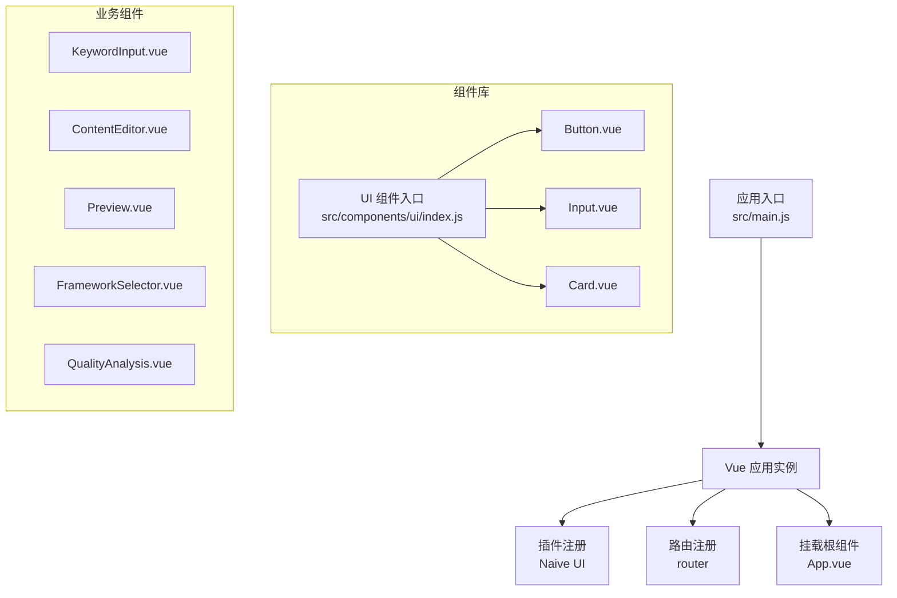
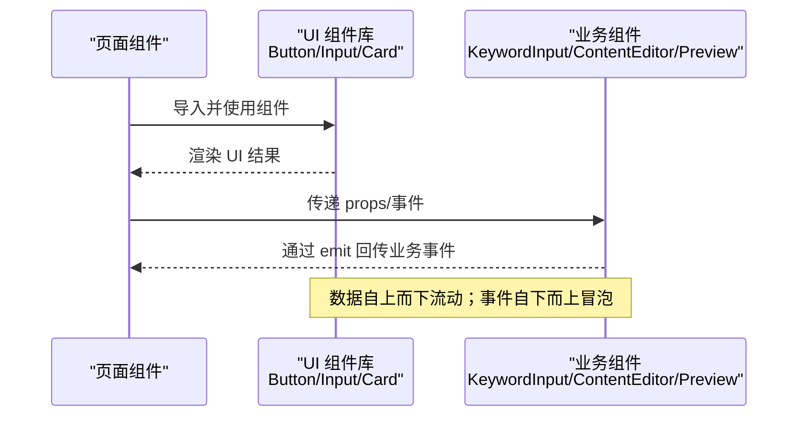
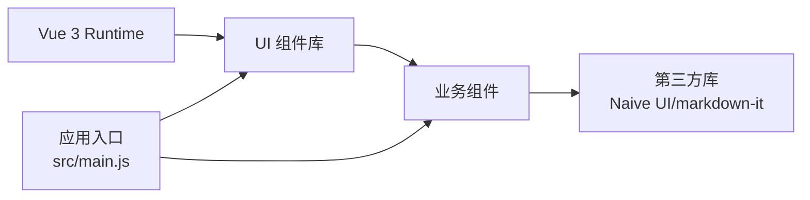

# 基础组件开发

<cite>
**本文引用的文件**
- [src/components/ui/Button.vue](file://src/components/ui/Button.vue)
- [src/components/ui/Input.vue](file://src/components/ui/Input.vue)
- [src/components/ui/Card.vue](file://src/components/ui/Card.vue)
- [src/components/ui/index.js](file://src/components/ui/index.js)
- [src/components/HelloWorld.vue](file://src/components/HelloWorld.vue)
- [src/components/KeywordInput.vue](file://src/components/KeywordInput.vue)
- [src/components/ContentEditor.vue](file://src/components/ContentEditor.vue)
- [src/components/Preview.vue](file://src/components/Preview.vue)
- [src/components/FrameworkSelector.vue](file://src/components/FrameworkSelector.vue)
- [src/components/QualityAnalysis.vue](file://src/components/QualityAnalysis.vue)
- [src/main.js](file://src/main.js)
- [frontend/src/main.js](file://frontend/src/main.js)
- [package.json](file://package.json)
- [vite.config.js](file://vite.config.js)
- [docs/GUIDE.md](file://docs/GUIDE.md)
- [docs/EXAMPLES.md](file://docs/EXAMPLES.md)
</cite>

## 目录
1. [简介](#简介)
2. [项目结构](#项目结构)
3. [核心组件](#核心组件)
4. [架构总览](#架构总览)
5. [组件详解与最佳实践](#组件详解与最佳实践)
6. [依赖关系分析](#依赖关系分析)
7. [性能考量](#性能考量)
8. [故障排查指南](#故障排查指南)
9. [结论](#结论)
10. [附录](#附录)

## 简介
本指南面向希望基于 Vue 3 开发可复用、可维护的基础组件的工程师。结合仓库中的实际组件与文档，系统讲解组件文件命名规范、单文件结构组织（template/script/style）、props 定义与校验、事件处理机制、Composition API 的正确使用（setup、响应式数据、计算属性、侦听器）、生命周期钩子的使用时机，并提供可直接参考的代码路径与可视化图示，帮助你在实际项目中高效落地。

## 项目结构
该仓库采用“多入口 + 多组件库”的结构：
- 根目录前端应用入口位于 src/main.js，使用 Vite + Vue 3 + Naive UI
- 组件库集中于 src/components/ui，提供 Button、Input、Card 等通用 UI 组件
- 业务组件位于 src/components，如 KeywordInput、ContentEditor、Preview、FrameworkSelector、QualityAnalysis 等
- 文档位于 docs，包含开发指南与示例

**图表来源**
- [src/main.js](file://src/main.js#L1-L16)
- [src/components/ui/index.js](file://src/components/ui/index.js#L1-L23)

**章节来源**
- [src/main.js](file://src/main.js#L1-L16)
- [frontend/src/main.js](file://frontend/src/main.js#L1-L15)
- [vite.config.js](file://vite.config.js#L1-L37)

## 核心组件
本节聚焦于 UI 组件库中的三个基础组件：Button、Input、Card。它们体现了 props 定义与校验、事件发射、计算属性、作用域样式的最佳实践。

- Button：支持多种变体与尺寸，内置加载态与禁用态，通过计算属性动态拼接类名，事件仅在可用状态下触发
- Input：支持 v-model、前后缀插槽、清空、聚焦/失焦/回车等事件，错误态与提示信息展示
- Card：支持标题/副标题、多种变体、悬停与可点击行为，通过 useSlots 判断插槽是否存在

**章节来源**
- [src/components/ui/Button.vue](file://src/components/ui/Button.vue#L1-L244)
- [src/components/ui/Input.vue](file://src/components/ui/Input.vue#L1-L325)
- [src/components/ui/Card.vue](file://src/components/ui/Card.vue#L1-L204)
- [src/components/ui/index.js](file://src/components/ui/index.js#L1-L23)

## 架构总览
下面的序列图展示了从页面到组件库再到业务组件的调用链路，以及事件冒泡与数据流方向。

**图表来源**
- [src/components/ui/index.js](file://src/components/ui/index.js#L1-L23)
- [src/components/KeywordInput.vue](file://src/components/KeywordInput.vue#L1-L265)
- [src/components/ContentEditor.vue](file://src/components/ContentEditor.vue#L1-L418)
- [src/components/Preview.vue](file://src/components/Preview.vue#L1-L411)

## 组件详解与最佳实践

### 文件命名规范
- 基础 UI 组件统一放置于 src/components/ui，文件名采用 PascalCase，如 Button.vue、Input.vue、Card.vue
- 业务组件放置于 src/components，文件名采用语义化命名，如 KeywordInput.vue、ContentEditor.vue、Preview.vue
- 组件库入口文件为 index.js，负责统一导出与全局注册

**章节来源**
- [src/components/ui/index.js](file://src/components/ui/index.js#L1-L23)

### 单文件结构组织（template/script/style）
- template：保持简洁，尽量只做渲染与事件绑定，复杂逻辑移至 script
- script：使用 Composition API 的 <script setup>，集中定义 props、emit、响应式数据、计算属性与方法
- style：优先使用 scoped，避免污染全局样式；通过 CSS 变量与主题系统提升一致性

**章节来源**
- [src/components/ui/Button.vue](file://src/components/ui/Button.vue#L1-L244)
- [src/components/ui/Input.vue](file://src/components/ui/Input.vue#L1-L325)
- [src/components/ui/Card.vue](file://src/components/ui/Card.vue#L1-L204)

### Props 定义与校验
- 类型声明：明确指定类型（String、Number、Boolean、Array、Object、Function 等）
- 默认值：为每个可选 prop 提供合理默认值
- 自定义校验器：使用 validator 对枚举值进行约束，确保传入值合法
- 必填项：对必须传入的 prop 设置 required

示例参考：
- Button 的 variant/size/type/disabled/loading/block 等
- Input 的 modelValue/type/label/placeholder/size/disabled/read-only/required/clearable/prefixIcon/suffixIcon/hint/error 等
- Card 的 title/subtitle/variant/hoverable/clickable/padding 等

**章节来源**
- [src/components/ui/Button.vue](file://src/components/ui/Button.vue#L25-L58)
- [src/components/ui/Input.vue](file://src/components/ui/Input.vue#L64-L131)
- [src/components/ui/Card.vue](file://src/components/ui/Card.vue#L35-L68)

### 事件处理机制
- 使用 defineEmits 声明对外发出的事件名称
- 在用户交互时，先判断可用状态（如 disabled/loading），再 emit 事件
- 对于 v-model 场景，使用 update:modelValue 作为约定事件名

示例参考：
- Button 的 click 事件
- Input 的 update:modelValue/focus/blur/enter/clear 事件
- Card 的 click 事件

**章节来源**
- [src/components/ui/Button.vue](file://src/components/ui/Button.vue#L60-L79)
- [src/components/ui/Input.vue](file://src/components/ui/Input.vue#L133-L178)
- [src/components/ui/Card.vue](file://src/components/ui/Card.vue#L70-L98)

### 计算属性与响应式数据
- 计算属性：用于派生状态（如按钮类名、输入框状态类、卡片 header/footer 是否显示）
- 响应式数据：使用 ref/响应式对象承载组件内部状态（如输入框焦点态、卡片点击态、可见性控制）

示例参考：
- Button 的 buttonClasses
- Input 的 wrapperClasses/inputClasses/isFocused/inputId
- Card 的 hasHeader/hasFooter/cardClasses
- KeywordInput 的 keywords/showQuickKeywords/visible/activeTools
- ContentEditor 的 editorContent/inputVisible/inputValue/images 等

**章节来源**
- [src/components/ui/Button.vue](file://src/components/ui/Button.vue#L62-L73)
- [src/components/ui/Input.vue](file://src/components/ui/Input.vue#L138-L155)
- [src/components/ui/Card.vue](file://src/components/ui/Card.vue#L74-L92)
- [src/components/KeywordInput.vue](file://src/components/KeywordInput.vue#L105-L125)
- [src/components/ContentEditor.vue](file://src/components/ContentEditor.vue#L262-L281)

### 侦听器与生命周期钩子
- 侦听器：使用 watch 监听外部 props 或内部状态变化，触发副作用（如同步外部值、触发业务事件）
- 生命周期钩子：在需要 DOM 更新后的场景使用 nextTick；在需要等待组件挂载后再执行的逻辑中谨慎使用

示例参考：
- ContentEditor 的 watch(props.content) 与 watch(editorContent, deep: true)
- KeywordInput 的 watch(props.value) 与默认选中第一个框架
- HelloWorld 的最小化 setup 示例

**章节来源**
- [src/components/ContentEditor.vue](file://src/components/ContentEditor.vue#L273-L281)
- [src/components/KeywordInput.vue](file://src/components/KeywordInput.vue#L127-L140)
- [src/components/HelloWorld.vue](file://src/components/HelloWorld.vue#L1-L45)

### 组件库入口与全局注册
- 统一导出：index.js 导出各组件并提供 install(app) 函数，便于全局注册
- 全局注册：在 main.js 中 app.use(UI) 即可在任意组件中直接使用

**章节来源**
- [src/components/ui/index.js](file://src/components/ui/index.js#L1-L23)
- [src/main.js](file://src/main.js#L1-L16)

### 业务组件示例与复用策略
- KeywordInput：组合多个 UI 组件与第三方库（Naive UI），通过 emit 将分析结果回传父组件
- ContentEditor：复杂编辑器，包含 Markdown 预览、图片生成区、标签管理、发布流程弹窗等
- Preview：实时预览组件，支持移动端/桌面端模式切换与图片下载
- FrameworkSelector：多选框架选择器，支持选中摘要展示与图标映射
- QualityAnalysis：质量分析卡片，折叠面板展示多维度分析结果

这些组件展示了如何将基础 UI 组件组合为更高阶的业务组件，并通过 props/emit 形成清晰的数据与事件边界。

**章节来源**
- [src/components/KeywordInput.vue](file://src/components/KeywordInput.vue#L1-L265)
- [src/components/ContentEditor.vue](file://src/components/ContentEditor.vue#L1-L418)
- [src/components/Preview.vue](file://src/components/Preview.vue#L1-L411)
- [src/components/FrameworkSelector.vue](file://src/components/FrameworkSelector.vue#L1-L241)
- [src/components/QualityAnalysis.vue](file://src/components/QualityAnalysis.vue#L1-L138)

### Composition API 最佳实践
- 使用 <script setup> 简化导入与导出
- 将“渲染无关”的逻辑（如事件处理、状态管理）集中在 setup 内部
- 将“可复用逻辑”抽离为组合函数（composables），在多个组件间共享
- 保持模板简洁，避免在 template 中写复杂表达式

**章节来源**
- [src/components/ui/Button.vue](file://src/components/ui/Button.vue#L22-L79)
- [src/components/ui/Input.vue](file://src/components/ui/Input.vue#L61-L178)
- [src/components/ui/Card.vue](file://src/components/ui/Card.vue#L32-L98)
- [src/components/ContentEditor.vue](file://src/components/ContentEditor.vue#L197-L316)

### 模板结构设计
- 语义化标签：使用语义化 HTML 元素，配合 slot 与插槽实现灵活扩展
- 事件绑定：在交互元素上绑定事件，注意条件判断与防抖
- 插槽使用：通过具名插槽与默认插槽暴露可定制区域（如 Card 的 header/footer）

**章节来源**
- [src/components/ui/Card.vue](file://src/components/ui/Card.vue#L10-L29)
- [src/components/Preview.vue](file://src/components/Preview.vue#L21-L132)

### 样式组织与主题
- 使用 scoped 样式隔离组件样式
- 通过 CSS 变量与主题系统统一风格
- 在业务组件中合理使用第三方 UI 库样式（如 Naive UI）

**章节来源**
- [src/components/ui/Button.vue](file://src/components/ui/Button.vue#L82-L237)
- [src/components/ui/Input.vue](file://src/components/ui/Input.vue#L181-L314)
- [src/components/ui/Card.vue](file://src/components/ui/Card.vue#L101-L195)
- [src/components/Preview.vue](file://src/components/Preview.vue#L210-L405)

## 依赖关系分析
- 组件库依赖：Button/Input/Card 依赖 Vue 的响应式 API（computed/ref）
- 业务组件依赖：ContentEditor/Preview/FrameworkSelector 等依赖 Naive UI 与第三方库（如 markdown-it）
- 应用入口：src/main.js 注册 Naive UI 与路由，业务组件通过 UI 组件库与业务组件共同构成页面

**图表来源**
- [src/main.js](file://src/main.js#L1-L16)
- [package.json](file://package.json#L1-L32)

**章节来源**
- [package.json](file://package.json#L1-L32)
- [src/main.js](file://src/main.js#L1-L16)

## 性能考量
- 按需导入：优先按需导入 UI 组件，减少打包体积
- 合理使用计算属性：避免在模板中重复计算，将昂贵计算放入 computed
- 侦听器优化：对高频变更使用防抖/节流；必要时使用深拷贝避免不必要的重渲染
- 图片与网络请求：在预览与下载场景中注意跨域与代理配置，避免阻塞主线程
- 组件懒加载：对大型业务组件采用异步组件或路由级懒加载

[本节为通用指导，无需特定文件引用]

## 故障排查指南
- 事件未触发：检查是否在 disabled/loading 状态下仍 emit；确认事件名与父组件监听一致
- v-model 不生效：确认子组件 emit 的是 update:modelValue，且父组件使用 v-model 绑定
- 样式冲突：检查 scoped 样式是否被第三方库覆盖；必要时使用 ::deep 或提升选择器权重
- 图片下载失败：检查代理配置与后端 CORS 设置；捕获异常并提示用户
- 主题不生效：确认 CSS 变量覆盖顺序与作用域；检查主题切换逻辑

**章节来源**
- [src/components/ui/Input.vue](file://src/components/ui/Input.vue#L157-L178)
- [src/components/Preview.vue](file://src/components/Preview.vue#L146-L166)
- [vite.config.js](file://vite.config.js#L23-L28)

## 结论
通过本指南，你可以基于 Vue 3 的 Composition API 与单文件组件结构，遵循 props 校验、事件规范、计算属性与侦听器的最佳实践，快速开发高质量的基础组件与业务组件。同时，借助组件库入口与全局注册机制，实现组件的统一管理与复用，提升团队开发效率与一致性。

[本节为总结，无需特定文件引用]

## 附录
- 开发指南与示例：参考 docs/GUIDE.md 与 docs/EXAMPLES.md 中的组件使用范式与页面搭建流程
- Vite 配置：参考 vite.config.js 中的插件、代理与别名配置
- 应用入口：参考 src/main.js 与 frontend/src/main.js 的应用初始化流程

**章节来源**
- [docs/GUIDE.md](file://docs/GUIDE.md#L1-L460)
- [docs/EXAMPLES.md](file://docs/EXAMPLES.md#L1-L464)
- [vite.config.js](file://vite.config.js#L1-L37)
- [frontend/src/main.js](file://frontend/src/main.js#L1-L15)