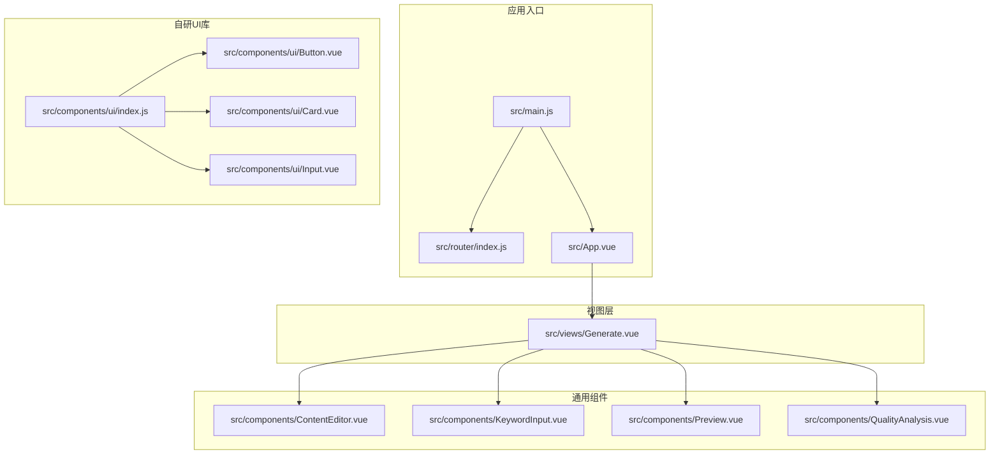
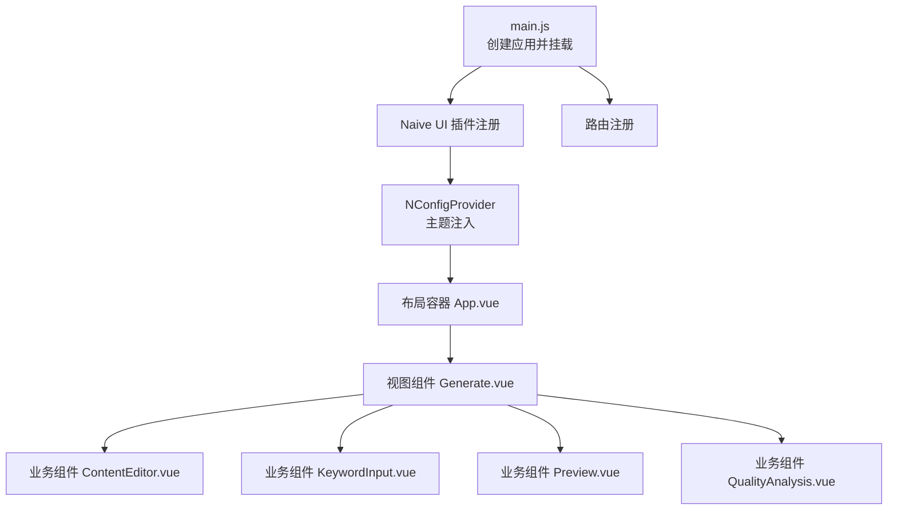
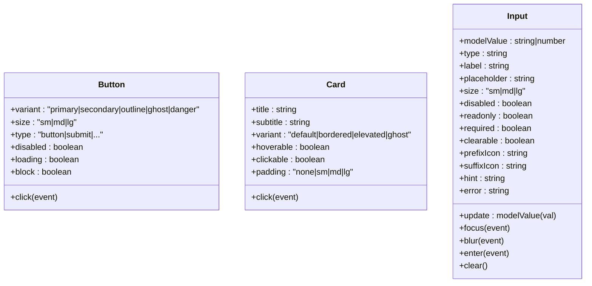
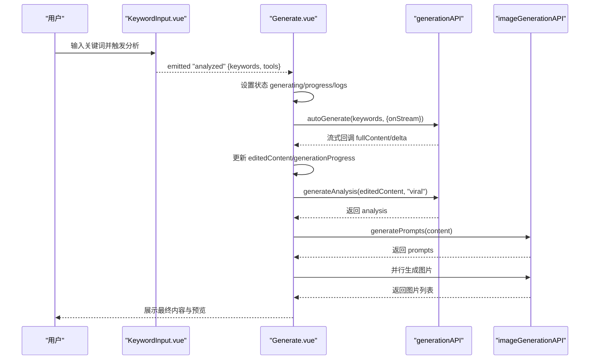
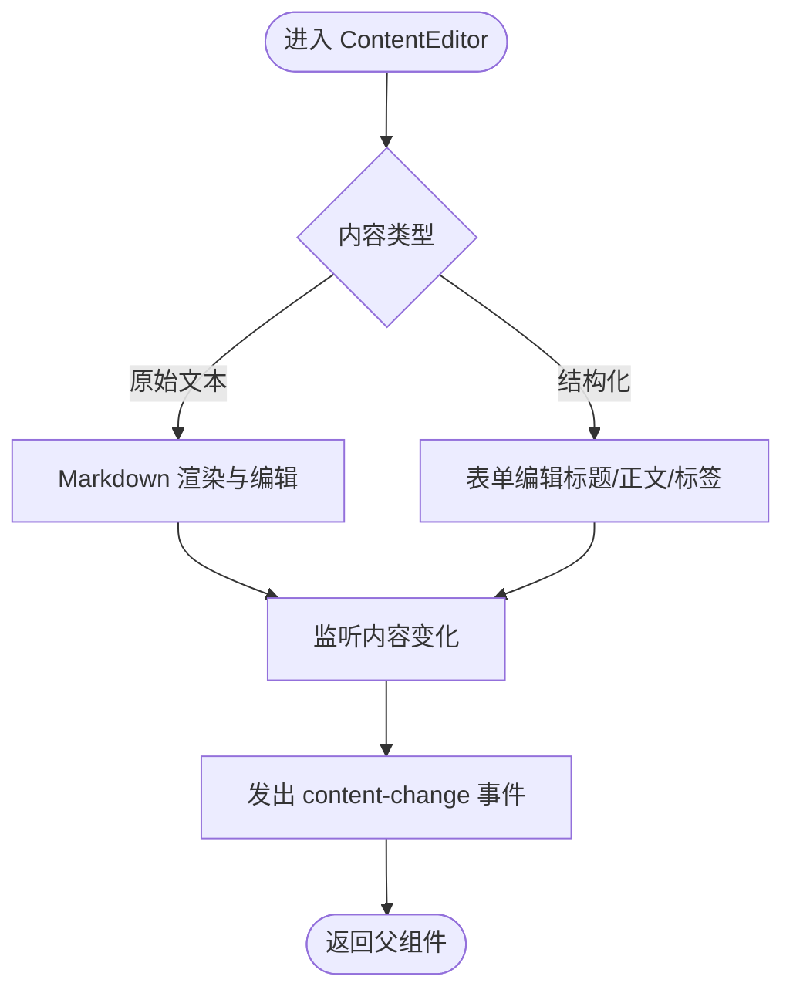
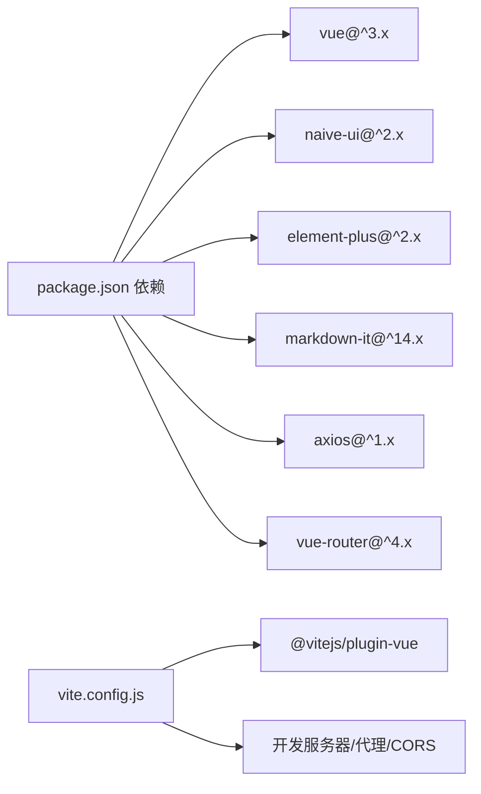

# 组件开发流程

<cite>
**本文引用的文件**
- [src/App.vue](file://src/App.vue)
- [src/main.js](file://src/main.js)
- [src/router/index.js](file://src/router/index.js)
- [src/components/ui/index.js](file://src/components/ui/index.js)
- [src/components/ui/Button.vue](file://src/components/ui/Button.vue)
- [src/components/ui/Card.vue](file://src/components/ui/Card.vue)
- [src/components/ui/Input.vue](file://src/components/ui/Input.vue)
- [src/views/Generate.vue](file://src/views/Generate.vue)
- [src/components/ContentEditor.vue](file://src/components/ContentEditor.vue)
- [src/components/KeywordInput.vue](file://src/components/KeywordInput.vue)
- [src/components/Preview.vue](file://src/components/Preview.vue)
- [src/components/QualityAnalysis.vue](file://src/components/QualityAnalysis.vue)
- [package.json](file://package.json)
- [vite.config.js](file://vite.config.js)
</cite>

## 目录
1. [简介](#简介)
2. [项目结构](#项目结构)
3. [核心组件](#核心组件)
4. [架构总览](#架构总览)
5. [详细组件分析](#详细组件分析)
6. [依赖关系分析](#依赖关系分析)
7. [性能考量](#性能考量)
8. [故障排查指南](#故障排查指南)
9. [结论](#结论)
10. [附录](#附录)

## 简介
本指南面向使用 Vue 3 Composition API 的前端开发者，结合仓库现有代码，系统化总结组件开发流程与最佳实践，涵盖：
- 文件命名规范与模板结构
- Props 定义、事件处理与生命周期使用
- UI 组件开发与 Naive UI 集成
- 组件间通信（父子、兄弟、跨层级）
- 组件测试与调试技巧

## 项目结构
该工程采用基于功能分层的组织方式：视图层、组件层、服务层、路由与入口等模块清晰分离；同时提供自研 UI 组件库与外部 UI 框架（Naive UI）的统一接入。

**图表来源**
- [src/main.js](file://src/main.js#L1-L16)
- [src/router/index.js](file://src/router/index.js#L1-L26)
- [src/App.vue](file://src/App.vue#L1-L108)
- [src/views/Generate.vue](file://src/views/Generate.vue#L1-L175)
- [src/components/ui/index.js](file://src/components/ui/index.js#L1-L23)

**章节来源**
- [src/main.js](file://src/main.js#L1-L16)
- [src/router/index.js](file://src/router/index.js#L1-L26)
- [src/App.vue](file://src/App.vue#L1-L108)

## 核心组件
- 自研 UI 组件库：统一导出与全局安装，便于在项目内按需使用与扩展。
- 视图组件：以页面为单位组织，负责编排业务流程与数据流转。
- 通用业务组件：内容编辑、关键词输入、预览、质量分析等，职责单一、可复用性强。

**章节来源**
- [src/components/ui/index.js](file://src/components/ui/index.js#L1-L23)
- [src/components/ui/Button.vue](file://src/components/ui/Button.vue#L1-L80)
- [src/components/ui/Card.vue](file://src/components/ui/Card.vue#L1-L99)
- [src/components/ui/Input.vue](file://src/components/ui/Input.vue#L1-L179)
- [src/views/Generate.vue](file://src/views/Generate.vue#L1-L175)

## 架构总览
应用通过 Vite 构建，使用 Vue 3 + Naive UI，路由驱动视图切换，页面内通过组件组合实现复杂交互。全局主题通过 NConfigProvider 注入，提供一致的视觉与交互体验。

**图表来源**
- [src/main.js](file://src/main.js#L1-L16)
- [src/App.vue](file://src/App.vue#L1-L108)
- [src/views/Generate.vue](file://src/views/Generate.vue#L1-L175)

**章节来源**
- [src/main.js](file://src/main.js#L1-L16)
- [src/App.vue](file://src/App.vue#L1-L108)

## 详细组件分析

### 自研 UI 组件库（Button、Card、Input）
- 设计原则
  - 明确的 Props 校验与默认值，保证组件健壮性
  - 通过计算属性动态拼装类名，简化样式控制
  - 事件透传与防抖策略（如 loading/disabled），提升交互稳定性
- 最佳实践
  - 使用 defineProps/defineEmits 约束接口
  - 在模板中通过 v-if/v-else 控制加载态与插槽渲染
  - 为每个变体提供对应的样式变量与过渡动画

**图表来源**
- [src/components/ui/Button.vue](file://src/components/ui/Button.vue#L25-L79)
- [src/components/ui/Card.vue](file://src/components/ui/Card.vue#L35-L98)
- [src/components/ui/Input.vue](file://src/components/ui/Input.vue#L64-L179)

**章节来源**
- [src/components/ui/index.js](file://src/components/ui/index.js#L1-L23)
- [src/components/ui/Button.vue](file://src/components/ui/Button.vue#L1-L80)
- [src/components/ui/Card.vue](file://src/components/ui/Card.vue#L1-L99)
- [src/components/ui/Input.vue](file://src/components/ui/Input.vue#L1-L179)

### 视图组件（Generate）
- 职责与流程
  - 管理生成状态、进度、日志与历史记录
  - 编排内容编辑器、质量分析、预览与图片生成
  - 通过事件向上冒泡协调父级状态
- 关键点
  - 使用 Naive UI 的 Provider 组件提供全局上下文
  - 通过 ref 与事件实现与子组件的松耦合通信
  - 流式生成与错误处理的完整链路

**图表来源**
- [src/views/Generate.vue](file://src/views/Generate.vue#L257-L324)
- [src/components/KeywordInput.vue](file://src/components/KeywordInput.vue#L132-L142)

**章节来源**
- [src/views/Generate.vue](file://src/views/Generate.vue#L177-L427)

### 业务组件（ContentEditor、Preview、QualityAnalysis）
- ContentEditor
  - 支持原始文本与结构化内容两种模式
  - 通过 v-model 与事件双向通信，支持标签增删与图片下载
- Preview
  - 模拟小红书图文内容，支持移动端/桌面端预览与图片下载
- QualityAnalysis
  - 结构化展示文案质量分析结果，折叠面板便于阅读

**图表来源**
- [src/components/ContentEditor.vue](file://src/components/ContentEditor.vue#L273-L281)

**章节来源**
- [src/components/ContentEditor.vue](file://src/components/ContentEditor.vue#L1-L418)
- [src/components/Preview.vue](file://src/components/Preview.vue#L1-L411)
- [src/components/QualityAnalysis.vue](file://src/components/QualityAnalysis.vue#L1-L138)

## 依赖关系分析
- 运行时依赖
  - Vue 3、Naive UI、Element Plus（多套 UI 方案）、markdown-it、axios、vue-router
- 构建与开发
  - Vite 插件、代理与 CORS 配置，支持前后端联调
- 入口与路由
  - main.js 注册插件与路由，App.vue 作为根组件承载全局 Provider 与布局

**图表来源**
- [package.json](file://package.json#L15-L26)
- [vite.config.js](file://vite.config.js#L1-L37)

**章节来源**
- [package.json](file://package.json#L1-L32)
- [vite.config.js](file://vite.config.js#L1-L37)

## 性能考量
- 模板与状态
  - 合理拆分视图与组件，避免单文件过大
  - 使用 computed 与浅层 watch，减少不必要的重渲染
- 图片与流式渲染
  - 对图片生成采用并行 Promise，完成后一次性更新状态
  - 流式回调中仅更新必要字段，降低 DOM 抖动
- UI 交互
  - 使用 Naive UI 的 Provider 与主题变量，统一动画与过渡
  - 在大列表场景使用虚拟滚动或分页（如后续扩展）

[本节为通用指导，无需具体文件引用]

## 故障排查指南
- 网络与代理
  - 开发环境通过 Vite 代理转发 /api 请求至后端服务，确保代理配置正确
- 图片下载失败
  - Preview 中通过后端代理下载图片，若失败检查代理与跨域设置
- 表单与输入
  - Input 组件支持 clearable 与 enter 事件，注意 v-model 与 update:modelValue 的一致性
- 日志与进度
  - Generate 中的 processingLogs 与 generationProgress 用于可视化生成过程，异常时打印日志并提示用户

**章节来源**
- [vite.config.js](file://vite.config.js#L23-L28)
- [src/components/Preview.vue](file://src/components/Preview.vue#L146-L166)
- [src/components/ui/Input.vue](file://src/components/ui/Input.vue#L175-L178)
- [src/views/Generate.vue](file://src/views/Generate.vue#L245-L323)

## 结论
本项目以 Composition API 为核心，结合自研 UI 组件库与 Naive UI，实现了从视图到业务组件的完整闭环。遵循本文档的组件开发流程与最佳实践，可在保证可维护性的前提下，快速迭代与扩展新功能。

[本节为总结性内容，无需具体文件引用]

## 附录

### 组件开发标准流程（建议）
- 文件命名
  - 组件文件采用 PascalCase，如 MyComponent.vue
  - 工具函数与混入使用 kebab-case 或 camelCase，按职责命名
- 模板结构
  - 以语义化标签包裹，合理使用 slot 与具名插槽
  - 控制条件渲染与懒加载，避免首屏阻塞
- Props 定义
  - 使用 defineProps，提供默认值与类型校验
  - 严格区分受控与非受控属性（如 v-model 场景）
- 事件处理
  - 使用 defineEmits，统一事件命名风格（如 update:modelValue、自定义事件）
  - 防重复提交（loading/disabled）与错误兜底
- 生命周期钩子
  - onMounted 初始化数据与订阅
  - onUnmounted 清理定时器、订阅与副作用
- UI 集成
  - 优先使用 Naive UI 组件，必要时封装为自研组件
  - 通过 NConfigProvider 注入主题，统一视觉与交互
- 组件间通信
  - 父子：Props + Emits
  - 兄弟：共同父组件集中管理状态
  - 跨层级：Provide/Inject 或集中式状态管理（如 Pinia）
- 测试与调试
  - 单元测试：针对纯函数与组合式逻辑
  - 集成测试：模拟用户操作与异步流程
  - 调试：利用浏览器 DevTools、Vue DevTools、日志与断点

[本节为通用指导，无需具体文件引用]