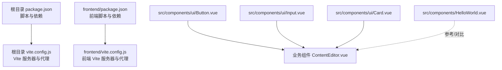
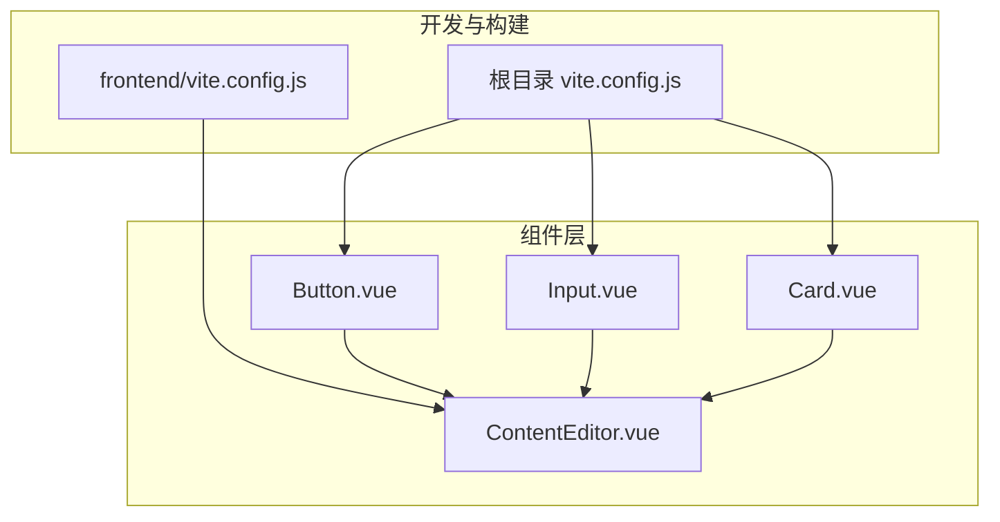
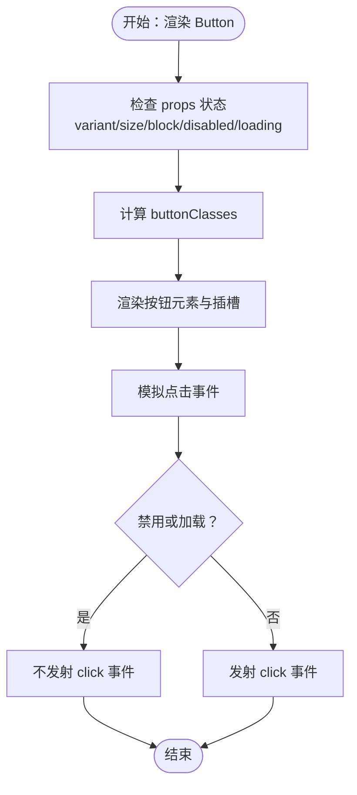
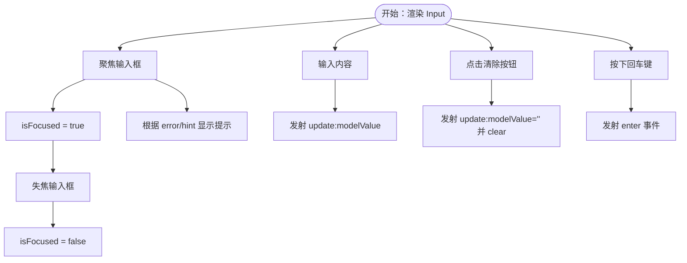
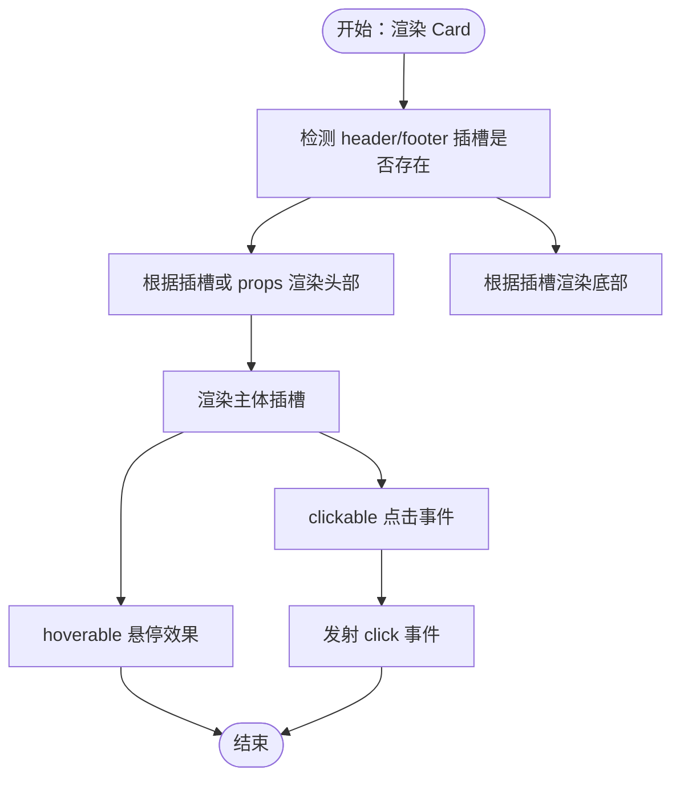
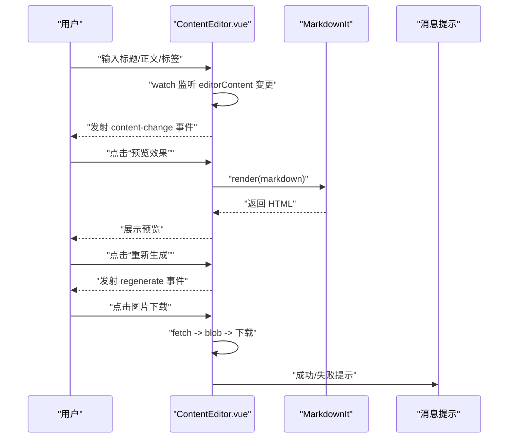
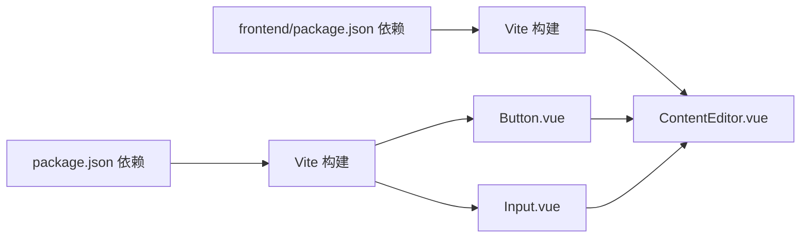

# 组件测试与调试

<cite>
**本文引用的文件**
- [package.json](file://package.json)
- [frontend/package.json](file://frontend/package.json)
- [vite.config.js](file://vite.config.js)
- [frontend/vite.config.js](file://frontend/vite.config.js)
- [src/components/ui/Button.vue](file://src/components/ui/Button.vue)
- [src/components/ui/Input.vue](file://src/components/ui/Input.vue)
- [src/components/ui/Card.vue](file://src/components/ui/Card.vue)
- [src/components/ContentEditor.vue](file://src/components/ContentEditor.vue)
- [src/components/HelloWorld.vue](file://src/components/HelloWorld.vue)
</cite>

## 目录
1. [简介](#简介)
2. [项目结构](#项目结构)
3. [核心组件](#核心组件)
4. [架构总览](#架构总览)
5. [详细组件分析](#详细组件分析)
6. [依赖分析](#依赖分析)
7. [性能考虑](#性能考虑)
8. [故障排查指南](#故障排查指南)
9. [结论](#结论)
10. [附录](#附录)

## 简介
本指南面向Vue 3组件的测试与调试，结合仓库现有组件与构建配置，给出从单元测试到集成/端到端测试的策略建议，并覆盖调试工具（Vue DevTools、浏览器开发者工具）的使用要点与常见问题的诊断与修复路径。文中所有测试与调试建议均基于当前代码库中的组件实现与构建脚本。

## 项目结构
- 前端工程位于根目录与 frontend 子目录，分别提供独立的构建与开发服务配置。
- 组件集中在 src/components 与 src/components/ui 下，包含基础UI组件与业务组件。
- 构建工具采用 Vite，便于快速启动与热更新；前端工程亦有独立的 Vite 配置。

图表来源
- [package.json](file://package.json#L1-L32)
- [frontend/package.json](file://frontend/package.json#L1-L21)
- [vite.config.js](file://vite.config.js#L1-L37)
- [frontend/vite.config.js](file://frontend/vite.config.js#L1-L19)
- [src/components/ui/Button.vue](file://src/components/ui/Button.vue#L1-L244)
- [src/components/ui/Input.vue](file://src/components/ui/Input.vue#L1-L325)
- [src/components/ui/Card.vue](file://src/components/ui/Card.vue#L1-L204)
- [src/components/ContentEditor.vue](file://src/components/ContentEditor.vue#L1-L418)
- [src/components/HelloWorld.vue](file://src/components/HelloWorld.vue#L1-L45)

章节来源
- [package.json](file://package.json#L1-L32)
- [frontend/package.json](file://frontend/package.json#L1-L21)
- [vite.config.js](file://vite.config.js#L1-L37)
- [frontend/vite.config.js](file://frontend/vite.config.js#L1-L19)

## 核心组件
- Button：支持多种变体、尺寸、禁用与加载状态，具备点击事件发射与类名计算逻辑。
- Input：支持 v-model、前缀/后缀插槽、清空、聚焦/失焦、回车事件与提示/错误状态。
- Card：支持标题/副标题、多种变体、悬停与可点击行为、插槽布局。
- ContentEditor：复杂业务组件，包含表单、标签管理、Markdown渲染、图片生成与下载、发布流程弹窗等。
- HelloWorld：最小化示例组件，便于理解模板与样式作用域。

章节来源
- [src/components/ui/Button.vue](file://src/components/ui/Button.vue#L1-L244)
- [src/components/ui/Input.vue](file://src/components/ui/Input.vue#L1-L325)
- [src/components/ui/Card.vue](file://src/components/ui/Card.vue#L1-L204)
- [src/components/ContentEditor.vue](file://src/components/ContentEditor.vue#L1-L418)
- [src/components/HelloWorld.vue](file://src/components/HelloWorld.vue#L1-L45)

## 架构总览
- 开发环境：根目录与 frontend 目录各自提供 Vite 服务与代理配置，便于前后端联调。
- 组件层：基础UI组件（Button/Input/Card）与业务组件（ContentEditor）分层清晰，便于单独测试与复用。
- 测试策略：以单元测试为主，配合组件集成测试与端到端测试，形成完整的质量保障闭环。

图表来源
- [vite.config.js](file://vite.config.js#L1-L37)
- [frontend/vite.config.js](file://frontend/vite.config.js#L1-L19)
- [src/components/ui/Button.vue](file://src/components/ui/Button.vue#L1-L244)
- [src/components/ui/Input.vue](file://src/components/ui/Input.vue#L1-L325)
- [src/components/ui/Card.vue](file://src/components/ui/Card.vue#L1-L204)
- [src/components/ContentEditor.vue](file://src/components/ContentEditor.vue#L1-L418)

## 详细组件分析

### Button 组件测试要点
- 行为测试
  - 点击事件在启用且非加载状态下触发，禁用或加载时不应触发。
  - 类名计算应随 variant/size/block/disabled/loading 动态变化。
- 视觉测试
  - 不同变体与尺寸的渲染一致性。
  - 加载动画与禁用态样式。
- 边界测试
  - 传入非法 validator 值时的行为（由组件自身校验器保证）。
- 测试建议
  - 使用测试工具渲染组件并断言 DOM 类名与事件发射次数。
  - 使用快照或视觉回归工具验证样式变更。

图表来源
- [src/components/ui/Button.vue](file://src/components/ui/Button.vue#L22-L79)

章节来源
- [src/components/ui/Button.vue](file://src/components/ui/Button.vue#L1-L244)

### Input 组件测试要点
- 行为测试
  - v-model 更新：输入事件应触发 update:modelValue。
  - 焦点/失焦：聚焦时内部状态与 focus 事件发射；失焦时状态切换与 blur 事件。
  - 回车事件：keyup.enter 应触发 enter 事件。
  - 清空：clearable 且存在值时显示清除按钮，点击后清空并触发 clear。
- 视觉测试
  - label/required/hint/error 的显示与样式。
  - 前缀/后缀插槽与图标渲染。
- 边界测试
  - disabled/readonly 状态下的交互限制。
  - 输入类型与空值处理。
- 测试建议
  - 使用测试工具模拟用户交互，断言 emit 事件与 DOM 状态。
  - 对插槽内容进行渲染验证。

图表来源
- [src/components/ui/Input.vue](file://src/components/ui/Input.vue#L135-L178)

章节来源
- [src/components/ui/Input.vue](file://src/components/ui/Input.vue#L1-L325)

### Card 组件测试要点
- 行为测试
  - header/footer 插槽与默认标题/副标题的显示逻辑。
  - clickable=true 时点击事件发射。
  - hoverable 悬停样式与交互。
- 视觉测试
  - 多种变体（default/bordered/elevated/ghost）与内边距变体的渲染。
- 边界测试
  - 无插槽时 header/footer 的隐藏逻辑。
- 测试建议
  - 使用具名插槽渲染内容，断言节点存在与类名。
  - 模拟鼠标悬停与点击事件，验证样式与事件。

图表来源
- [src/components/ui/Card.vue](file://src/components/ui/Card.vue#L72-L98)

章节来源
- [src/components/ui/Card.vue](file://src/components/ui/Card.vue#L1-L204)

### ContentEditor 组件测试要点
- 行为测试
  - 表单字段（标题、正文、标签）的双向绑定与变更监听。
  - 标签增删逻辑与输入确认。
  - 预览与重新生成事件发射。
  - 图片下载流程（含错误处理与消息提示）。
  - 发布流程弹窗的打开与关闭。
- 视觉测试
  - Markdown 渲染区域样式与滚动行为。
  - 图片网格布局与悬停遮罩、下载按钮显隐。
- 性能测试
  - 大量标签或长文本时的渲染与响应性。
- 测试建议
  - 使用测试工具挂载组件并注入 mock 数据，断言 emit 与 DOM。
  - 对异步操作（图片下载）进行超时与错误分支测试。

图表来源
- [src/components/ContentEditor.vue](file://src/components/ContentEditor.vue#L197-L316)

章节来源
- [src/components/ContentEditor.vue](file://src/components/ContentEditor.vue#L1-L418)

### HelloWorld 组件参考
- 作为最小化组件，适合用于测试渲染与样式作用域的基本流程，便于对比复杂组件的差异。

章节来源
- [src/components/HelloWorld.vue](file://src/components/HelloWorld.vue#L1-L45)

## 依赖分析
- 构建与开发
  - 根目录与 frontend 目录分别提供 Vite 配置与脚本，便于前后端联调与代理转发。
- 组件依赖
  - ContentEditor 依赖 naive-ui 组件库与 markdown-it，测试时需对第三方依赖进行 mock 或隔离。
- 测试工具链
  - 当前仓库未包含 Jest/Vitest 配置文件，但组件结构与 Vite 已为测试工具接入提供了良好基础。

图表来源
- [package.json](file://package.json#L1-L32)
- [frontend/package.json](file://frontend/package.json#L1-L21)
- [vite.config.js](file://vite.config.js#L1-L37)
- [frontend/vite.config.js](file://frontend/vite.config.js#L1-L19)
- [src/components/ui/Button.vue](file://src/components/ui/Button.vue#L1-L244)
- [src/components/ui/Input.vue](file://src/components/ui/Input.vue#L1-L325)
- [src/components/ContentEditor.vue](file://src/components/ContentEditor.vue#L1-L418)

章节来源
- [package.json](file://package.json#L1-L32)
- [frontend/package.json](file://frontend/package.json#L1-L21)
- [vite.config.js](file://vite.config.js#L1-L37)
- [frontend/vite.config.js](file://frontend/vite.config.js#L1-L19)

## 性能考虑
- 渲染优化
  - 使用 computed 缓存派生状态（如 Button 的类名、Input 的焦点状态、ContentEditor 的 Markdown HTML）。
  - 合理拆分组件，避免不必要的重渲染。
- 事件处理
  - 在高频交互场景（如输入、滚动）中，避免在事件回调中执行昂贵操作；必要时使用防抖/节流。
- 异步任务
  - 图片下载与网络请求需设置超时与错误回退，防止阻塞主线程。
- 样式与资源
  - 大量图片与长文本渲染时，注意虚拟列表或分页策略，减少 DOM 节点数量。

## 故障排查指南
- 性能问题
  - 症状：页面卡顿、输入延迟、滚动掉帧。
  - 排查：使用浏览器性能面板定位重排/重绘热点；检查是否存在深层 watch 或频繁的 DOM 操作。
  - 解决：减少不必要的响应式依赖、合并状态更新、使用 requestAnimationFrame 优化动画。
- 内存泄漏
  - 症状：长时间使用后内存持续增长。
  - 排查：检查是否在组件卸载时清理定时器、事件监听器、订阅与全局对象引用。
  - 解决：在 onUnmounted 中统一清理；避免闭包持有大对象。
- 事件处理错误
  - 症状：点击无效、键盘事件未触发、v-model 不更新。
  - 排查：核对事件修饰符与条件判断（如 Button 的禁用/加载状态）；确认 emit 名称与参数一致。
  - 解决：在测试中模拟事件并断言 emit 次数与参数；确保条件分支覆盖全面。
- 样式异常
  - 症状：scoped 样式未生效、插槽内容样式错乱。
  - 排查：确认样式作用域与深度选择器使用；检查插槽命名与默认内容。
  - 解决：使用测试工具截图比对或快照；修正样式选择器与类名拼接逻辑。

## 结论
本指南基于现有组件与构建配置，给出了从单元测试到集成/端到端测试的策略建议，并结合调试工具与常见问题的诊断方法，帮助团队建立稳定高效的组件测试与调试体系。建议尽快引入 Jest/Vitest 配置与测试脚本，完善自动化测试流程。

## 附录
- 测试工具链建议
  - 单元测试：引入 Vitest（与 Vite 集成度高），使用测试工具渲染组件并断言行为与DOM。
  - 集成测试：针对多组件协作场景（如 ContentEditor 与其子表单/图片区），使用测试工具挂载并模拟外部依赖。
  - 端到端测试：可选 Cypress/Playwright，覆盖真实用户流程（如发起生成、预览、下载、发布）。
- 调试工具
  - Vue DevTools：查看组件树、Props/State、事件发射与时间线；利用“筛选组件”定位目标组件。
  - 浏览器开发者工具：Elements 面板检查 DOM 与类名；Console 查看错误与日志；Performance 分析渲染瓶颈；Network 检查异步请求与超时。
- 最佳实践
  - 为每个组件编写最小可运行的测试用例，覆盖正常与边界分支。
  - 对异步流程（下载、网络请求）增加超时与错误分支测试。
  - 使用快照或视觉回归工具记录关键 UI 状态，防止回归。