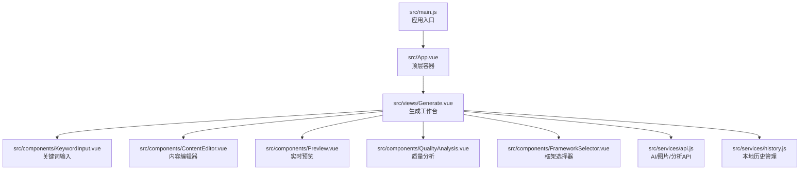
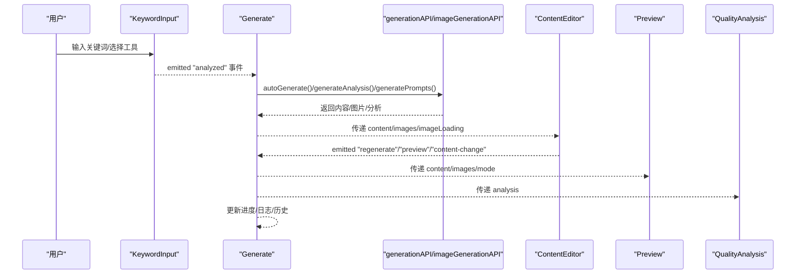
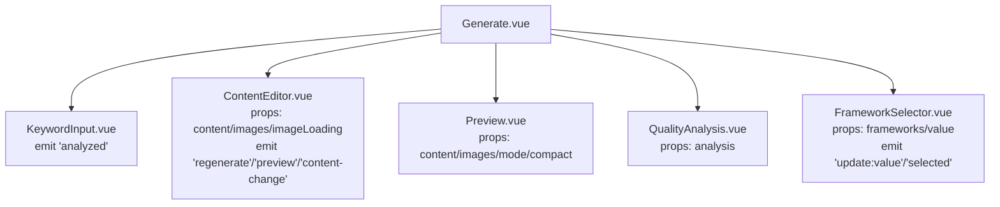
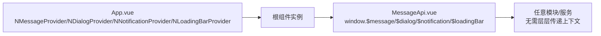
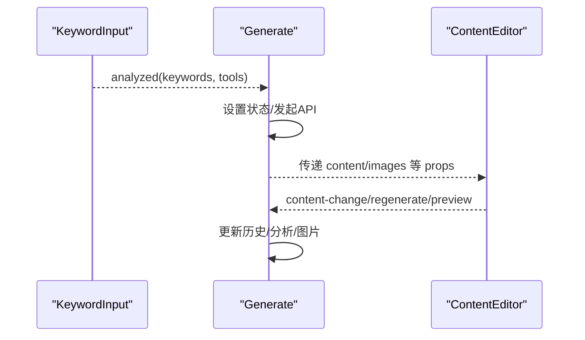
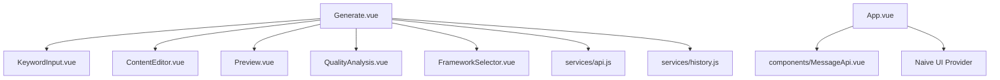

# 组件通信机制

<cite>
**本文档引用的文件**
- [src/App.vue](file://src/App.vue)
- [src/views/Generate.vue](file://src/views/Generate.vue)
- [src/components/ContentEditor.vue](file://src/components/ContentEditor.vue)
- [src/components/KeywordInput.vue](file://src/components/KeywordInput.vue)
- [src/components/Preview.vue](file://src/components/Preview.vue)
- [src/components/FrameworkSelector.vue](file://src/components/FrameworkSelector.vue)
- [src/components/QualityAnalysis.vue](file://src/components/QualityAnalysis.vue)
- [src/services/api.js](file://src/services/api.js)
- [src/services/history.js](file://src/services/history.js)
- [src/main.js](file://src/main.js)
- [src/router/index.js](file://src/router/index.js)
- [src/components/MessageApi.vue](file://src/components/MessageApi.vue)
</cite>

## 目录
1. [简介](#简介)
2. [项目结构](#项目结构)
3. [核心组件](#核心组件)
4. [架构总览](#架构总览)
5. [详细组件分析](#详细组件分析)
6. [依赖关系分析](#依赖关系分析)
7. [性能考量](#性能考量)
8. [故障排查指南](#故障排查指南)
9. [结论](#结论)
10. [附录](#附录)

## 简介
本文件系统梳理 Vue 3 在该项目中的组件通信机制，重点覆盖：
- 父子组件通信：props 向下传递、emits 向上传递事件、provide/inject 跨层级通信
- 兄弟组件通信：通过共同父组件、事件总线、状态管理等方式实现
- 跨组件通信最佳实践：通信时机选择、数据流向设计、性能优化
- 结合真实代码示例路径，说明不同场景下的实现方式与适用性

## 项目结构
项目采用基于功能模块的组织方式，前端入口在根目录的 main.js 中挂载 App.vue，App.vue 作为顶层容器协调全局布局与视图切换；核心业务集中在 views 与 components 目录中，配合 services 提供 API 与历史管理能力。

图表来源
- [src/main.js](file://src/main.js#L1-L16)
- [src/App.vue](file://src/App.vue#L1-L108)
- [src/views/Generate.vue](file://src/views/Generate.vue#L1-L175)
- [src/components/KeywordInput.vue](file://src/components/KeywordInput.vue#L1-L76)
- [src/components/ContentEditor.vue](file://src/components/ContentEditor.vue#L1-L60)
- [src/components/Preview.vue](file://src/components/Preview.vue#L21-L132)
- [src/components/QualityAnalysis.vue](file://src/components/QualityAnalysis.vue#L21-L110)
- [src/components/FrameworkSelector.vue](file://src/components/FrameworkSelector.vue#L15-L74)
- [src/services/api.js](file://src/services/api.js#L250-L364)
- [src/services/history.js](file://src/services/history.js#L9-L88)

章节来源
- [src/main.js](file://src/main.js#L1-L16)
- [src/App.vue](file://src/App.vue#L1-L108)
- [src/views/Generate.vue](file://src/views/Generate.vue#L1-L175)

## 核心组件
- 顶层容器与布局：App.vue 负责全局主题、消息/对话框/通知/加载条提供者、页面切换与工作台布局
- 生成工作台：Generate.vue 作为中枢，协调关键词输入、内容编辑、预览、质量分析、历史管理与图片生成
- 子组件：KeywordInput（输入与触发生成）、ContentEditor（内容编辑与事件发射）、Preview（预览渲染）、QualityAnalysis（分析结果展示）、FrameworkSelector（框架选择）

章节来源
- [src/App.vue](file://src/App.vue#L8-L107)
- [src/views/Generate.vue](file://src/views/Generate.vue#L1-L175)
- [src/components/KeywordInput.vue](file://src/components/KeywordInput.vue#L12-L76)
- [src/components/ContentEditor.vue](file://src/components/ContentEditor.vue#L1-L60)
- [src/components/Preview.vue](file://src/components/Preview.vue#L21-L132)
- [src/components/QualityAnalysis.vue](file://src/components/QualityAnalysis.vue#L21-L110)
- [src/components/FrameworkSelector.vue](file://src/components/FrameworkSelector.vue#L15-L74)

## 架构总览
下图展示了组件间的数据流与事件流：Generate 作为中枢，接收来自 KeywordInput 的关键词与工具选择，驱动 API 调用与状态更新；ContentEditor 通过 emits 将内容变更与操作事件回传给 Generate；Preview 与 QualityAnalysis 作为纯展示组件，接收 props 数据并渲染。

图表来源
- [src/views/Generate.vue](file://src/views/Generate.vue#L257-L324)
- [src/components/KeywordInput.vue](file://src/components/KeywordInput.vue#L132-L142)
- [src/components/ContentEditor.vue](file://src/components/ContentEditor.vue#L260-L311)
- [src/components/Preview.vue](file://src/components/Preview.vue#L168-L185)
- [src/components/QualityAnalysis.vue](file://src/components/QualityAnalysis.vue#L113-L118)
- [src/services/api.js](file://src/services/api.js#L250-L364)

## 详细组件分析

### 父子组件通信：props/emits/事件流
- props 向下传递
  - Generate -> ContentEditor：传递 content、images、imageLoading
  - Generate -> Preview：传递 content、images、mode、compact
  - Generate -> QualityAnalysis：传递 analysis
  - Generate -> KeywordInput：传递 analyzing 状态
  - Generate -> FrameworkSelector：传递 frameworks/value
- emits 向上传递事件
  - ContentEditor -> Generate：regenerate、preview、content-change
  - KeywordInput -> Generate：analyzed
  - FrameworkSelector -> Generate：update:value、selected

图表来源
- [src/views/Generate.vue](file://src/views/Generate.vue#L81-L90)
- [src/components/ContentEditor.vue](file://src/components/ContentEditor.vue#L245-L258)
- [src/components/Preview.vue](file://src/components/Preview.vue#L168-L185)
- [src/components/QualityAnalysis.vue](file://src/components/QualityAnalysis.vue#L113-L118)
- [src/components/FrameworkSelector.vue](file://src/components/FrameworkSelector.vue#L79-L90)

章节来源
- [src/views/Generate.vue](file://src/views/Generate.vue#L81-L90)
- [src/components/ContentEditor.vue](file://src/components/ContentEditor.vue#L245-L258)
- [src/components/Preview.vue](file://src/components/Preview.vue#L168-L185)
- [src/components/QualityAnalysis.vue](file://src/components/QualityAnalysis.vue#L113-L118)
- [src/components/FrameworkSelector.vue](file://src/components/FrameworkSelector.vue#L79-L90)

### provide/inject 跨层级通信
- 顶层容器 App.vue 使用 Naive UI 的 Provider 组件为整个应用注入消息、对话框、通知、加载条等能力，形成跨层级的依赖注入，避免在多层组件中重复传递相同上下文。
- 项目中还通过 MessageApi 组件将 Naive UI 的 API 暴露到 window 对象，便于在非组件上下文中使用消息提示等能力。

图表来源
- [src/App.vue](file://src/App.vue#L9-L107)
- [src/components/MessageApi.vue](file://src/components/MessageApi.vue#L1-L15)

章节来源
- [src/App.vue](file://src/App.vue#L9-L107)
- [src/components/MessageApi.vue](file://src/components/MessageApi.vue#L1-L15)

### 兄弟组件通信：通过共同父组件
- KeywordInput 与 ContentEditor 之间无直接耦合，通过 Generate 作为共同父组件进行协调：
  - KeywordInput 触发 analyzed 事件，Generate 解析关键词与工具，启动生成流程
  - ContentEditor 通过 emits 将内容变更与操作回传给 Generate，后者统一管理状态与副作用（如历史、分析、图片生成）

图表来源
- [src/components/KeywordInput.vue](file://src/components/KeywordInput.vue#L132-L142)
- [src/views/Generate.vue](file://src/views/Generate.vue#L257-L324)
- [src/components/ContentEditor.vue](file://src/components/ContentEditor.vue#L260-L311)

章节来源
- [src/components/KeywordInput.vue](file://src/components/KeywordInput.vue#L132-L142)
- [src/views/Generate.vue](file://src/views/Generate.vue#L257-L324)
- [src/components/ContentEditor.vue](file://src/components/ContentEditor.vue#L260-L311)

### 兄弟组件通信：事件总线/状态管理
- 事件总线：项目未显式引入外部事件总线库，主要通过 Vue 组件事件与 props/emits 实现通信，简洁可控。
- 状态管理：项目未集成 Pinia/Vuex，核心状态集中在 Generate 组件内，结合本地历史服务与 API 服务完成数据流转与持久化。

章节来源
- [src/views/Generate.vue](file://src/views/Generate.vue#L197-L427)
- [src/services/history.js](file://src/services/history.js#L9-L88)

### 跨组件通信最佳实践
- 通信时机选择
  - 关键词输入与触发：在 KeywordInput 中收集输入与工具选择，统一在 Generate 中发起 API 请求，避免分散在多个组件
  - 内容变更：ContentEditor 通过 content-change 事件在编辑过程中持续回传，Generate 以深拷贝与计算属性确保渲染性能
- 数据流向设计
  - 单向数据流：props 向下，emits 向上，Generate 作为唯一可变源，保证状态一致性
  - 展示组件：Preview、QualityAnalysis 仅消费 props，不改变状态，降低耦合
- 性能优化
  - 预览侧边栏按需渲染：仅在生成中或生成后显示，减少常驻 DOM
  - 图片生成异步：使用 Promise.all 并行请求，完成后统一更新状态
  - 本地历史：使用 localStorage 缓存，避免频繁网络请求

章节来源
- [src/views/Generate.vue](file://src/views/Generate.vue#L329-L354)
- [src/components/Preview.vue](file://src/components/Preview.vue#L118-L142)
- [src/services/history.js](file://src/services/history.js#L14-L41)

## 依赖关系分析
- 组件依赖
  - Generate 依赖 KeywordInput、ContentEditor、Preview、QualityAnalysis、FrameworkSelector
  - ContentEditor 依赖 Preview（通过 props 传递内容）
  - API 服务被 Generate 调用，History 服务被 Generate 调用
- 外部依赖
  - Naive UI 提供的 Provider 组件与 Message/Dialog/Notification/LoadingBar 能力
  - Axios 用于 API 调用，环境变量用于密钥与地址配置

图表来源
- [src/views/Generate.vue](file://src/views/Generate.vue#L191-L195)
- [src/components/ContentEditor.vue](file://src/components/ContentEditor.vue#L1-L60)
- [src/components/Preview.vue](file://src/components/Preview.vue#L21-L132)
- [src/components/QualityAnalysis.vue](file://src/components/QualityAnalysis.vue#L21-L110)
- [src/components/FrameworkSelector.vue](file://src/components/FrameworkSelector.vue#L15-L74)
- [src/services/api.js](file://src/services/api.js#L1-L454)
- [src/services/history.js](file://src/services/history.js#L1-L89)
- [src/App.vue](file://src/App.vue#L9-L107)
- [src/components/MessageApi.vue](file://src/components/MessageApi.vue#L1-L15)

章节来源
- [src/App.vue](file://src/App.vue#L9-L107)
- [src/views/Generate.vue](file://src/views/Generate.vue#L191-L195)
- [src/services/api.js](file://src/services/api.js#L1-L454)
- [src/services/history.js](file://src/services/history.js#L1-L89)

## 性能考量
- 渲染优化
  - 预览侧边栏条件渲染，减少常驻节点数量
  - 图片生成使用骨架屏占位，改善感知性能
- 网络优化
  - API 调用统一在 Generate 中发起，集中处理错误与进度
  - 图片生成采用并发请求，缩短等待时间
- 状态管理
  - 本地历史使用 localStorage，避免频繁网络请求
  - 通过计算属性与深拷贝减少不必要的重渲染

章节来源
- [src/views/Generate.vue](file://src/views/Generate.vue#L329-L354)
- [src/components/ContentEditor.vue](file://src/components/ContentEditor.vue#L52-L58)
- [src/services/history.js](file://src/services/history.js#L14-L41)

## 故障排查指南
- 生成失败
  - 现象：生成流程中断，日志显示失败
  - 排查：检查 API 基础地址与密钥配置，确认 onStream 回调是否正确处理流式数据
- 图片下载失败
  - 现象：点击下载报错
  - 排查：确认后端代理 URL 是否正确，网络是否可达，跨域策略是否允许
- 历史记录异常
  - 现象：历史无法保存/读取
  - 排查：检查 localStorage 权限与容量，确认序列化/反序列化是否成功

章节来源
- [src/services/api.js](file://src/services/api.js#L120-L177)
- [src/components/Preview.vue](file://src/components/Preview.vue#L146-L166)
- [src/services/history.js](file://src/services/history.js#L14-L55)

## 结论
本项目在 Vue 3 中实现了清晰的组件通信体系：通过 props/emits 实现父子通信，通过 provide/inject 提供跨层级上下文，通过共同父组件协调兄弟组件，结合本地历史与 API 服务完成端到端的数据流。整体设计遵循单向数据流与单一可变源原则，具备良好的可维护性与扩展性。

## 附录
- 路由配置：根路径指向 Generate 页面，便于直接访问工作台
- 应用入口：注册 Naive UI 与路由，挂载根组件

章节来源
- [src/router/index.js](file://src/router/index.js#L9-L22)
- [src/main.js](file://src/main.js#L4-L13)