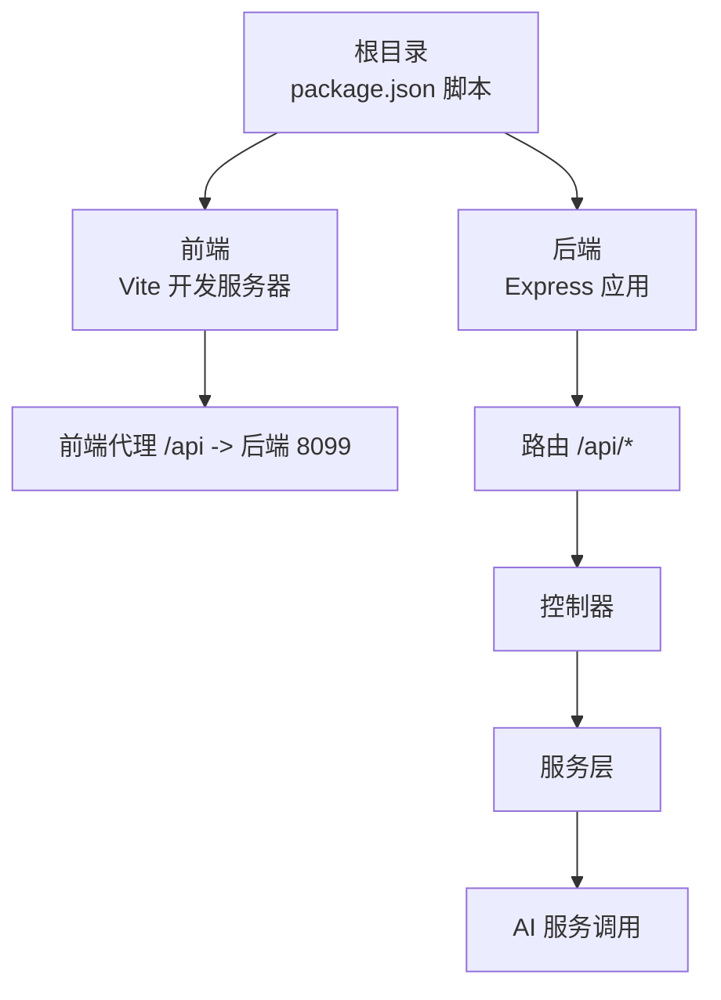
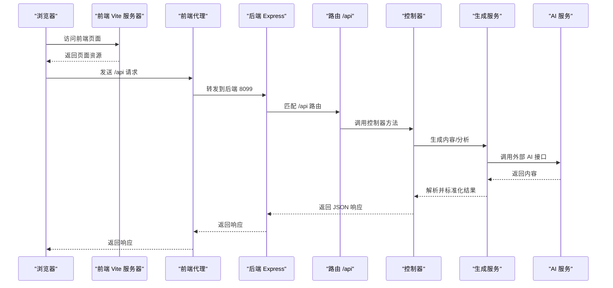
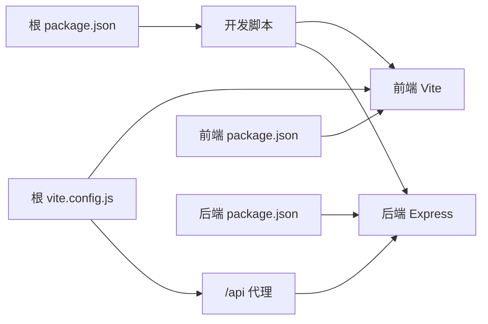

# 快速开始

<cite>
**本文引用的文件**
- [README.md](file://README.md)
- [package.json](file://package.json)
- [backend/package.json](file://backend/package.json)
- [frontend/package.json](file://frontend/package.json)
- [.env.example](file://.env.example)
- [backend/.env.example](file://backend/.env.example)
- [backend/src/app.js](file://backend/src/app.js)
- [backend/src/config/ai.config.js](file://backend/src/config/ai.config.js)
- [backend/src/services/aiService.js](file://backend/src/services/aiService.js)
- [backend/src/routes/index.js](file://backend/src/routes/index.js)
- [backend/src/controllers/generationController.js](file://backend/src/controllers/generationController.js)
- [backend/src/services/generationService.js](file://backend/src/services/generationService.js)
- [vite.config.js](file://vite.config.js)
- [frontend/vite.config.js](file://frontend/vite.config.js)
- [frontend/src/main.js](file://frontend/src/main.js)
- [frontend/src/App.vue](file://frontend/src/App.vue)
- [docs/GUIDE.md](file://docs/GUIDE.md)
</cite>

## 目录
1. [简介](#简介)
2. [项目结构](#项目结构)
3. [核心组件](#核心组件)
4. [架构总览](#架构总览)
5. [详细组件分析](#详细组件分析)
6. [依赖关系分析](#依赖关系分析)
7. [性能注意事项](#性能注意事项)
8. [故障排查指南](#故障排查指南)
9. [结论](#结论)
10. [附录](#附录)

## 简介
本指南面向首次接触“小红书爆款文案生成工具”的用户，提供从零到一的完整启动流程，涵盖环境准备、依赖安装、环境变量配置、开发服务器启动、常见问题排查与验证步骤。项目采用前后端分离架构：前端基于 Vue 3 + Vite，后端基于 Node.js + Express，通过代理实现本地联调。

## 项目结构
- 根目录提供统一的开发脚本与配置，便于一键安装与同时启动前后端。
- 前端位于根目录下的 src 目录（或独立 frontend 目录），使用 Vite 作为开发服务器与构建工具。
- 后端位于 backend 目录，提供 Express 服务与路由、控制器、服务层等模块化结构。
- 项目包含示例环境变量文件，用于配置 AI 服务与生图服务的基础地址、密钥与模型参数。

图表来源
- [package.json](file://package.json#L6-L13)
- [vite.config.js](file://vite.config.js#L23-L28)
- [backend/src/app.js](file://backend/src/app.js#L11-L24)
- [backend/src/routes/index.js](file://backend/src/routes/index.js#L9-L18)

章节来源
- [README.md](file://README.md#L13-L22)
- [package.json](file://package.json#L6-L13)
- [vite.config.js](file://vite.config.js#L11-L29)
- [backend/src/app.js](file://backend/src/app.js#L11-L24)

## 核心组件
- 前端开发服务器：使用 Vite，默认监听端口，启用代理将 /api 请求转发至后端。
- 后端开发服务器：使用 Express，默认监听端口，启用 CORS 并挂载 /api 路由。
- AI 服务：封装了对外部 AI 接口的调用，包含基础地址、模型与请求头配置。
- 生成服务：负责拼接提示词、调用 AI 服务并解析返回内容，提供降级回退策略。
- 控制器：接收前端请求，校验参数，调用服务层并返回标准化响应。

章节来源
- [frontend/vite.config.js](file://frontend/vite.config.js#L8-L16)
- [backend/src/app.js](file://backend/src/app.js#L11-L24)
- [backend/src/config/ai.config.js](file://backend/src/config/ai.config.js#L6-L17)
- [backend/src/services/aiService.js](file://backend/src/services/aiService.js#L14-L53)
- [backend/src/services/generationService.js](file://backend/src/services/generationService.js#L63-L94)
- [backend/src/controllers/generationController.js](file://backend/src/controllers/generationController.js#L10-L33)

## 架构总览
下图展示了从浏览器到后端 API 的典型请求链路，以及后端内部的服务调用关系。

图表来源
- [vite.config.js](file://vite.config.js#L23-L28)
- [backend/src/app.js](file://backend/src/app.js#L11-L24)
- [backend/src/routes/index.js](file://backend/src/routes/index.js#L9-L18)
- [backend/src/controllers/generationController.js](file://backend/src/controllers/generationController.js#L10-L33)
- [backend/src/services/generationService.js](file://backend/src/services/generationService.js#L63-L94)
- [backend/src/services/aiService.js](file://backend/src/services/aiService.js#L14-L53)

## 详细组件分析

### 环境变量与配置
- 根目录与后端目录均提供示例环境变量文件，用于配置前端 Vite 的 AI 服务地址、密钥与模型，以及后端服务端口与 CORS 来源。
- 建议在本地启动前复制示例文件为实际使用的 .env 文件，并填写有效值。

章节来源
- [.env.example](file://.env.example#L1-L9)
- [backend/.env.example](file://backend/.env.example#L1-L3)

### 启动方式与命令
- 自动安装并启动（推荐）
  - 安装前后端全部依赖
  - 同时启动前端与后端开发服务器
- 手动分步启动
  - 后端：进入 backend 目录，安装依赖并启动开发模式
  - 前端：在新终端回到根目录，安装依赖并启动开发模式

章节来源
- [README.md](file://README.md#L24-L56)
- [package.json](file://package.json#L6-L13)
- [backend/package.json](file://backend/package.json#L6-L9)
- [frontend/package.json](file://frontend/package.json#L5-L9)

### 端口与代理配置
- 前端 Vite 默认端口与代理
  - 本地开发端口
  - 代理将 /api 请求转发至后端
- 后端 Express 默认端口
  - 默认监听端口
  - CORS 来源可通过环境变量配置

章节来源
- [vite.config.js](file://vite.config.js#L11-L29)
- [frontend/vite.config.js](file://frontend/vite.config.js#L8-L16)
- [backend/src/app.js](file://backend/src/app.js#L12-L16)

### AI 服务与提示词
- AI 服务封装了外部接口调用，包含基础地址、模型与请求头配置。
- 生成服务内置多套提示词模板，用于生成文案与分析内容，并提供降级回退策略，保证在异常情况下仍能返回可用内容。

章节来源
- [backend/src/config/ai.config.js](file://backend/src/config/ai.config.js#L6-L17)
- [backend/src/services/aiService.js](file://backend/src/services/aiService.js#L14-L53)
- [backend/src/services/generationService.js](file://backend/src/services/generationService.js#L3-L61)

### 控制器与路由
- 路由集中定义了 /api 下的多个端点，分别对应框架查询、关键词分析、内容生成、质量分析与图片代理。
- 控制器对请求参数进行校验，调用服务层并返回统一结构的响应。

章节来源
- [backend/src/routes/index.js](file://backend/src/routes/index.js#L9-L18)
- [backend/src/controllers/generationController.js](file://backend/src/controllers/generationController.js#L10-L33)

### 前端入口与页面
- 前端入口初始化应用、路由与 UI 组件库，并挂载到页面。
- 页面组件负责展示标题栏与生成页视图，提供基础样式与布局。

章节来源
- [frontend/src/main.js](file://frontend/src/main.js#L10-L13)
- [frontend/src/App.vue](file://frontend/src/App.vue#L5-L27)

## 依赖关系分析
- 根目录 package.json 提供统一的开发脚本，使用并发执行器同时启动前端与后端。
- 前端与后端各自维护独立的依赖与脚本，确保模块化与可维护性。
- Vite 配置在根目录与前端目录分别存在，分别服务于根目录前端与独立前端目录。

图表来源
- [package.json](file://package.json#L6-L13)
- [vite.config.js](file://vite.config.js#L23-L28)
- [frontend/vite.config.js](file://frontend/vite.config.js#L8-L16)
- [backend/package.json](file://backend/package.json#L6-L9)
- [frontend/package.json](file://frontend/package.json#L5-L9)

章节来源
- [package.json](file://package.json#L6-L13)
- [vite.config.js](file://vite.config.js#L11-L29)
- [frontend/vite.config.js](file://frontend/vite.config.js#L8-L16)
- [backend/package.json](file://backend/package.json#L6-L9)
- [frontend/package.json](file://frontend/package.json#L5-L9)

## 性能注意事项
- 使用 Vite 的热更新与按需编译，减少开发时等待时间。
- 合理设置代理与 CORS，避免跨域带来的额外开销。
- 在生成服务中已内置降级回退策略，确保在网络不稳定或接口异常时仍可返回可用内容。

## 故障排查指南
- 端口冲突
  - 前端默认端口可能被占用，可在 Vite 配置中调整。
  - 后端默认端口可能被占用，可在环境变量中修改。
- 代理未生效
  - 确认前端代理配置指向正确的后端地址与端口。
  - 确认后端已启动并监听相应端口。
- CORS 错误
  - 检查后端 CORS 配置是否允许前端来源。
- 环境变量未生效
  - 确认已复制示例文件为实际使用的 .env 文件，并填写有效值。
- AI 接口调用失败
  - 检查 AI 服务的基础地址、密钥与模型配置。
  - 观察控制台错误日志，确认网络连通性与超时设置。

章节来源
- [vite.config.js](file://vite.config.js#L11-L29)
- [frontend/vite.config.js](file://frontend/vite.config.js#L8-L16)
- [backend/src/app.js](file://backend/src/app.js#L14-L16)
- [.env.example](file://.env.example#L1-L9)
- [backend/.env.example](file://backend/.env.example#L1-L3)
- [backend/src/services/aiService.js](file://backend/src/services/aiService.js#L45-L53)

## 结论
通过本指南，您可以快速完成环境准备、依赖安装与开发服务器启动，并在遇到问题时依据故障排查指南进行定位与修复。建议在启动前先检查端口与代理配置，确保前后端协同工作；在需要接入真实 AI 服务时，完善环境变量中的密钥与地址配置。

## 附录
- 开发指南与组件使用说明可参考文档目录中的开发指南文件，其中包含页面创建、组件使用、主题定制与构建发布的详细步骤与示例。

章节来源
- [docs/GUIDE.md](file://docs/GUIDE.md#L18-L42)