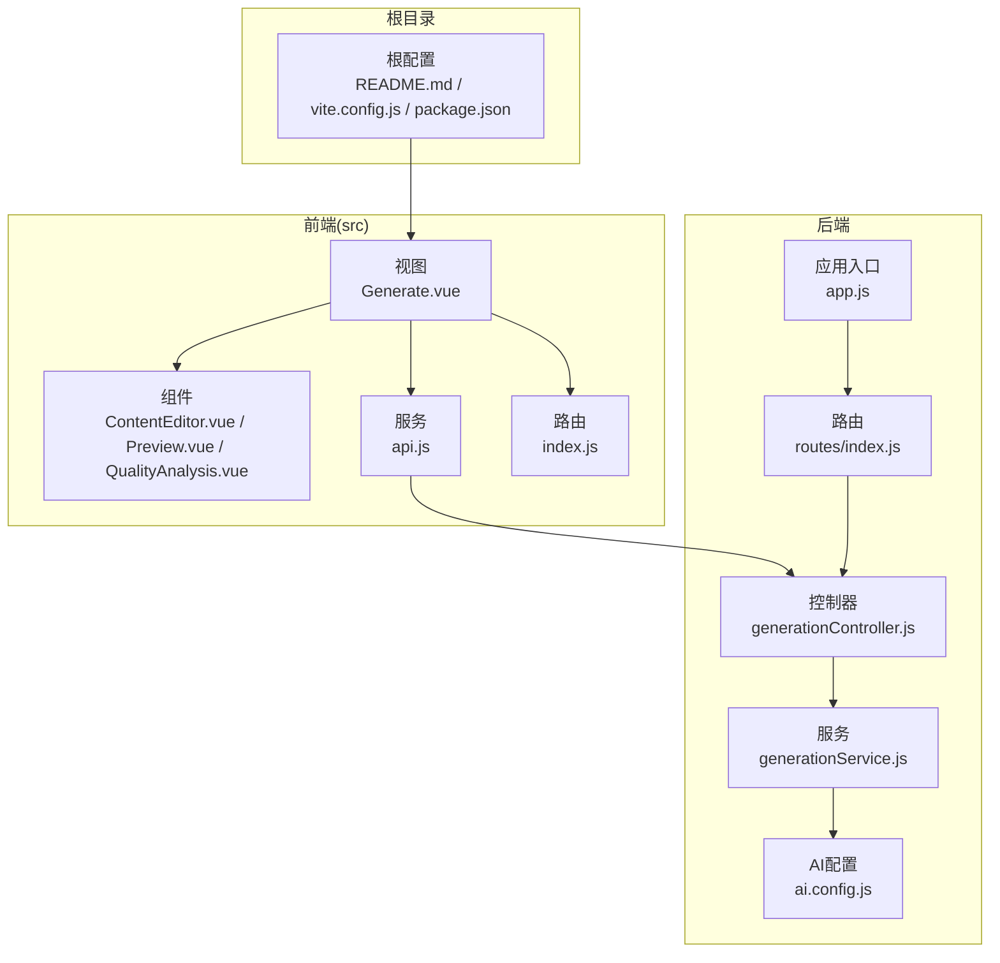
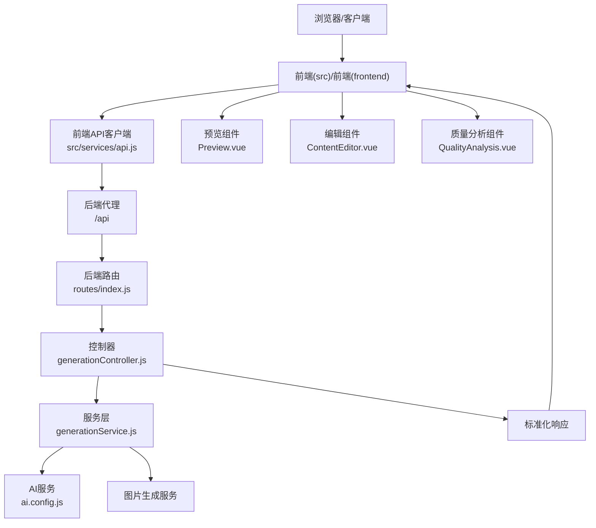
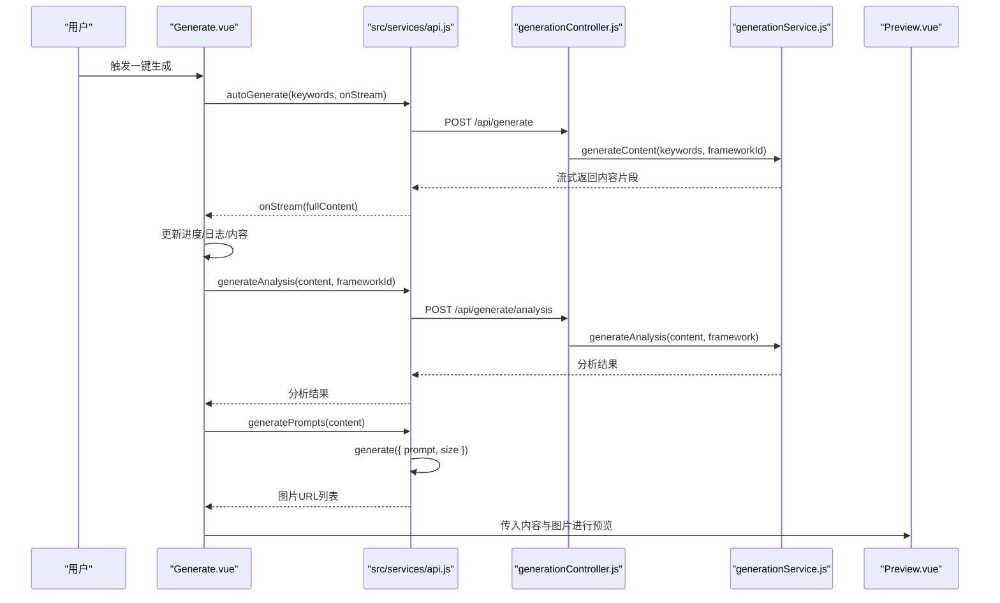
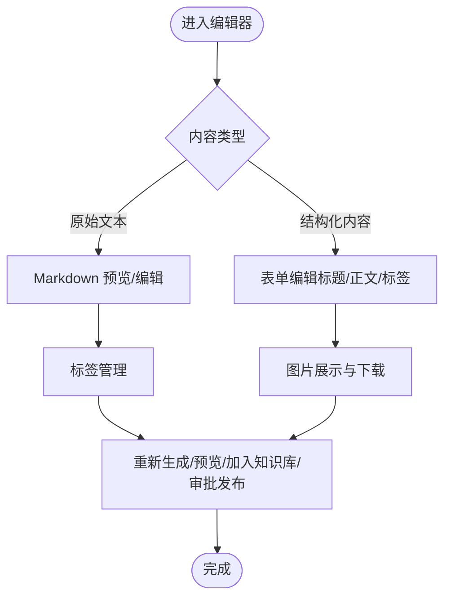
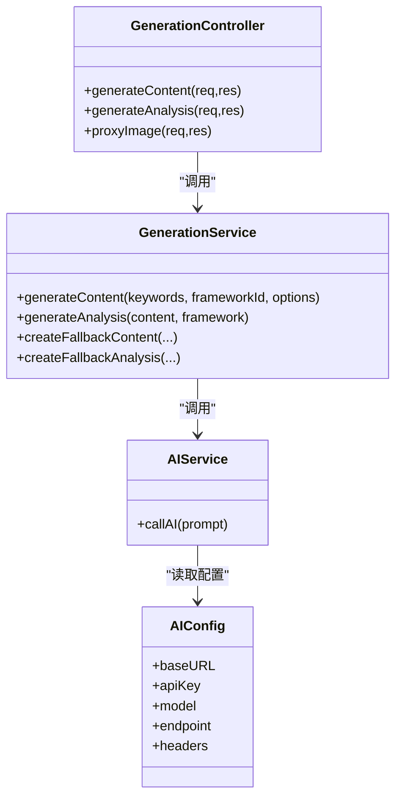
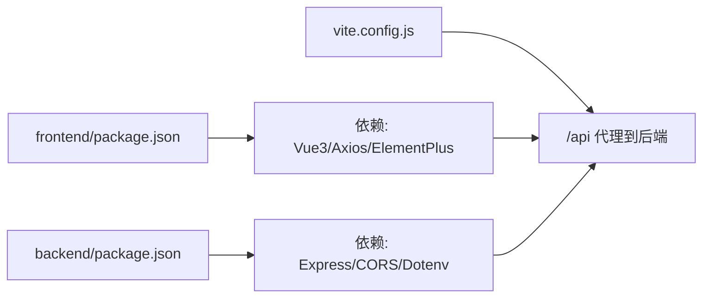

# 技术报告

<cite>
**本文引用的文件**
- [README.md](file://README.md)
- [TECHNICAL_REPORT.md](file://TECHNICAL_REPORT.md)
- [PROJECT_HIGHLIGHTS.md](file://PROJECT_HIGHLIGHTS.md)
- [backend/src/app.js](file://backend/src/app.js)
- [backend/package.json](file://backend/package.json)
- [backend/src/routes/index.js](file://backend/src/routes/index.js)
- [backend/src/controllers/generationController.js](file://backend/src/controllers/generationController.js)
- [backend/src/services/generationService.js](file://backend/src/services/generationService.js)
- [backend/src/config/ai.config.js](file://backend/src/config/ai.config.js)
- [frontend/package.json](file://frontend/package.json)
- [src/services/api.js](file://src/services/api.js)
- [frontend/src/services/api.js](file://frontend/src/services/api.js)
- [src/views/Generate.vue](file://src/views/Generate.vue)
- [src/components/ContentEditor.vue](file://src/components/ContentEditor.vue)
- [src/components/QualityAnalysis.vue](file://src/components/QualityAnalysis.vue)
- [src/components/Preview.vue](file://src/components/Preview.vue)
- [src/router/index.js](file://src/router/index.js)
- [vite.config.js](file://vite.config.js)
</cite>

## 目录
1. [简介](#简介)
2. [项目结构](#项目结构)
3. [核心组件](#核心组件)
4. [架构总览](#架构总览)
5. [详细组件分析](#详细组件分析)
6. [依赖关系分析](#依赖关系分析)
7. [性能考虑](#性能考虑)
8. [故障排查指南](#故障排查指南)
9. [结论](#结论)
10. [附录](#附录)

## 简介
本项目“Nixtio AI 爆款创作工作台”是一款面向小红书（Xiaohongshu）创作者的智能图文生成工具，融合多阶段 Agent 协同与爆款营销框架，实现从关键词到高转化内容的一键生成。项目采用前后端分离架构，前端基于 Vue 3 + Vite，后端基于 Node.js + Express，通过结构化 Prompt 工程与流式输出能力，提供沉浸式“所见即所得”的创作体验，并内置质量分析与双端预览能力，帮助创作者快速产出符合平台调性的爆款内容。

## 项目结构
项目采用多端统一的仓库组织方式，包含根目录配置、前端工程、后端服务与文档资料。核心模块划分如下：
- 根目录：项目说明、技术报告、亮点总结、产品规划与框架文档
- backend：后端服务，包含路由、控制器、服务与 AI 配置
- frontend：旧版前端工程（与 src 前端并存）
- src：新版前端工程，包含视图、组件、服务与路由

图表来源
- [src/views/Generate.vue](file://src/views/Generate.vue#L1-L668)
- [src/components/ContentEditor.vue](file://src/components/ContentEditor.vue#L1-L418)
- [src/components/Preview.vue](file://src/components/Preview.vue#L1-L411)
- [src/components/QualityAnalysis.vue](file://src/components/QualityAnalysis.vue#L1-L138)
- [src/services/api.js](file://src/services/api.js#L1-L454)
- [src/router/index.js](file://src/router/index.js#L1-L26)
- [backend/src/app.js](file://backend/src/app.js#L1-L26)
- [backend/src/routes/index.js](file://backend/src/routes/index.js#L1-L21)
- [backend/src/controllers/generationController.js](file://backend/src/controllers/generationController.js#L1-L100)
- [backend/src/services/generationService.js](file://backend/src/services/generationService.js#L1-L194)
- [backend/src/config/ai.config.js](file://backend/src/config/ai.config.js#L1-L18)

章节来源
- [README.md](file://README.md#L1-L76)
- [vite.config.js](file://vite.config.js#L1-L37)
- [backend/src/app.js](file://backend/src/app.js#L1-L26)

## 核心组件
- 前端工作台与流程编排
  - Generate.vue：负责生成流程编排、进度日志、流式渲染、质量分析与图片生成调度
  - ContentEditor.vue：内容编辑与 Markdown 预览、标签管理、图片下载与发布审批入口
  - Preview.vue：双端（手机/电脑）实时预览，模拟小红书 App 布局与交互
  - QualityAnalysis.vue：质量分析卡片，支持结构化评分与建议
  - api.js（src）：统一的 AI、图片与知识库 API 客户端，支持流式传输与错误兜底
- 后端服务与接口
  - app.js：Express 应用入口，CORS 与 JSON 解析配置
  - routes/index.js：REST 接口定义，涵盖框架查询、关键词分析、内容生成、质量分析与图片代理
  - generationController.js：请求参数校验、调用服务层并返回标准化响应
  - generationService.js：Prompt 工程与结构化输出、降级兜底、质量分析生成
  - ai.config.js：AI 服务基础配置（地址、鉴权、模型、端点）

章节来源
- [src/views/Generate.vue](file://src/views/Generate.vue#L1-L668)
- [src/components/ContentEditor.vue](file://src/components/ContentEditor.vue#L1-L418)
- [src/components/Preview.vue](file://src/components/Preview.vue#L1-L411)
- [src/components/QualityAnalysis.vue](file://src/components/QualityAnalysis.vue#L1-L138)
- [src/services/api.js](file://src/services/api.js#L1-L454)
- [backend/src/app.js](file://backend/src/app.js#L1-L26)
- [backend/src/routes/index.js](file://backend/src/routes/index.js#L1-L21)
- [backend/src/controllers/generationController.js](file://backend/src/controllers/generationController.js#L1-L100)
- [backend/src/services/generationService.js](file://backend/src/services/generationService.js#L1-L194)
- [backend/src/config/ai.config.js](file://backend/src/config/ai.config.js#L1-L18)

## 架构总览
系统采用“五层序贯流水线引擎”：
- 感知层（MCP 协议）：通过后端代理与外部服务对接，动态获取实时数据
- 逻辑层（策略匹配）：基于 RAG 思路匹配 AIDA、SCQA 等营销模型
- 创作层（上下文写作）：流式输出，标题、正文、标签在同一上下文窗口协同推理
- 诊断层（批判 Agent）：独立影子 Agent 对钩子、框架完整性与平台适配度进行量化评估
- 渲染层（实时预览）：Vue 3 响应式系统实现双端预览

图表来源
- [src/services/api.js](file://src/services/api.js#L1-L454)
- [backend/src/routes/index.js](file://backend/src/routes/index.js#L1-L21)
- [backend/src/controllers/generationController.js](file://backend/src/controllers/generationController.js#L1-L100)
- [backend/src/services/generationService.js](file://backend/src/services/generationService.js#L1-L194)
- [backend/src/config/ai.config.js](file://backend/src/config/ai.config.js#L1-L18)
- [src/components/Preview.vue](file://src/components/Preview.vue#L1-L411)
- [src/components/ContentEditor.vue](file://src/components/ContentEditor.vue#L1-L418)
- [src/components/QualityAnalysis.vue](file://src/components/QualityAnalysis.vue#L1-L138)

## 详细组件分析

### 前端工作台（Generate.vue）
- 流式生成与进度可视化：通过 onStream 回调增量更新内容，展示处理日志与进度条
- 全自动流程：识别博主风格 → 流式生成文案 → 质量分析 → 自动生成图片 → 保存历史
- 双端预览：右侧悬浮预览区支持手机/电脑端布局切换
- 历史记录：本地存储生成历史，支持加载、删除与清空

图表来源
- [src/views/Generate.vue](file://src/views/Generate.vue#L257-L324)
- [src/services/api.js](file://src/services/api.js#L250-L364)
- [backend/src/controllers/generationController.js](file://backend/src/controllers/generationController.js#L10-L64)
- [backend/src/services/generationService.js](file://backend/src/services/generationService.js#L63-L194)
- [src/components/Preview.vue](file://src/components/Preview.vue#L1-L411)

章节来源
- [src/views/Generate.vue](file://src/views/Generate.vue#L1-L668)

### 内容编辑器（ContentEditor.vue）
- Markdown 预览：使用 MarkdownIt 渲染正文，支持链接识别与排版
- 标签管理：动态增删标签，支持输入确认
- 图片展示：网格展示生成图片，支持下载与占位图
- 发布审批：预留审批与定时发布入口（UI 展示）

图表来源
- [src/components/ContentEditor.vue](file://src/components/ContentEditor.vue#L1-L418)

章节来源
- [src/components/ContentEditor.vue](file://src/components/ContentEditor.vue#L1-L418)

### 质量分析（QualityAnalysis.vue）
- 支持结构化评分与纯文本分析两种形态
- 按维度展开：钩子分析、框架原理、内容结构、平台适配
- 提供可视化评分与建议提示

章节来源
- [src/components/QualityAnalysis.vue](file://src/components/QualityAnalysis.vue#L1-L138)

### 实时预览（Preview.vue）
- 双端布局：手机端圆角容器与电脑端左右分栏
- 图片轮播与占位：支持已生成图片与建议图片展示
- 交互模拟：点赞、收藏、评论计数与下载按钮

章节来源
- [src/components/Preview.vue](file://src/components/Preview.vue#L1-L411)

### 后端服务与接口
- 应用入口：CORS、JSON 解析、路由挂载
- 路由定义：框架查询、关键词分析、内容生成、质量分析、图片代理
- 控制器：参数校验、调用服务层、异常捕获
- 服务层：Prompt 工程、结构化输出、降级兜底、分析生成
- AI 配置：统一的 AI 服务地址、鉴权与模型信息

图表来源
- [backend/src/controllers/generationController.js](file://backend/src/controllers/generationController.js#L1-L100)
- [backend/src/services/generationService.js](file://backend/src/services/generationService.js#L1-L194)
- [backend/src/config/ai.config.js](file://backend/src/config/ai.config.js#L1-L18)

章节来源
- [backend/src/app.js](file://backend/src/app.js#L1-L26)
- [backend/src/routes/index.js](file://backend/src/routes/index.js#L1-L21)
- [backend/src/controllers/generationController.js](file://backend/src/controllers/generationController.js#L1-L100)
- [backend/src/services/generationService.js](file://backend/src/services/generationService.js#L1-L194)
- [backend/src/config/ai.config.js](file://backend/src/config/ai.config.js#L1-L18)

## 依赖关系分析
- 前端依赖
  - Vue 3、Naive UI、Axios、Element Plus、Vue Router
  - Vite 构建与开发服务器，配置代理至后端
- 后端依赖
  - Express、CORS、Dotenv、Axios
- 跨域与代理
  - 前端通过 /api 代理到后端，后端提供图片下载代理解决跨域

图表来源
- [frontend/package.json](file://frontend/package.json#L1-L21)
- [backend/package.json](file://backend/package.json#L1-L17)
- [vite.config.js](file://vite.config.js#L1-L37)

章节来源
- [frontend/package.json](file://frontend/package.json#L1-L21)
- [backend/package.json](file://backend/package.json#L1-L17)
- [vite.config.js](file://vite.config.js#L1-L37)

## 性能考虑
- 流式传输
  - 前端通过 fetch + ReadableStream 实现增量渲染，降低感知延迟
  - 后端服务层对 AI 输出进行结构化约束，减少解析失败与重试成本
- 超时与兜底
  - 前端 AI 请求超时延长至 120 秒，图片生成与复杂推理场景更稳健
  - 服务层对非结构化输出与异常进行降级兜底，保证 UI 稳定
- 预览与渲染
  - 预览组件按设备尺寸自适应，减少不必要的重绘
  - Markdown 渲染采用轻量库，避免过度计算

章节来源
- [src/services/api.js](file://src/services/api.js#L94-L177)
- [backend/src/services/generationService.js](file://backend/src/services/generationService.js#L63-L194)

## 故障排查指南
- 生成失败
  - 检查前端 API 调用是否超时，必要时延长超时时间
  - 查看后端控制器与服务层异常捕获，确认降级兜底是否生效
- 图片下载跨域
  - 使用后端代理接口 /api/proxy-image，避免前端直接跨域下载
- 预览显示异常
  - 确认内容字段结构（标题/正文/标签/图片），确保渲染组件正确接收
- CORS 与代理
  - 确认 Vite 代理配置与后端 CORS 允许来源一致

章节来源
- [src/services/api.js](file://src/services/api.js#L369-L448)
- [backend/src/controllers/generationController.js](file://backend/src/controllers/generationController.js#L69-L94)
- [vite.config.js](file://vite.config.js#L23-L28)

## 结论
本项目通过“五层序贯流水线引擎”将 Prompt 工程、结构化输出与流式体验有机结合，形成从关键词到爆款内容的自动化生产路径。其技术亮点包括：强类型 JSON 约束、平台特性硬编码、CoT 思维链引导、影子诊断 Agent、双端预览与图片生成一体化。项目在工程健壮性方面提供了完善的降级与容错机制，确保在复杂场景下仍能稳定输出高质量内容。

## 附录
- 项目愿景：让每一位创作者都能拥有顶级运营的思维，让内容生产从“苦差事”变成“一键触发”的艺术
- 产品规划与框架文档：项目内包含多份框架与规划文档，便于持续迭代与扩展

章节来源
- [PROJECT_HIGHLIGHTS.md](file://PROJECT_HIGHLIGHTS.md#L1-L38)
- [README.md](file://README.md#L1-L76)
- [TECHNICAL_REPORT.md](file://TECHNICAL_REPORT.md#L1-L57)