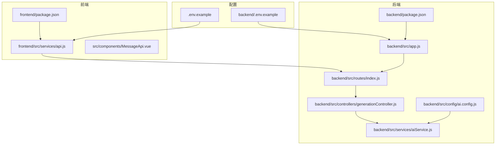
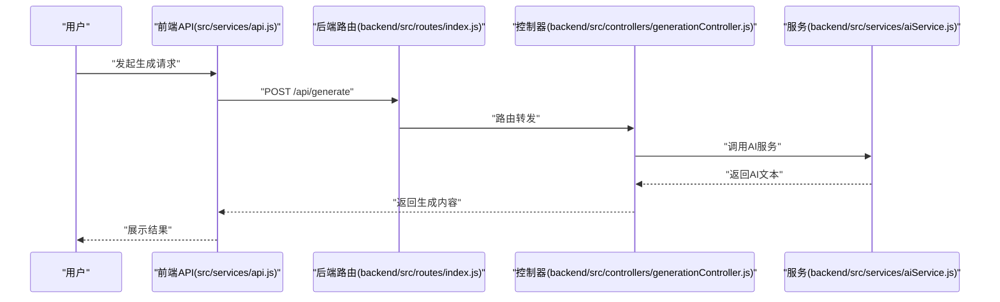
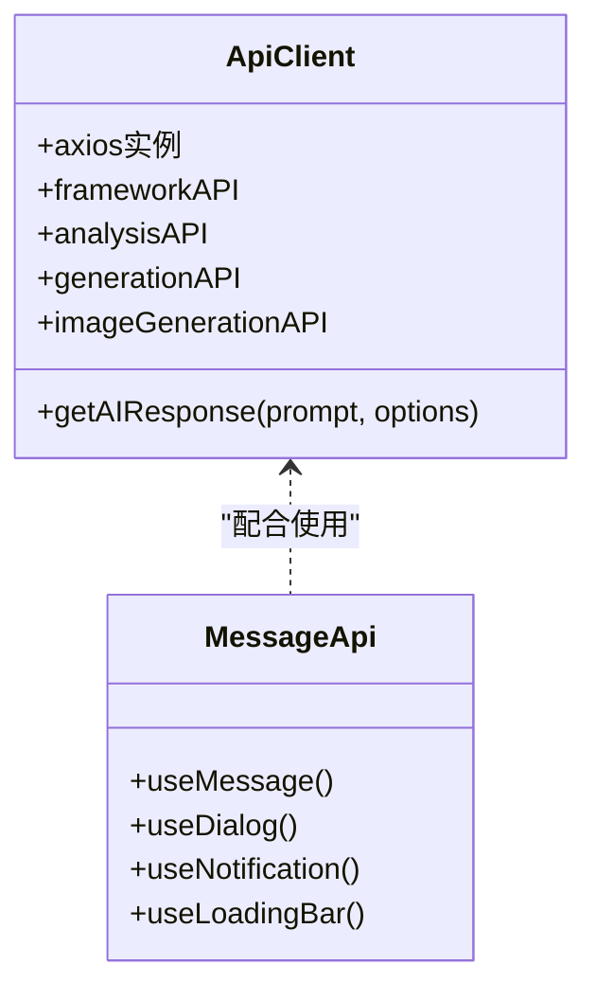
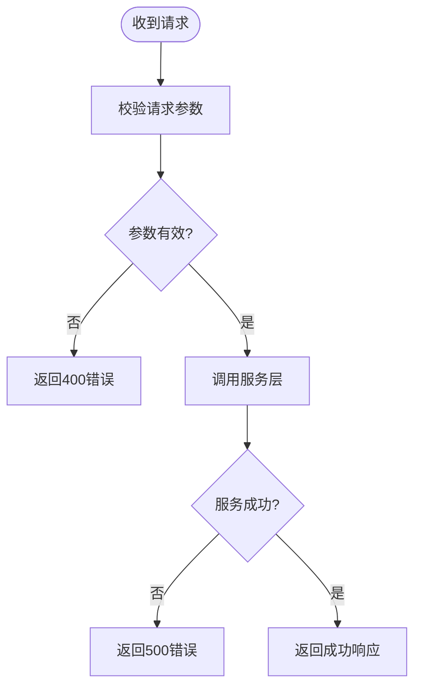
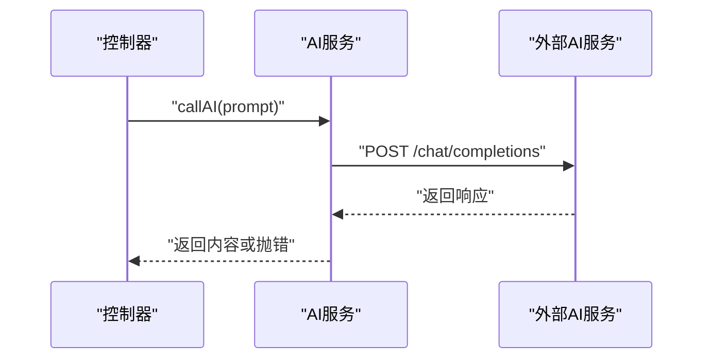
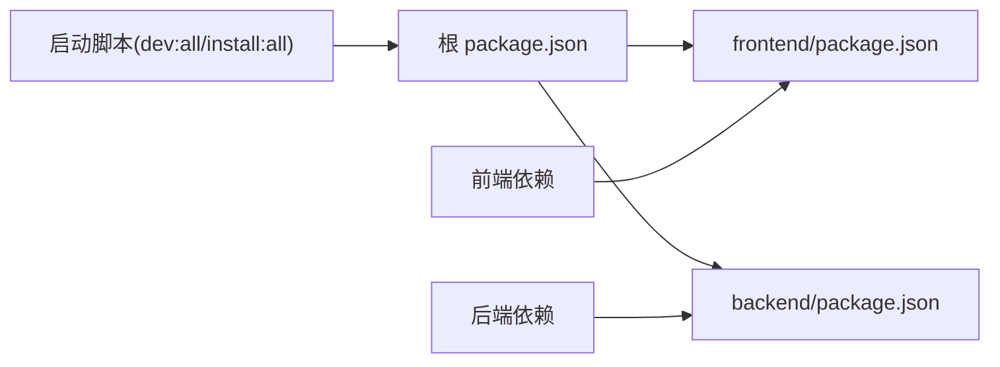

# 故障排除与常见问题

<cite>
**本文引用的文件**
- [README.md](file://README.md)
- [package.json](file://package.json)
- [backend/package.json](file://backend/package.json)
- [frontend/package.json](file://frontend/package.json)
- [backend/src/app.js](file://backend/src/app.js)
- [backend/.env.example](file://backend/.env.example)
- [.env.example](file://.env.example)
- [backend/src/config/ai.config.js](file://backend/src/config/ai.config.js)
- [backend/src/routes/index.js](file://backend/src/routes/index.js)
- [backend/src/controllers/generationController.js](file://backend/src/controllers/generationController.js)
- [backend/src/services/aiService.js](file://backend/src/services/aiService.js)
- [src/services/api.js](file://src/services/api.js)
- [frontend/src/services/api.js](file://frontend/src/services/api.js)
- [src/components/MessageApi.vue](file://src/components/MessageApi.vue)
- [src/views/Help.vue](file://src/views/Help.vue)
- [src/services/history.js](file://src/services/history.js)
</cite>

## 目录
1. [简介](#简介)
2. [项目结构](#项目结构)
3. [核心组件](#核心组件)
4. [架构总览](#架构总览)
5. [详细组件分析](#详细组件分析)
6. [依赖关系分析](#依赖关系分析)
7. [性能考虑](#性能考虑)
8. [故障排除指南](#故障排除指南)
9. [结论](#结论)
10. [附录](#附录)

## 简介
本指南面向使用“小红书爆款创作工作台”的用户与维护者，提供系统化的故障排除与常见问题解答。内容覆盖启动问题、配置问题、功能异常、日志分析、环境检查、依赖验证、性能排查、优化建议、兼容性处理与版本升级注意事项，并提供社区支持与问题反馈流程，帮助快速定位与解决问题。

## 项目结构
项目采用前后端分离架构：
- 前端：基于 Vue 3 + Vite 的工作台界面与组件体系
- 后端：基于 Node.js + Express 的 API 服务
- 配置：根目录与 backend 目录分别提供前端与后端的环境变量模板

图表来源
- [frontend/package.json](file://frontend/package.json#L1-L21)
- [backend/package.json](file://backend/package.json#L1-L17)
- [backend/src/app.js](file://backend/src/app.js#L1-L26)
- [backend/src/routes/index.js](file://backend/src/routes/index.js#L1-L21)
- [backend/src/controllers/generationController.js](file://backend/src/controllers/generationController.js#L1-L100)
- [backend/src/services/aiService.js](file://backend/src/services/aiService.js#L1-L55)
- [backend/src/config/ai.config.js](file://backend/src/config/ai.config.js#L1-L18)
- [.env.example](file://.env.example#L1-L9)
- [backend/.env.example](file://backend/.env.example#L1-L3)

章节来源
- [README.md](file://README.md#L13-L22)
- [package.json](file://package.json#L1-L32)
- [frontend/package.json](file://frontend/package.json#L1-L21)
- [backend/package.json](file://backend/package.json#L1-L17)

## 核心组件
- 前端 API 客户端：负责与后端 /api 路由通信，封装 AI 与图片生成请求
- 后端路由与控制器：提供框架查询、关键词分析、内容生成、质量分析与图片代理
- AI 服务：封装对外部 AI 与图片生成服务的调用，含超时与错误处理
- 配置模块：集中管理外部服务的基础地址、密钥与模型参数
- 消息与通知：通过 Naive UI 提供统一的消息、对话框、通知与加载条 API

章节来源
- [src/services/api.js](file://src/services/api.js#L1-L454)
- [backend/src/routes/index.js](file://backend/src/routes/index.js#L1-L21)
- [backend/src/controllers/generationController.js](file://backend/src/controllers/generationController.js#L1-L100)
- [backend/src/services/aiService.js](file://backend/src/services/aiService.js#L1-L55)
- [backend/src/config/ai.config.js](file://backend/src/config/ai.config.js#L1-L18)
- [src/components/MessageApi.vue](file://src/components/MessageApi.vue#L1-L16)

## 架构总览
前端通过 /api 前缀调用后端路由；后端路由将请求分发至对应控制器；控制器调用服务层完成业务逻辑；服务层对接外部 AI 与图片生成服务；环境变量决定各服务的地址与密钥。

图表来源
- [src/services/api.js](file://src/services/api.js#L250-L320)
- [backend/src/routes/index.js](file://backend/src/routes/index.js#L14-L16)
- [backend/src/controllers/generationController.js](file://backend/src/controllers/generationController.js#L10-L33)
- [backend/src/services/aiService.js](file://backend/src/services/aiService.js#L14-L53)

## 详细组件分析

### 前端 API 客户端与消息系统
- 前端 API 客户端：
  - 使用 Vite 环境变量注入外部服务地址与密钥
  - 支持流式与非流式两种调用模式，分别用于大模型推理与简单分析
  - 对图片生成与提示词工程化生成提供专用接口
- 消息系统：
  - 通过 MessageApi 注入全局消息、对话框、通知与加载条，便于在非组件上下文使用

图表来源
- [src/services/api.js](file://src/services/api.js#L1-L454)
- [src/components/MessageApi.vue](file://src/components/MessageApi.vue#L1-L16)

章节来源
- [src/services/api.js](file://src/services/api.js#L1-L454)
- [src/components/MessageApi.vue](file://src/components/MessageApi.vue#L1-L16)

### 后端路由与控制器
- 路由：
  - 提供框架查询、关键词分析、内容生成、质量分析与图片代理接口
- 控制器：
  - 参数校验与错误处理
  - 图片代理解决前端跨域下载问题
  - 调用服务层执行业务逻辑

图表来源
- [backend/src/controllers/generationController.js](file://backend/src/controllers/generationController.js#L10-L33)
- [backend/src/controllers/generationController.js](file://backend/src/controllers/generationController.js#L69-L94)

章节来源
- [backend/src/routes/index.js](file://backend/src/routes/index.js#L1-L21)
- [backend/src/controllers/generationController.js](file://backend/src/controllers/generationController.js#L1-L100)

### AI 服务与图片生成
- AI 服务：
  - 统一封装外部大模型服务调用，设置超时与错误日志
  - 对空响应进行显式错误抛出
- 图片生成：
  - 通过火山引擎接口生成图片
  - 对响应格式异常进行捕获与提示

图表来源
- [backend/src/services/aiService.js](file://backend/src/services/aiService.js#L14-L53)

章节来源
- [backend/src/services/aiService.js](file://backend/src/services/aiService.js#L1-L55)
- [src/services/api.js](file://src/services/api.js#L369-L449)

## 依赖关系分析
- 前端依赖：
  - Vue 3、Axios、Naive UI、Element Plus、Vite
- 后端依赖：
  - Express、CORS、dotenv、Axios
- 脚本与启动：
  - 根目录提供一键安装与并行启动脚本
  - 后端提供开发与生产脚本

图表来源
- [package.json](file://package.json#L6-L13)
- [frontend/package.json](file://frontend/package.json#L10-L19)
- [backend/package.json](file://backend/package.json#L10-L15)

章节来源
- [package.json](file://package.json#L1-L32)
- [frontend/package.json](file://frontend/package.json#L1-L21)
- [backend/package.json](file://backend/package.json#L1-L17)

## 性能考虑
- 超时与并发：
  - 前端 AI 请求默认超时较长，适合复杂提示词与流式输出
  - 图片生成与 AI 推理可能耗时较长，建议合理设置超时
- 流式传输：
  - 流式模式可边接收边渲染，改善用户体验
- 本地存储：
  - 历史记录与知识库使用本地存储，注意容量与序列化开销
- 代理下载：
  - 图片代理避免前端跨域限制，但需关注网络延迟与超时

章节来源
- [src/services/api.js](file://src/services/api.js#L16-L37)
- [src/services/api.js](file://src/services/api.js#L120-L177)
- [src/services/history.js](file://src/services/history.js#L50-L88)
- [backend/src/controllers/generationController.js](file://backend/src/controllers/generationController.js#L69-L94)

## 故障排除指南

### 一、启动问题
- 症状
  - 启动后无法访问前端或后端服务
  - 端口占用或 CORS 错误
- 诊断步骤
  - 检查根目录与 backend 目录的安装脚本与依赖
  - 确认端口与 CORS 配置是否正确
  - 查看控制台输出与日志
- 解决方案
  - 使用一键安装与启动脚本
  - 修改端口与 CORS 允许来源
  - 确保前后端均正常监听

章节来源
- [README.md](file://README.md#L24-L56)
- [package.json](file://package.json#L6-L13)
- [backend/src/app.js](file://backend/src/app.js#L12-L16)
- [backend/.env.example](file://backend/.env.example#L1-L3)

### 二、配置问题
- 症状
  - AI 服务或图片生成接口调用失败
  - 401/403 权限错误或鉴权失败
- 诊断步骤
  - 检查 Vite 环境变量是否正确加载
  - 核对基础 URL、API Key、模型名称
  - 对比 .env.example 与实际 .env 文件
- 解决方案
  - 补充并修正环境变量
  - 确保 Authorization 头与必要请求头完整
  - 验证外部服务可用性与配额

章节来源
- [.env.example](file://.env.example#L1-L9)
- [src/services/api.js](file://src/services/api.js#L16-L37)
- [backend/src/config/ai.config.js](file://backend/src/config/ai.config.js#L6-L17)
- [backend/src/services/aiService.js](file://backend/src/services/aiService.js#L14-L53)

### 三、功能异常
- 症状
  - 生成内容为空或报错
  - 图片生成失败或无返回
  - 质量分析不可用
- 诊断步骤
  - 检查前端 API 调用链路与错误提示
  - 查看后端控制器参数校验与异常处理
  - 核查外部服务响应与超时设置
- 解决方案
  - 重试请求或调整提示词
  - 检查网络与外部服务状态
  - 降低复杂度或延长超时时间

章节来源
- [src/services/api.js](file://src/services/api.js#L250-L363)
- [backend/src/controllers/generationController.js](file://backend/src/controllers/generationController.js#L10-L33)
- [backend/src/controllers/generationController.js](file://backend/src/controllers/generationController.js#L69-L94)
- [backend/src/services/aiService.js](file://backend/src/services/aiService.js#L40-L53)

### 四、日志分析与环境检查
- 日志位置
  - 后端控制台输出：服务启动、请求处理、错误堆栈
  - 前端控制台输出：API 调用、流式解析、错误信息
- 检查要点
  - 确认环境变量已正确注入
  - 观察超时与网络错误
  - 记录响应状态码与错误消息

章节来源
- [backend/src/app.js](file://backend/src/app.js#L22-L24)
- [backend/src/services/aiService.js](file://backend/src/services/aiService.js#L46-L51)
- [src/services/api.js](file://src/services/api.js#L120-L177)

### 五、依赖验证
- 前端依赖
  - 确认 axios、vue、vue-router、naive-ui 版本兼容
- 后端依赖
  - 确认 express、cors、dotenv、axios 版本兼容
- 启动脚本
  - 使用根目录脚本一次性安装与启动

章节来源
- [frontend/package.json](file://frontend/package.json#L10-L19)
- [backend/package.json](file://backend/package.json#L10-L15)
- [package.json](file://package.json#L6-L13)

### 六、性能问题排查与优化
- 排查要点
  - 请求超时、网络抖动、外部服务限流
  - 流式传输卡顿、本地存储读写
- 优化建议
  - 合理设置超时与重试策略
  - 减少复杂提示词或拆分请求
  - 使用缓存与本地存储减少重复请求

章节来源
- [src/services/api.js](file://src/services/api.js#L16-L37)
- [src/services/api.js](file://src/services/api.js#L120-L177)
- [src/services/history.js](file://src/services/history.js#L50-L88)

### 七、兼容性与版本升级
- 兼容性
  - 前端与后端 Node 版本需满足依赖要求
  - Vite 与 Vue 版本需保持兼容
- 升级注意事项
  - 升级前备份 .env 与本地存储数据
  - 逐项更新依赖并测试关键路径
  - 关注外部服务接口变更与鉴权要求

章节来源
- [frontend/package.json](file://frontend/package.json#L10-L19)
- [backend/package.json](file://backend/package.json#L10-L15)
- [README.md](file://README.md#L71-L76)

### 八、社区支持与问题反馈
- 帮助中心
  - 提供快速入门、内容知识库说明、图片生成相关提示
- 反馈流程
  - 保留日志与错误截图
  - 描述复现步骤与期望结果
  - 提交至项目维护渠道

章节来源
- [src/views/Help.vue](file://src/views/Help.vue#L1-L42)

## 结论
通过系统化的启动检查、配置核对、日志分析与性能优化，大多数问题可在短时间内定位并解决。建议在升级与扩展功能时遵循兼容性与版本管理规范，确保系统稳定运行。

## 附录
- 快速入口
  - 一键安装与启动：参见根目录脚本
  - 前端默认访问地址：参见 README 中的默认端口说明
- 常用命令
  - 安装与启动：参见根目录脚本
  - 后端开发与生产：参见后端脚本

章节来源
- [README.md](file://README.md#L24-L56)
- [package.json](file://package.json#L6-L13)
- [backend/package.json](file://backend/package.json#L6-L9)