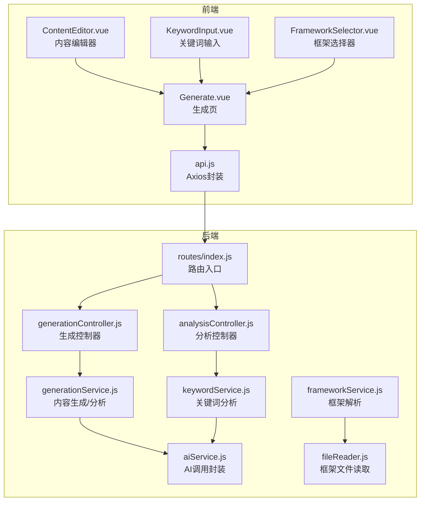
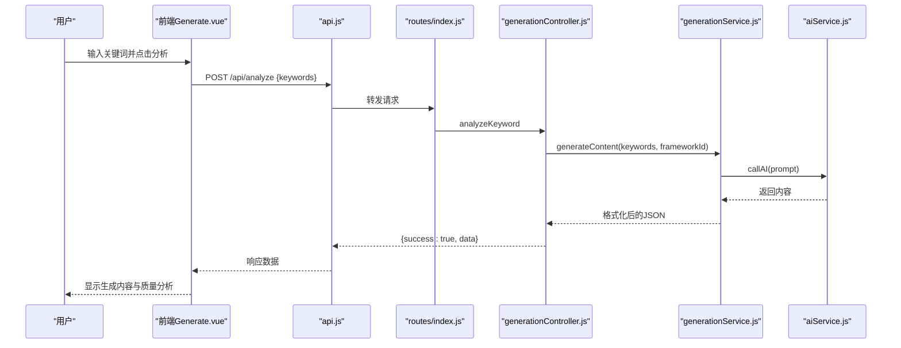
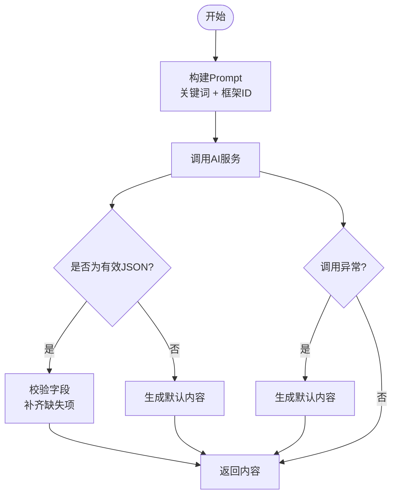
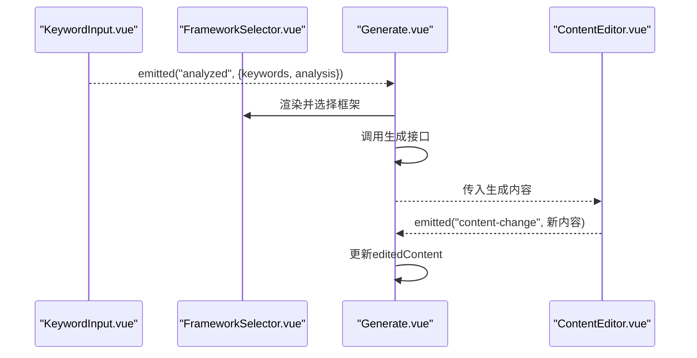
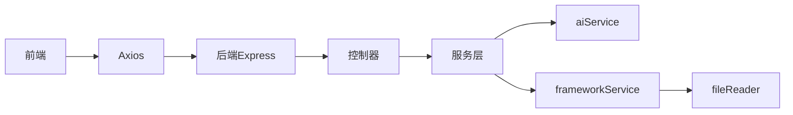

# 内容生成系统

<cite>
**本文引用的文件**
- [README.md](file://README.md)
- [package.json](file://package.json)
- [backend/src/services/aiService.js](file://backend/src/services/aiService.js)
- [backend/src/services/generationService.js](file://backend/src/services/generationService.js)
- [backend/src/services/keywordService.js](file://backend/src/services/keywordService.js)
- [backend/src/services/frameworkService.js](file://backend/src/services/frameworkService.js)
- [backend/src/utils/fileReader.js](file://backend/src/utils/fileReader.js)
- [backend/src/controllers/generationController.js](file://backend/src/controllers/generationController.js)
- [backend/src/controllers/analysisController.js](file://backend/src/controllers/analysisController.js)
- [backend/src/routes/index.js](file://backend/src/routes/index.js)
- [frontend/src/views/Generate.vue](file://frontend/src/views/Generate.vue)
- [frontend/src/components/ContentEditor.vue](file://frontend/src/components/ContentEditor.vue)
- [frontend/src/components/KeywordInput.vue](file://frontend/src/components/KeywordInput.vue)
- [frontend/src/components/FrameworkSelector.vue](file://frontend/src/components/FrameworkSelector.vue)
- [frontend/src/services/api.js](file://frontend/src/services/api.js)
</cite>

## 目录
1. [简介](#简介)
2. [项目结构](#项目结构)
3. [核心组件](#核心组件)
4. [架构总览](#架构总览)
5. [详细组件分析](#详细组件分析)
6. [依赖关系分析](#依赖关系分析)
7. [性能考量](#性能考量)
8. [故障排查指南](#故障排查指南)
9. [结论](#结论)
10. [附录](#附录)

## 简介
本系统是一个面向小红书内容创作的AI驱动图文生成平台，提供从关键词分析、框架匹配、AI生成到质量分析与实时编辑的完整工作流。系统采用前后端分离架构：前端基于Vue 3与Element Plus构建交互界面；后端基于Node.js/Express提供REST API，内部封装AI调用与内容生成逻辑。

系统的关键能力包括：
- Prompt工程设计：为关键词分析、内容生成与质量分析分别设计了结构化的提示词模板，确保输出符合预期格式与领域规范。
- 框架选择机制：通过关键词匹配与框架描述解析，推荐最契合的写作框架，并支持手动选择。
- 流式内容生成：当前实现为非流式同步生成，后续可按需扩展为流式输出。
- 备用机制与异常处理：当AI返回非JSON或调用失败时，系统自动降级为默认内容与默认分析，保证可用性。
- 前端集成：通过ContentEditor组件实现内容的双向数据绑定与实时更新，支持重新生成、预览与标签编辑。

## 项目结构
整体采用“前端Vue应用 + 后端Express服务”的分层架构，后端服务包含控制器、服务层与工具模块，前端提供工作台页面与组件化UI。

图表来源
- [backend/src/routes/index.js](file://backend/src/routes/index.js#L1-L21)
- [backend/src/controllers/generationController.js](file://backend/src/controllers/generationController.js#L1-L100)
- [backend/src/controllers/analysisController.js](file://backend/src/controllers/analysisController.js#L1-L37)
- [backend/src/services/aiService.js](file://backend/src/services/aiService.js#L1-L55)
- [backend/src/services/generationService.js](file://backend/src/services/generationService.js#L1-L194)
- [backend/src/services/keywordService.js](file://backend/src/services/keywordService.js#L1-L85)
- [backend/src/services/frameworkService.js](file://backend/src/services/frameworkService.js#L1-L64)
- [backend/src/utils/fileReader.js](file://backend/src/utils/fileReader.js#L1-L49)
- [frontend/src/views/Generate.vue](file://frontend/src/views/Generate.vue#L1-L189)
- [frontend/src/components/ContentEditor.vue](file://frontend/src/components/ContentEditor.vue#L1-L195)
- [frontend/src/components/KeywordInput.vue](file://frontend/src/components/KeywordInput.vue#L1-L148)
- [frontend/src/components/FrameworkSelector.vue](file://frontend/src/components/FrameworkSelector.vue#L1-L121)
- [frontend/src/services/api.js](file://frontend/src/services/api.js#L1-L40)

章节来源
- [README.md](file://README.md#L1-L76)
- [package.json](file://package.json#L1-L32)

## 核心组件
- AI服务封装（aiService.js）
  - 统一调用外部AI服务，负责请求构造、超时控制与错误处理。
  - 关键点：固定模型与基础URL、统一错误抛出、返回消息内容。
- 关键词分析服务（keywordService.js）
  - 使用专用Prompt对关键词进行意图、主题、受众与框架推荐分析。
  - 输出严格JSON，若AI返回非JSON则回退为默认分析结果。
- 内容生成服务（generationService.js）
  - 生成内容：构造Prompt并调用AI，解析JSON，缺失字段补齐，失败时回退默认内容。
  - 质量分析：对已有内容进行质量评估，包含钩子、框架、结构与吸引力评分。
- 框架服务（frameworkService.js）
  - 解析本地框架Markdown文件，提取标题、描述与全文，支持按关键词匹配排序。
- 文件读取工具（fileReader.js）
  - 支持跨目录读取框架文件，提供容错回退路径。
- 控制器（generationController.js、analysisController.js）
  - 路由入口，参数校验，调用服务层，返回标准化响应。
- 前端视图与组件（Generate.vue、ContentEditor.vue、KeywordInput.vue、FrameworkSelector.vue）
  - 生成页串联关键词分析、框架选择、内容生成与质量分析。
  - 编辑器实现内容双向绑定、标签增删、重新生成与预览触发。

章节来源
- [backend/src/services/aiService.js](file://backend/src/services/aiService.js#L1-L55)
- [backend/src/services/keywordService.js](file://backend/src/services/keywordService.js#L1-L85)
- [backend/src/services/generationService.js](file://backend/src/services/generationService.js#L1-L194)
- [backend/src/services/frameworkService.js](file://backend/src/services/frameworkService.js#L1-L64)
- [backend/src/utils/fileReader.js](file://backend/src/utils/fileReader.js#L1-L49)
- [backend/src/controllers/generationController.js](file://backend/src/controllers/generationController.js#L1-L100)
- [backend/src/controllers/analysisController.js](file://backend/src/controllers/analysisController.js#L1-L37)
- [frontend/src/views/Generate.vue](file://frontend/src/views/Generate.vue#L1-L189)
- [frontend/src/components/ContentEditor.vue](file://frontend/src/components/ContentEditor.vue#L1-L195)
- [frontend/src/components/KeywordInput.vue](file://frontend/src/components/KeywordInput.vue#L1-L148)
- [frontend/src/components/FrameworkSelector.vue](file://frontend/src/components/FrameworkSelector.vue#L1-L121)

## 架构总览
系统采用经典的三层架构：表现层（前端）、应用层（控制器/服务）、数据与AI层（文件/外部API）。前端通过Axios调用后端路由，后端控制器委派至服务层，服务层再调用AI服务或本地文件解析。

图表来源
- [frontend/src/views/Generate.vue](file://frontend/src/views/Generate.vue#L75-L116)
- [frontend/src/services/api.js](file://frontend/src/services/api.js#L28-L35)
- [backend/src/routes/index.js](file://backend/src/routes/index.js#L13-L16)
- [backend/src/controllers/analysisController.js](file://backend/src/controllers/analysisController.js#L6-L29)
- [backend/src/controllers/generationController.js](file://backend/src/controllers/generationController.js#L10-L33)
- [backend/src/services/generationService.js](file://backend/src/services/generationService.js#L63-L94)
- [backend/src/services/aiService.js](file://backend/src/services/aiService.js#L14-L53)

## 详细组件分析

### GenerationService：内容生成与质量分析
- Prompt工程设计
  - 内容生成Prompt包含框架说明与JSON输出约束，确保返回结构化数据。
  - 质量分析Prompt包含评分维度与JSON输出要求，便于前端展示。
- 关键词处理
  - 支持字符串或数组形式的关键词，统一切分为主关键词列表，用于回退内容生成。
- 框架适配
  - 生成阶段仅使用框架ID作为上下文提示，不强制解析框架内容。
  - 分析阶段接收框架对象（含id/name/description），便于分析报告中体现框架信息。
- JSON格式化输出
  - 优先解析AI返回的JSON；失败时回退默认内容与默认分析，保证字段完整性。
- 备用机制与异常处理
  - 任何环节异常均捕获并回退到默认值，避免前端崩溃。
  - 回退内容包含标题、正文、图片建议与标签，满足最小可用输出。

图表来源
- [backend/src/services/generationService.js](file://backend/src/services/generationService.js#L63-L112)
- [backend/src/services/aiService.js](file://backend/src/services/aiService.js#L14-L53)

章节来源
- [backend/src/services/generationService.js](file://backend/src/services/generationService.js#L1-L194)

### keywordService：关键词分析与框架推荐
- Prompt设计
  - 明确任务目标：意图、主题、受众与框架推荐。
  - 列举可用框架及其适用场景，指导AI给出合理推荐。
- 输出结构
  - JSON包含intent、topic、targetAudience与recommendedFrameworks。
- 容错策略
  - 若AI返回非JSON或异常，则回退到默认分析结果，确保流程稳定。

章节来源
- [backend/src/services/keywordService.js](file://backend/src/services/keywordService.js#L1-L85)

### frameworkService：框架解析与匹配
- 文件读取
  - 从指定目录读取框架Markdown文件，解析标题与描述，提取前若干字符作为摘要。
- 匹配逻辑
  - 将关键词转为小写集合，统计与框架内容的匹配词数，按匹配度排序。
- 结果结构
  - 返回包含id、name、title、description、fullContent与matchScore的框架列表。

章节来源
- [backend/src/services/frameworkService.js](file://backend/src/services/frameworkService.js#L1-L64)
- [backend/src/utils/fileReader.js](file://backend/src/utils/fileReader.js#L1-L49)

### aiService：AI调用封装
- 请求构造
  - 固定基础URL与模型，设置超时与鉴权头。
- 错误处理
  - 捕获网络与业务异常，统一抛出带错误信息的异常，便于上层回退。

章节来源
- [backend/src/services/aiService.js](file://backend/src/services/aiService.js#L1-L55)

### 前端组件集成：ContentEditor与Generate工作流
- 数据绑定
  - ContentEditor通过props接收生成内容，使用watch监听变化并通过content-change事件向上冒泡。
  - Generate页面接收生成内容后，同时拷贝一份editedContent用于编辑态，实现“所见即所得”的编辑体验。
- 交互流程
  - 用户输入关键词 → 分析并推荐框架 → 选择框架 → 生成内容 → 质量分析 → 编辑与预览。

图表来源
- [frontend/src/views/Generate.vue](file://frontend/src/views/Generate.vue#L75-L147)
- [frontend/src/components/ContentEditor.vue](file://frontend/src/components/ContentEditor.vue#L97-L105)
- [frontend/src/components/KeywordInput.vue](file://frontend/src/components/KeywordInput.vue#L88-L102)
- [frontend/src/components/FrameworkSelector.vue](file://frontend/src/components/FrameworkSelector.vue#L56-L60)

章节来源
- [frontend/src/views/Generate.vue](file://frontend/src/views/Generate.vue#L1-L189)
- [frontend/src/components/ContentEditor.vue](file://frontend/src/components/ContentEditor.vue#L1-L195)
- [frontend/src/components/KeywordInput.vue](file://frontend/src/components/KeywordInput.vue#L1-L148)
- [frontend/src/components/FrameworkSelector.vue](file://frontend/src/components/FrameworkSelector.vue#L1-L121)

## 依赖关系分析
- 前端依赖
  - Vue 3、Element Plus、Axios等，提供组件化UI与HTTP通信。
- 后端依赖
  - Express提供路由与中间件，axios用于外部API调用。
- 模块耦合
  - 控制器仅依赖服务层接口，服务层依赖AI服务与文件工具，保持良好的分层与解耦。
- 外部依赖
  - 外部AI服务（通过aiService封装），框架文件（通过fileReader读取）。

图表来源
- [package.json](file://package.json#L15-L31)
- [backend/src/routes/index.js](file://backend/src/routes/index.js#L1-L21)
- [backend/src/services/aiService.js](file://backend/src/services/aiService.js#L1-L55)
- [backend/src/services/frameworkService.js](file://backend/src/services/frameworkService.js#L1-L64)
- [backend/src/utils/fileReader.js](file://backend/src/utils/fileReader.js#L1-L49)

章节来源
- [package.json](file://package.json#L1-L32)

## 性能考量
- 网络与超时
  - AI调用设置合理超时，避免阻塞请求线程；前端API也设置了较短超时，便于快速反馈。
- 内容生成
  - 当前为同步生成，建议在需要长文本或复杂分析时考虑改为流式输出，以改善用户体验。
- 缓存与复用
  - 对于框架描述与关键词分析结果，可在服务层增加缓存策略，减少重复计算与文件读取。
- 错误重试
  - 可在前端对失败的生成请求增加有限重试机制，结合加载状态与用户提示，提升稳定性。

## 故障排查指南
- AI服务不可用
  - 现象：生成接口返回失败或空白内容。
  - 排查：检查AI服务封装中的超时与鉴权头设置；确认外部服务可用性。
  - 参考
    - [backend/src/services/aiService.js](file://backend/src/services/aiService.js#L14-L53)
- 生成内容非JSON
  - 现象：前端收到非标准JSON或字段缺失。
  - 排查：查看生成服务的JSON解析与回退逻辑；确认Prompt是否正确约束输出格式。
  - 参考
    - [backend/src/services/generationService.js](file://backend/src/services/generationService.js#L63-L94)
- 框架文件读取失败
  - 现象：框架列表为空或部分缺失。
  - 排查：确认框架文件名与路径；检查fileReader的回退逻辑是否生效。
  - 参考
    - [backend/src/utils/fileReader.js](file://backend/src/utils/fileReader.js#L9-L45)
- 前端无法显示图片
  - 现象：图片链接跨域导致无法显示。
  - 排查：使用后端代理接口下载图片，确保CORS头设置正确。
  - 参考
    - [backend/src/controllers/generationController.js](file://backend/src/controllers/generationController.js#L69-L94)

章节来源
- [backend/src/services/aiService.js](file://backend/src/services/aiService.js#L14-L53)
- [backend/src/services/generationService.js](file://backend/src/services/generationService.js#L63-L94)
- [backend/src/utils/fileReader.js](file://backend/src/utils/fileReader.js#L9-L45)
- [backend/src/controllers/generationController.js](file://backend/src/controllers/generationController.js#L69-L94)

## 结论
本系统通过精心设计的Prompt工程、稳定的框架解析与完善的回退机制，实现了从关键词到内容再到质量分析的完整链路。前端组件化设计提升了交互体验，后端服务层清晰分层便于扩展与维护。未来可在流式输出、缓存策略与重试机制方面进一步优化，以提升性能与稳定性。

## 附录

### 使用示例：调用生成接口与处理响应
- 关键词分析
  - 请求：POST /api/analyze { keywords }
  - 响应：{ success: true, data: { intent, topic, targetAudience, recommendedFrameworks } }
  - 参考
    - [frontend/src/services/api.js](file://frontend/src/services/api.js#L22-L26)
    - [backend/src/controllers/analysisController.js](file://backend/src/controllers/analysisController.js#L6-L29)
- 生成内容
  - 请求：POST /api/generate { keywords, frameworkId }
  - 响应：{ success: true, data: { title, body, images[], tags[] } }
  - 参考
    - [frontend/src/services/api.js](file://frontend/src/services/api.js#L28-L35)
    - [backend/src/controllers/generationController.js](file://backend/src/controllers/generationController.js#L10-L33)
- 质量分析
  - 请求：POST /api/generate/analysis { content, frameworkId }
  - 响应：{ success: true, data: { hook, framework, structure, appeal } }
  - 参考
    - [frontend/src/services/api.js](file://frontend/src/services/api.js#L32-L35)
    - [backend/src/controllers/generationController.js](file://backend/src/controllers/generationController.js#L35-L64)

### 与前端组件的集成要点
- ContentEditor
  - 通过props接收内容，使用watch监听变化并通过content-change事件向父组件传递编辑后的数据。
  - 支持标签增删、重新生成与预览触发。
  - 参考
    - [frontend/src/components/ContentEditor.vue](file://frontend/src/components/ContentEditor.vue#L97-L132)
- Generate工作流
  - 关键词输入 → 框架推荐 → 生成内容 → 质量分析 → 编辑与预览。
  - 参考
    - [frontend/src/views/Generate.vue](file://frontend/src/views/Generate.vue#L75-L147)

### 扩展新框架的支持方法
- 新增框架文件
  - 在框架目录新增Markdown文件，命名遵循现有框架命名规范。
  - 参考
    - [backend/src/utils/fileReader.js](file://backend/src/utils/fileReader.js#L29-L45)
- 更新框架解析
  - frameworkService会自动读取新增文件并参与匹配；无需修改核心逻辑。
  - 参考
    - [backend/src/services/frameworkService.js](file://backend/src/services/frameworkService.js#L9-L26)

### 性能优化建议
- 流式输出
  - 将AI调用改为流式模式，逐步推送内容片段，提升首屏速度与交互体验。
- 缓存策略
  - 对框架描述与关键词分析结果进行短期缓存，减少重复I/O与计算。
- 重试与降级
  - 在前端对失败请求进行有限次数重试，并在重试耗尽后提示用户或使用默认内容。