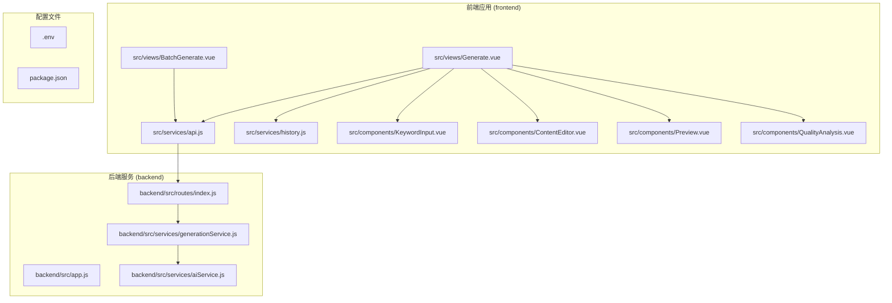
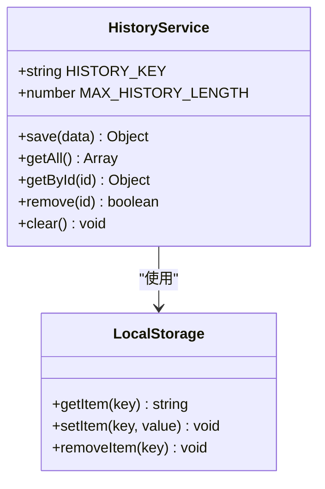
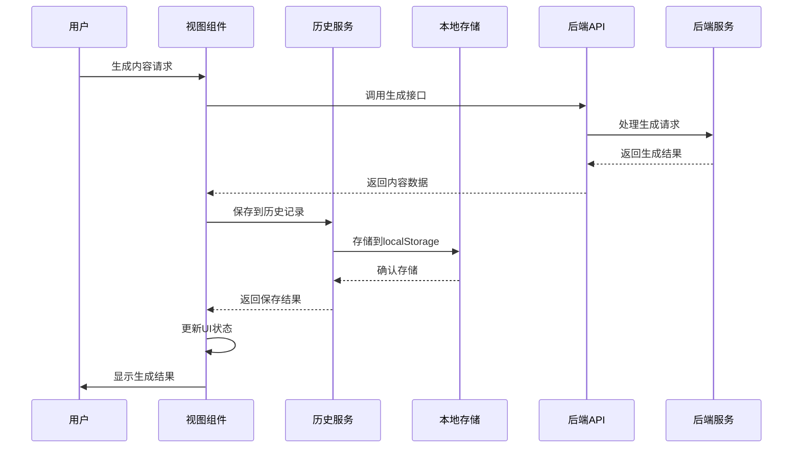
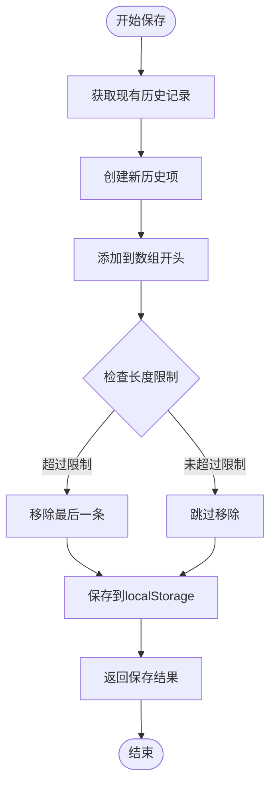
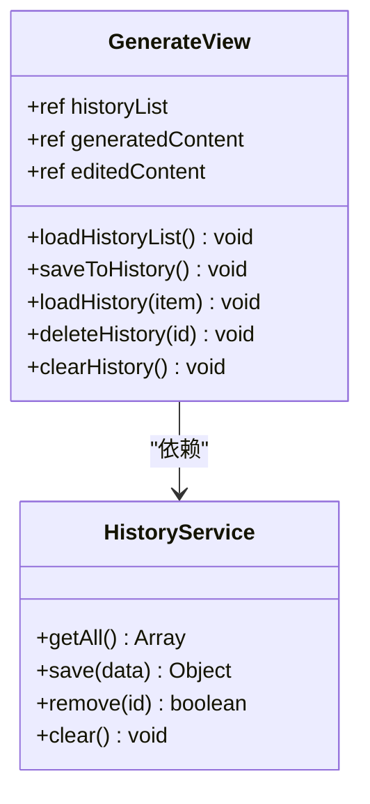
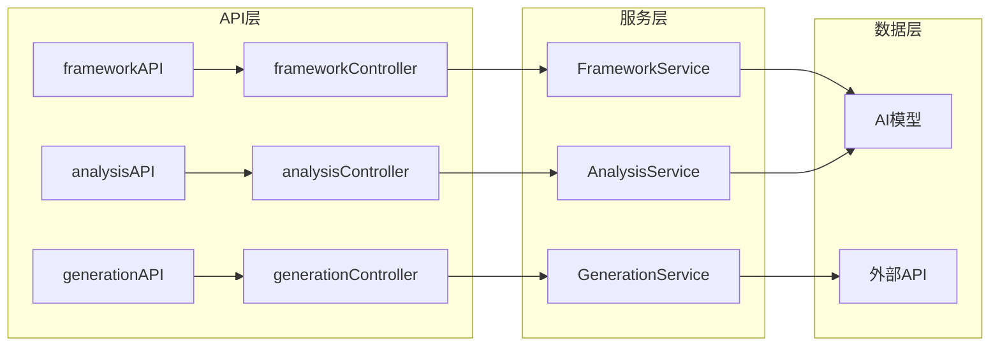
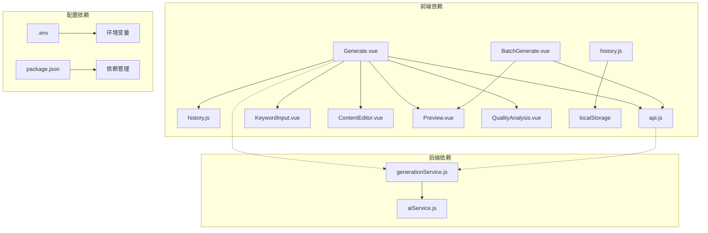

# 历史管理系统

<cite>
**本文档引用的文件**
- [history.js](file://src/services/history.js)
- [Generate.vue](file://src/views/Generate.vue)
- [BatchGenerate.vue](file://src/views/BatchGenerate.vue)
- [api.js](file://src/services/api.js)
- [generationService.js](file://backend/src/services/generationService.js)
- [KeywordInput.vue](file://src/components/KeywordInput.vue)
- [ContentEditor.vue](file://src/components/ContentEditor.vue)
- [Preview.vue](file://src/components/Preview.vue)
- [QualityAnalysis.vue](file://src/components/QualityAnalysis.vue)
</cite>

## 目录
1. [简介](#简介)
2. [项目结构](#项目结构)
3. [核心组件](#核心组件)
4. [架构概览](#架构概览)
5. [详细组件分析](#详细组件分析)
6. [依赖关系分析](#依赖关系分析)
7. [性能考量](#性能考量)
8. [故障排除指南](#故障排除指南)
9. [结论](#结论)
10. [附录](#附录)

## 简介

历史管理系统是一个基于浏览器本地存储的生成内容管理解决方案。该系统提供了完整的本地历史记录管理功能，包括内容保存、版本控制、搜索过滤、批量操作等核心特性。系统采用前后端分离架构，前端使用Vue.js构建用户界面，后端使用Express.js提供API服务。

系统的核心设计理念是：
- **本地持久化**：所有历史记录存储在浏览器localStorage中，确保数据安全和隐私
- **轻量级设计**：避免服务器端存储，减少部署复杂度
- **实时同步**：通过Vue响应式系统实现UI与历史数据的实时同步
- **扩展性**：模块化的架构设计便于功能扩展和维护

## 项目结构

该项目采用前后端分离的单页应用架构，主要目录结构如下：



**图表来源**
- [history.js](file://src/services/history.js#L1-L89)
- [Generate.vue](file://src/views/Generate.vue#L1-L668)
- [BatchGenerate.vue](file://src/views/BatchGenerate.vue#L1-L345)

**章节来源**
- [history.js](file://src/services/history.js#L1-L89)
- [Generate.vue](file://src/views/Generate.vue#L1-L668)

## 核心组件

历史管理系统由多个核心组件构成，每个组件都有明确的职责和功能边界：

### 历史服务 (HistoryService)

历史服务是整个系统的核心，负责管理本地存储的历史记录。它提供了完整的CRUD操作和数据管理功能。



**图表来源**
- [history.js](file://src/services/history.js#L6-L88)

### 前端视图组件

前端应用包含多个视图组件，每个组件都集成了历史管理功能：

- **生成视图**：主界面，包含历史记录侧边栏
- **批量生成视图**：支持批量处理多个生成任务
- **关键词输入组件**：提供智能关键词输入和分析功能
- **内容编辑器**：支持内容编辑和预览
- **质量分析组件**：提供内容质量评估功能

**章节来源**
- [Generate.vue](file://src/views/Generate.vue#L144-L173)
- [BatchGenerate.vue](file://src/views/BatchGenerate.vue#L1-L345)

## 架构概览

系统采用三层架构设计，从前端到后端形成完整的数据流：



**图表来源**
- [Generate.vue](file://src/views/Generate.vue#L312-L314)
- [history.js](file://src/services/history.js#L14-L41)

## 详细组件分析

### 历史服务实现详解

历史服务采用单例模式设计，提供简洁而强大的API接口：

#### 数据结构设计

历史记录采用统一的数据结构，确保数据的一致性和完整性：

| 字段名 | 类型 | 描述 | 必填 |
|--------|------|------|------|
| id | number | 历史记录唯一标识符 | 是 |
| timestamp | string | ISO 8601格式的时间戳 | 是 |
| keywords | string | 关键词内容 | 否 |
| content | any | 生成的内容数据 | 是 |
| images | array | 配套图片URL数组 | 否 |
| qualityAnalysis | object | 质量分析结果 | 否 |
| specialRequirements | string | 特殊要求说明 | 否 |

#### 核心算法实现

##### 保存算法 (save)


**图表来源**
- [history.js](file://src/services/history.js#L14-L41)

##### 数据序列化机制
历史服务使用JSON序列化技术处理数据存储：
- **序列化**：使用`JSON.stringify()`将JavaScript对象转换为字符串
- **反序列化**：使用`JSON.parse()`将字符串转换为JavaScript对象
- **错误处理**：包含完整的try-catch机制处理序列化异常

##### 去重机制
系统通过时间戳实现天然的去重：
- 使用`Date.now()`生成唯一ID
- 确保历史记录的唯一性和顺序性
- 自动处理重复内容的存储

**章节来源**
- [history.js](file://src/services/history.js#L14-L88)

### 前端集成实现

#### 生成视图集成

生成视图集成了完整的历史管理功能：



**图表来源**
- [Generate.vue](file://src/views/Generate.vue#L238-L422)
- [history.js](file://src/services/history.js#L9-L88)

#### 批量生成集成

批量生成视图提供了批量历史管理功能：

| 功能特性 | 实现方式 | 用户体验 |
|----------|----------|----------|
| 批量保存 | 自动保存每个生成结果 | 无需手动操作 |
| 批量下载 | 支持ZIP打包下载 | 提升工作效率 |
| 批量预览 | 弹窗预览单个结果 | 方便内容审核 |
| 批量删除 | 支持批量清理历史 | 维护存储空间 |

**章节来源**
- [BatchGenerate.vue](file://src/views/BatchGenerate.vue#L163-L230)

### 后端服务架构

后端服务提供API接口支持前端历史管理：



**图表来源**
- [generationService.js](file://backend/src/services/generationService.js#L63-L194)

**章节来源**
- [generationService.js](file://backend/src/services/generationService.js#L1-L194)

## 依赖关系分析

系统各组件之间的依赖关系清晰明确：



**图表来源**
- [Generate.vue](file://src/views/Generate.vue#L189-L195)
- [history.js](file://src/services/history.js#L6-L7)

**章节来源**
- [api.js](file://src/services/api.js#L1-L454)

## 性能考量

### 存储性能优化

系统在存储性能方面采用了多项优化策略：

#### 存储容量管理
- **容量限制**：最大历史记录数量为50条
- **自动清理**：超出限制时自动移除最旧的记录
- **内存优化**：使用数组操作优化存储效率

#### 数据访问优化
- **懒加载**：仅在需要时加载历史记录
- **缓存策略**：Vue响应式系统提供自动缓存
- **增量更新**：支持局部更新而不影响整体性能

### 前端性能优化

#### 组件渲染优化
- **虚拟DOM**：Vue.js的虚拟DOM提高渲染效率
- **响应式更新**：精确的变更检测减少不必要的重渲染
- **组件复用**：通用组件设计提升代码复用率

#### 网络请求优化
- **请求合并**：批量操作减少网络请求次数
- **错误重试**：智能的错误处理和重试机制
- **超时控制**：合理的超时设置避免资源浪费

## 故障排除指南

### 常见问题及解决方案

#### 历史记录丢失
**问题描述**：用户发现历史记录意外消失
**可能原因**：
- 浏览器清除缓存或Cookie
- localStorage存储空间不足
- 浏览器兼容性问题

**解决方案**：
1. 检查浏览器存储权限设置
2. 清理浏览器缓存但保留localStorage
3. 在不同浏览器中测试功能

#### 数据序列化错误
**问题描述**：保存历史记录时报错
**可能原因**：
- 数据包含不可序列化对象
- JSON解析失败
- 存储空间不足

**解决方案**：
1. 检查数据结构的可序列化性
2. 使用try-catch包装序列化操作
3. 实现数据清理和验证机制

#### 性能问题
**问题描述**：历史记录加载缓慢
**可能原因**：
- 历史记录过多
- DOM渲染压力大
- 网络请求阻塞

**解决方案**：
1. 实现分页加载机制
2. 优化DOM结构
3. 使用虚拟滚动技术

**章节来源**
- [history.js](file://src/services/history.js#L37-L40)
- [Generate.vue](file://src/views/Generate.vue#L315-L323)

## 结论

历史管理系统通过精心设计的架构和实现，成功实现了本地存储的历史记录管理功能。系统的主要优势包括：

### 技术优势
- **安全性**：数据完全存储在本地，无需担心服务器安全风险
- **隐私性**：用户数据不会离开本地设备
- **可靠性**：基于成熟的localStorage API，稳定性高
- **扩展性**：模块化设计便于功能扩展

### 功能优势
- **易用性**：直观的用户界面和简单的工作流程
- **完整性**：支持完整的CRUD操作和批量管理
- **实时性**：Vue响应式系统提供实时的状态同步
- **兼容性**：支持多种浏览器和设备

### 改进建议
1. **数据备份**：考虑实现数据导出和导入功能
2. **搜索功能**：添加关键词搜索和过滤功能
3. **版本控制**：支持内容版本管理和比较功能
4. **云同步**：提供可选的云端同步选项

该系统为内容创作者提供了一个强大而可靠的历史记录管理解决方案，有效提升了内容创作和管理的效率。

## 附录

### 使用示例

#### 保存生成内容
```javascript
// 在生成完成后调用
historyService.save({
  keywords: "小红书文案",
  content: generatedContent,
  images: generatedImages,
  qualityAnalysis: qualityAnalysis,
  specialRequirements: ""
});
```

#### 查看历史记录
```javascript
// 获取所有历史记录
const historyList = historyService.getAll();
console.log(historyList);

// 根据ID获取特定记录
const specificRecord = historyService.getById(recordId);
```

#### 恢复旧版本
```javascript
// 加载历史记录到编辑器
historyService.getById(recordId);
// 系统会自动填充编辑器内容
```

#### 删除不需要的内容
```javascript
// 删除单条记录
historyService.remove(recordId);

// 清空所有历史
historyService.clear();
```

### 集成指南

#### 前端组件集成
1. 导入history.js模块
2. 在组件中调用historyService方法
3. 绑定UI事件到历史操作
4. 实现错误处理和用户反馈

#### 后端API集成
1. 配置API路由
2. 实现业务逻辑处理
3. 返回标准化的响应格式
4. 处理异常情况和错误码