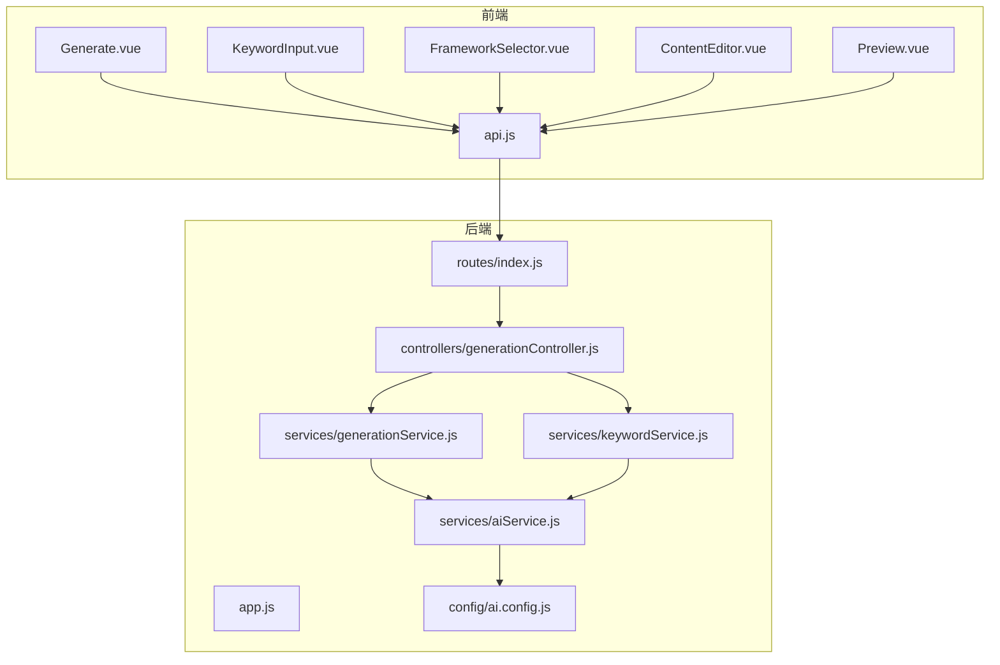
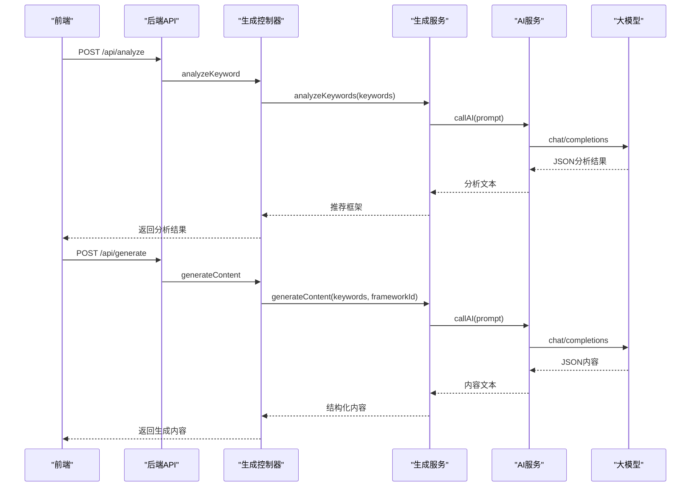
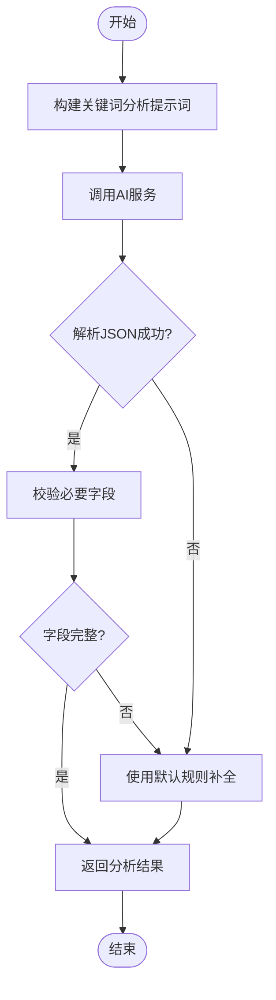
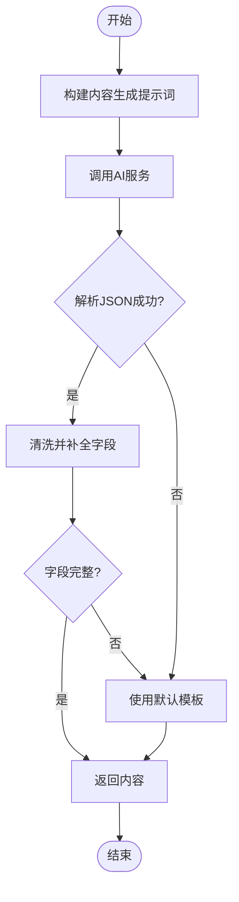
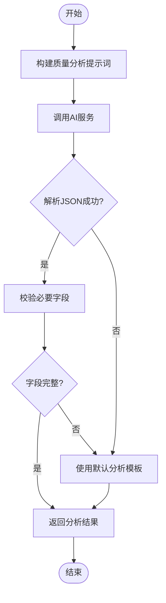
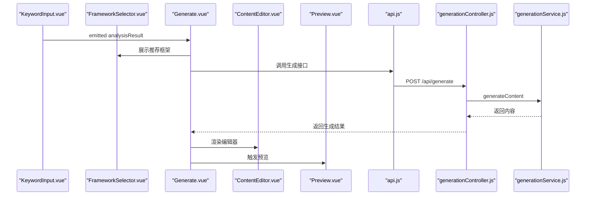
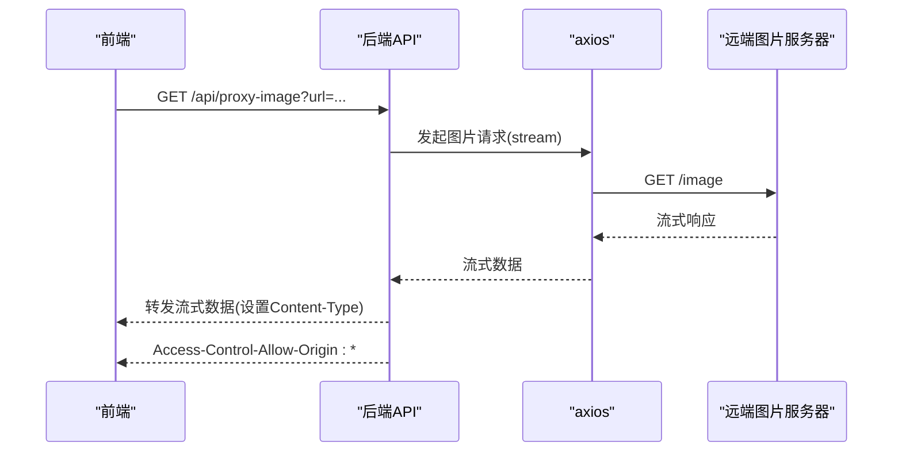
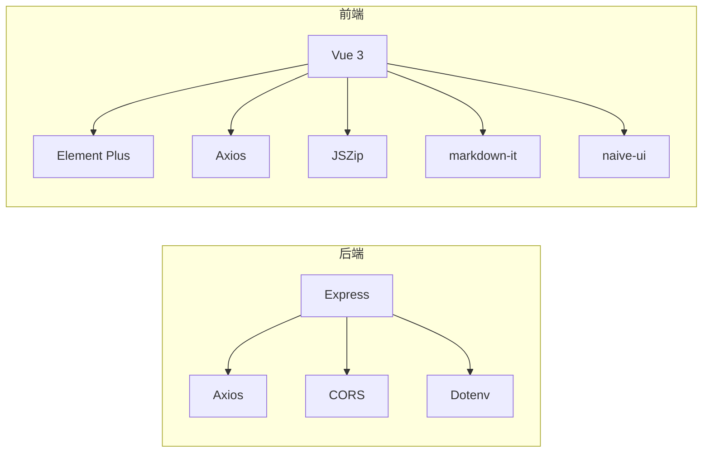

# 图片生成系统

<cite>
**本文档引用的文件**
- [backend/src/app.js](file://backend/src/app.js)
- [backend/src/routes/index.js](file://backend/src/routes/index.js)
- [backend/src/controllers/generationController.js](file://backend/src/controllers/generationController.js)
- [backend/src/services/generationService.js](file://backend/src/services/generationService.js)
- [backend/src/services/keywordService.js](file://backend/src/services/keywordService.js)
- [backend/src/services/aiService.js](file://backend/src/services/aiService.js)
- [backend/src/config/ai.config.js](file://backend/src/config/ai.config.js)
- [frontend/src/views/Generate.vue](file://frontend/src/views/Generate.vue)
- [frontend/src/services/api.js](file://frontend/src/services/api.js)
- [frontend/src/components/KeywordInput.vue](file://frontend/src/components/KeywordInput.vue)
- [frontend/src/components/FrameworkSelector.vue](file://frontend/src/components/FrameworkSelector.vue)
- [frontend/src/components/ContentEditor.vue](file://frontend/src/components/ContentEditor.vue)
- [frontend/src/components/Preview.vue](file://frontend/src/components/Preview.vue)
- [package.json](file://package.json)
- [docs/GUIDE.md](file://docs/GUIDE.md)
</cite>

## 目录
1. [简介](#简介)
2. [项目结构](#项目结构)
3. [核心组件](#核心组件)
4. [架构总览](#架构总览)
5. [详细组件分析](#详细组件分析)
6. [依赖关系分析](#依赖关系分析)
7. [性能考量](#性能考量)
8. [故障排查指南](#故障排查指南)
9. [结论](#结论)
10. [附录](#附录)

## 简介
本项目是一个面向小红书内容创作的图片生成辅助系统，围绕“智能提示词提取”与“内容生成”两大核心能力展开。系统通过自然语言处理与大模型对话接口，完成关键词意图分析、写作框架推荐、内容生成与质量评估，并提供前端可视化编辑与预览能力。当前实现聚焦于提示词驱动的内容生成与图片建议，未包含直接调用第三方图片服务的图片生成功能；但系统架构已预留扩展点，便于后续接入外部图片服务。

## 项目结构
后端采用 Express 框架，提供 REST 接口；前端基于 Vue 3 + Element Plus，提供关键词分析、框架选择、内容编辑与预览等功能。整体采用前后端分离架构，后端负责 AI 对话与业务逻辑，前端负责用户交互与内容呈现。

**图表来源**
- [backend/src/app.js](file://backend/src/app.js#L1-L26)
- [backend/src/routes/index.js](file://backend/src/routes/index.js#L1-L21)
- [backend/src/controllers/generationController.js](file://backend/src/controllers/generationController.js#L1-L100)
- [backend/src/services/generationService.js](file://backend/src/services/generationService.js#L1-L194)
- [backend/src/services/keywordService.js](file://backend/src/services/keywordService.js#L1-L85)
- [backend/src/services/aiService.js](file://backend/src/services/aiService.js#L1-L55)
- [backend/src/config/ai.config.js](file://backend/src/config/ai.config.js#L1-L18)
- [frontend/src/views/Generate.vue](file://frontend/src/views/Generate.vue#L1-L189)
- [frontend/src/services/api.js](file://frontend/src/services/api.js#L1-L40)

**章节来源**
- [backend/src/app.js](file://backend/src/app.js#L1-L26)
- [backend/src/routes/index.js](file://backend/src/routes/index.js#L1-L21)
- [frontend/src/views/Generate.vue](file://frontend/src/views/Generate.vue#L1-L189)
- [frontend/src/services/api.js](file://frontend/src/services/api.js#L1-L40)

## 核心组件
- 关键词分析服务：解析用户输入的关键词，识别意图、主题、受众，并推荐最匹配的写作框架。
- 内容生成服务：基于选定框架与关键词，调用大模型生成图文内容（标题、正文、图片建议、标签），并提供回退策略。
- 质量分析服务：对生成内容进行质量评估，从钩子、框架、结构、吸引力等维度给出评分与建议。
- 前端工作流：关键词输入 → 框架推荐 → 内容生成 → 编辑与预览 → 质量分析。
- 代理下载：为解决前端下载跨域问题，提供图片代理接口。

**章节来源**
- [backend/src/services/keywordService.js](file://backend/src/services/keywordService.js#L1-L85)
- [backend/src/services/generationService.js](file://backend/src/services/generationService.js#L1-L194)
- [frontend/src/views/Generate.vue](file://frontend/src/views/Generate.vue#L1-L189)
- [backend/src/controllers/generationController.js](file://backend/src/controllers/generationController.js#L1-L100)

## 架构总览
系统采用三层架构：前端交互层、后端服务层、AI 对话层。前端通过 API 调用后端接口，后端通过 AI 服务调用第三方大模型接口，最终返回结构化内容供前端渲染。

**图表来源**
- [frontend/src/services/api.js](file://frontend/src/services/api.js#L1-L40)
- [backend/src/controllers/generationController.js](file://backend/src/controllers/generationController.js#L1-L100)
- [backend/src/services/generationService.js](file://backend/src/services/generationService.js#L1-L194)
- [backend/src/services/aiService.js](file://backend/src/services/aiService.js#L1-L55)

## 详细组件分析

### 关键词智能提取与意图分析
- 目标：从用户输入的关键词中识别意图、主题、目标受众，并推荐最匹配的写作框架。
- 算法思路：
  - 提示词工程：设计结构化提示词，限定输出格式为 JSON，确保解析稳定性。
  - 模型调用：统一通过 AI 服务封装请求参数与头部，避免硬编码。
  - 回退策略：若模型返回非 JSON 或字段缺失，使用默认规则补全。
- 输出结构：包含意图、主题、目标受众、推荐框架列表（含匹配度）。

**图表来源**
- [backend/src/services/keywordService.js](file://backend/src/services/keywordService.js#L1-L85)
- [backend/src/services/aiService.js](file://backend/src/services/aiService.js#L1-L55)

**章节来源**
- [backend/src/services/keywordService.js](file://backend/src/services/keywordService.js#L1-L85)
- [backend/src/services/aiService.js](file://backend/src/services/aiService.js#L1-L55)

### 内容生成与提示词优化
- 目标：根据关键词与选定框架，生成符合小红书平台规范的图文内容。
- 处理流程：
  - 组装提示词：包含框架说明、关键词、输出格式约束。
  - 调用大模型：获取 JSON 格式的结构化内容。
  - 数据清洗：若返回非 JSON 或字段缺失，回退到默认内容模板。
  - 字段补全：确保标题、正文、图片建议、标签等字段存在。
- 输出结构：标题、正文、图片数组（含类型与风格）、标签数组。

**图表来源**
- [backend/src/services/generationService.js](file://backend/src/services/generationService.js#L1-L194)
- [backend/src/services/aiService.js](file://backend/src/services/aiService.js#L1-L55)

**章节来源**
- [backend/src/services/generationService.js](file://backend/src/services/generationService.js#L1-L194)

### 质量分析与评估
- 目标：对生成内容进行质量评估，从钩子、框架、结构、吸引力等维度给出评分与理由。
- 处理流程：
  - 组装提示词：包含标题、正文、所选框架。
  - 调用大模型：获取 JSON 格式的分析结果。
  - 回退策略：若解析失败或字段缺失，使用默认分析模板。
- 输出结构：钩子类型与有效性、框架优劣势、结构清晰度、情感/实用/行动评分与综合评价。

**图表来源**
- [backend/src/services/generationService.js](file://backend/src/services/generationService.js#L1-L194)
- [backend/src/services/aiService.js](file://backend/src/services/aiService.js#L1-L55)

**章节来源**
- [backend/src/services/generationService.js](file://backend/src/services/generationService.js#L1-L194)

### 前端工作流与组件交互
- 关键词输入：支持手动输入与快捷标签，触发关键词分析。
- 框架选择：基于分析结果展示推荐框架及匹配度，支持用户选择。
- 内容生成：提交关键词与框架，调用生成接口，渲染编辑器与预览。
- 编辑与预览：支持标签增删、内容修改，实时预览小红书风格。
- 质量分析：生成后自动触发质量分析，展示评分与建议。

**图表来源**
- [frontend/src/components/KeywordInput.vue](file://frontend/src/components/KeywordInput.vue#L1-L148)
- [frontend/src/components/FrameworkSelector.vue](file://frontend/src/components/FrameworkSelector.vue#L1-L121)
- [frontend/src/views/Generate.vue](file://frontend/src/views/Generate.vue#L1-L189)
- [frontend/src/components/ContentEditor.vue](file://frontend/src/components/ContentEditor.vue#L1-L195)
- [frontend/src/components/Preview.vue](file://frontend/src/components/Preview.vue#L1-L301)
- [frontend/src/services/api.js](file://frontend/src/services/api.js#L1-L40)
- [backend/src/controllers/generationController.js](file://backend/src/controllers/generationController.js#L1-L100)
- [backend/src/services/generationService.js](file://backend/src/services/generationService.js#L1-L194)

**章节来源**
- [frontend/src/views/Generate.vue](file://frontend/src/views/Generate.vue#L1-L189)
- [frontend/src/components/KeywordInput.vue](file://frontend/src/components/KeywordInput.vue#L1-L148)
- [frontend/src/components/FrameworkSelector.vue](file://frontend/src/components/FrameworkSelector.vue#L1-L121)
- [frontend/src/components/ContentEditor.vue](file://frontend/src/components/ContentEditor.vue#L1-L195)
- [frontend/src/components/Preview.vue](file://frontend/src/components/Preview.vue#L1-L301)
- [frontend/src/services/api.js](file://frontend/src/services/api.js#L1-L40)

### 图片代理与跨域处理
- 场景：前端直接下载图片可能遇到跨域限制。
- 方案：后端提供代理接口，将远端图片流式转发至前端。
- 参数：接收 URL 查询参数，设置响应头并流式传输。
- 错误处理：捕获异常并返回统一错误信息。

**图表来源**
- [backend/src/controllers/generationController.js](file://backend/src/controllers/generationController.js#L66-L94)

**章节来源**
- [backend/src/controllers/generationController.js](file://backend/src/controllers/generationController.js#L66-L94)

## 依赖关系分析
- 后端依赖：
  - Express：提供 Web 服务与路由。
  - Axios：发起 HTTP 请求（AI 服务与图片代理）。
  - CORS：允许跨域访问。
  - Dotenv：读取环境变量。
- 前端依赖：
  - Vue 3：组件化开发。
  - Element Plus：UI 组件库。
  - Axios：发起 API 请求。
  - JSZip、markdown-it、naive-ui 等：辅助功能模块。

**图表来源**
- [package.json](file://package.json#L1-L32)

**章节来源**
- [package.json](file://package.json#L1-L32)

## 性能考量
- 大模型调用：
  - 设置合理超时时间，避免阻塞请求。
  - 对非 JSON 响应与字段缺失进行快速回退，保证可用性。
- 前端渲染：
  - 使用虚拟滚动与懒加载减少大列表开销。
  - 图片懒加载与格式优化（如 WebP）提升加载速度。
- 网络与缓存：
  - 合理利用浏览器缓存与 CDN。
  - 对重复请求进行去重与节流。
- 代码分割与构建优化：
  - 启用代码分割与 Tree Shaking。
  - 生产构建开启压缩与资源内联策略。

[本节为通用性能建议，无需特定文件引用]

## 故障排查指南
- AI 服务调用失败：
  - 检查网络连通性与 API 密钥配置。
  - 查看响应状态码与错误日志，确认模型可用性。
- JSON 解析异常：
  - 确认提示词中明确要求 JSON 格式输出。
  - 在服务层增加更健壮的解析与回退逻辑。
- 跨域与下载问题：
  - 使用后端代理接口转发图片流。
  - 确保代理接口正确设置响应头与超时时间。
- 前端请求超时：
  - 调整前端与后端超时配置，避免过短导致失败。

**章节来源**
- [backend/src/services/aiService.js](file://backend/src/services/aiService.js#L1-L55)
- [backend/src/controllers/generationController.js](file://backend/src/controllers/generationController.js#L66-L94)

## 结论
本系统通过结构化的提示词工程与大模型对话接口，实现了关键词意图分析、写作框架推荐、内容生成与质量评估的完整闭环。前端提供了直观的工作流与预览能力，后端具备良好的容错与回退机制。当前未直接集成第三方图片服务，但系统已具备扩展能力，可在保持现有接口稳定性的前提下，逐步接入外部图片生成服务，实现从“提示词生成内容”到“提示词生成图片”的完整链路。

## 附录

### 使用示例与最佳实践
- 从内容中提取图片描述：
  - 在生成内容后，从图片建议数组中读取描述与风格字段，作为后续图片生成的提示词基础。
- 生成多种风格图片：
  - 在图片建议中为不同图片类型（封面、细节）指定风格标签，结合外部图片服务的风格参数进行批量生成。
- 批量处理图片资源：
  - 将图片建议与代理接口结合，统一管理图片下载与缓存，避免跨域与重复下载问题。
- 质量控制与优化：
  - 通过质量分析结果调整提示词与框架，持续优化生成内容与图片建议的一致性。
  - 在前端预览中模拟小红书展示效果，确保排版与可读性。

[本节为概念性指导，无需特定文件引用]

### 扩展新图片服务支持方法
- 新增服务适配器：
  - 定义统一的图片服务接口，封装请求参数、鉴权与响应解析。
- 集成点建议：
  - 在生成服务中新增图片生成步骤，将提示词与风格参数传递给新服务。
  - 保留代理接口用于图片下载与跨域处理。
- 性能优化建议：
  - 引入异步队列与并发控制，避免大量请求阻塞。
  - 对高频请求进行缓存与去重，减少重复调用。
  - 在前端实现图片懒加载与占位图，改善用户体验。

[本节为概念性指导，无需特定文件引用]