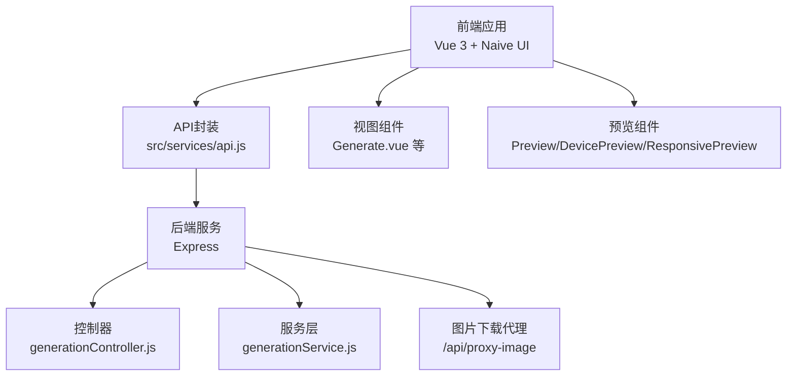
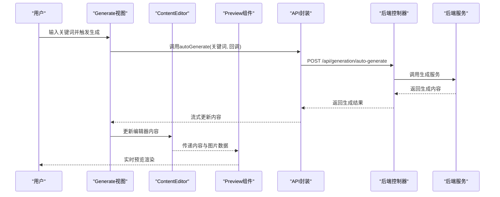
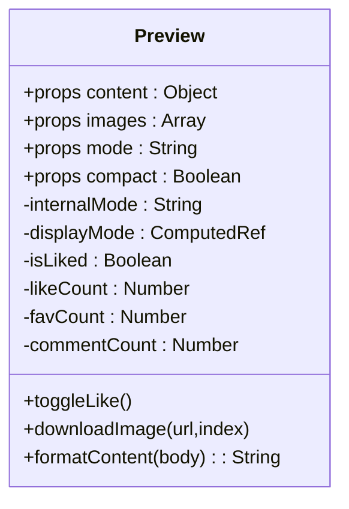
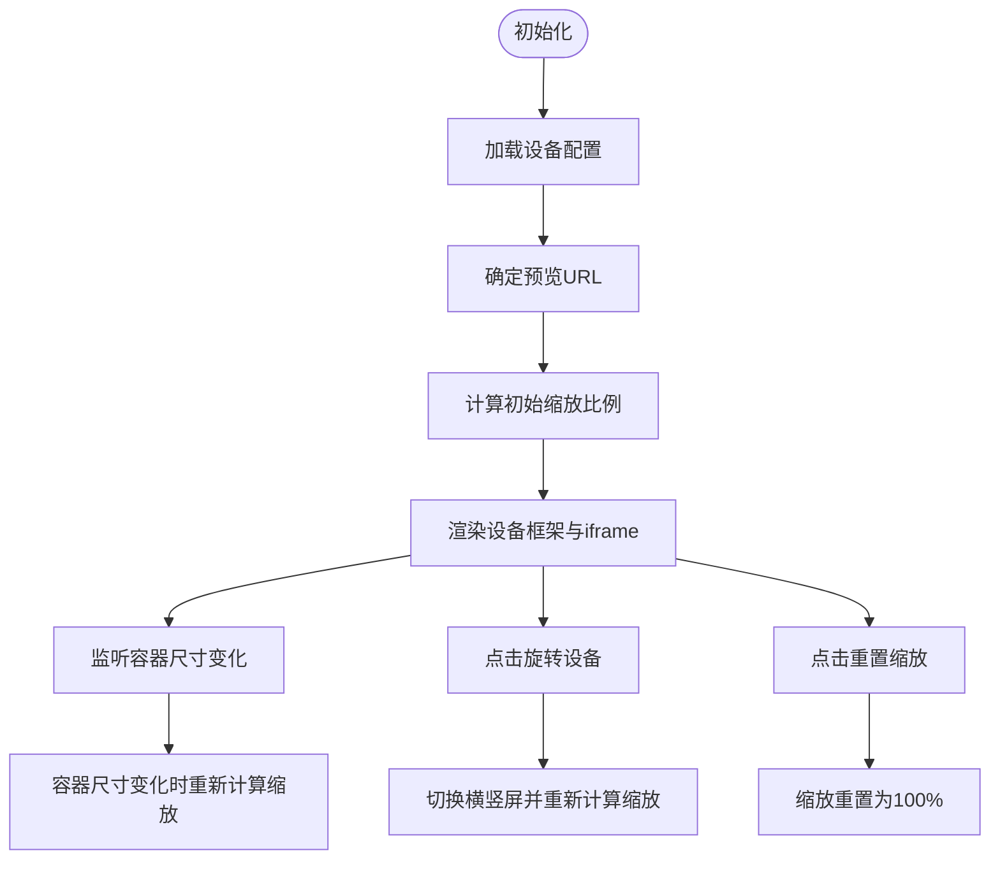
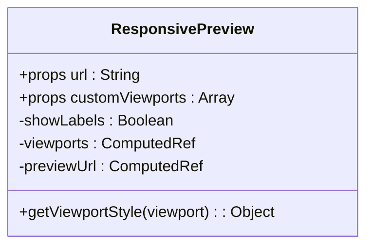
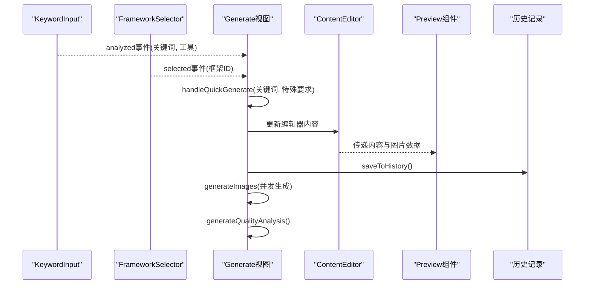
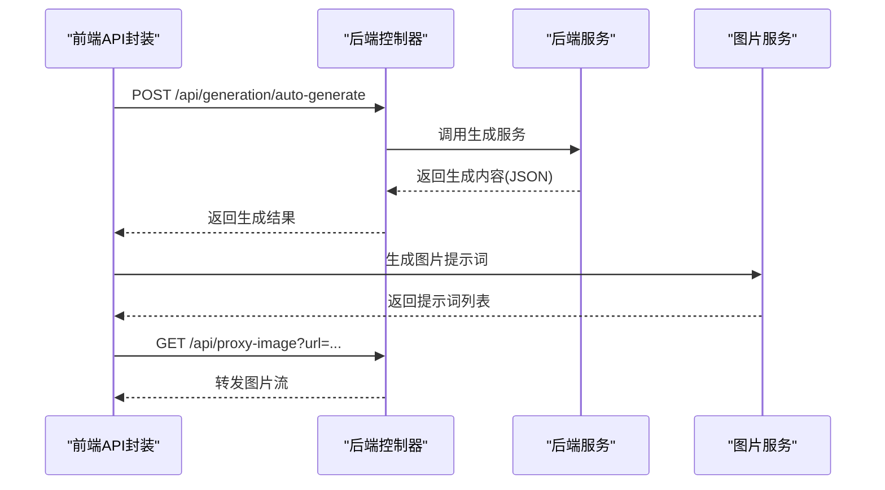
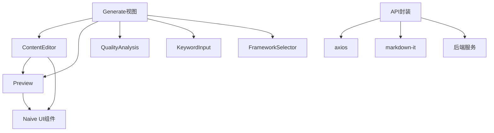

# 实时预览系统

<cite>
**本文档引用的文件**
- [src/components/Preview.vue](file://src/components/Preview.vue)
- [src/components/DevicePreview.vue](file://src/components/DevicePreview.vue)
- [src/components/ResponsivePreview.vue](file://src/components/ResponsivePreview.vue)
- [src/views/Generate.vue](file://src/views/Generate.vue)
- [src/components/ContentEditor.vue](file://src/components/ContentEditor.vue)
- [src/services/api.js](file://src/services/api.js)
- [src/services/history.js](file://src/services/history.js)
- [backend/src/controllers/generationController.js](file://backend/src/controllers/generationController.js)
- [backend/src/services/generationService.js](file://backend/src/services/generationService.js)
- [backend/src/app.js](file://backend/src/app.js)
- [src/components/KeywordInput.vue](file://src/components/KeywordInput.vue)
- [src/components/FrameworkSelector.vue](file://src/components/FrameworkSelector.vue)
- [src/components/QualityAnalysis.vue](file://src/components/QualityAnalysis.vue)
- [frontend/src/views/Generate.vue](file://frontend/src/views/Generate.vue)
- [frontend/src/components/Preview.vue](file://frontend/src/components/Preview.vue)
</cite>

## 目录
1. [简介](#简介)
2. [项目结构](#项目结构)
3. [核心组件](#核心组件)
4. [架构总览](#架构总览)
5. [详细组件分析](#详细组件分析)
6. [依赖关系分析](#依赖关系分析)
7. [性能考量](#性能考量)
8. [故障排查指南](#故障排查指南)
9. [结论](#结论)
10. [附录](#附录)

## 简介
本系统为小红书风格图文内容的实时预览解决方案，提供多设备预览能力（手机、平板、桌面、笔记本）、响应式布局展示、屏幕适配与交互模拟。系统由前端Vue组件与后端Express服务组成，前端负责内容渲染、样式应用与交互模拟；后端提供内容生成、质量分析与图片下载代理等服务。系统支持与内容生成系统的数据同步，包括状态管理、事件通信与数据更新策略，并提供加载状态、错误处理与性能优化等用户体验优化方案。

## 项目结构
系统采用前后端分离架构，前端使用Vue 3 + Naive UI，后端使用Express + CORS，通过统一的API网关与前端交互。核心模块包括：
- 预览组件：Preview、DevicePreview、ResponsivePreview
- 内容编辑与分析：ContentEditor、QualityAnalysis
- 生成流程：Generate视图、KeywordInput、FrameworkSelector
- 服务层：API封装、历史记录、后端控制器与服务

**图表来源**
- [src/views/Generate.vue](file://src/views/Generate.vue#L1-L668)
- [src/components/Preview.vue](file://src/components/Preview.vue#L1-L411)
- [src/components/DevicePreview.vue](file://src/components/DevicePreview.vue#L1-L378)
- [src/components/ResponsivePreview.vue](file://src/components/ResponsivePreview.vue#L1-L216)
- [src/services/api.js](file://src/services/api.js#L1-L454)
- [backend/src/controllers/generationController.js](file://backend/src/controllers/generationController.js#L1-L100)
- [backend/src/services/generationService.js](file://backend/src/services/generationService.js#L1-L194)

**章节来源**
- [src/views/Generate.vue](file://src/views/Generate.vue#L1-L668)
- [src/components/Preview.vue](file://src/components/Preview.vue#L1-L411)
- [src/components/DevicePreview.vue](file://src/components/DevicePreview.vue#L1-L378)
- [src/components/ResponsivePreview.vue](file://src/components/ResponsivePreview.vue#L1-L216)
- [src/services/api.js](file://src/services/api.js#L1-L454)
- [backend/src/controllers/generationController.js](file://backend/src/controllers/generationController.js#L1-L100)
- [backend/src/services/generationService.js](file://backend/src/services/generationService.js#L1-L194)

## 核心组件
- Preview：实时预览组件，支持移动端与桌面端两种模式，渲染小红书风格图文内容，包含图片轮播、互动栏、标签等元素，提供图片下载与点赞交互模拟。
- DevicePreview：多设备模拟预览，支持手机、平板、桌面、笔记本四种设备，提供设备切换、旋转、缩放与自适应容器尺寸计算。
- ResponsivePreview：响应式网格预览，支持多断点视口展示，可显示尺寸标签，便于对比不同屏幕下的布局表现。
- Generate视图：生成流程入口，整合关键词输入、框架选择、内容生成、质量分析与实时预览，维护生成状态、进度与历史记录。
- ContentEditor：内容编辑器，支持Markdown预览与编辑、标签管理、图片生成与下载、重新生成与预览触发。
- API封装：统一的前端API客户端，封装AI生成、分析、图片生成与提示词转换，支持流式输出与错误处理。
- 后端控制器与服务：提供内容生成、质量分析与图片下载代理，确保跨域与下载安全。

**章节来源**
- [src/components/Preview.vue](file://src/components/Preview.vue#L1-L411)
- [src/components/DevicePreview.vue](file://src/components/DevicePreview.vue#L1-L378)
- [src/components/ResponsivePreview.vue](file://src/components/ResponsivePreview.vue#L1-L216)
- [src/views/Generate.vue](file://src/views/Generate.vue#L1-L668)
- [src/components/ContentEditor.vue](file://src/components/ContentEditor.vue#L1-L418)
- [src/services/api.js](file://src/services/api.js#L1-L454)
- [backend/src/controllers/generationController.js](file://backend/src/controllers/generationController.js#L1-L100)
- [backend/src/services/generationService.js](file://backend/src/services/generationService.js#L1-L194)

## 架构总览
系统采用前后端分离架构，前端通过API封装调用后端服务，后端提供内容生成、分析与图片代理下载。生成流程中，前端实时更新预览组件，后端服务保证数据一致性与稳定性。

**图表来源**
- [src/views/Generate.vue](file://src/views/Generate.vue#L257-L324)
- [src/services/api.js](file://src/services/api.js#L250-L282)
- [backend/src/controllers/generationController.js](file://backend/src/controllers/generationController.js#L10-L33)
- [backend/src/services/generationService.js](file://backend/src/services/generationService.js#L64-L94)

**章节来源**
- [src/views/Generate.vue](file://src/views/Generate.vue#L257-L324)
- [src/services/api.js](file://src/services/api.js#L250-L282)
- [backend/src/controllers/generationController.js](file://backend/src/controllers/generationController.js#L10-L33)
- [backend/src/services/generationService.js](file://backend/src/services/generationService.js#L64-L94)

## 详细组件分析

### Preview组件分析
- 功能概述
  - 支持移动端与桌面端两种显示模式，通过内部模式与紧凑模式控制布局。
  - 渲染小红书风格图文内容，包含标题、正文、标签、图片轮播与互动栏。
  - 提供图片下载代理（后端代理解决跨域）、点赞交互模拟与随机计数。
  - 样式应用基于scoped样式，针对不同模式提供不同的容器尺寸与布局。
- 数据流
  - 接收content与images属性，formatContent函数将文本按段落渲染。
  - 通过toggleLike切换点赞状态并更新计数。
  - downloadImage通过后端代理下载图片，避免跨域问题。
- 交互与状态
  - 内部状态：internalMode（内部模式）、isLiked、likeCount、favCount、commentCount。
  - 显示模式：displayMode根据compact与mode决定最终模式。
- 性能与优化
  - 图片轮播使用Naive UI组件，减少自定义复杂逻辑。
  - 按需渲染图片占位与生成图片，避免不必要的DOM节点。
  - 使用computed计算显示模式，减少重复计算。

**图表来源**
- [src/components/Preview.vue](file://src/components/Preview.vue#L168-L207)

**章节来源**
- [src/components/Preview.vue](file://src/components/Preview.vue#L1-L411)

### DevicePreview组件分析
- 功能概述
  - 提供设备模拟预览，支持手机、平板、桌面、笔记本四种设备。
  - 工具栏包含设备选择、旋转、缩放与设备信息显示。
  - 通过iframe加载预览URL，监听容器尺寸变化并计算缩放比例。
- 数据流
  - devices配置设备参数（宽高、UA、图标、标签）。
  - currentDevice与isRotated控制当前设备与旋转状态。
  - frameStyle基于设备信息与缩放比例动态计算。
- 交互与状态
  - selectDevice切换设备并重置旋转与缩放。
  - toggleRotate切换横竖屏并重新计算缩放。
  - resetScale重置缩放到100%。
  - calculateScale基于容器尺寸与设备尺寸计算缩放比。
- 性能与优化
  - 使用ResizeObserver监听容器尺寸变化，避免频繁重排。
  - 缩放通过transform实现，保证渲染性能。

**图表来源**
- [src/components/DevicePreview.vue](file://src/components/DevicePreview.vue#L66-L214)

**章节来源**
- [src/components/DevicePreview.vue](file://src/components/DevicePreview.vue#L1-L378)

### ResponsivePreview组件分析
- 功能概述
  - 响应式网格预览，支持多断点视口展示（手机S/M/L、平板、笔记本、桌面）。
  - 可切换显示尺寸标签，便于对比不同屏幕下的布局表现。
  - 支持自定义视口配置，通过插槽注入内容或iframe。
- 数据流
  - defaultViewports定义默认视口集合。
  - customViewports允许外部传入自定义视口配置。
  - previewUrl基于传入URL或当前页面地址。
- 交互与状态
  - showLabels控制是否显示视口尺寸标签。
  - getViewportStyle为每个视口计算宽度与最小高度。
- 性能与优化
  - 使用CSS Grid实现自适应布局，减少JavaScript计算。
  - 视口容器采用最小高度约束，避免布局抖动。

**图表来源**
- [src/components/ResponsivePreview.vue](file://src/components/ResponsivePreview.vue#L47-L87)

**章节来源**
- [src/components/ResponsivePreview.vue](file://src/components/ResponsivePreview.vue#L1-L216)

### Generate视图与内容生成流程
- 功能概述
  - 整合关键词输入、框架选择、内容生成、质量分析与实时预览。
  - 维护生成状态、进度与历史记录，支持一键快捷生成与重新生成。
  - 预览侧边栏根据设备模式动态调整宽度与内容。
- 数据流
  - handleQuickGenerate触发生成流程，支持流式更新内容。
  - generateImages根据文案生成配套图片，支持Promises并发。
  - generateQualityAnalysis调用AI生成质量分析。
  - saveToHistory与loadHistory管理历史记录。
- 事件与通信
  - ContentEditor通过事件向Generate传递内容变更与预览请求。
  - Preview组件接收来自Generate的实时内容与图片数据。
- 性能与优化
  - 流式生成通过回调实时更新UI，避免阻塞。
  - 并发生成图片，缩短等待时间。
  - 预览侧边栏动画与宽度切换平滑过渡。

**图表来源**
- [src/views/Generate.vue](file://src/views/Generate.vue#L257-L324)
- [src/components/KeywordInput.vue](file://src/components/KeywordInput.vue#L132-L142)
- [src/components/FrameworkSelector.vue](file://src/components/FrameworkSelector.vue#L96-L107)
- [src/components/ContentEditor.vue](file://src/components/ContentEditor.vue#L309-L311)
- [src/services/history.js](file://src/services/history.js#L14-L41)

**章节来源**
- [src/views/Generate.vue](file://src/views/Generate.vue#L1-L668)
- [src/components/KeywordInput.vue](file://src/components/KeywordInput.vue#L1-L265)
- [src/components/FrameworkSelector.vue](file://src/components/FrameworkSelector.vue#L1-L241)
- [src/components/ContentEditor.vue](file://src/components/ContentEditor.vue#L1-L418)
- [src/services/history.js](file://src/services/history.js#L1-L89)

### API封装与后端服务
- 功能概述
  - API封装提供AI生成、分析、图片生成与提示词转换，支持流式输出。
  - 后端控制器提供内容生成、质量分析与图片下载代理。
  - 后端服务实现内容生成与分析的Prompt模板与回退策略。
- 数据流
  - generationAPI.autoGenerate调用getAIResponse实现流式生成。
  - imageGenerationAPI.generatePrompts将文案转为图片提示词。
  - generationController.proxyImage解决前端下载跨域问题。
- 错误处理
  - 前端捕获API调用异常并提示用户。
  - 后端代理下载时设置响应头并转发流式数据。
- 性能与优化
  - 流式传输减少首屏等待时间。
  - 并发请求图片生成，提升整体效率。

**图表来源**
- [src/services/api.js](file://src/services/api.js#L250-L282)
- [src/services/api.js](file://src/services/api.js#L417-L448)
- [backend/src/controllers/generationController.js](file://backend/src/controllers/generationController.js#L69-L94)
- [backend/src/services/generationService.js](file://backend/src/services/generationService.js#L64-L94)

**章节来源**
- [src/services/api.js](file://src/services/api.js#L1-L454)
- [backend/src/controllers/generationController.js](file://backend/src/controllers/generationController.js#L1-L100)
- [backend/src/services/generationService.js](file://backend/src/services/generationService.js#L1-L194)

## 依赖关系分析
- 组件耦合
  - Generate视图与ContentEditor、Preview紧密耦合，通过props与事件通信。
  - Preview依赖Naive UI组件与图标库，样式通过scoped作用域隔离。
  - DevicePreview与ResponsivePreview独立性强，可单独使用。
- 外部依赖
  - axios用于HTTP请求，支持流式与超时配置。
  - markdown-it用于Markdown渲染。
  - Naive UI提供UI组件与消息提示。
- 循环依赖
  - 未发现循环依赖，组件间通过props与事件单向通信。

**图表来源**
- [src/views/Generate.vue](file://src/views/Generate.vue#L195-L196)
- [src/components/ContentEditor.vue](file://src/components/ContentEditor.vue#L199-L201)
- [src/components/Preview.vue](file://src/components/Preview.vue#L135-L137)
- [src/services/api.js](file://src/services/api.js#L6-L25)

**章节来源**
- [src/views/Generate.vue](file://src/views/Generate.vue#L1-L668)
- [src/components/ContentEditor.vue](file://src/components/ContentEditor.vue#L1-L418)
- [src/components/Preview.vue](file://src/components/Preview.vue#L1-L411)
- [src/services/api.js](file://src/services/api.js#L1-L454)

## 性能考量
- 渲染性能
  - 使用computed与响应式数据减少不必要的重渲染。
  - Preview与ContentEditor中的图片轮播与Markdown渲染采用懒加载与骨架屏。
- 网络性能
  - API封装支持流式传输，缩短首屏时间。
  - 图片生成采用并发请求，提升整体效率。
- 交互性能
  - DevicePreview使用ResizeObserver监听容器尺寸变化，避免频繁重排。
  - 预览侧边栏动画与宽度切换平滑过渡，提升用户体验。

## 故障排查指南
- 图片下载失败
  - 检查后端代理是否正确配置，确认CORS与响应头设置。
  - 前端下载逻辑捕获异常并提示用户，检查网络与权限。
- 生成内容为空
  - 确认关键词输入与框架选择是否正确。
  - 检查后端服务是否返回有效内容，必要时启用回退策略。
- 预览不显示
  - 检查Preview组件的content与images属性是否正确传递。
  - 确认Display模式与紧凑模式设置是否符合预期。
- 历史记录异常
  - 检查localStorage存储状态，必要时清理历史记录。

**章节来源**
- [backend/src/controllers/generationController.js](file://backend/src/controllers/generationController.js#L69-L94)
- [src/services/api.js](file://src/services/api.js#L140-L166)
- [src/services/history.js](file://src/services/history.js#L14-L41)

## 结论
本系统通过多设备预览组件与响应式布局，实现了小红书风格图文内容的实时预览与交互模拟。前端与后端协同工作，提供流畅的生成与预览体验。通过合理的状态管理、事件通信与数据更新策略，系统在保证功能完整性的同时兼顾了性能与用户体验。后续可在图片生成策略、流式传输优化与历史记录扩展等方面进一步完善。

## 附录
- 使用示例
  - 实时预览：在Generate视图中输入关键词并触发生成，预览侧边栏将实时显示内容。
  - 设备切换：在DevicePreview中选择设备并旋转，观察不同设备下的布局表现。
  - 响应式对比：在ResponsivePreview中查看不同断点下的布局差异。
- 最佳实践
  - 合理使用流式生成，避免阻塞UI线程。
  - 并发处理图片生成，缩短等待时间。
  - 使用ResizeObserver监听容器尺寸变化，提升响应速度。
  - 通过历史记录管理生成结果，便于回溯与复用。