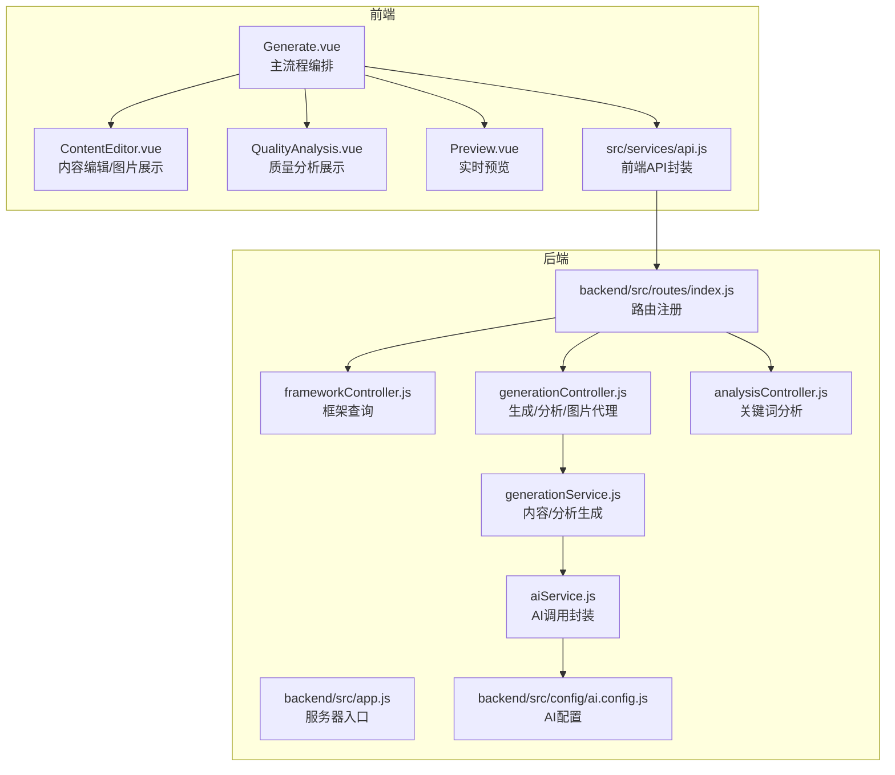
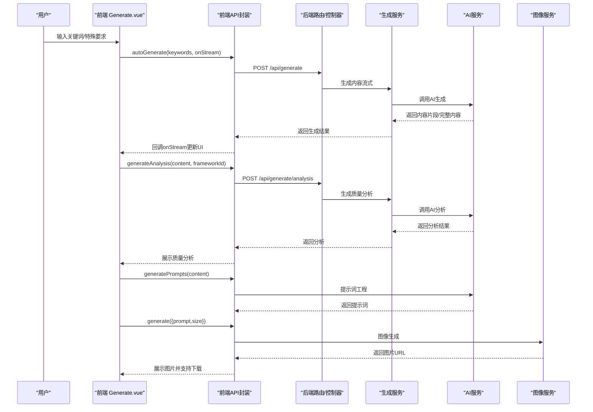
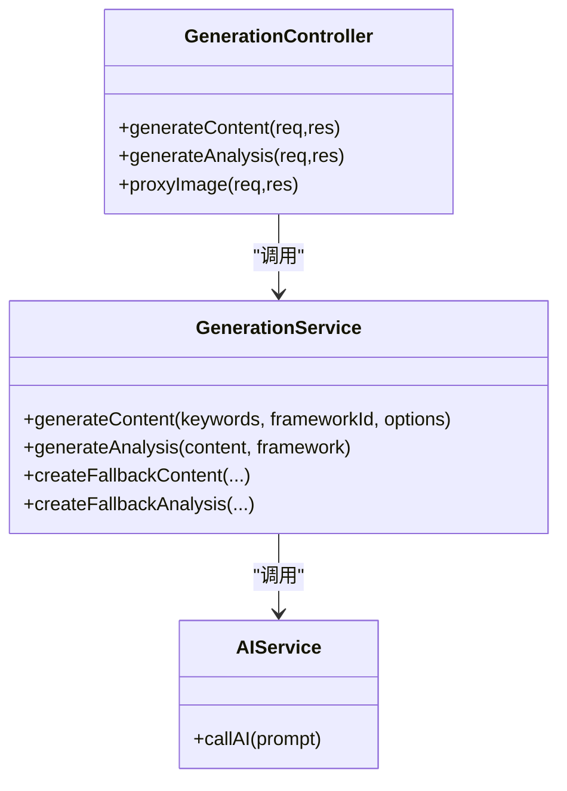
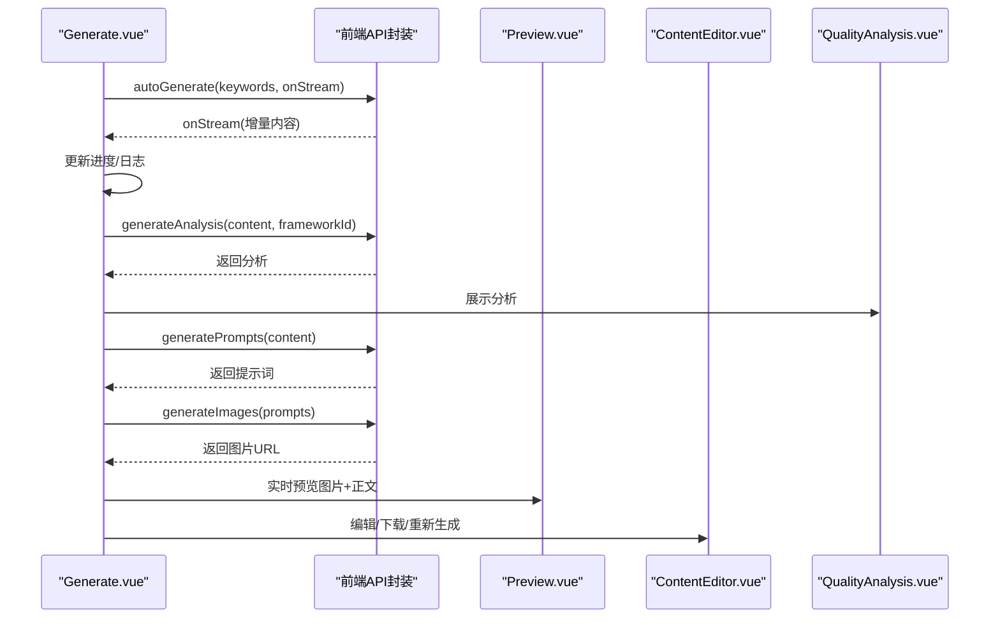
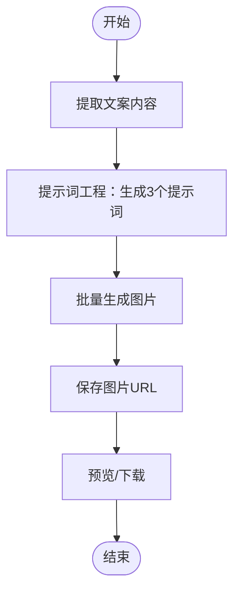
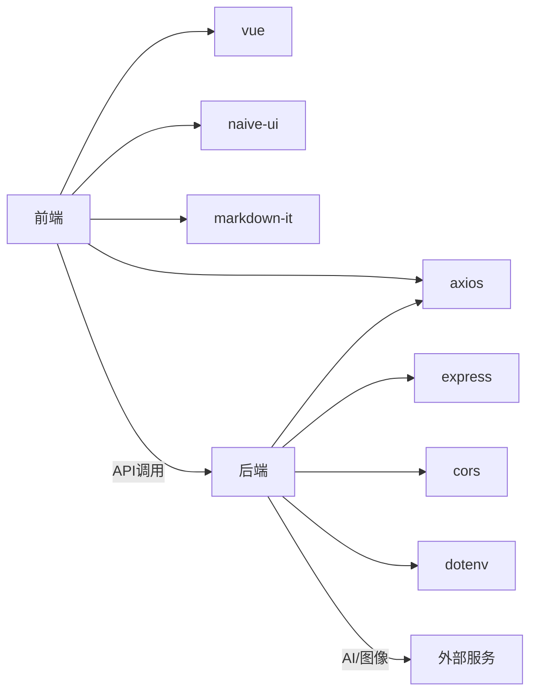

# 核心功能模块

<cite>
**本文档引用的文件**
- [backend/src/app.js](file://backend/src/app.js)
- [backend/src/config/ai.config.js](file://backend/src/config/ai.config.js)
- [backend/src/controllers/generationController.js](file://backend/src/controllers/generationController.js)
- [backend/src/controllers/analysisController.js](file://backend/src/controllers/analysisController.js)
- [backend/src/controllers/frameworkController.js](file://backend/src/controllers/frameworkController.js)
- [backend/src/routes/index.js](file://backend/src/routes/index.js)
- [backend/src/services/aiService.js](file://backend/src/services/aiService.js)
- [backend/src/services/generationService.js](file://backend/src/services/generationService.js)
- [frontend/src/services/api.js](file://frontend/src/services/api.js)
- [src/services/api.js](file://src/services/api.js)
- [src/views/Generate.vue](file://src/views/Generate.vue)
- [src/components/ContentEditor.vue](file://src/components/ContentEditor.vue)
- [src/components/QualityAnalysis.vue](file://src/components/QualityAnalysis.vue)
- [src/components/Preview.vue](file://src/components/Preview.vue)
- [package.json](file://package.json)
</cite>

## 目录
1. [简介](#简介)
2. [项目结构](#项目结构)
3. [核心组件](#核心组件)
4. [架构总览](#架构总览)
5. [详细组件分析](#详细组件分析)
6. [依赖关系分析](#依赖关系分析)
7. [性能考量](#性能考量)
8. [故障排查指南](#故障排查指南)
9. [结论](#结论)
10. [附录](#附录)

## 简介
本项目是一个面向小红书平台的爆款文案生成工具，提供从关键词到图文内容的全流程自动化能力。核心功能包括：
- 智能内容生成：基于多套成熟框架（如AIDA、SCQA、黄金圈法则等）与AI大模型协同，生成符合平台调性的文案与图片建议。
- 质量分析：对生成内容进行多维度质量评估，包括钩子有效性、框架契合度、内容结构与平台适配度。
- 实时预览：在移动端与桌面端两种设备模式下，实时预览最终图文效果，支持图片下载与互动模拟。
- 图片生成：将文案内容转化为专业绘画提示词，调用图像生成服务批量产出高清配图。

系统采用前后端分离架构，前端使用Vue 3 + Naive UI构建交互界面，后端使用Express提供REST API，AI与图像生成通过外部服务集成。

## 项目结构
项目分为三层：
- 后端（Node.js + Express）：提供内容生成、质量分析、框架查询与图片代理下载等API。
- 前端（Vue 3）：负责用户交互、内容编辑、质量分析展示与实时预览。
- 配置与环境：通过.env与Vite环境变量注入AI与图像服务的访问凭据与基础地址。

图表来源
- [backend/src/app.js](file://backend/src/app.js#L1-L26)
- [backend/src/routes/index.js](file://backend/src/routes/index.js#L1-L21)
- [backend/src/controllers/generationController.js](file://backend/src/controllers/generationController.js#L1-L100)
- [backend/src/controllers/analysisController.js](file://backend/src/controllers/analysisController.js#L1-L37)
- [backend/src/controllers/frameworkController.js](file://backend/src/controllers/frameworkController.js#L1-L49)
- [backend/src/services/generationService.js](file://backend/src/services/generationService.js#L1-L194)
- [backend/src/services/aiService.js](file://backend/src/services/aiService.js#L1-L55)
- [backend/src/config/ai.config.js](file://backend/src/config/ai.config.js#L1-L18)
- [src/services/api.js](file://src/services/api.js#L1-L454)
- [src/views/Generate.vue](file://src/views/Generate.vue#L1-L668)
- [src/components/ContentEditor.vue](file://src/components/ContentEditor.vue#L1-L418)
- [src/components/QualityAnalysis.vue](file://src/components/QualityAnalysis.vue#L1-L138)
- [src/components/Preview.vue](file://src/components/Preview.vue#L1-L411)

章节来源
- [backend/src/app.js](file://backend/src/app.js#L1-L26)
- [backend/src/routes/index.js](file://backend/src/routes/index.js#L1-L21)
- [package.json](file://package.json#L1-L32)

## 核心组件
- 内容生成服务（GenerationService）
  - 负责拼装提示词、调用AI生成内容与质量分析，并提供降级策略保证稳定性。
  - 支持多种框架（如小红书爆款框架、AIDA、SCQA、黄金圈法则、情感共鸣、干货分享、种草推荐、生活方式分享）。
- AI服务（aiService）
  - 封装外部AI服务调用，统一请求头、超时与错误处理。
- 路由与控制器（frameworkController、generationController、analysisController）
  - 提供框架查询、内容生成、质量分析与图片代理下载的REST接口。
- 前端API封装（src/services/api.js）
  - 封装AI与图像生成客户端，支持流式输出、提示词工程与图片生成。
- 视图与组件（Generate.vue、ContentEditor.vue、QualityAnalysis.vue、Preview.vue）
  - 主流程编排、内容编辑、质量分析展示与实时预览。

章节来源
- [backend/src/services/generationService.js](file://backend/src/services/generationService.js#L1-L194)
- [backend/src/services/aiService.js](file://backend/src/services/aiService.js#L1-L55)
- [backend/src/controllers/generationController.js](file://backend/src/controllers/generationController.js#L1-L100)
- [backend/src/controllers/analysisController.js](file://backend/src/controllers/analysisController.js#L1-L37)
- [backend/src/controllers/frameworkController.js](file://backend/src/controllers/frameworkController.js#L1-L49)
- [src/services/api.js](file://src/services/api.js#L1-L454)
- [src/views/Generate.vue](file://src/views/Generate.vue#L1-L668)
- [src/components/ContentEditor.vue](file://src/components/ContentEditor.vue#L1-L418)
- [src/components/QualityAnalysis.vue](file://src/components/QualityAnalysis.vue#L1-L138)
- [src/components/Preview.vue](file://src/components/Preview.vue#L1-L411)

## 架构总览
系统采用“前端交互 + 后端API + 外部AI/图像服务”的三层架构。前端通过API封装调用后端路由，后端控制器协调服务层完成业务处理，服务层再调用AI服务与外部图像生成服务。

图表来源
- [src/views/Generate.vue](file://src/views/Generate.vue#L257-L324)
- [src/services/api.js](file://src/services/api.js#L94-L177)
- [backend/src/routes/index.js](file://backend/src/routes/index.js#L13-L16)
- [backend/src/controllers/generationController.js](file://backend/src/controllers/generationController.js#L10-L64)
- [backend/src/services/generationService.js](file://backend/src/services/generationService.js#L64-L94)
- [backend/src/services/aiService.js](file://backend/src/services/aiService.js#L14-L53)

## 详细组件分析

### 内容生成与质量分析（后端）
- 控制器职责
  - 生成内容：接收关键词与框架ID，调用生成服务并返回JSON。
  - 生成分析：接收内容与框架ID，生成质量分析并返回。
  - 图片代理：解决前端下载跨域问题，后端转发图片流。
- 生成服务
  - 提示词工程：内置多框架说明与输出约束，确保符合小红书平台规范。
  - 降级策略：当AI返回非JSON或异常时，回退到默认内容与分析。
- AI服务
  - 统一请求头、超时与错误处理；支持流式与非流式两种模式。

图表来源
- [backend/src/controllers/generationController.js](file://backend/src/controllers/generationController.js#L1-L100)
- [backend/src/services/generationService.js](file://backend/src/services/generationService.js#L63-L194)
- [backend/src/services/aiService.js](file://backend/src/services/aiService.js#L14-L53)

章节来源
- [backend/src/controllers/generationController.js](file://backend/src/controllers/generationController.js#L1-L100)
- [backend/src/services/generationService.js](file://backend/src/services/generationService.js#L1-L194)
- [backend/src/services/aiService.js](file://backend/src/services/aiService.js#L1-L55)

### 前端生成流程与实时预览
- 主流程编排
  - 用户输入关键词与特殊要求，触发一键全自动生成。
  - 流式回调逐步更新UI，显示生成进度与处理日志。
  - 生成完成后自动进行质量分析与图片生成。
- 实时预览
  - 支持手机/桌面双模式，展示图片轮播与正文内容。
  - 图片下载通过后端代理解决跨域问题。
- 内容编辑
  - 支持Markdown预览与原始文本编辑，便于二次修改。
  - 提供图片展示区与下载按钮。

图表来源
- [src/views/Generate.vue](file://src/views/Generate.vue#L257-L370)
- [src/components/Preview.vue](file://src/components/Preview.vue#L146-L166)
- [src/components/ContentEditor.vue](file://src/components/ContentEditor.vue#L210-L227)
- [src/components/QualityAnalysis.vue](file://src/components/QualityAnalysis.vue#L25-L29)

章节来源
- [src/views/Generate.vue](file://src/views/Generate.vue#L1-L668)
- [src/components/Preview.vue](file://src/components/Preview.vue#L1-L411)
- [src/components/ContentEditor.vue](file://src/components/ContentEditor.vue#L1-L418)
- [src/components/QualityAnalysis.vue](file://src/components/QualityAnalysis.vue#L1-L138)

### 图片生成与提示词工程
- 提示词工程
  - 将文案内容转化为3个专业绘画提示词，支持清理编号与截断。
- 图片生成
  - 调用图像生成服务，返回图片URL；支持960x1280（3:4）推荐尺寸。
- 下载机制
  - 前端通过后端代理下载图片，避免跨域限制。

图表来源
- [src/services/api.js](file://src/services/api.js#L417-L448)
- [src/services/api.js](file://src/services/api.js#L377-L410)
- [src/components/Preview.vue](file://src/components/Preview.vue#L146-L166)

章节来源
- [src/services/api.js](file://src/services/api.js#L366-L454)
- [src/components/Preview.vue](file://src/components/Preview.vue#L146-L166)

## 依赖关系分析
- 前端依赖
  - Vue 3、Naive UI、Axios、markdown-it、路由等。
  - 通过Vite开发与打包，支持并发启动前后端。
- 后端依赖
  - Express、CORS、dotenv、axios等。
  - 路由集中注册，控制器与服务解耦。
- 外部服务
  - AI服务与图像服务通过配置注入，支持替换与扩展。

图表来源
- [package.json](file://package.json#L15-L30)
- [backend/src/app.js](file://backend/src/app.js#L4-L24)

章节来源
- [package.json](file://package.json#L1-L32)
- [backend/src/app.js](file://backend/src/app.js#L1-L26)

## 性能考量
- 流式输出
  - 前端支持流式回调，提升用户体验；后端AI服务也支持流式响应（在前端封装中体现）。
- 超时与重试
  - 前端与后端均设置合理超时时间，避免长时间阻塞；AI服务异常时进行降级处理。
- 图片生成
  - 图片生成与AI推理可能耗时较长，前端与后端均提高超时阈值。
- 响应头与缓存
  - 后端代理图片时透传原始内容类型，减少额外转换开销。

章节来源
- [src/services/api.js](file://src/services/api.js#L120-L177)
- [backend/src/services/aiService.js](file://backend/src/services/aiService.js#L35-L52)
- [backend/src/controllers/generationController.js](file://backend/src/controllers/generationController.js#L76-L93)

## 故障排查指南
- AI服务调用失败
  - 检查AI服务地址、API Key与请求头配置；查看响应状态与数据。
  - 降级策略：生成服务会回退到默认内容与分析。
- 图片生成异常
  - 检查图像服务返回格式；确认提示词工程是否正确解析。
  - 前端通过后端代理下载图片，若失败检查代理接口与网络。
- 跨域问题
  - 图片下载通过后端代理解决；确保代理接口可用。
- 前端流式输出异常
  - 检查fetch流式读取与JSON解析逻辑；确认服务端支持流式输出。

章节来源
- [backend/src/services/aiService.js](file://backend/src/services/aiService.js#L45-L52)
- [backend/src/services/generationService.js](file://backend/src/services/generationService.js#L90-L94)
- [src/services/api.js](file://src/services/api.js#L431-L448)
- [src/components/Preview.vue](file://src/components/Preview.vue#L146-L166)

## 结论
本项目通过前后端协作与外部AI/图像服务集成，实现了从小红书爆款文案到配套图片的一站式生成与预览能力。核心模块具备良好的扩展性与稳定性：提示词工程与降级策略确保生成质量与可用性，流式输出与实时预览显著提升交互体验，图片代理与下载机制有效规避跨域问题。开发者可在现有基础上灵活扩展框架类型、优化提示词工程与图像生成策略，进一步提升内容质量与生产效率。

## 附录
- 使用场景与操作流程
  - 快速生成：输入关键词与特殊要求，点击一键生成，等待流式输出与质量分析，随后生成配套图片并预览。
  - 编辑优化：在内容编辑器中切换Markdown预览与原始文本编辑，调整文案后重新生成或下载图片。
  - 历史管理：生成结果保存至本地历史，支持查看、删除与清空。
- 配置选项
  - AI基础地址、API Key、模型与超时时间通过环境变量注入。
  - 图像生成模型、尺寸与水印等参数可通过前端API封装进行配置。
- 代码示例路径
  - 一键全自动生成：[src/views/Generate.vue](file://src/views/Generate.vue#L257-L324)
  - 质量分析生成：[src/services/api.js](file://src/services/api.js#L327-L363)
  - 图片生成与提示词工程：[src/services/api.js](file://src/services/api.js#L377-L448)
  - 后端代理图片下载：[backend/src/controllers/generationController.js](file://backend/src/controllers/generationController.js#L69-L94)