# 质量分析系统

<cite>
**本文引用的文件**
- [QualityAnalysis.vue（前端）](file://frontend/src/components/QualityAnalysis.vue)
- [QualityAnalysis.vue（后端工作台）](file://src/components/QualityAnalysis.vue)
- [api.js（前端API封装）](file://frontend/src/services/api.js)
- [Generate.vue（前端工作台视图）](file://src/views/Generate.vue)
- [analysisController.js（后端分析控制器）](file://backend/src/controllers/analysisController.js)
- [generationController.js（后端生成控制器）](file://backend/src/controllers/generationController.js)
- [aiService.js（后端AI服务）](file://backend/src/services/aiService.js)
- [keywordService.js（关键词分析服务）](file://backend/src/services/keywordService.js)
- [generationService.js（内容生成与分析服务）](file://backend/src/services/generationService.js)
- [index.js（后端路由）](file://backend/src/routes/index.js)
- [README.md（项目说明）](file://README.md)
- [小红书爆款框架.md（平台框架文档）](file://小红书爆款框架.md)
- [情感共鸣框架.md（情感框架文档）](file://情感共鸣框架.md)
</cite>

## 目录
1. [简介](#简介)
2. [项目结构](#项目结构)
3. [核心组件](#核心组件)
4. [架构总览](#架构总览)
5. [详细组件分析](#详细组件分析)
6. [依赖关系分析](#依赖关系分析)
7. [性能考量](#性能考量)
8. [故障排查指南](#故障排查指南)
9. [结论](#结论)
10. [附录](#附录)

## 简介
本系统面向小红书内容创作者，提供从关键词分析、框架匹配、内容生成到质量分析与优化建议的全流程能力。质量分析模块通过AI对生成内容进行“钩子分析、框架原理、内容结构、吸引力评估”等维度的诊断，帮助创作者快速定位内容优势与改进点，提升传播效果与用户互动。

## 项目结构
系统采用前后端分离架构：
- 前端工作台（Vue 3 + Naive UI）：负责用户交互、内容编辑、质量分析展示与预览。
- 后端服务（Node.js + Express）：提供关键词分析、内容生成、质量分析与图片代理等接口。
- AI服务：通过外部大模型API进行内容理解与生成。

**图表来源**
- [Generate.vue（前端工作台视图）](file://src/views/Generate.vue#L1-L668)
- [QualityAnalysis.vue（前端）](file://frontend/src/components/QualityAnalysis.vue#L1-L227)
- [api.js（前端API封装）](file://frontend/src/services/api.js#L1-L40)
- [index.js（后端路由）](file://backend/src/routes/index.js#L1-L21)
- [analysisController.js（后端分析控制器）](file://backend/src/controllers/analysisController.js#L1-L37)
- [generationController.js（后端生成控制器）](file://backend/src/controllers/generationController.js#L1-L100)
- [keywordService.js（关键词分析服务）](file://backend/src/services/keywordService.js#L1-L85)
- [generationService.js（内容生成与分析服务）](file://backend/src/services/generationService.js#L1-L194)
- [aiService.js（后端AI服务）](file://backend/src/services/aiService.js#L1-L55)

**章节来源**
- [README.md（项目说明）](file://README.md#L1-L76)
- [index.js（后端路由）](file://backend/src/routes/index.js#L1-L21)

## 核心组件
- 前端质量分析组件：接收后端分析结果，以折叠面板、评分卡、标签等形式直观展示钩子类型、框架优势、结构逻辑与吸引力评分。
- 前端工作台视图：在内容生成流程中自动触发质量分析，并将结果与编辑器、预览侧边栏联动。
- 后端分析控制器：接收关键词，调用关键词分析服务，返回匹配框架与意图分析。
- 后端生成/分析控制器：接收内容与框架，调用生成分析服务，返回质量诊断结果。
- AI服务：统一调用外部大模型API，封装错误处理与超时控制。
- 关键词分析服务：构造提示词，解析AI返回的JSON，兜底默认框架。
- 生成与分析服务：构造提示词，解析AI返回的质量分析JSON，兜底默认分析结果。

**章节来源**
- [QualityAnalysis.vue（前端）](file://frontend/src/components/QualityAnalysis.vue#L1-L227)
- [Generate.vue（前端工作台视图）](file://src/views/Generate.vue#L356-L370)
- [analysisController.js（后端分析控制器）](file://backend/src/controllers/analysisController.js#L1-L37)
- [generationController.js（后端生成控制器）](file://backend/src/controllers/generationController.js#L1-L100)
- [aiService.js（后端AI服务）](file://backend/src/services/aiService.js#L1-L55)
- [keywordService.js（关键词分析服务）](file://backend/src/services/keywordService.js#L1-L85)
- [generationService.js（内容生成与分析服务）](file://backend/src/services/generationService.js#L1-L194)

## 架构总览
质量分析的端到端流程如下：

**图表来源**
- [Generate.vue（前端工作台视图）](file://src/views/Generate.vue#L356-L370)
- [api.js（前端API封装）](file://frontend/src/services/api.js#L28-L35)
- [index.js（后端路由）](file://backend/src/routes/index.js#L14-L15)
- [generationController.js（后端生成控制器）](file://backend/src/controllers/generationController.js#L35-L64)
- [generationService.js（内容生成与分析服务）](file://backend/src/services/generationService.js#L114-L162)
- [aiService.js（后端AI服务）](file://backend/src/services/aiService.js#L14-L53)

## 详细组件分析

### 质量分析组件（前端）
- 数据展示维度
  - 钩子分析：展示钩子类型、有效性与原因解释。
  - 框架原理：展示框架名称、核心优势与有效性的心理学解释。
  - 内容结构：展示逻辑清晰度、互动引导与建议。
  - 吸引力评估：情感感染力、实用价值、行动引导三项评分与综合评价。
- 交互与样式
  - 使用折叠面板逐项展开，便于聚焦分析点。
  - 使用评分控件与标签强调关键结论。
  - 使用网格布局展示吸引力三要素卡片。

```mermaid
flowchart TD
Start(["组件接收 analysis 对象"]) --> Hook["钩子分析<br/>类型/有效性/原因"]
Start --> Framework["框架原理<br/>名称/优势/有效原因"]
Start --> Structure["内容结构<br/>逻辑/互动/建议"]
Start --> Appeal["吸引力评估<br/>情感/实用/行动/综合"]
Hook --> Render["渲染折叠面板与标签"]
Framework --> Render
Structure --> Render
Appeal --> Render
Render --> End(["完成展示"])
```

**图表来源**
- [QualityAnalysis.vue（前端）](file://frontend/src/components/QualityAnalysis.vue#L13-L128)

**章节来源**
- [QualityAnalysis.vue（前端）](file://frontend/src/components/QualityAnalysis.vue#L1-L227)

### 质量分析组件（后端工作台）
- 与前端工作台组件对应，提供更丰富的结构化展示，包括平台适配度评分与细节标签。
- 用于演示平台适配维度，帮助创作者理解内容在小红书生态中的契合度。

**章节来源**
- [QualityAnalysis.vue（后端工作台）](file://src/components/QualityAnalysis.vue#L1-L138)

### 前端工作台视图（生成与分析联动）
- 在内容生成完成后，自动调用后端分析接口，将分析结果注入质量分析组件。
- 与编辑器、预览侧边栏联动，形成“生成-分析-编辑-预览”的闭环。

**图表来源**
- [Generate.vue（前端工作台视图）](file://src/views/Generate.vue#L356-L370)
- [api.js（前端API封装）](file://frontend/src/services/api.js#L28-L35)

**章节来源**
- [Generate.vue（前端工作台视图）](file://src/views/Generate.vue#L356-L370)

### 后端分析控制器与关键词分析服务
- 控制器负责参数校验与错误处理，调用关键词分析服务。
- 关键词分析服务构造提示词，调用AI服务，解析JSON并兜底默认框架。

**图表来源**
- [analysisController.js（后端分析控制器）](file://backend/src/controllers/analysisController.js#L6-L30)
- [keywordService.js（关键词分析服务）](file://backend/src/services/keywordService.js#L39-L84)
- [aiService.js（后端AI服务）](file://backend/src/services/aiService.js#L14-L53)

**章节来源**
- [analysisController.js（后端分析控制器）](file://backend/src/controllers/analysisController.js#L1-L37)
- [keywordService.js（关键词分析服务）](file://backend/src/services/keywordService.js#L1-L85)
- [aiService.js（后端AI服务）](file://backend/src/services/aiService.js#L1-L55)

### 后端生成/分析控制器与生成分析服务
- 控制器负责参数校验与错误处理，调用生成分析服务。
- 生成分析服务构造提示词，调用AI服务，解析JSON并兜底默认分析。

**图表来源**
- [generationController.js（后端生成控制器）](file://backend/src/controllers/generationController.js#L35-L64)
- [generationService.js（内容生成与分析服务）](file://backend/src/services/generationService.js#L114-L162)
- [aiService.js（后端AI服务）](file://backend/src/services/aiService.js#L14-L53)

**章节来源**
- [generationController.js（后端生成控制器）](file://backend/src/controllers/generationController.js#L1-L100)
- [generationService.js（内容生成与分析服务）](file://backend/src/services/generationService.js#L1-L194)
- [aiService.js（后端AI服务）](file://backend/src/services/aiService.js#L1-L55)

### AI服务与外部模型通信
- 统一封装请求头、超时与错误处理，确保稳定性与可观测性。
- 对响应内容进行校验，若为空则抛出错误，便于上层兜底。

**章节来源**
- [aiService.js（后端AI服务）](file://backend/src/services/aiService.js#L1-L55)

## 依赖关系分析
- 前端依赖
  - Generate.vue 依赖 generationAPI 与历史服务，负责触发分析与渲染。
  - QualityAnalysis.vue 依赖 analysis 数据结构，负责展示。
- 后端依赖
  - 路由将请求分发至控制器，控制器调用服务层，服务层调用AI服务。
  - 关键词分析与生成分析共享AI服务，保证一致性。

**图表来源**
- [Generate.vue（前端工作台视图）](file://src/views/Generate.vue#L177-L427)
- [QualityAnalysis.vue（前端）](file://frontend/src/components/QualityAnalysis.vue#L1-L227)
- [api.js（前端API封装）](file://frontend/src/services/api.js#L1-L40)
- [index.js（后端路由）](file://backend/src/routes/index.js#L1-L21)
- [analysisController.js（后端分析控制器）](file://backend/src/controllers/analysisController.js#L1-L37)
- [generationController.js（后端生成控制器）](file://backend/src/controllers/generationController.js#L1-L100)
- [keywordService.js（关键词分析服务）](file://backend/src/services/keywordService.js#L1-L85)
- [generationService.js（内容生成与分析服务）](file://backend/src/services/generationService.js#L1-L194)
- [aiService.js（后端AI服务）](file://backend/src/services/aiService.js#L1-L55)

**章节来源**
- [index.js（后端路由）](file://backend/src/routes/index.js#L1-L21)

## 性能考量
- 请求超时与错误兜底：AI服务设置合理超时，解析失败时使用默认值，避免前端长时间等待。
- 流式生成与进度：工作台支持流式生成与进度条，结合分析阶段插入日志，提升用户体验。
- 图片代理：后端提供图片下载代理，避免前端跨域问题，提高图片加载稳定性。

**章节来源**
- [aiService.js（后端AI服务）](file://backend/src/services/aiService.js#L14-L53)
- [generationController.js（后端生成控制器）](file://backend/src/controllers/generationController.js#L66-L94)
- [Generate.vue（前端工作台视图）](file://src/views/Generate.vue#L272-L324)

## 故障排查指南
- 常见错误
  - 参数缺失：关键词或框架ID为空时，控制器返回400错误。
  - AI服务异常：外部模型不可用或响应为空，会抛出错误并记录日志。
  - JSON解析失败：AI返回非预期格式时，使用默认值保证流程继续。
- 建议排查步骤
  - 检查前端请求参数是否完整。
  - 查看后端控制器与服务的日志输出。
  - 确认AI服务的网络连通性与鉴权信息。
  - 若出现跨域问题，确认图片代理接口是否正确配置。

**章节来源**
- [analysisController.js（后端分析控制器）](file://backend/src/controllers/analysisController.js#L10-L15)
- [generationController.js（后端生成控制器）](file://backend/src/controllers/generationController.js#L14-L19)
- [keywordService.js（关键词分析服务）](file://backend/src/services/keywordService.js#L44-L54)
- [generationService.js（内容生成与分析服务）](file://backend/src/services/generationService.js#L120-L124)
- [aiService.js（后端AI服务）](file://backend/src/services/aiService.js#L45-L52)

## 结论
质量分析系统通过清晰的前后端职责划分与稳定的AI服务集成，实现了从关键词分析到内容生成再到质量诊断的完整链路。前端组件以直观的方式呈现分析结果，帮助创作者快速理解内容优势与改进方向；后端服务通过兜底策略与错误处理，保障了整体流程的鲁棒性。结合平台框架文档，创作者可以更有针对性地优化内容结构与表达方式，提升在小红书生态中的传播效果。

## 附录

### 分析指标与设计思路
- 钩子分析：识别标题/封面的吸引力来源与有效性，解释为何能快速抓住注意力。
- 框架原理：解释所用框架的核心优势与心理学依据，帮助创作者理解结构背后的逻辑。
- 内容结构：评估逻辑清晰度与互动引导，提供可操作的改进建议。
- 吸引力评估：从情感感染力、实用价值、行动引导三个维度给出评分与综合评价，辅助创作者优化内容的用户粘性与转化。

**章节来源**
- [generationService.js（内容生成与分析服务）](file://backend/src/services/generationService.js#L35-L60)

### 使用场景与最佳实践
- 内容质量评估：在生成完成后自动触发分析，查看各项评分与建议，针对性优化。
- 获取优化建议：根据“内容结构”与“吸引力评估”的建议，调整段落组织与互动引导。
- 对比不同版本：通过历史记录对比不同版本内容的分析结果，选择最优方案。
- 平台适配：参考平台适配度评分与细节标签，调整标题、标签与视觉元素以贴合平台算法偏好。

**章节来源**
- [Generate.vue（前端工作台视图）](file://src/views/Generate.vue#L356-L370)
- [QualityAnalysis.vue（后端工作台）](file://src/components/QualityAnalysis.vue#L85-L107)
- [小红书爆款框架.md（平台框架文档）](file://小红书爆款框架.md#L1-L225)
- [情感共鸣框架.md（情感框架文档）](file://情感共鸣框架.md#L1-L240)