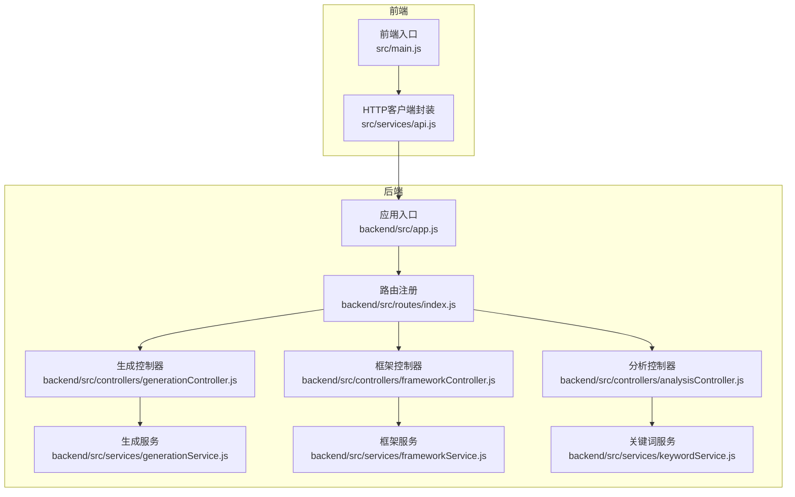
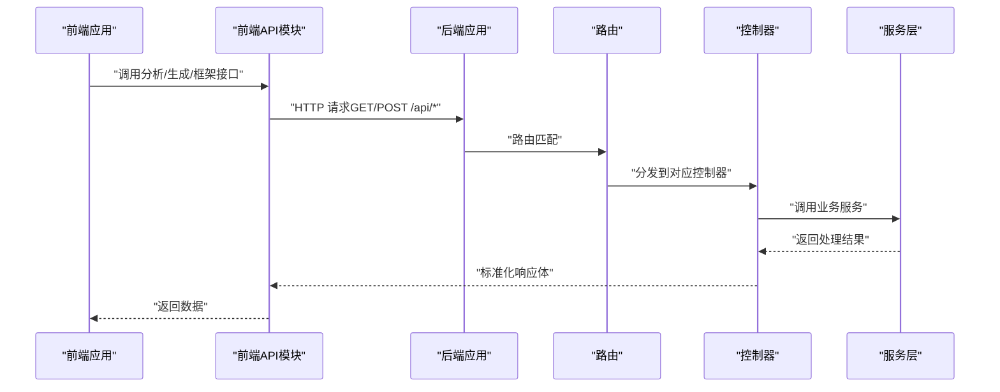
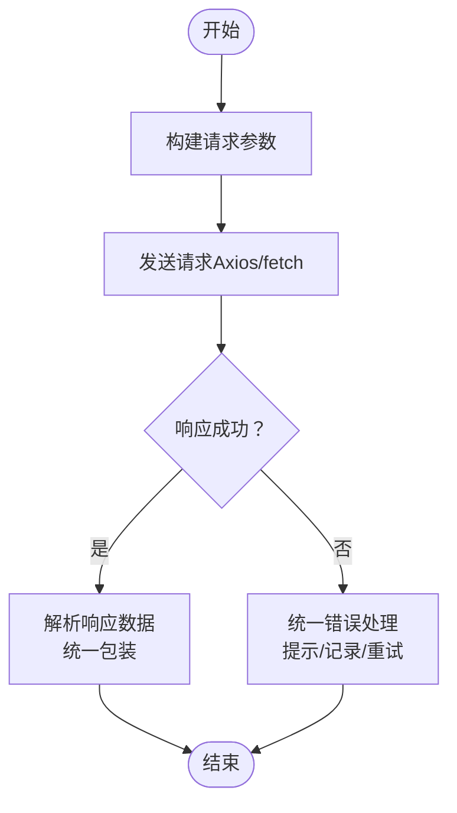
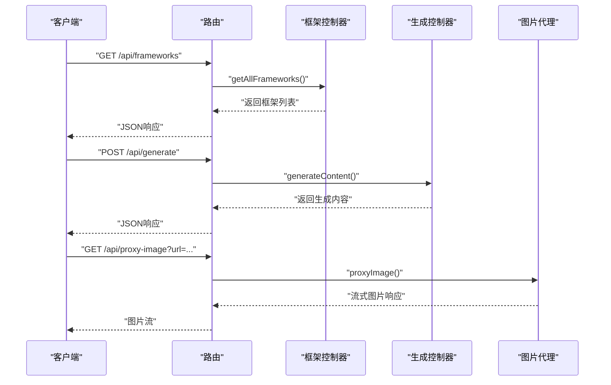
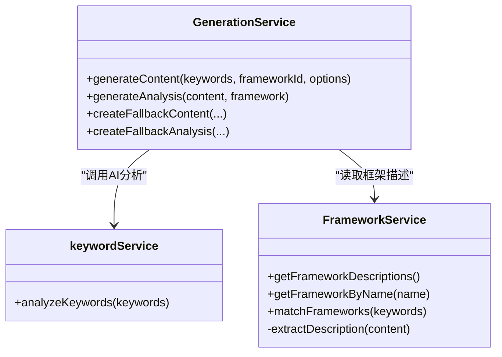
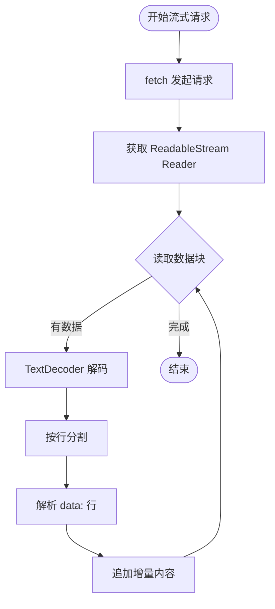
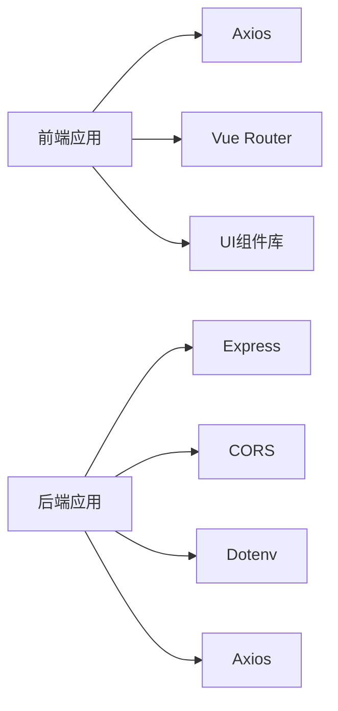

# API集成

<cite>
**本文档引用的文件**
- [frontend/src/services/api.js](file://frontend/src/services/api.js)
- [src/services/api.js](file://src/services/api.js)
- [backend/src/app.js](file://backend/src/app.js)
- [backend/src/routes/index.js](file://backend/src/routes/index.js)
- [backend/src/controllers/frameworkController.js](file://backend/src/controllers/frameworkController.js)
- [backend/src/controllers/analysisController.js](file://backend/src/controllers/analysisController.js)
- [backend/src/controllers/generationController.js](file://backend/src/controllers/generationController.js)
- [backend/src/services/generationService.js](file://backend/src/services/generationService.js)
- [backend/src/services/frameworkService.js](file://backend/src/services/frameworkService.js)
- [backend/src/services/keywordService.js](file://backend/src/services/keywordService.js)
- [frontend/src/main.js](file://frontend/src/main.js)
- [src/main.js](file://src/main.js)
- [package.json](file://package.json)
- [backend/package.json](file://backend/package.json)
- [.env.example](file://.env.example)
</cite>

## 目录
1. [简介](#简介)
2. [项目结构](#项目结构)
3. [核心组件](#核心组件)
4. [架构总览](#架构总览)
5. [详细组件分析](#详细组件分析)
6. [依赖关系分析](#依赖关系分析)
7. [性能考虑](#性能考虑)
8. [故障排查指南](#故障排查指南)
9. [结论](#结论)
10. [附录](#附录)

## 简介
本文件面向前端与后端服务的API集成，系统性说明HTTP客户端配置、统一请求处理策略（错误处理、重试机制、超时控制）、数据格式化与转换、认证与安全策略（Token管理、权限验证、CSRF防护）、流式数据处理（Server-Sent Events与WebSocket）、API调用示例与最佳实践。文档同时提供前后端交互的完整流程图与类图，帮助开发者快速理解并正确集成。

## 项目结构
- 前端采用Vue 3 + Vite，Axios作为HTTP客户端，封装统一API模块。
- 后端采用Express，提供REST接口，路由层负责请求分发，控制器层处理业务逻辑，服务层封装AI与文件读取等能力。
- 项目根目录提供一键启动脚本，便于本地联调。

图表来源
- [frontend/src/main.js](file://frontend/src/main.js#L1-L16)
- [src/main.js](file://src/main.js#L1-L16)
- [frontend/src/services/api.js](file://frontend/src/services/api.js#L1-L40)
- [src/services/api.js](file://src/services/api.js#L1-L454)
- [backend/src/app.js](file://backend/src/app.js#L1-L26)
- [backend/src/routes/index.js](file://backend/src/routes/index.js#L1-L21)
- [backend/src/controllers/frameworkController.js](file://backend/src/controllers/frameworkController.js#L1-L49)
- [backend/src/controllers/analysisController.js](file://backend/src/controllers/analysisController.js#L1-L37)
- [backend/src/controllers/generationController.js](file://backend/src/controllers/generationController.js#L1-L100)
- [backend/src/services/generationService.js](file://backend/src/services/generationService.js#L1-L194)
- [backend/src/services/frameworkService.js](file://backend/src/services/frameworkService.js#L1-L64)
- [backend/src/services/keywordService.js](file://backend/src/services/keywordService.js#L1-L85)

章节来源
- [frontend/src/main.js](file://frontend/src/main.js#L1-L16)
- [src/main.js](file://src/main.js#L1-L16)
- [package.json](file://package.json#L1-L32)
- [backend/package.json](file://backend/package.json#L1-L17)

## 核心组件
- 前端HTTP客户端
  - 基于Axios创建基础实例，设置baseURL与超时时间。
  - 封装业务API模块：框架查询、分析、生成、图片生成等。
  - 支持流式响应处理（fetch + ReadableStream）与非流式响应（axios）。
- 后端HTTP服务
  - Express应用，启用CORS与JSON解析中间件。
  - 路由注册：框架、分析、生成、图片代理等。
  - 控制器：校验参数、调用服务层、返回统一格式响应。
  - 服务层：AI调用封装、框架与关键词分析、内容生成与质量分析。

章节来源
- [frontend/src/services/api.js](file://frontend/src/services/api.js#L1-L40)
- [src/services/api.js](file://src/services/api.js#L1-L454)
- [backend/src/app.js](file://backend/src/app.js#L1-L26)
- [backend/src/routes/index.js](file://backend/src/routes/index.js#L1-L21)

## 架构总览
前后端通过REST协议通信，前端通过统一API模块发起请求；后端路由将请求分发至对应控制器，控制器调用服务层完成业务处理并返回标准响应体。图片生成通过独立客户端与后端代理接口实现跨域下载。

图表来源
- [frontend/src/services/api.js](file://frontend/src/services/api.js#L1-L40)
- [src/services/api.js](file://src/services/api.js#L1-L454)
- [backend/src/app.js](file://backend/src/app.js#L1-L26)
- [backend/src/routes/index.js](file://backend/src/routes/index.js#L1-L21)
- [backend/src/controllers/frameworkController.js](file://backend/src/controllers/frameworkController.js#L1-L49)
- [backend/src/controllers/analysisController.js](file://backend/src/controllers/analysisController.js#L1-L37)
- [backend/src/controllers/generationController.js](file://backend/src/controllers/generationController.js#L1-L100)
- [backend/src/services/generationService.js](file://backend/src/services/generationService.js#L1-L194)
- [backend/src/services/keywordService.js](file://backend/src/services/keywordService.js#L1-L85)

## 详细组件分析

### 前端HTTP客户端与统一处理策略
- Axios实例创建
  - baseURL统一为“/api”，便于开发环境代理与生产部署路径复用。
  - 默认超时10秒，AI客户端与图片客户端分别设置更长超时以适应复杂推理与大体积资源。
- 请求与响应拦截器
  - 当前未实现拦截器，建议在实际项目中补充：
    - 请求拦截器：注入鉴权头、参数序列化、请求去重、埋点上报。
    - 响应拦截器：统一错误码映射、Token失效跳转登录、业务态解包。
- 错误处理
  - 对外暴露的API函数返回Promise，调用方需捕获异常并提示。
  - 非流式AI调用使用axios，流式调用使用原生fetch并逐块解析SSE格式数据。
- 重试机制
  - 当前未实现自动重试，建议基于网络错误与特定HTTP状态码实现指数退避重试。
- 超时控制
  - 前端Axios默认10秒，AI与图片客户端分别为120秒，避免长耗时请求被提前中断。
- 数据格式化与转换
  - 请求参数：直接传入对象，由Axios自动序列化为application/json。
  - 响应数据：统一包装success/data/error字段，便于前端一致处理。
- 认证与安全
  - 前端未实现Token管理与权限验证，建议结合后端会话/令牌策略完善。
  - CSRF防护：当前未实现CSRF中间件，建议在后端启用并配合前端同源策略。

图表来源
- [frontend/src/services/api.js](file://frontend/src/services/api.js#L1-L40)
- [src/services/api.js](file://src/services/api.js#L1-L454)

章节来源
- [frontend/src/services/api.js](file://frontend/src/services/api.js#L1-L40)
- [src/services/api.js](file://src/services/api.js#L1-L454)

### 后端路由与控制器
- 路由注册
  - GET /api/frameworks：获取框架列表
  - GET /api/frameworks/:name：按名称获取框架详情
  - POST /api/analyze：关键词分析
  - POST /api/generate：生成内容
  - POST /api/generate/analysis：生成质量分析
  - GET /api/proxy-image：图片下载代理（解决跨域）
- 控制器职责
  - 参数校验与错误处理，调用服务层，返回统一JSON响应。
  - 代理接口使用axios以流式方式下载图片并转发给前端。
- CORS配置
  - 后端允许指定origin，默认指向本地开发端口，生产环境需按需调整。

图表来源
- [backend/src/routes/index.js](file://backend/src/routes/index.js#L1-L21)
- [backend/src/controllers/frameworkController.js](file://backend/src/controllers/frameworkController.js#L1-L49)
- [backend/src/controllers/generationController.js](file://backend/src/controllers/generationController.js#L1-L100)

章节来源
- [backend/src/routes/index.js](file://backend/src/routes/index.js#L1-L21)
- [backend/src/controllers/frameworkController.js](file://backend/src/controllers/frameworkController.js#L1-L49)
- [backend/src/controllers/analysisController.js](file://backend/src/controllers/analysisController.js#L1-L37)
- [backend/src/controllers/generationController.js](file://backend/src/controllers/generationController.js#L1-L100)
- [backend/src/app.js](file://backend/src/app.js#L1-L26)

### 服务层与AI集成
- 生成服务
  - 提供内容生成与质量分析，内置多框架提示词模板。
  - 对AI返回的非JSON内容进行降级处理，确保前端稳定显示。
- 框架服务
  - 从文件系统读取框架内容，提取标题与描述，支持关键词匹配。
- 关键词服务
  - 调用AI分析关键词意图、主题、受众并推荐合适框架，返回标准化JSON。

图表来源
- [backend/src/services/generationService.js](file://backend/src/services/generationService.js#L1-L194)
- [backend/src/services/frameworkService.js](file://backend/src/services/frameworkService.js#L1-L64)
- [backend/src/services/keywordService.js](file://backend/src/services/keywordService.js#L1-L85)

章节来源
- [backend/src/services/generationService.js](file://backend/src/services/generationService.js#L1-L194)
- [backend/src/services/frameworkService.js](file://backend/src/services/frameworkService.js#L1-L64)
- [backend/src/services/keywordService.js](file://backend/src/services/keywordService.js#L1-L85)

### 流式数据处理（SSE与WebSocket）
- SSE（Server-Sent Events）
  - 前端通过原生fetch + ReadableStream实现SSE流式接收，逐块解析“data: ”行并拼接增量内容。
  - 适用于长文本生成的实时反馈场景。
- WebSocket
  - 当前未实现WebSocket通道，如需实时双向通信可在后端新增ws路由与处理器，并在前端建立连接与事件监听。

图表来源
- [src/services/api.js](file://src/services/api.js#L120-L177)

章节来源
- [src/services/api.js](file://src/services/api.js#L120-L177)

### 认证机制与安全策略
- Token管理
  - 前端未实现Token存储与刷新逻辑，建议结合后端会话/JWT策略，在请求拦截器中注入Authorization头。
- 权限验证
  - 后端控制器对必填参数进行校验，必要时可扩展中间件进行角色/权限检查。
- CSRF防护
  - 当前未启用CSRF中间件，建议在后端引入相应中间件并在前端设置同源策略与安全头。

章节来源
- [backend/src/controllers/frameworkController.js](file://backend/src/controllers/frameworkController.js#L1-L49)
- [backend/src/controllers/analysisController.js](file://backend/src/controllers/analysisController.js#L1-L37)
- [backend/src/controllers/generationController.js](file://backend/src/controllers/generationController.js#L1-L100)

### API调用示例与最佳实践
- 前端调用示例（路径参考）
  - 获取框架列表：[frontend/src/services/api.js](file://frontend/src/services/api.js#L13-L20)
  - 关键词分析：[frontend/src/services/api.js](file://frontend/src/services/api.js#L22-L26)
  - 一键生成文案：[frontend/src/services/api.js](file://frontend/src/services/api.js#L28-L35)
- 错误处理最佳实践
  - 统一捕获异常并提示用户，记录错误日志，区分网络错误与业务错误。
  - 对可恢复错误（如超时）实现有限次重试与退避策略。
  - 对401/403等鉴权错误，引导用户重新登录或刷新令牌。
- 数据格式化
  - 请求体统一为JSON，响应体包含success/data/error字段，便于前端一致处理。
- 超时与重试
  - 前端Axios默认10秒，AI与图片客户端120秒；可根据接口特性调整。
  - 建议在拦截器中实现指数退避重试，避免雪崩效应。

章节来源
- [frontend/src/services/api.js](file://frontend/src/services/api.js#L1-L40)
- [src/services/api.js](file://src/services/api.js#L1-L454)

## 依赖关系分析
- 前端依赖
  - Vue 3、Element Plus/Naive UI、Axios、Vue Router。
- 后端依赖
  - Express、CORS、Dotenv、Axios。
- 环境变量
  - AI与火山引擎（生图）的API Key与Base URL通过环境变量注入。

图表来源
- [package.json](file://package.json#L1-L32)
- [backend/package.json](file://backend/package.json#L1-L17)

章节来源
- [package.json](file://package.json#L1-L32)
- [backend/package.json](file://backend/package.json#L1-L17)
- [.env.example](file://.env.example#L1-L9)

## 性能考虑
- 超时设置
  - 前端Axios默认10秒，AI与图片客户端120秒，避免长耗时请求被中断。
- 流式传输
  - 使用ReadableStream实现增量渲染，减少首屏等待时间。
- 缓存与降级
  - 对AI返回非JSON内容进行降级处理，保证功能可用性。
- 跨域与代理
  - 图片下载通过后端代理，避免浏览器跨域限制并可添加鉴权与速率控制。

## 故障排查指南
- 常见错误与定位
  - 400错误：检查请求参数是否缺失或格式不正确。
  - 500错误：查看后端日志，确认服务层调用链是否抛出异常。
  - 跨域问题：确认CORS配置与前端baseURL代理设置。
  - 流式解析失败：检查SSE数据格式与增量拼接逻辑。
- 建议的日志与监控
  - 前端：请求/响应日志、错误上报、性能指标。
  - 后端：请求链路日志、AI调用耗时、异常堆栈。

章节来源
- [backend/src/controllers/frameworkController.js](file://backend/src/controllers/frameworkController.js#L1-L49)
- [backend/src/controllers/analysisController.js](file://backend/src/controllers/analysisController.js#L1-L37)
- [backend/src/controllers/generationController.js](file://backend/src/controllers/generationController.js#L1-L100)
- [src/services/api.js](file://src/services/api.js#L120-L177)

## 结论
本项目提供了清晰的前后端分离架构与统一的API封装。前端通过Axios与原生fetch实现常规与流式请求，后端通过Express路由与控制器提供REST接口，并在服务层完成AI与文件处理。建议后续完善请求拦截器、统一错误处理、Token管理与CSRF防护，以进一步提升安全性与稳定性。

## 附录
- 环境变量示例
  - AI与火山引擎的API Key与Base URL配置参考：[.env.example](file://.env.example#L1-L9)
- 一键启动
  - 前端：npm run dev
  - 后端：cd backend && npm run dev
  - 全量：npm run dev:all

章节来源
- [.env.example](file://.env.example#L1-L9)
- [package.json](file://package.json#L1-L32)
- [backend/package.json](file://backend/package.json#L1-L17)