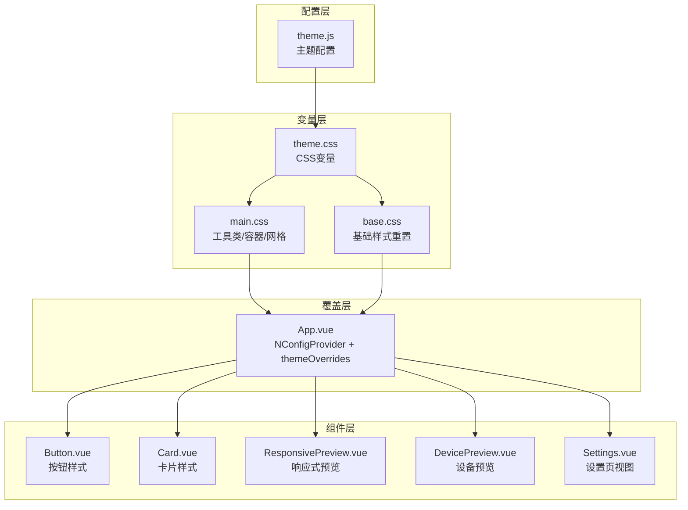
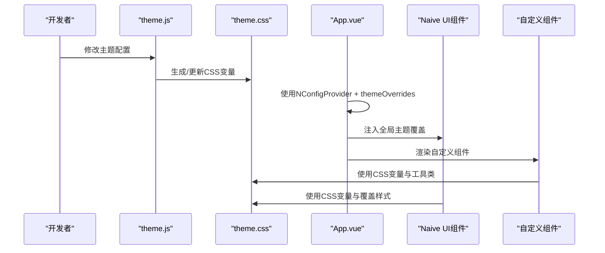
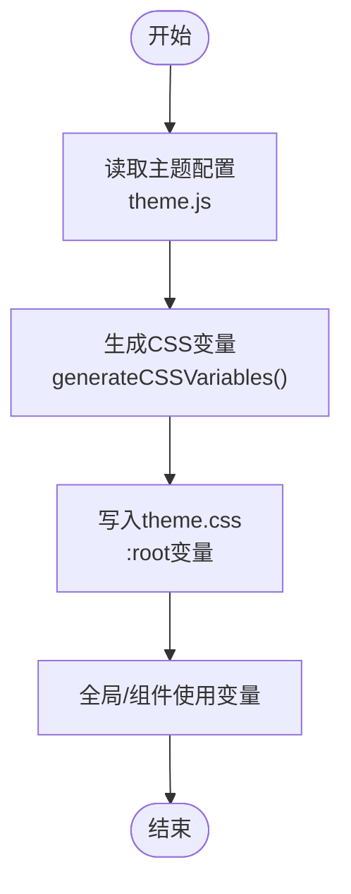
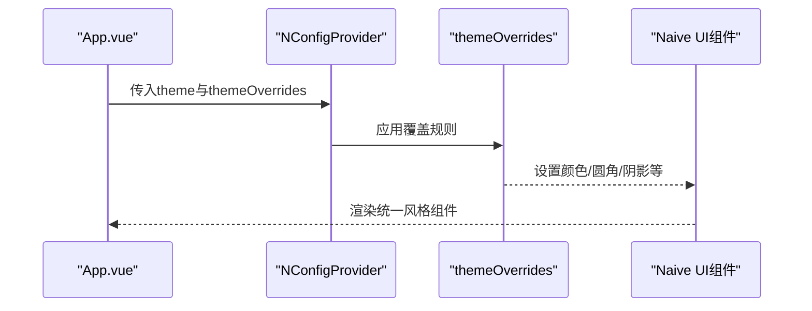
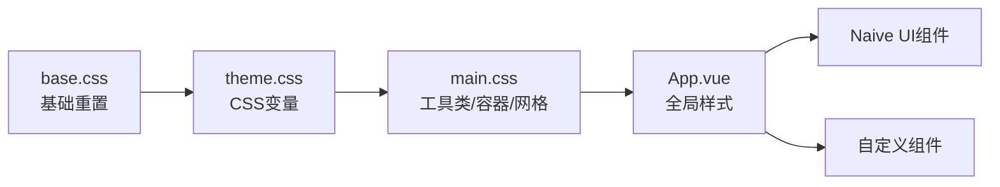
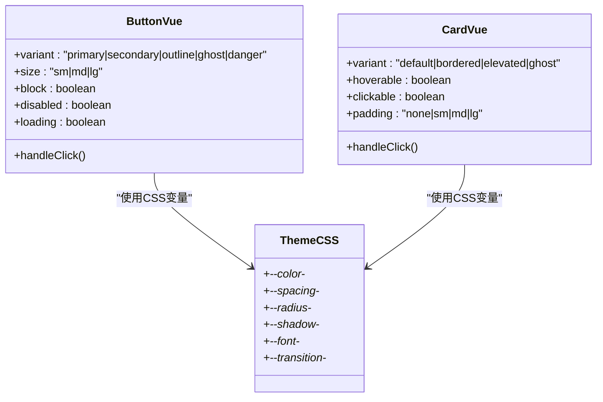
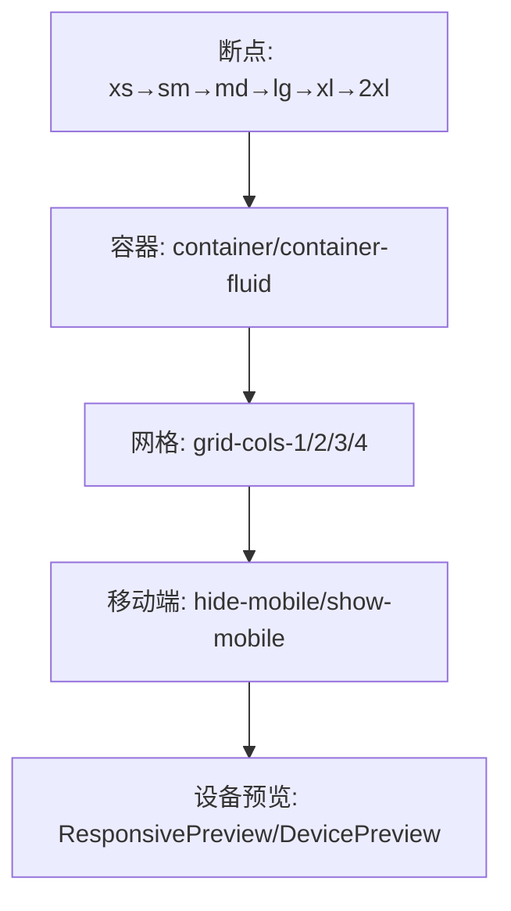
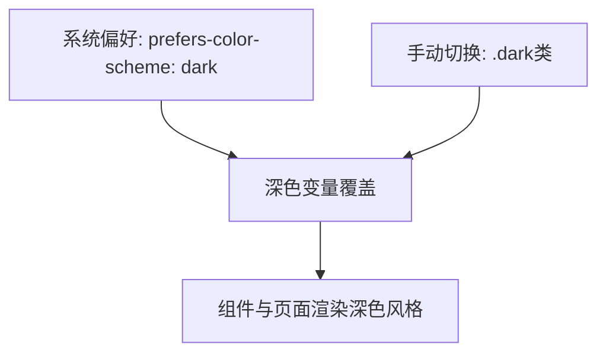
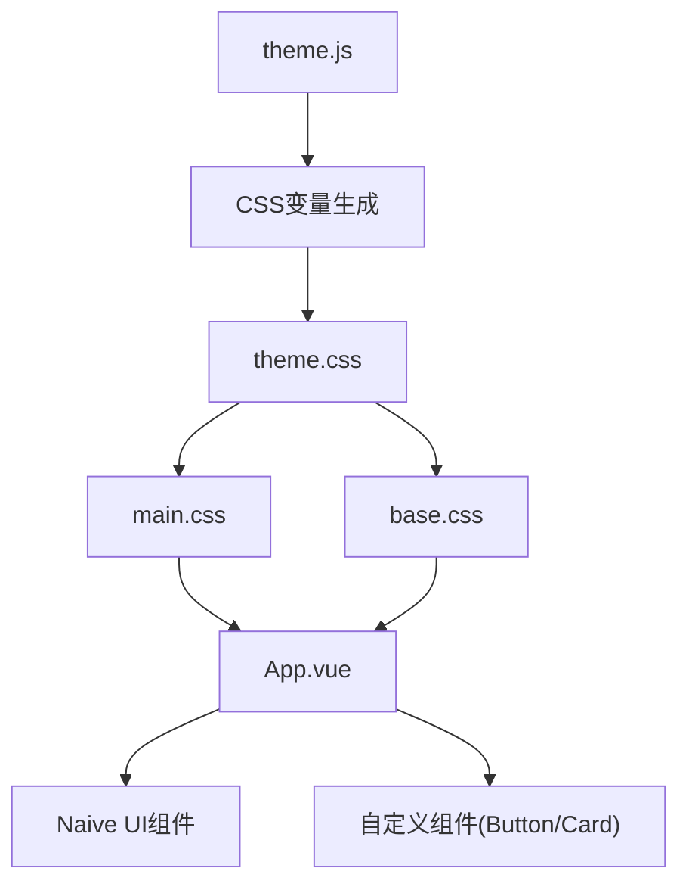

# UI主题系统

<cite>
**本文引用的文件**
- [theme.js](file://src/config/theme.js)
- [theme.css](file://src/assets/theme.css)
- [main.css](file://src/assets/main.css)
- [base.css](file://src/assets/base.css)
- [App.vue](file://src/App.vue)
- [main.js](file://src/main.js)
- [vite.config.js](file://vite.config.js)
- [Button.vue](file://src/components/ui/Button.vue)
- [Card.vue](file://src/components/ui/Card.vue)
- [ResponsivePreview.vue](file://src/components/ResponsivePreview.vue)
- [DevicePreview.vue](file://src/components/DevicePreview.vue)
- [Settings.vue](file://src/views/Settings.vue)
- [GUIDE.md](file://docs/GUIDE.md)
</cite>

## 目录
1. [简介](#简介)
2. [项目结构](#项目结构)
3. [核心组件](#核心组件)
4. [架构总览](#架构总览)
5. [详细组件分析](#详细组件分析)
6. [依赖关系分析](#依赖关系分析)
7. [性能考量](#性能考量)
8. [故障排查指南](#故障排查指南)
9. [结论](#结论)
10. [附录](#附录)

## 简介
本文件系统性阐述该仓库的UI主题系统，重点围绕Naive UI组件库的主题定制与样式管理展开，涵盖以下方面：
- 主题配置结构：颜色方案、字体设置、间距规范、圆角、阴影、Z-index层级、过渡动画
- CSS变量体系：如何从主题配置生成CSS变量，并在全局与组件中使用
- 主题覆盖机制：Naive UI的全局主题覆盖与组件级样式定制
- 响应式设计：断点设置、容器系统、移动端适配策略
- 暗色模式：系统偏好与类名驱动的深色主题切换
- 自定义组件样式与动画：按钮、卡片等组件的样式实现与交互动画
- 最佳实践与示例：主题配置、覆盖与扩展方法

## 项目结构
主题系统由“配置层”“变量层”“覆盖层”“组件层”四部分组成：
- 配置层：集中定义主题变量与断点、层级等
- 变量层：将配置转换为CSS变量并注入全局
- 覆盖层：通过Naive UI的全局主题覆盖统一风格
- 组件层：通用组件与业务视图按主题变量进行样式渲染

**图表来源**
- [theme.js](file://src/config/theme.js#L6-L235)
- [theme.css](file://src/assets/theme.css#L7-L205)
- [main.css](file://src/assets/main.css#L6-L207)
- [base.css](file://src/assets/base.css#L1-L154)
- [App.vue](file://src/App.vue#L14-L207)

**章节来源**
- [theme.js](file://src/config/theme.js#L6-L235)
- [theme.css](file://src/assets/theme.css#L7-L205)
- [main.css](file://src/assets/main.css#L6-L207)
- [base.css](file://src/assets/base.css#L1-L154)
- [App.vue](file://src/App.vue#L14-L207)

## 核心组件
- 主题配置：集中定义颜色、字体、间距、圆角、阴影、断点、容器、Z-index、过渡等
- CSS变量：将主题配置映射为CSS自定义属性，供全局与组件使用
- Naive UI主题覆盖：通过NConfigProvider的theme与themeOverrides统一组件风格
- 基础样式与工具类：提供盒模型重置、滚动条样式、容器与网格系统、文本与间距工具类
- 自定义组件：按钮、卡片等组件基于主题变量实现一致的视觉与交互体验
- 响应式与设备预览：响应式容器、网格、媒体查询与设备/视口预览组件

**章节来源**
- [theme.js](file://src/config/theme.js#L6-L235)
- [theme.css](file://src/assets/theme.css#L7-L205)
- [main.css](file://src/assets/main.css#L6-L207)
- [base.css](file://src/assets/base.css#L1-L154)
- [Button.vue](file://src/components/ui/Button.vue#L82-L237)
- [Card.vue](file://src/components/ui/Card.vue#L101-L195)
- [ResponsivePreview.vue](file://src/components/ResponsivePreview.vue#L47-L215)
- [DevicePreview.vue](file://src/components/DevicePreview.vue#L107-L172)
- [Settings.vue](file://src/views/Settings.vue#L1-L260)

## 架构总览
主题系统采用“配置→变量→覆盖→组件”的分层架构，确保一致性与可扩展性。

**图表来源**
- [theme.js](file://src/config/theme.js#L241-L271)
- [theme.css](file://src/assets/theme.css#L7-L205)
- [App.vue](file://src/App.vue#L14-L207)
- [Button.vue](file://src/components/ui/Button.vue#L82-L237)
- [Card.vue](file://src/components/ui/Card.vue#L101-L195)

## 详细组件分析

### 主题配置与CSS变量
- 颜色系统：主色、辅色、成功/警告/错误、中性灰、背景、文字、边框
- 字体系统：字体族、字号、字重、行高
- 间距系统：从0到64的离散步进
- 圆角系统：从sm到full的半径
- 阴影系统：多层级阴影
- 断点与容器：xs到2xl的断点与容器最大宽度
- Z-index层级：下拉、粘性、固定、模态、弹出、提示等
- 过渡动画：fast/base/slow三档

CSS变量生成逻辑将上述配置映射为形如--color-primary-500、--spacing-4、--radius-lg等变量，并在theme.css中注入到:root。

**图表来源**
- [theme.js](file://src/config/theme.js#L241-L271)
- [theme.css](file://src/assets/theme.css#L7-L205)

**章节来源**
- [theme.js](file://src/config/theme.js#L6-L235)
- [theme.css](file://src/assets/theme.css#L7-L205)

### Naive UI主题覆盖机制
- 全局主题：通过NConfigProvider的theme绑定lightTheme
- 主题覆盖：themeOverrides统一设置主色、圆角、卡片、按钮、输入、滚动条等
- 组件样式：通过CSS变量与覆盖规则实现一致风格

**图表来源**
- [App.vue](file://src/App.vue#L14-L207)

**章节来源**
- [App.vue](file://src/App.vue#L14-L207)

### 基础样式与工具类
- 基础重置：盒模型、滚动条、链接、列表、按钮、输入、图片、标题、段落
- 容器系统：container与container-fluid，配合断点控制最大宽度
- 布局工具类：Flex/Grid、宽高、间距、文本、圆角、阴影、过渡、显示隐藏
- 响应式显示：移动端/桌面端条件显示

**图表来源**
- [base.css](file://src/assets/base.css#L1-L154)
- [theme.css](file://src/assets/theme.css#L7-L205)
- [main.css](file://src/assets/main.css#L6-L207)
- [App.vue](file://src/App.vue#L256-L463)

**章节来源**
- [base.css](file://src/assets/base.css#L1-L154)
- [main.css](file://src/assets/main.css#L6-L207)
- [App.vue](file://src/App.vue#L256-L463)

### 自定义组件样式与动画
- 按钮组件：支持primary/secondary/outline/ghost/danger五种变体，sm/md/lg三种尺寸，块级与禁用/加载状态；使用CSS变量实现颜色与圆角、阴影、过渡
- 卡片组件：支持default/bordered/elevated/ghost四种变体，hover与click交互；内边距可配置
- 动画与过渡：按钮悬停、卡片悬停、页面切换过渡、背景光晕动画

**图表来源**
- [Button.vue](file://src/components/ui/Button.vue#L22-L237)
- [Card.vue](file://src/components/ui/Card.vue#L32-L195)
- [theme.css](file://src/assets/theme.css#L7-L205)

**章节来源**
- [Button.vue](file://src/components/ui/Button.vue#L22-L237)
- [Card.vue](file://src/components/ui/Card.vue#L32-L195)

### 响应式设计与移动端适配
- 断点与容器：xs到2xl六个断点，配合container类在不同断点限制最大宽度
- 网格系统：基于CSS Grid，md/lg断点下列数变化
- 移动端适配：hide-mobile/show-mobile工具类，媒体查询控制布局
- 设备/视口预览：ResponsivePreview与DevicePreview组件提供多设备视图与缩放控制

**图表来源**
- [main.css](file://src/assets/main.css#L18-L207)
- [ResponsivePreview.vue](file://src/components/ResponsivePreview.vue#L47-L215)
- [DevicePreview.vue](file://src/components/DevicePreview.vue#L107-L172)

**章节来源**
- [main.css](file://src/assets/main.css#L18-L207)
- [ResponsivePreview.vue](file://src/components/ResponsivePreview.vue#L47-L215)
- [DevicePreview.vue](file://src/components/DevicePreview.vue#L107-L172)

### 暗色模式支持与动态切换
- 系统偏好：通过@media (prefers-color-scheme: dark)自动应用深色变量
- 类名驱动：.dark类可手动切换深色主题
- 切换策略：可在应用入口或设置页通过切换根元素类名实现主题切换

**图表来源**
- [theme.css](file://src/assets/theme.css#L171-L205)

**章节来源**
- [theme.css](file://src/assets/theme.css#L171-L205)

### 主题配置示例与最佳实践
- 修改CSS变量：在组件或全局覆盖:root变量，快速定制主色、间距、圆角
- 修改主题配置：编辑theme.js，再生成CSS变量文件
- 创建主题变体：新增CSS类（如.theme-dark），通过切换类名实现主题切换
- 在设置页中集成主题开关：结合类名切换与持久化存储实现用户偏好保存

**章节来源**
- [GUIDE.md](file://docs/GUIDE.md#L283-L341)
- [Settings.vue](file://src/views/Settings.vue#L176-L232)

## 依赖关系分析
- 主题配置依赖：theme.js被CSS生成器使用，最终注入theme.css
- 样式依赖：main.css与base.css被App.vue引入，形成全局样式基础
- 组件依赖：Button、Card等组件依赖CSS变量与工具类
- UI依赖：App.vue通过NConfigProvider与themeOverrides影响Naive UI组件

**图表来源**
- [theme.js](file://src/config/theme.js#L241-L271)
- [theme.css](file://src/assets/theme.css#L7-L205)
- [main.css](file://src/assets/main.css#L6-L207)
- [base.css](file://src/assets/base.css#L1-L154)
- [App.vue](file://src/App.vue#L14-L207)

**章节来源**
- [theme.js](file://src/config/theme.js#L241-L271)
- [theme.css](file://src/assets/theme.css#L7-L205)
- [main.css](file://src/assets/main.css#L6-L207)
- [base.css](file://src/assets/base.css#L1-L154)
- [App.vue](file://src/App.vue#L14-L207)

## 性能考量
- CSS变量复用：通过统一变量减少重复样式，降低CSS体积与维护成本
- 组件覆盖最小化：优先使用CSS变量与工具类，避免过度内联样式
- 响应式媒体查询：合理使用断点，避免过多复杂查询导致重排
- 动画与过渡：使用CSS变量控制过渡时长与缓动，保持流畅同时避免过度动画影响性能

## 故障排查指南
- 主题变量未生效
  - 检查theme.js是否正确导出变量，CSS变量是否写入theme.css
  - 确认App.vue中NConfigProvider是否正确传入theme与themeOverrides
- 暗色模式不生效
  - 检查@media与.dark类是否正确注入
  - 确认切换逻辑是否正确添加/移除根元素类名
- 组件样式异常
  - 检查组件是否使用正确的CSS变量与工具类
  - 确认容器与网格类是否与断点匹配
- 构建与开发
  - 确认Vite配置与别名路径正确，避免资源加载失败

**章节来源**
- [theme.js](file://src/config/theme.js#L241-L271)
- [theme.css](file://src/assets/theme.css#L171-L205)
- [App.vue](file://src/App.vue#L14-L207)
- [vite.config.js](file://vite.config.js#L30-L35)

## 结论
该主题系统以集中配置为核心，通过CSS变量与Naive UI覆盖实现统一风格，辅以工具类与响应式设计满足多端适配需求。配合暗色模式与自定义组件，既保证了设计一致性，又提供了灵活的扩展空间。建议在团队内统一主题变量命名与覆盖规范，结合文档与示例，持续沉淀主题资产。

## 附录
- 主题配置文件：src/config/theme.js
- CSS变量文件：src/assets/theme.css
- 全局样式：src/assets/main.css、src/assets/base.css
- 应用入口与主题覆盖：src/App.vue、src/main.js
- Vite配置：vite.config.js
- 自定义组件示例：src/components/ui/Button.vue、src/components/ui/Card.vue
- 响应式与设备预览：src/components/ResponsivePreview.vue、src/components/DevicePreview.vue
- 设置页视图：src/views/Settings.vue
- 主题定制指南：docs/GUIDE.md