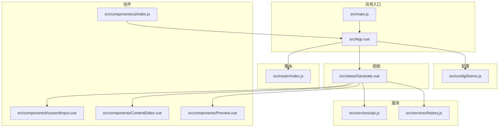
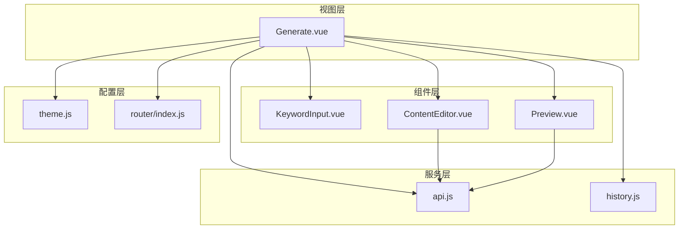
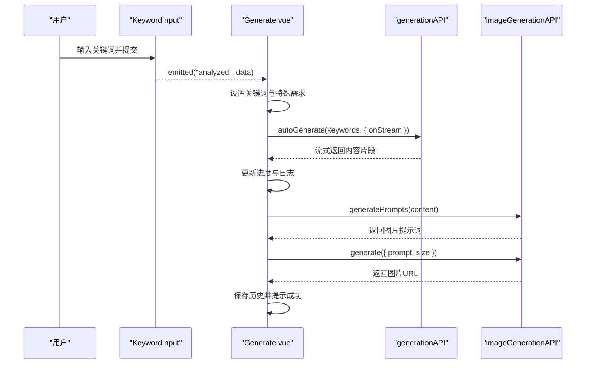
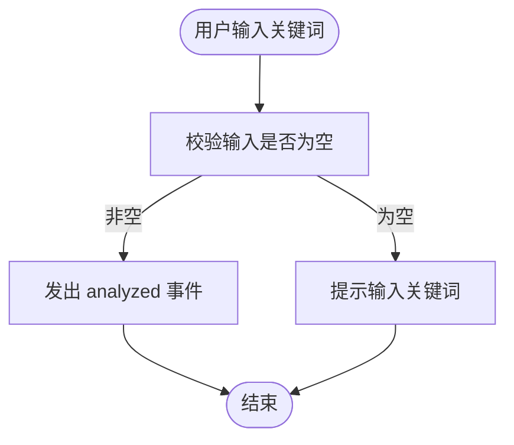
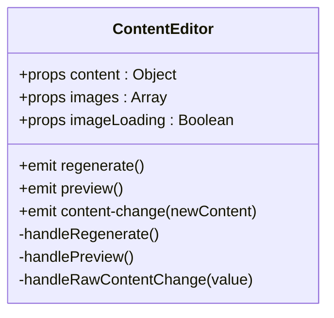
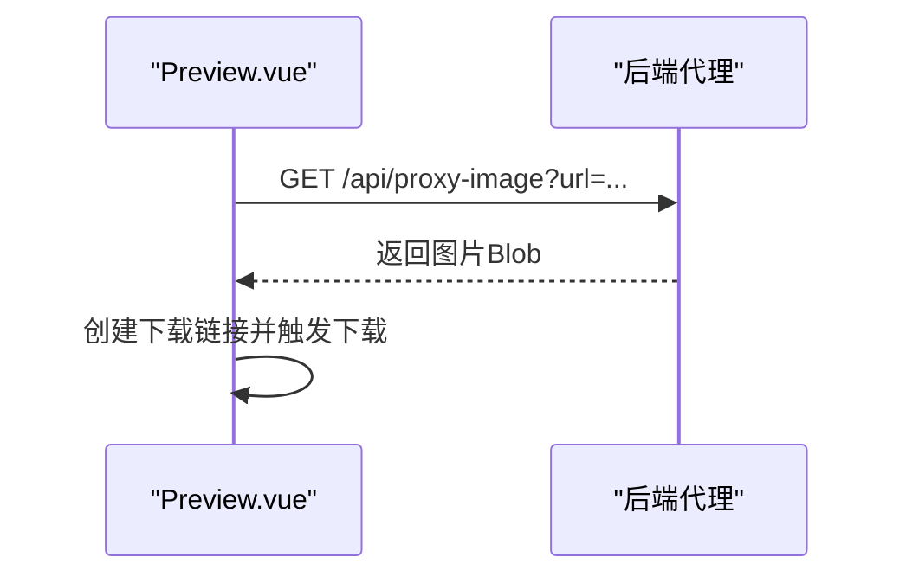
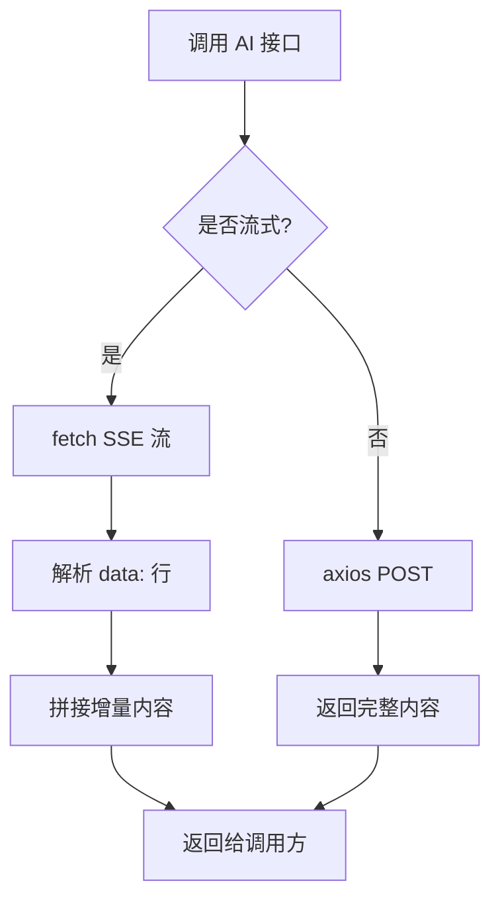
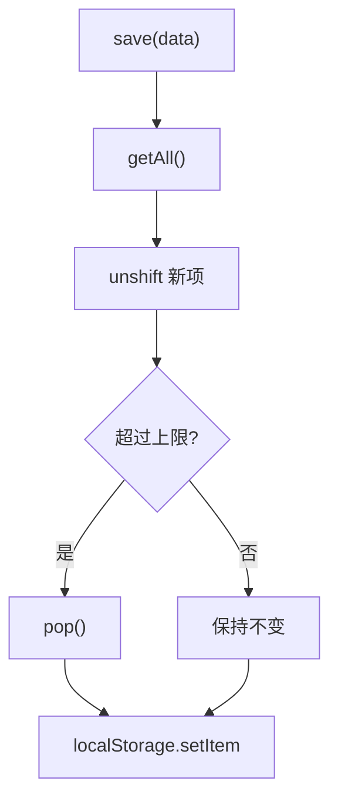
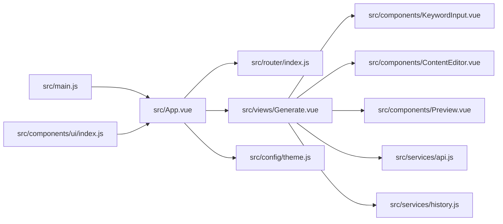

# 前端架构

<cite>
**本文档引用的文件**
- [main.js](file://src/main.js)
- [App.vue](file://src/App.vue)
- [router/index.js](file://src/router/index.js)
- [services/api.js](file://src/services/api.js)
- [views/Generate.vue](file://src/views/Generate.vue)
- [components/ContentEditor.vue](file://src/components/ContentEditor.vue)
- [components/KeywordInput.vue](file://src/components/KeywordInput.vue)
- [components/Preview.vue](file://src/components/Preview.vue)
- [services/history.js](file://src/services/history.js)
- [config/theme.js](file://src/config/theme.js)
- [components/ui/index.js](file://src/components/ui/index.js)
</cite>

## 目录
1. [简介](#简介)
2. [项目结构](#项目结构)
3. [核心组件](#核心组件)
4. [架构总览](#架构总览)
5. [详细组件分析](#详细组件分析)
6. [依赖关系分析](#依赖关系分析)
7. [性能考量](#性能考量)
8. [故障排查指南](#故障排查指南)
9. [结论](#结论)
10. [附录](#附录)

## 简介
本项目为基于 Vue 3 的前端应用，采用 Composition API 与组合式组件设计，围绕“小红书文案图文生成工具”的业务目标构建。系统以工作台布局为核心，提供关键词输入、AI 文案生成、质量分析、图片生成与预览、历史记录管理等能力。前端采用 Naive UI 作为基础组件库，结合自定义主题系统与响应式设计，实现现代化、可扩展的用户体验。

## 项目结构
前端采用按功能域划分的目录组织方式，核心模块包括：
- 应用入口与根组件：负责应用初始化、插件注册与全局布局
- 视图层：按页面职责拆分，如生成页、批量生成页、知识库页等
- 组件层：通用业务组件与 UI 组件库
- 服务层：API 客户端封装、历史记录管理
- 配置层：主题系统与路由配置

图表来源
- [main.js](file://src/main.js#L1-L16)
- [App.vue](file://src/App.vue#L1-L108)
- [router/index.js](file://src/router/index.js#L1-L26)
- [views/Generate.vue](file://src/views/Generate.vue#L1-L175)
- [components/KeywordInput.vue](file://src/components/KeywordInput.vue#L1-L76)
- [components/ContentEditor.vue](file://src/components/ContentEditor.vue#L1-L195)
- [components/Preview.vue](file://src/components/Preview.vue#L1-L132)
- [services/api.js](file://src/services/api.js#L1-L454)
- [services/history.js](file://src/services/history.js#L1-L89)
- [config/theme.js](file://src/config/theme.js#L1-L274)
- [components/ui/index.js](file://src/components/ui/index.js#L1-L23)

章节来源
- [main.js](file://src/main.js#L1-L16)
- [App.vue](file://src/App.vue#L1-L108)
- [router/index.js](file://src/router/index.js#L1-L26)

## 核心组件
- 应用根组件：负责全局主题注入、消息与对话框提供者、布局容器与视图切换
- 生成页：聚合关键词输入、内容编辑、质量分析、图片生成与预览、历史管理
- 关键词输入：胶囊式输入、工具选择、快捷关键词推荐
- 内容编辑器：Markdown 预览与编辑、图片展示与下载、标签管理、审批发布流程
- 预览组件：移动端/桌面端双模式预览、图片轮播、下载代理
- 历史服务：本地存储生成历史、增删查清
- API 服务：统一封装 AI、图片生成、分析与框架接口
- 主题系统：颜色、字体、间距、阴影、断点等设计令牌与 CSS 变量生成
- UI 组件库：Button、Card、Input 统一导出与全局注册

章节来源
- [App.vue](file://src/App.vue#L110-L254)
- [views/Generate.vue](file://src/views/Generate.vue#L177-L427)
- [components/KeywordInput.vue](file://src/components/KeywordInput.vue#L78-L151)
- [components/ContentEditor.vue](file://src/components/ContentEditor.vue#L197-L316)
- [components/Preview.vue](file://src/components/Preview.vue#L134-L208)
- [services/history.js](file://src/services/history.js#L9-L88)
- [services/api.js](file://src/services/api.js#L8-L451)
- [config/theme.js](file://src/config/theme.js#L6-L235)
- [components/ui/index.js](file://src/components/ui/index.js#L7-L21)

## 架构总览
系统采用“视图-组件-服务-配置”的分层架构：
- 视图层：通过路由驱动，承载业务页面与交互
- 组件层：复用性强的业务组件与 UI 组件
- 服务层：封装 API 与本地存储，提供稳定的数据访问
- 配置层：主题系统与路由配置，统一设计语言与导航

图表来源
- [views/Generate.vue](file://src/views/Generate.vue#L177-L427)
- [components/KeywordInput.vue](file://src/components/KeywordInput.vue#L78-L151)
- [components/ContentEditor.vue](file://src/components/ContentEditor.vue#L197-L316)
- [components/Preview.vue](file://src/components/Preview.vue#L134-L208)
- [services/api.js](file://src/services/api.js#L8-L451)
- [services/history.js](file://src/services/history.js#L9-L88)
- [config/theme.js](file://src/config/theme.js#L1-L274)
- [router/index.js](file://src/router/index.js#L1-L26)

## 详细组件分析

### 生成页（Generate.vue）
- 职责：整合关键词输入、AI 生成流程、质量分析、图片生成与预览、历史管理
- 关键流程：
  - 快捷生成：触发 AI 全自动生成，流式更新进度与日志，完成后生成图片并保存历史
  - 编辑与预览：支持 Markdown 预览与编辑，实时预览移动端/桌面端效果
  - 质量分析：对生成内容进行质量维度分析
  - 历史管理：本地存储与恢复生成结果
- 数据绑定：响应式状态驱动 UI 更新，计算属性决定侧边栏宽度与视图切换
- 事件处理：组件间通过 emits 传递事件，父组件集中处理业务逻辑

图表来源
- [views/Generate.vue](file://src/views/Generate.vue#L257-L324)
- [services/api.js](file://src/services/api.js#L256-L320)
- [services/api.js](file://src/services/api.js#L369-L448)

章节来源
- [views/Generate.vue](file://src/views/Generate.vue#L177-L427)

### 关键词输入（KeywordInput.vue）
- 职责：提供胶囊式输入、工具选择、快捷关键词推荐与触发分析
- 交互：支持 Enter 提交、工具多选、隐藏/显示切换
- 事件：向父组件发出 analyzed 事件，携带关键词与工具集合

图表来源
- [components/KeywordInput.vue](file://src/components/KeywordInput.vue#L132-L142)

章节来源
- [components/KeywordInput.vue](file://src/components/KeywordInput.vue#L78-L151)

### 内容编辑器（ContentEditor.vue）
- 职责：支持 Markdown 预览与编辑、图片展示与下载、标签管理、审批发布流程
- 数据绑定：props 接收内容与图片，watch 监听变化并通过 content-change 事件向上游传递
- 事件处理：regenerate、preview、content-change 三个核心事件

图表来源
- [components/ContentEditor.vue](file://src/components/ContentEditor.vue#L197-L316)

章节来源
- [components/ContentEditor.vue](file://src/components/ContentEditor.vue#L1-L418)

### 预览组件（Preview.vue）
- 职责：双模式预览（移动端/桌面端）、图片轮播、下载代理
- 交互：支持下载图片，桌面端图片区与正文区并列展示
- 安全：通过后端代理下载图片，避免跨域问题

图表来源
- [components/Preview.vue](file://src/components/Preview.vue#L146-L166)

章节来源
- [components/Preview.vue](file://src/components/Preview.vue#L1-L411)

### API 集成策略（services/api.js）
- 客户端配置：
  - 通用 axios 客户端：baseURL 为 /api，统一超时
  - AI 客户端：基于环境变量配置，支持 Authorization、Referer、X-Title 等头
  - 图片生成客户端：火山引擎（申图）客户端，支持长超时
- 接口封装：
  - 知识库 API：基于 localStorage 的 CRUD
  - 框架 API：返回硬编码框架列表
  - 分析 API：调用 AI 获取推荐框架与理由
  - 生成 API：支持流式与非流式两种模式，返回文案与分析
  - 图片生成 API：生成提示词与图片，返回 URL
- 错误处理：捕获异常并返回结构化错误对象，保证 UI 稳定

图表来源
- [services/api.js](file://src/services/api.js#L94-L177)

章节来源
- [services/api.js](file://src/services/api.js#L8-L451)

### 历史记录（services/history.js）
- 职责：本地持久化生成历史，限制最大长度，提供增删查清操作
- 存储：localStorage，键名固定，序列化对象数组

图表来源
- [services/history.js](file://src/services/history.js#L14-L41)

章节来源
- [services/history.js](file://src/services/history.js#L1-L89)

### 主题系统（config/theme.js）
- 设计令牌：颜色、字体、间距、圆角、阴影、断点、Z-index、过渡
- CSS 变量：将主题令牌映射为 CSS 自定义属性，便于在组件中使用
- 在根组件中通过 Naive UI 的 ConfigProvider 注入主题与覆盖样式

章节来源
- [config/theme.js](file://src/config/theme.js#L6-L274)
- [App.vue](file://src/App.vue#L14-L207)

### UI 组件库（components/ui/index.js）
- 统一导出 Button、Card、Input
- 提供 install(app) 方法，用于全局注册组件

章节来源
- [components/ui/index.js](file://src/components/ui/index.js#L7-L21)

## 依赖关系分析
- 应用入口依赖：Vue 根实例、Naive UI 插件、路由
- 根组件依赖：Naive UI 提供者、主题配置、视图组件
- 生成页依赖：关键词输入、内容编辑器、预览组件、API 服务、历史服务
- 组件间通信：父子组件通过 props/emit，兄弟组件通过父组件协调
- 外部依赖：Naive UI、Axios、MarkdownIt、环境变量

图表来源
- [main.js](file://src/main.js#L1-L16)
- [App.vue](file://src/App.vue#L1-L108)
- [router/index.js](file://src/router/index.js#L1-L26)
- [views/Generate.vue](file://src/views/Generate.vue#L1-L175)
- [components/KeywordInput.vue](file://src/components/KeywordInput.vue#L1-L76)
- [components/ContentEditor.vue](file://src/components/ContentEditor.vue#L1-L195)
- [components/Preview.vue](file://src/components/Preview.vue#L1-L132)
- [services/api.js](file://src/services/api.js#L1-L454)
- [services/history.js](file://src/services/history.js#L1-L89)
- [config/theme.js](file://src/config/theme.js#L1-L274)
- [components/ui/index.js](file://src/components/ui/index.js#L1-L23)

## 性能考量
- 流式渲染：生成页通过流式回调逐步更新内容，减少首屏阻塞
- 图片懒加载：预览组件使用图片懒加载与轮播，降低内存占用
- 本地存储：历史记录与知识库使用 localStorage，避免频繁网络请求
- 组件拆分：将编辑、预览、分析等功能拆分为独立组件，便于按需渲染与缓存
- 超时与重试：AI 与图片生成接口设置合理超时，必要时在 UI 层提示重试

## 故障排查指南
- 生成失败：
  - 检查关键词输入是否为空
  - 查看控制台错误日志，确认 AI 接口返回
  - 确认环境变量配置（AI_BASE_URL、AI_API_KEY、AI_MODEL）
- 图片下载失败：
  - 确认后端代理 /api/proxy-image 正常
  - 检查网络与跨域设置
- 历史记录异常：
  - 清空 localStorage 中的历史键值，重新生成
- 主题不生效：
  - 确认 ConfigProvider 注入与主题覆盖配置正确

章节来源
- [views/Generate.vue](file://src/views/Generate.vue#L315-L323)
- [components/Preview.vue](file://src/components/Preview.vue#L146-L166)
- [services/history.js](file://src/services/history.js#L85-L88)
- [App.vue](file://src/App.vue#L14-L207)

## 结论
本前端架构以 Vue 3 为核心，结合 Naive UI 与自定义主题系统，实现了从关键词输入到内容生成、质量分析与图片生成的完整工作流。通过清晰的组件分层与服务封装，系统具备良好的可维护性与扩展性。后续可在路由扩展、状态管理（如 Pinia）、国际化与测试体系方面进一步完善。

## 附录
- 环境变量建议：
  - VITE_AI_BASE_URL：AI 服务地址
  - VITE_AI_API_KEY：AI 服务密钥
  - VITE_AI_MODEL：默认模型名称
  - VITE_VOLCENGINE_BASE_URL：图片生成服务地址
  - VITE_VOLCENGINE_API_KEY：图片生成服务密钥
  - VITE_VOLCENGINE_MODEL：图片生成模型名称
- 最佳实践：
  - 统一在 services/api.js 中新增接口，保持调用一致性
  - 使用 computed 与 watch 控制组件渲染与副作用
  - 对外暴露的组件尽量通过 UI 组件库统一导出与注册