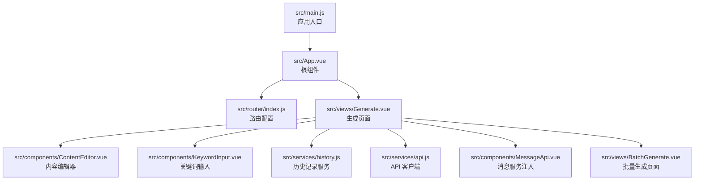
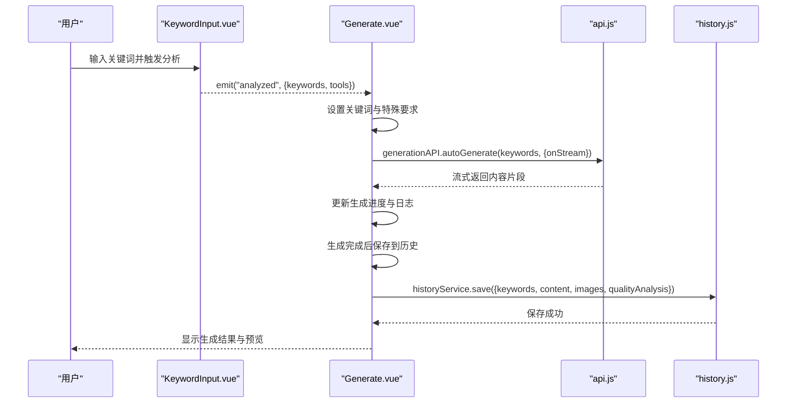
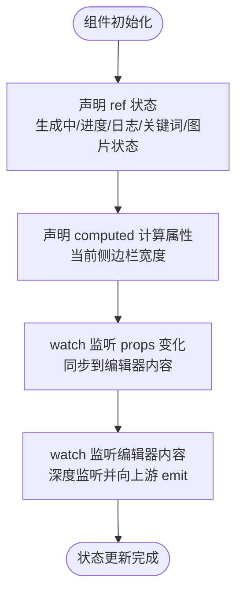
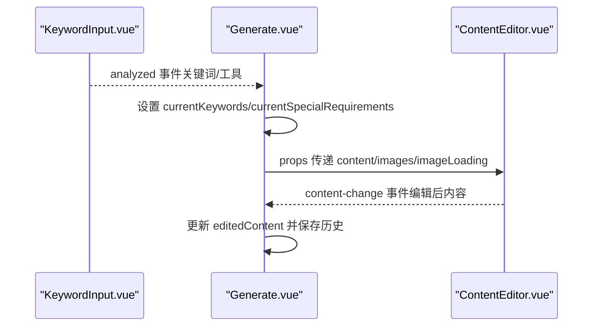
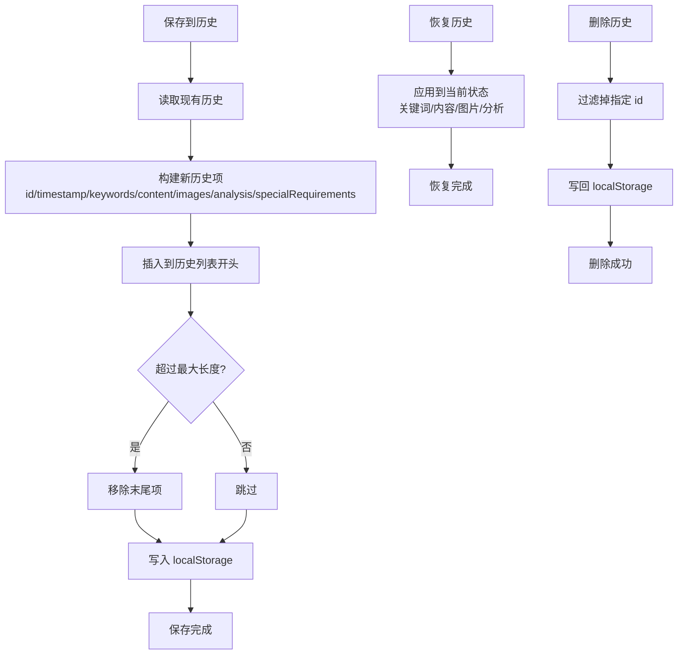
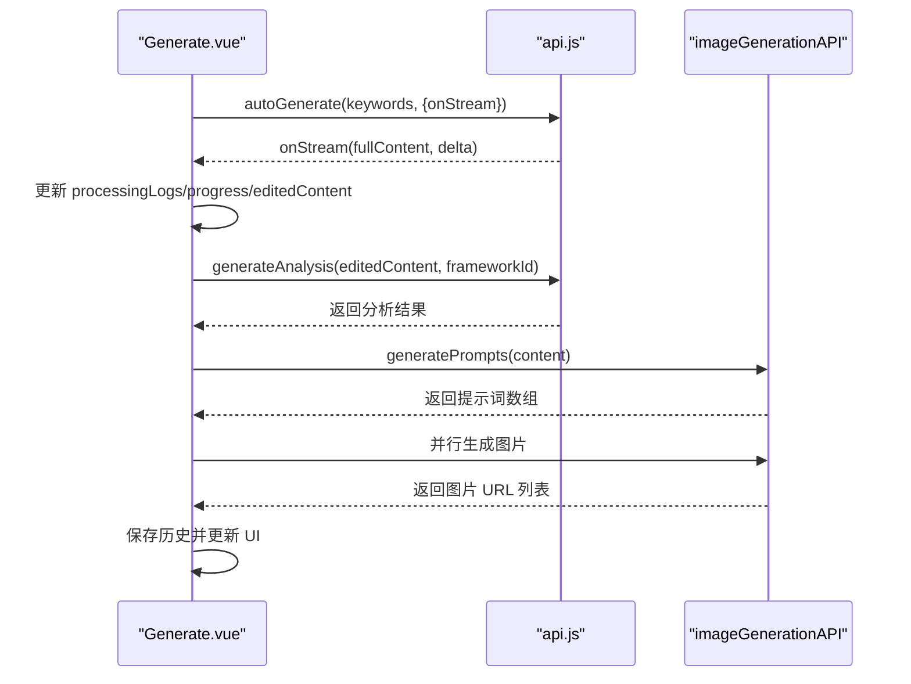
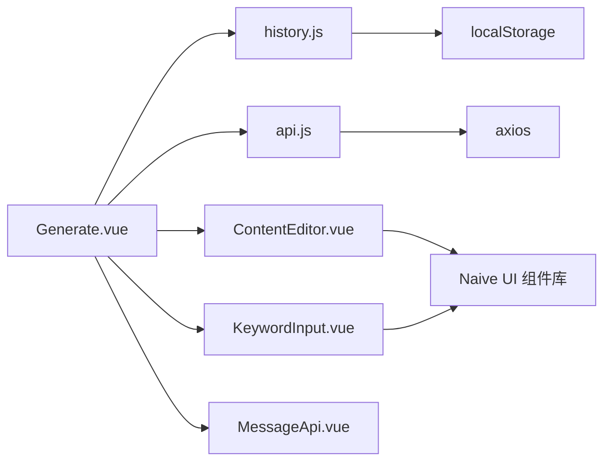

# 状态管理

<cite>
**本文档引用的文件**
- [src/services/history.js](file://src/services/history.js)
- [src/views/Generate.vue](file://src/views/Generate.vue)
- [src/App.vue](file://src/App.vue)
- [src/main.js](file://src/main.js)
- [frontend/src/main.js](file://frontend/src/main.js)
- [src/components/ContentEditor.vue](file://src/components/ContentEditor.vue)
- [src/components/KeywordInput.vue](file://src/components/KeywordInput.vue)
- [src/router/index.js](file://src/router/index.js)
- [src/services/api.js](file://src/services/api.js)
- [src/components/MessageApi.vue](file://src/components/MessageApi.vue)
- [src/views/BatchGenerate.vue](file://src/views/BatchGenerate.vue)
</cite>

## 目录
1. [简介](#简介)
2. [项目结构](#项目结构)
3. [核心组件](#核心组件)
4. [架构总览](#架构总览)
5. [详细组件分析](#详细组件分析)
6. [依赖关系分析](#依赖关系分析)
7. [性能考虑](#性能考虑)
8. [故障排查指南](#故障排查指南)
9. [结论](#结论)

## 简介
本项目采用 Vue 3 Composition API 实现前端状态管理，结合本地存储实现状态持久化与历史记录管理。本文档系统梳理响应式数据管理（ref、reactive、computed）、组件间状态共享（props、事件发射）、历史记录管理（保存、恢复、删除）、状态持久化与同步机制，并提供性能优化建议与最佳实践。

## 项目结构
前端采用单页应用架构，核心入口在根目录的 main.js 中挂载 App.vue，App.vue 作为根组件承载全局布局与视图切换；生成页面 Generate.vue 为核心业务页面，负责状态聚合与历史记录管理；各功能组件通过 props 与事件进行解耦通信。

图表来源
- [src/main.js](file://src/main.js#L1-L16)
- [src/App.vue](file://src/App.vue#L1-L468)
- [src/router/index.js](file://src/router/index.js#L1-L26)
- [src/views/Generate.vue](file://src/views/Generate.vue#L1-L668)
- [src/components/ContentEditor.vue](file://src/components/ContentEditor.vue#L1-L418)
- [src/components/KeywordInput.vue](file://src/components/KeywordInput.vue#L1-L265)
- [src/services/history.js](file://src/services/history.js#L1-L89)
- [src/services/api.js](file://src/services/api.js#L1-L454)
- [src/components/MessageApi.vue](file://src/components/MessageApi.vue#L1-L16)
- [src/views/BatchGenerate.vue](file://src/views/BatchGenerate.vue#L1-L200)

章节来源
- [src/main.js](file://src/main.js#L1-L16)
- [src/App.vue](file://src/App.vue#L1-L468)
- [src/router/index.js](file://src/router/index.js#L1-L26)

## 核心组件
- 响应式状态管理：使用 ref、computed、watch 实现响应式数据与计算属性。
- 组件间通信：通过 props 向子组件传递数据，通过 emits 事件向上游组件通知状态变化。
- 历史记录服务：封装 localStorage 的增删查改操作，限制最大历史数量。
- API 客户端：封装 AI 与图片生成的请求，支持流式输出与错误处理。
- 全局消息服务：通过 MessageApi 注入 Naive UI 的消息、对话框、通知与加载条服务。

章节来源
- [src/views/Generate.vue](file://src/views/Generate.vue#L177-L427)
- [src/services/history.js](file://src/services/history.js#L1-L89)
- [src/services/api.js](file://src/services/api.js#L1-L454)
- [src/components/MessageApi.vue](file://src/components/MessageApi.vue#L1-L16)

## 架构总览
应用采用“页面级状态 + 服务级状态”的分层架构：
- 页面级状态：集中在 Generate.vue 中，管理生成流程、编辑器状态、预览状态、历史记录等。
- 服务级状态：historyService 管理本地历史，api.js 管理网络请求与流式处理。
- 组件级状态：ContentEditor.vue 与 KeywordInput.vue 通过 props 与事件与父组件通信。

图表来源
- [src/components/KeywordInput.vue](file://src/components/KeywordInput.vue#L132-L142)
- [src/views/Generate.vue](file://src/views/Generate.vue#L257-L324)
- [src/services/api.js](file://src/services/api.js#L256-L282)
- [src/services/history.js](file://src/services/history.js#L14-L41)

## 详细组件分析

### 响应式数据管理（ref、reactive、computed）
- ref：用于声明可变标量状态，如生成状态、进度、日志、关键词、图片生成状态等。
- computed：用于派生状态，如当前侧边栏宽度基于预览设备与内容状态计算。
- watch：监听 props 或响应式对象变化，触发事件或更新子组件状态。

图表来源
- [src/views/Generate.vue](file://src/views/Generate.vue#L199-L221)
- [src/views/Generate.vue](file://src/views/Generate.vue#L215-L218)
- [src/components/ContentEditor.vue](file://src/components/ContentEditor.vue#L273-L281)

章节来源
- [src/views/Generate.vue](file://src/views/Generate.vue#L199-L221)
- [src/views/Generate.vue](file://src/views/Generate.vue#L215-L218)
- [src/components/ContentEditor.vue](file://src/components/ContentEditor.vue#L273-L281)

### 组件间状态共享（props、事件发射）
- 父传子：Generate.vue 通过 props 向 ContentEditor.vue 传递内容、图片与加载状态。
- 子传父：ContentEditor.vue 通过 content-change 事件将编辑后的文本回传给父组件。
- 事件链路：KeywordInput.vue 触发 analyzed 事件，Generate.vue 接收并启动生成流程。

图表来源
- [src/components/KeywordInput.vue](file://src/components/KeywordInput.vue#L132-L142)
- [src/views/Generate.vue](file://src/views/Generate.vue#L257-L324)
- [src/components/ContentEditor.vue](file://src/components/ContentEditor.vue#L259-L281)

章节来源
- [src/components/KeywordInput.vue](file://src/components/KeywordInput.vue#L132-L142)
- [src/views/Generate.vue](file://src/views/Generate.vue#L383-L385)
- [src/components/ContentEditor.vue](file://src/components/ContentEditor.vue#L259-L281)

### 历史记录管理（保存、恢复、删除）
- 保存：生成完成后将关键词、内容、图片、质量分析等信息保存至 localStorage。
- 恢复：从历史列表点击项恢复到当前编辑状态。
- 删除：支持单条删除与清空历史。
- 存储策略：使用 localStorage，键名固定，最大历史条数限制为 50 条。

图表来源
- [src/services/history.js](file://src/services/history.js#L14-L41)
- [src/services/history.js](file://src/services/history.js#L47-L55)
- [src/services/history.js](file://src/services/history.js#L70-L80)
- [src/views/Generate.vue](file://src/views/Generate.vue#L390-L422)

章节来源
- [src/services/history.js](file://src/services/history.js#L1-L89)
- [src/views/Generate.vue](file://src/views/Generate.vue#L390-L422)

### 状态持久化与同步机制
- 本地持久化：历史记录与知识库均使用 localStorage 实现跨会话持久化。
- 同步策略：页面加载时读取历史列表；每次生成完成后写入最新历史；删除与清空操作即时同步到存储。
- 全局消息服务：通过 MessageApi 注入 Naive UI 的消息与通知，保证跨组件一致的用户反馈。

章节来源
- [src/services/history.js](file://src/services/history.js#L47-L55)
- [src/services/history.js](file://src/services/history.js#L85-L87)
- [src/components/MessageApi.vue](file://src/components/MessageApi.vue#L1-L16)

### API 流式处理与状态联动
- 流式生成：generationAPI 支持 onStream 回调，逐步更新生成进度与日志。
- 质量分析：生成完成后调用分析接口，将结果存入 qualityAnalysis。
- 图片生成：根据文案生成配图提示词并并行生成图片，完成后更新 generatedImages。

图表来源
- [src/views/Generate.vue](file://src/views/Generate.vue#L276-L324)
- [src/services/api.js](file://src/services/api.js#L256-L282)
- [src/services/api.js](file://src/services/api.js#L327-L363)
- [src/services/api.js](file://src/services/api.js#L417-L448)

章节来源
- [src/views/Generate.vue](file://src/views/Generate.vue#L276-L354)
- [src/services/api.js](file://src/services/api.js#L123-L177)

### 批量生成页面的状态管理
- 输入解析：将多行输入解析为需求列表，支持并发控制与进度展示。
- 队列管理：维护任务队列，实时更新状态与进度。
- 结果汇总：支持打包下载与逐项预览。

章节来源
- [src/views/BatchGenerate.vue](file://src/views/BatchGenerate.vue#L153-L200)

## 依赖关系分析
- Generate.vue 依赖 historyService、api.js、ContentEditor.vue、KeywordInput.vue、MessageApi。
- ContentEditor.vue 依赖 Naive UI 组件与 MarkdownIt，通过 props 与 emits 与父组件交互。
- KeywordInput.vue 通过 analyzed 事件与父组件通信。
- api.js 依赖 axios 与环境变量，封装 AI 与图片生成客户端。
- history.js 依赖 localStorage API。

图表来源
- [src/views/Generate.vue](file://src/views/Generate.vue#L189-L195)
- [src/services/history.js](file://src/services/history.js#L1-L89)
- [src/services/api.js](file://src/services/api.js#L1-L454)
- [src/components/ContentEditor.vue](file://src/components/ContentEditor.vue#L1-L418)
- [src/components/KeywordInput.vue](file://src/components/KeywordInput.vue#L1-L265)
- [src/components/MessageApi.vue](file://src/components/MessageApi.vue#L1-L16)

章节来源
- [src/views/Generate.vue](file://src/views/Generate.vue#L189-L195)
- [src/services/api.js](file://src/services/api.js#L1-L454)
- [src/services/history.js](file://src/services/history.js#L1-L89)

## 性能考虑
- 流式渲染：利用 onStream 回调逐步更新 UI，避免一次性渲染大文本导致卡顿。
- 深度监听优化：对编辑器内容使用深度监听，必要时可改为浅监听并手动触发变更。
- 并行图片生成：使用 Promise.all 并行请求图片，减少总等待时间。
- 历史列表截断：限制最大历史数量，避免 localStorage 过大影响性能。
- 计算属性缓存：computed 基于依赖自动缓存，避免重复计算。

## 故障排查指南
- 历史记录读取失败：检查 localStorage 是否可用，捕获异常并降级为空数组。
- 生成接口超时：调整 axios 超时时间，合理设置流式读取的超时阈值。
- 图片生成失败：检查提示词生成与图片 API 的返回格式，确保 URL 正确。
- 消息服务不可用：确认 MessageApi 已在应用启动时注入到 window 对象。

章节来源
- [src/services/history.js](file://src/services/history.js#L47-L55)
- [src/services/api.js](file://src/services/api.js#L16-L25)
- [src/services/api.js](file://src/services/api.js#L417-L448)
- [src/components/MessageApi.vue](file://src/components/MessageApi.vue#L1-L16)

## 结论
本项目通过 Composition API 实现清晰的状态管理，结合 localStorage 实现历史记录与知识库的持久化。Generate.vue 作为状态中枢，协调 API 流程、编辑器交互与历史管理；组件间通过 props 与事件实现松耦合通信。建议在复杂场景引入集中式状态库（如 Pinia）以进一步提升可维护性与可测试性。