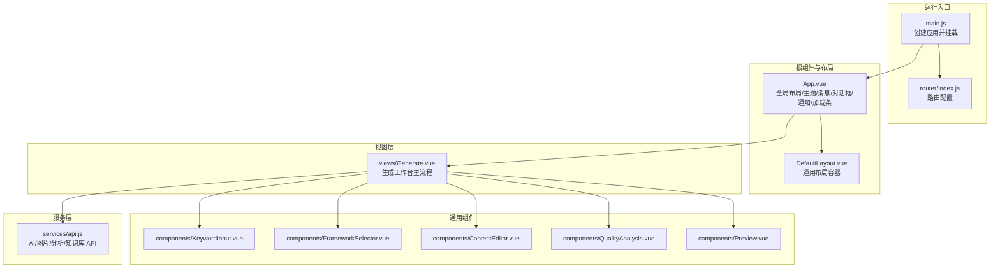
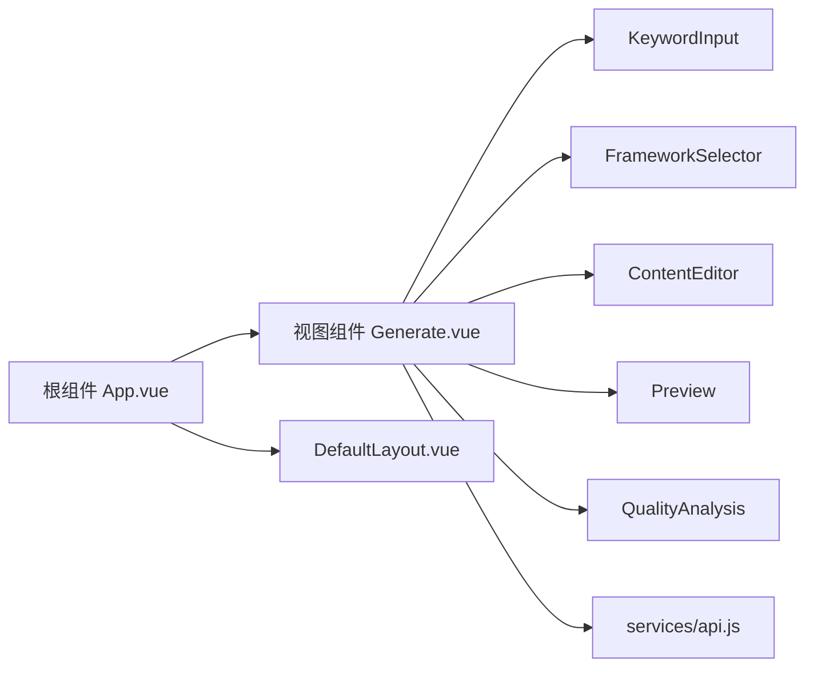
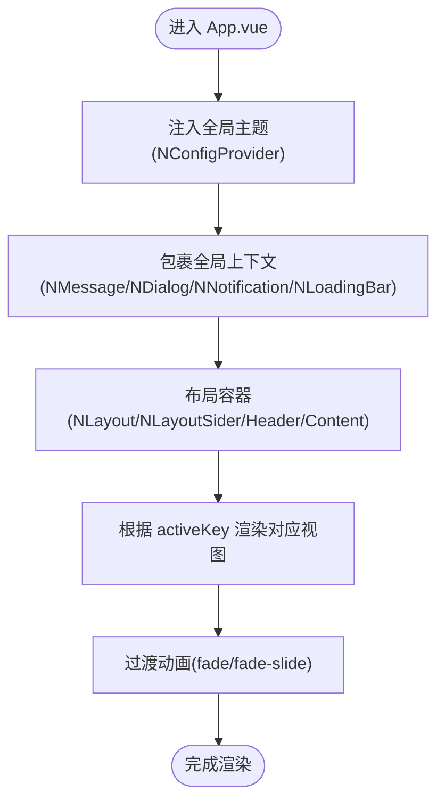
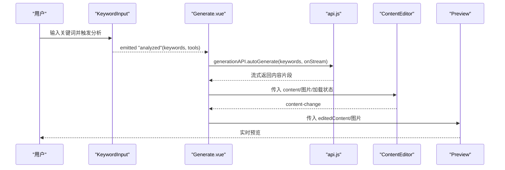
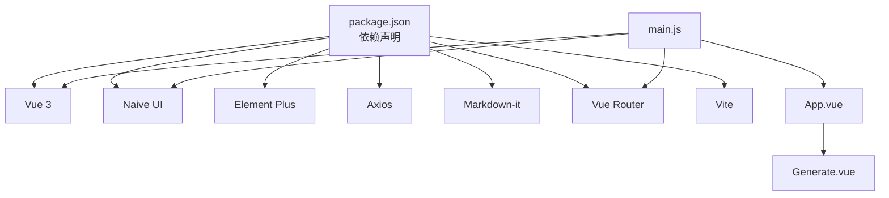
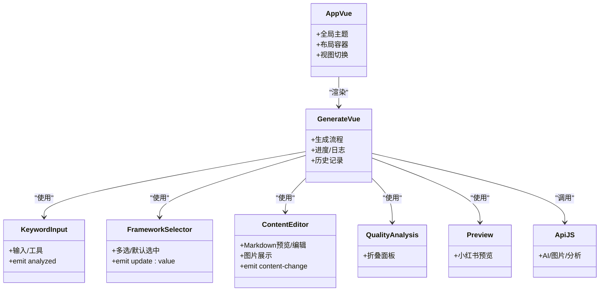

# 组件架构

<cite>
**本文档引用的文件**
- [App.vue](file://src/App.vue)
- [main.js](file://src/main.js)
- [router/index.js](file://src/router/index.js)
- [Generate.vue](file://src/views/Generate.vue)
- [ContentEditor.vue](file://src/components/ContentEditor.vue)
- [FrameworkSelector.vue](file://src/components/FrameworkSelector.vue)
- [KeywordInput.vue](file://src/components/KeywordInput.vue)
- [Preview.vue](file://src/components/Preview.vue)
- [QualityAnalysis.vue](file://src/components/QualityAnalysis.vue)
- [DefaultLayout.vue](file://src/layouts/DefaultLayout.vue)
- [api.js](file://src/services/api.js)
- [package.json](file://package.json)
</cite>

## 目录
1. [简介](#简介)
2. [项目结构](#项目结构)
3. [核心组件](#核心组件)
4. [架构总览](#架构总览)
5. [组件详解](#组件详解)
6. [依赖关系分析](#依赖关系分析)
7. [性能考量](#性能考量)
8. [故障排查指南](#故障排查指南)
9. [结论](#结论)
10. [附录](#附录)

## 简介
本文件面向前端开发者与产品设计人员，系统化梳理 Vue 3 组件化设计在本项目中的实现方式。重点涵盖：
- 根组件与布局设计
- 子组件层次与职责划分
- 组件间通信（props、事件、provide/inject 的使用现状）
- 状态管理策略（响应式数据、计算属性、侦听器）
- 生命周期与组合式 API 使用模式
- 组件复用、插槽与自定义指令的应用现状
- 组件关系图与数据流向图，帮助快速理解依赖与交互

## 项目结构
项目采用“视图 + 组件 + 服务 + 路由”的分层组织方式，根组件负责全局布局与主题配置，视图组件承载业务主流程，通用组件封装 UI 与交互，服务模块抽象 API 调用。

图表来源
- [main.js](file://src/main.js#L1-L16)
- [router/index.js](file://src/router/index.js#L1-L26)
- [App.vue](file://src/App.vue#L1-L468)
- [DefaultLayout.vue](file://src/layouts/DefaultLayout.vue#L1-L185)
- [Generate.vue](file://src/views/Generate.vue#L1-L668)
- [KeywordInput.vue](file://src/components/KeywordInput.vue#L1-L265)
- [FrameworkSelector.vue](file://src/components/FrameworkSelector.vue#L1-L241)
- [ContentEditor.vue](file://src/components/ContentEditor.vue#L1-L418)
- [QualityAnalysis.vue](file://src/components/QualityAnalysis.vue#L1-L138)
- [Preview.vue](file://src/components/Preview.vue#L1-L411)
- [api.js](file://src/services/api.js#L1-L454)

章节来源
- [main.js](file://src/main.js#L1-L16)
- [router/index.js](file://src/router/index.js#L1-L26)
- [App.vue](file://src/App.vue#L1-L468)
- [DefaultLayout.vue](file://src/layouts/DefaultLayout.vue#L1-L185)

## 核心组件
- 根组件 App.vue：提供全局主题、消息、对话框、通知、加载条等上下文，内嵌工作台布局与视图切换。
- 视图组件 Generate.vue：承载“关键词分析 → 框架选择 → 内容生成 → 编辑/预览/质量分析”的完整工作流。
- 通用组件：
  - KeywordInput：关键词输入与工具选择，支持快捷推荐与收起展开。
  - FrameworkSelector：多选/单选框架卡片，支持默认选中与双向更新。
  - ContentEditor：Markdown 预览/编辑、图片展示与下载、标签管理、审批发布弹窗。
  - QualityAnalysis：质量分析面板，折叠展开各维度。
  - Preview：小红书风格预览，支持手机/桌面两种模式与图片下载。
- 服务模块 api.js：封装 AI 文案生成、分析、图片生成、知识库等 API。

章节来源
- [App.vue](file://src/App.vue#L1-L468)
- [Generate.vue](file://src/views/Generate.vue#L1-L668)
- [KeywordInput.vue](file://src/components/KeywordInput.vue#L1-L265)
- [FrameworkSelector.vue](file://src/components/FrameworkSelector.vue#L1-L241)
- [ContentEditor.vue](file://src/components/ContentEditor.vue#L1-L418)
- [QualityAnalysis.vue](file://src/components/QualityAnalysis.vue#L1-L138)
- [Preview.vue](file://src/components/Preview.vue#L1-L411)
- [api.js](file://src/services/api.js#L1-L454)

## 架构总览
本项目采用“根组件 + 视图组件 + 通用组件 + 服务模块”的分层架构，配合 Vue 3 组合式 API 与 Naive UI/Element Plus 组件库，实现高内聚低耦合的组件体系。

图表来源
- [App.vue](file://src/App.vue#L1-L468)
- [Generate.vue](file://src/views/Generate.vue#L1-L668)
- [KeywordInput.vue](file://src/components/KeywordInput.vue#L1-L265)
- [FrameworkSelector.vue](file://src/components/FrameworkSelector.vue#L1-L241)
- [ContentEditor.vue](file://src/components/ContentEditor.vue#L1-L418)
- [Preview.vue](file://src/components/Preview.vue#L1-L411)
- [QualityAnalysis.vue](file://src/components/QualityAnalysis.vue#L1-L138)
- [DefaultLayout.vue](file://src/layouts/DefaultLayout.vue#L1-L185)
- [api.js](file://src/services/api.js#L1-L454)

## 组件详解

### 根组件与布局（App.vue）
- 布局：使用 Naive UI 的布局组件构建主框架，包含侧边栏、头部、内容区与过渡动画。
- 主题：通过 NConfigProvider 注入主题变量，支持全局圆角、主色、阴影等定制。
- 全局上下文：包裹消息、对话框、通知、加载条等全局 UI 上下文，确保弹窗与提示在任意层级可用。
- 视图切换：基于 key 的过渡与条件渲染，实现不同页面的平滑切换。
- 状态：维护活动页签、是否显示首页、主题等状态；菜单项与标题联动。

图表来源
- [App.vue](file://src/App.vue#L1-L468)

章节来源
- [App.vue](file://src/App.vue#L1-L468)

### 视图组件（Generate.vue）
- 流程编排：欢迎面板 → 生成过程可视化 → 编辑器 → 质量分析 → 预览侧边栏 → 历史记录抽屉。
- 关键状态：生成中、进度、日志、生成内容、编辑内容、图片生成状态、预览设备、历史列表。
- 事件链路：KeywordInput.analyzed → Generate.handleQuickGenerate → generationAPI.autoGenerate（流式）→ ContentEditor（实时更新）→ QualityAnalysis → Preview。
- 服务调用：统一通过 api.js 的 generationAPI/imageGenerationAPI/historyService 聚合。

图表来源
- [Generate.vue](file://src/views/Generate.vue#L1-L668)
- [KeywordInput.vue](file://src/components/KeywordInput.vue#L1-L265)
- [ContentEditor.vue](file://src/components/ContentEditor.vue#L1-L418)
- [Preview.vue](file://src/components/Preview.vue#L1-L411)
- [api.js](file://src/services/api.js#L1-L454)

章节来源
- [Generate.vue](file://src/views/Generate.vue#L1-L668)

### 通用组件

#### KeywordInput（关键词输入）
- 功能：主输入框 + 快捷工具区（热词/工具开关）+ 收起/展开动画。
- 事件：向父组件发出 analyzed 事件，携带关键词与工具集合。
- 交互：支持 Enter 触发、输入校验与消息提示。

章节来源
- [KeywordInput.vue](file://src/components/KeywordInput.vue#L1-L265)

#### FrameworkSelector（框架选择）
- 功能：网格卡片展示多个写作框架，支持多选/单选、徽章推荐、选中摘要。
- 事件：update:value 与 selected，实现 v-model 与变更通知。
- 侦听：监听外部 value 与 frameworks，实现双向同步与默认选中。

章节来源
- [FrameworkSelector.vue](file://src/components/FrameworkSelector.vue#L1-L241)

#### ContentEditor（内容编辑器）
- 功能：Markdown 预览/编辑、图片智能配图展示与下载、标签增删、审批发布弹窗。
- 事件：regenerate、preview、content-change。
- 侦听：监听 props.content（immediate）与 editorContent（深拷贝）变化，向外派发 content-change。
- 计算：Markdown 渲染为 HTML。

章节来源
- [ContentEditor.vue](file://src/components/ContentEditor.vue#L1-L418)

#### QualityAnalysis（质量分析）
- 功能：折叠面板展示钩子、框架、结构、平台适配四个维度的分析结果。
- 适用：在生成完成后展示，便于指导优化。

章节来源
- [QualityAnalysis.vue](file://src/components/QualityAnalysis.vue#L1-L138)

#### Preview（预览）
- 功能：小红书风格预览，支持手机/桌面模式、图片轮播与下载。
- 适用：编辑器右侧或浮动侧边栏，实时预览效果。

章节来源
- [Preview.vue](file://src/components/Preview.vue#L1-L411)

### 服务层（api.js）
- 统一基座：/api 基础路径与超时配置。
- AI 客户端：支持流式与非流式响应，封装提示词工程与模型调用。
- 图片生成：基于火山引擎，支持提示词生成与批量图片生成。
- 知识库：基于 localStorage 的 CRUD。
- 分析与生成：提供分析推荐、生成文案、生成分析等方法。

章节来源
- [api.js](file://src/services/api.js#L1-L454)

### 布局组件（DefaultLayout.vue）
- 插槽：header/sidebar/main/footer 及其子插槽，支持灵活组合。
- 响应式：侧边栏在移动端的显隐与过渡。
- 容器类型：container/container-fluid/none 控制主内容宽度。

章节来源
- [DefaultLayout.vue](file://src/layouts/DefaultLayout.vue#L1-L185)

## 依赖关系分析
- 运行时依赖：Vue 3、Naive UI、Element Plus、Axios、Markdown-it、Vue Router。
- 构建工具：Vite。
- 项目入口：main.js 创建应用，注册 naive、router，挂载 App.vue。
- 路由：最小路由配置，指向 Generate 视图。

图表来源
- [package.json](file://package.json#L1-L32)
- [main.js](file://src/main.js#L1-L16)

章节来源
- [package.json](file://package.json#L1-L32)
- [main.js](file://src/main.js#L1-L16)

## 性能考量
- 组件懒加载：视图组件按需渲染，减少初始负载。
- 图片加载：图片卡片使用骨架屏与占位图，降低首屏压力。
- 流式生成：AI 文案采用流式返回，提升感知速度与交互流畅度。
- 侦听与计算：合理使用 watch/immediate 与 computed，避免不必要的重渲染。
- 动画与过渡：使用 CSS 过渡与 transform，尽量避免昂贵的布局抖动。

## 故障排查指南
- API 调用失败
  - 现象：生成/分析/图片生成报错。
  - 排查：检查环境变量、网关代理、超时设置与错误日志。
  - 参考：[api.js](file://src/services/api.js#L1-L454)
- 预览图片下载失败
  - 现象：点击下载无响应或报错。
  - 排查：确认后端代理地址、CORS 设置与响应状态。
  - 参考：[Preview.vue](file://src/components/Preview.vue#L146-L166)
- 编辑器内容未同步
  - 现象：编辑器修改未反映到预览。
  - 排查：确认 content-change 事件是否正确派发与接收。
  - 参考：[ContentEditor.vue](file://src/components/ContentEditor.vue#L273-L281)
- 主题/全局样式异常
  - 现象：主题颜色/圆角/阴影不生效。
  - 排查：检查 NConfigProvider 注入与主题覆盖配置。
  - 参考：[App.vue](file://src/App.vue#L155-L207)

章节来源
- [api.js](file://src/services/api.js#L1-L454)
- [Preview.vue](file://src/components/Preview.vue#L146-L166)
- [ContentEditor.vue](file://src/components/ContentEditor.vue#L273-L281)
- [App.vue](file://src/App.vue#L155-L207)

## 结论
本项目以 App.vue 为核心，围绕 Generate.vue 视图串联关键词分析、框架选择、内容生成、编辑与预览的完整闭环。通过组合式 API、响应式数据与事件驱动，实现了清晰的状态流转与良好的用户体验。服务层对多源 API 进行统一封装，提升了可维护性与可扩展性。建议后续在大型场景下引入 Pinia 进行跨视图状态管理，并补充 provide/inject 以减少深层 props 传递。

## 附录

### 组件关系图（代码级）

图表来源
- [App.vue](file://src/App.vue#L1-L468)
- [Generate.vue](file://src/views/Generate.vue#L1-L668)
- [KeywordInput.vue](file://src/components/KeywordInput.vue#L1-L265)
- [FrameworkSelector.vue](file://src/components/FrameworkSelector.vue#L1-L241)
- [ContentEditor.vue](file://src/components/ContentEditor.vue#L1-L418)
- [QualityAnalysis.vue](file://src/components/QualityAnalysis.vue#L1-L138)
- [Preview.vue](file://src/components/Preview.vue#L1-L411)
- [api.js](file://src/services/api.js#L1-L454)