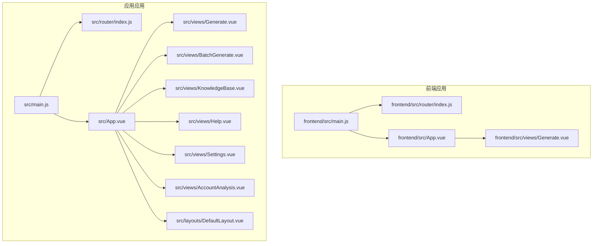
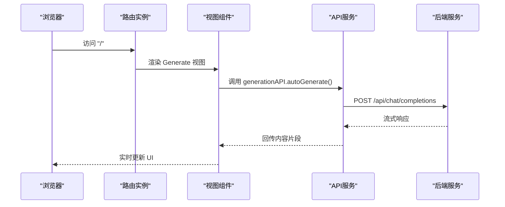
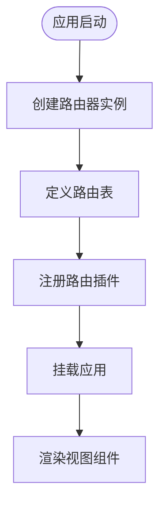
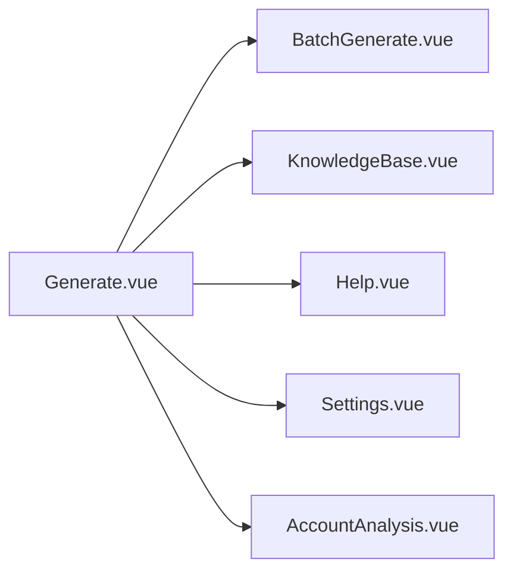
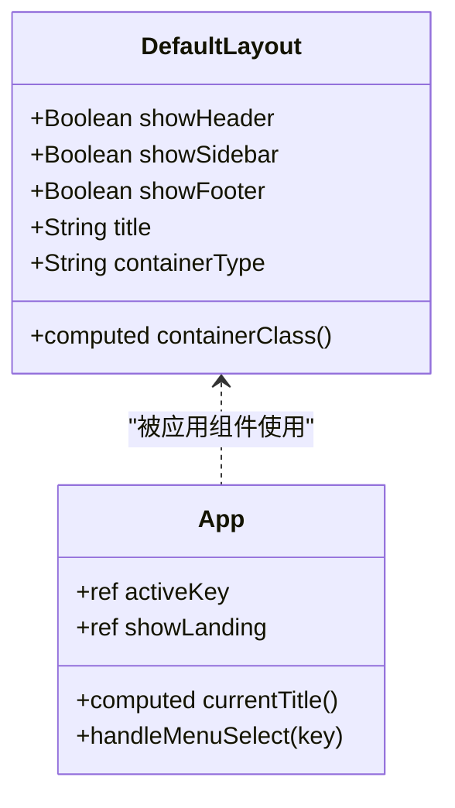
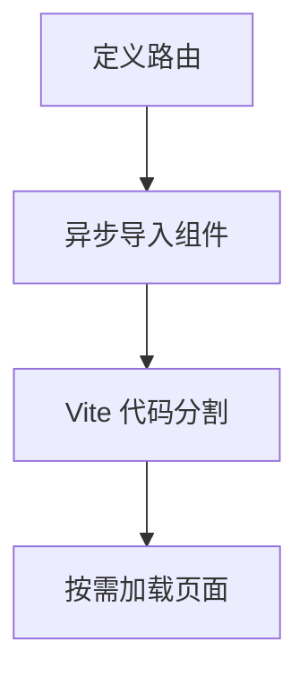
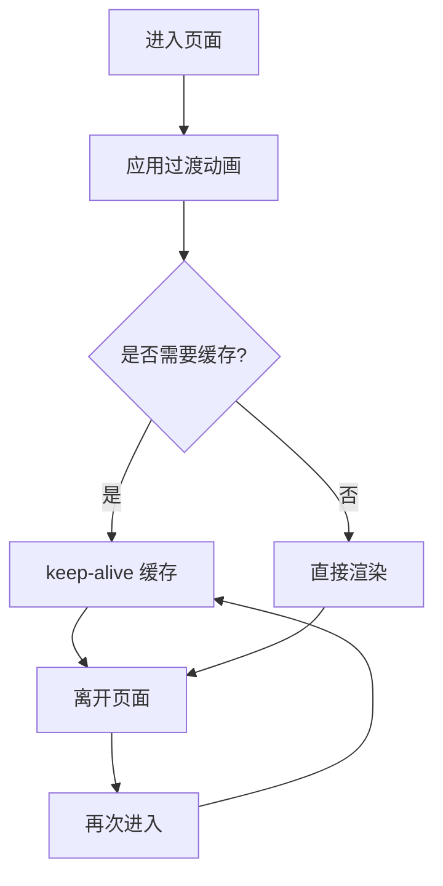
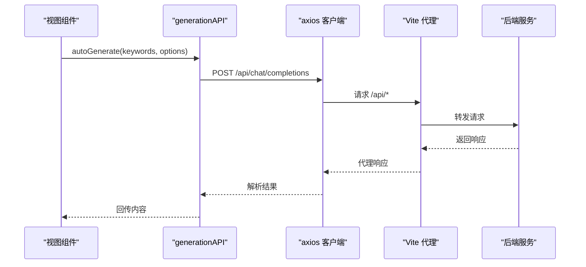
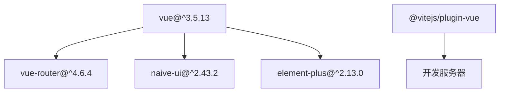

# 路由系统

<cite>
**本文档引用的文件**
- [src/router/index.js](file://src/router/index.js)
- [frontend/src/router/index.js](file://frontend/src/router/index.js)
- [src/main.js](file://src/main.js)
- [frontend/src/main.js](file://frontend/src/main.js)
- [src/App.vue](file://src/App.vue)
- [frontend/src/App.vue](file://frontend/src/App.vue)
- [src/views/Generate.vue](file://src/views/Generate.vue)
- [frontend/src/views/Generate.vue](file://frontend/src/views/Generate.vue)
- [src/views/BatchGenerate.vue](file://src/views/BatchGenerate.vue)
- [src/views/KnowledgeBase.vue](file://src/views/KnowledgeBase.vue)
- [src/views/Help.vue](file://src/views/Help.vue)
- [src/views/Settings.vue](file://src/views/Settings.vue)
- [src/views/AccountAnalysis.vue](file://src/views/AccountAnalysis.vue)
- [src/layouts/DefaultLayout.vue](file://src/layouts/DefaultLayout.vue)
- [src/services/api.js](file://src/services/api.js)
- [src/services/history.js](file://src/services/history.js)
- [package.json](file://package.json)
- [vite.config.js](file://vite.config.js)
</cite>

## 目录
1. [简介](#简介)
2. [项目结构](#项目结构)
3. [核心组件](#核心组件)
4. [架构总览](#架构总览)
5. [详细组件分析](#详细组件分析)
6. [依赖关系分析](#依赖关系分析)
7. [性能考虑](#性能考虑)
8. [故障排除指南](#故障排除指南)
9. [结论](#结论)
10. [附录](#附录)

## 简介
本项目采用 Vue Router 4.x 构建前端路由系统，结合 Vite 开发服务器与 Vue 3 Composition API，实现了简洁高效的单页应用路由架构。当前路由系统以 HashHistory 为基础，配合多视图组件与布局系统，支撑一键生成、批量生成、知识库、账号分析、帮助中心与设置等多个功能模块。

## 项目结构
项目采用前后端分离的双前端目录结构：
- 前端根目录：frontend（Element Plus + Vue 3）
- 应用根目录：src（Naive UI + Vue 3）

两者均包含独立的路由配置与入口文件，分别服务于不同技术栈的前端应用。

**图表来源**
- [frontend/src/main.js](file://frontend/src/main.js#L1-L15)
- [frontend/src/router/index.js](file://frontend/src/router/index.js#L1-L26)
- [frontend/src/App.vue](file://frontend/src/App.vue#L1-L50)
- [src/main.js](file://src/main.js#L1-L16)
- [src/router/index.js](file://src/router/index.js#L1-L26)
- [src/App.vue](file://src/App.vue#L1-L468)

**章节来源**
- [frontend/src/main.js](file://frontend/src/main.js#L1-L15)
- [src/main.js](file://src/main.js#L1-L16)
- [frontend/src/router/index.js](file://frontend/src/router/index.js#L1-L26)
- [src/router/index.js](file://src/router/index.js#L1-L26)

## 核心组件
- 路由器实例：基于 createRouter + createWebHistory 创建，当前为 HashHistory。
- 路由表：包含根路径 '/' 映射到 Generate 视图。
- 应用入口：在 main.js 中注册路由插件并挂载应用。
- 视图组件：涵盖生成、批量生成、知识库、帮助、设置、账号分析等页面。
- 布局组件：DefaultLayout 提供通用布局结构与插槽。

**章节来源**
- [src/router/index.js](file://src/router/index.js#L6-L22)
- [frontend/src/router/index.js](file://frontend/src/router/index.js#L6-L22)
- [src/main.js](file://src/main.js#L6-L12)
- [frontend/src/main.js](file://frontend/src/main.js#L4-L12)
- [src/layouts/DefaultLayout.vue](file://src/layouts/DefaultLayout.vue#L1-L185)

## 架构总览
路由系统采用集中式路由表与组件化视图相结合的方式：
- 路由表定义简单清晰，便于扩展。
- 视图组件通过组合式 API 管理状态与生命周期。
- 应用根组件负责全局布局与动画过渡。
- 服务层通过 axios 与后端 API 通信，支持流式生成与图片生成。

**图表来源**
- [src/router/index.js](file://src/router/index.js#L9-L14)
- [src/views/Generate.vue](file://src/views/Generate.vue#L257-L324)
- [src/services/api.js](file://src/services/api.js#L94-L177)

**章节来源**
- [src/views/Generate.vue](file://src/views/Generate.vue#L177-L324)
- [src/services/api.js](file://src/services/api.js#L94-L177)

## 详细组件分析

### 路由配置与初始化
- 路由器创建：使用 createRouter + createWebHistory，routes 数组包含根路径映射。
- 插件注册：在 main.js 中 app.use(router) 完成路由插件安装。
- 历史模式：当前为 WebHistory，适合生产环境部署；如需 HashHistory，可在 createWebHistory 参数中指定。

**图表来源**
- [src/router/index.js](file://src/router/index.js#L17-L22)
- [src/main.js](file://src/main.js#L10-L12)

**章节来源**
- [src/router/index.js](file://src/router/index.js#L6-L22)
- [frontend/src/router/index.js](file://frontend/src/router/index.js#L6-L22)
- [src/main.js](file://src/main.js#L6-L12)
- [frontend/src/main.js](file://frontend/src/main.js#L4-L12)

### 视图组件与页面切换
- Generate 视图：支持关键词输入、一键生成、质量分析、图片生成与历史记录。
- BatchGenerate 视图：批量生成与并发控制，支持打包下载。
- KnowledgeBase 视图：知识库增删改查与导入模板。
- Help 视图：帮助中心与常见问题。
- Settings 视图：集成配置、发布渠道、外部工具与系统设置。
- AccountAnalysis 视图：账号定位分析与内容规划。

**图表来源**
- [src/views/Generate.vue](file://src/views/Generate.vue#L1-L668)
- [src/views/BatchGenerate.vue](file://src/views/BatchGenerate.vue#L1-L345)
- [src/views/KnowledgeBase.vue](file://src/views/KnowledgeBase.vue#L1-L186)
- [src/views/Help.vue](file://src/views/Help.vue#L1-L42)
- [src/views/Settings.vue](file://src/views/Settings.vue#L1-L260)
- [src/views/AccountAnalysis.vue](file://src/views/AccountAnalysis.vue#L1-L84)

**章节来源**
- [src/views/Generate.vue](file://src/views/Generate.vue#L177-L427)
- [src/views/BatchGenerate.vue](file://src/views/BatchGenerate.vue#L121-L310)
- [src/views/KnowledgeBase.vue](file://src/views/KnowledgeBase.vue#L88-L179)
- [src/views/Help.vue](file://src/views/Help.vue#L28-L34)
- [src/views/Settings.vue](file://src/views/Settings.vue#L238-L250)
- [src/views/AccountAnalysis.vue](file://src/views/AccountAnalysis.vue#L66-L76)

### 布局系统与全局样式
- DefaultLayout：提供头部、侧边栏、主内容区与底部的通用布局结构。
- App.vue：应用根组件，包含全局主题、动画过渡与多视图切换容器。
- 全局动画：fade 与 fade-slide 过渡效果，配合视图切换实现流畅体验。

**图表来源**
- [src/layouts/DefaultLayout.vue](file://src/layouts/DefaultLayout.vue#L54-L89)
- [src/App.vue](file://src/App.vue#L155-L254)

**章节来源**
- [src/layouts/DefaultLayout.vue](file://src/layouts/DefaultLayout.vue#L1-L185)
- [src/App.vue](file://src/App.vue#L8-L107)

### 路由导航守卫
当前路由配置未显式声明导航守卫。若需实现全局前置守卫、路由独享守卫或组件内守卫，可在路由实例中按需添加。例如：
- 全局前置守卫：在路由实例上添加 beforeEach，用于鉴权与页面标题设置。
- 路由独享守卫：在具体路由项上添加 beforeEnter，实现页面级权限控制。
- 组件内守卫：在视图组件中使用 onBeforeRouteLeave/onBeforeRouteUpdate，处理离开确认与参数变化。

[本节为概念性说明，不直接分析具体文件，故不提供章节来源]

### 路由懒加载与代码分割
- 当前路由未启用路由级别的懒加载与异步组件导入。
- 推荐做法：将视图组件改为动态导入，利用 Vite 的代码分割能力，按需加载页面资源，减少首屏体积。

[本图为概念流程图，不对应具体源码，故不提供图表来源]

**章节来源**
- [src/router/index.js](file://src/router/index.js#L9-L14)
- [frontend/src/router/index.js](file://frontend/src/router/index.js#L9-L14)

### 路由元信息
- 页面标题：可通过路由元信息 meta.title 设置页面标题，结合导航守卫在进入路由时更新 document.title。
- 权限控制：通过 meta.requiresAuth 或 meta.roles 等字段，在导航守卫中判断用户权限，决定是否允许访问。

[本节为概念性说明，不直接分析具体文件，故不提供章节来源]

### 路由过渡动画与页面缓存
- 过渡动画：App.vue 中使用 transition 组件包裹视图容器，实现 fade 与 fade-slide 动画。
- 页面缓存：当前未启用 keep-alive 缓存策略。建议在需要保留页面状态的场景下，使用 keep-alive 包裹视图容器，结合 include/exclude 控制缓存范围。

[本图为概念流程图，不对应具体源码，故不提供图表来源]

**章节来源**
- [src/App.vue](file://src/App.vue#L86-L96)
- [src/App.vue](file://src/App.vue#L418-L442)

### API 服务与后端集成
- 服务封装：api.js 中封装 axios 客户端，支持流式响应与图片生成。
- 代理配置：vite.config.js 中配置 /api 代理到后端服务地址，便于开发调试。
- 历史记录：history.js 提供本地历史管理，支持保存、读取、删除与清空。

**图表来源**
- [src/services/api.js](file://src/services/api.js#L256-L282)
- [src/services/api.js](file://src/services/api.js#L94-L177)
- [vite.config.js](file://vite.config.js#L23-L28)

**章节来源**
- [src/services/api.js](file://src/services/api.js#L8-L454)
- [vite.config.js](file://vite.config.js#L1-L37)
- [src/services/history.js](file://src/services/history.js#L1-L89)

## 依赖关系分析
- 路由依赖：vue-router 版本 ^4.6.4。
- UI 依赖：Naive UI 与 Element Plus，分别用于 src 与 frontend 应用。
- 开发依赖：Vite 与 @vitejs/plugin-vue，提供开发服务器与热更新。

**图表来源**
- [package.json](file://package.json#L15-L26)

**章节来源**
- [package.json](file://package.json#L1-L32)

## 性能考虑
- 代码分割：将视图组件改为动态导入，减少首屏加载体积。
- 资源压缩：Vite 默认启用压缩与 Tree Shaking。
- 缓存策略：合理使用 keep-alive 缓存，避免重复渲染。
- 网络优化：后端 API 响应时间较长时，考虑增加超时配置与重试机制。

[本节为一般性指导，不直接分析具体文件，故不提供章节来源]

## 故障排除指南
- 路由无法跳转：检查路由实例是否正确注册，确保 app.use(router) 在 app.mount 之前调用。
- API 请求失败：确认 Vite 代理配置正确，/api 前缀是否匹配后端服务地址。
- 流式响应异常：检查后端流式接口是否正确返回数据，前端解析逻辑是否处理了分隔符与结束标记。

**章节来源**
- [src/main.js](file://src/main.js#L10-L12)
- [frontend/src/main.js](file://frontend/src/main.js#L10-L12)
- [vite.config.js](file://vite.config.js#L23-L28)
- [src/services/api.js](file://src/services/api.js#L120-L177)

## 结论
当前路由系统结构清晰、易于扩展，结合视图组件与服务层，能够满足多页面应用的路由需求。建议后续引入路由懒加载、导航守卫与元信息配置，进一步提升用户体验与安全性。

## 附录
- 路由配置示例路径：[src/router/index.js](file://src/router/index.js#L9-L22)
- 前端路由配置示例路径：[frontend/src/router/index.js](file://frontend/src/router/index.js#L9-L22)
- 应用入口示例路径：[src/main.js](file://src/main.js#L6-L12)
- 前端应用入口示例路径：[frontend/src/main.js](file://frontend/src/main.js#L4-L12)
- 视图组件示例路径：[src/views/Generate.vue](file://src/views/Generate.vue#L177-L324)
- API 服务示例路径：[src/services/api.js](file://src/services/api.js#L256-L363)
- 历史记录服务示例路径：[src/services/history.js](file://src/services/history.js#L9-L88)