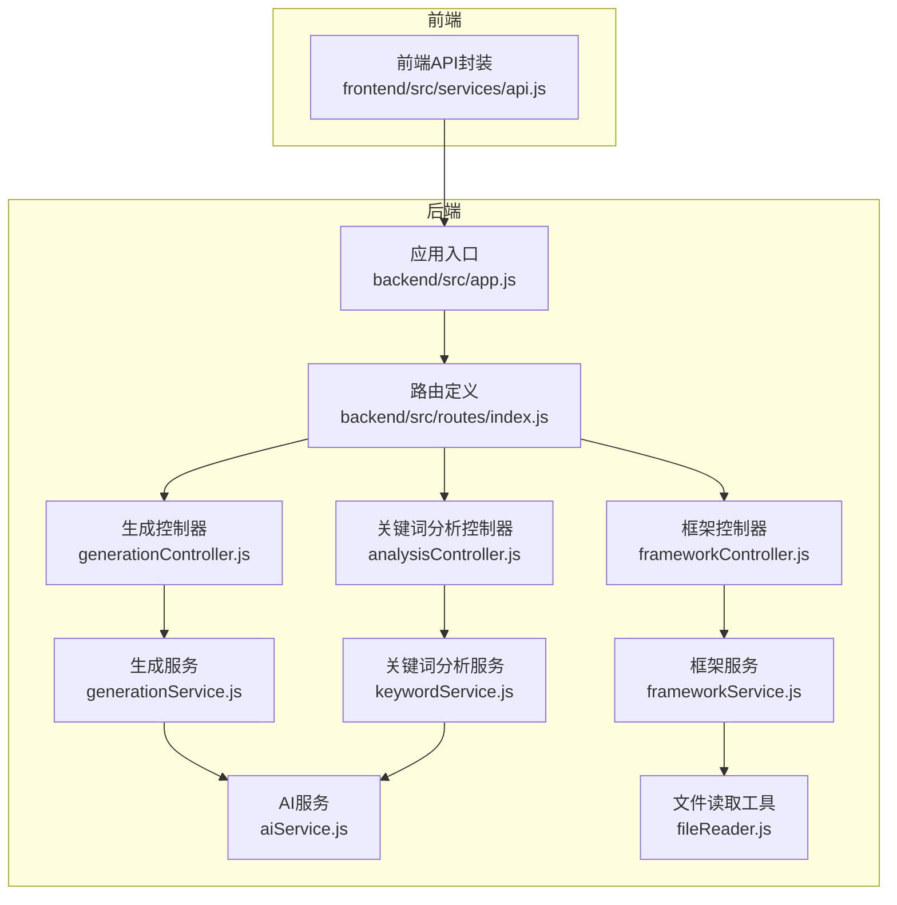
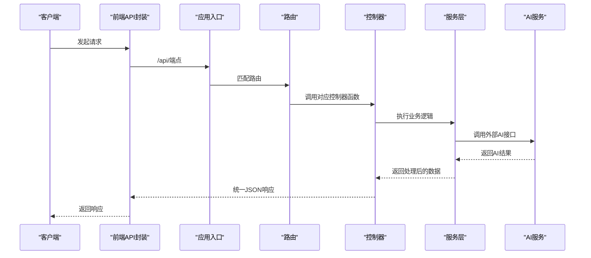
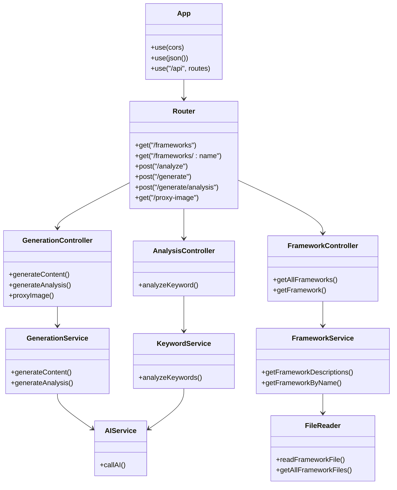

# API设计

<cite>
**本文引用的文件**
- [backend/src/app.js](file://backend/src/app.js)
- [backend/src/routes/index.js](file://backend/src/routes/index.js)
- [backend/src/controllers/generationController.js](file://backend/src/controllers/generationController.js)
- [backend/src/controllers/analysisController.js](file://backend/src/controllers/analysisController.js)
- [backend/src/controllers/frameworkController.js](file://backend/src/controllers/frameworkController.js)
- [backend/src/services/generationService.js](file://backend/src/services/generationService.js)
- [backend/src/services/keywordService.js](file://backend/src/services/keywordService.js)
- [backend/src/services/frameworkService.js](file://backend/src/services/frameworkService.js)
- [backend/src/services/aiService.js](file://backend/src/services/aiService.js)
- [backend/src/utils/fileReader.js](file://backend/src/utils/fileReader.js)
- [frontend/src/services/api.js](file://frontend/src/services/api.js)
</cite>

## 目录
1. [简介](#简介)
2. [项目结构](#项目结构)
3. [核心组件](#核心组件)
4. [架构总览](#架构总览)
5. [详细组件分析](#详细组件分析)
6. [依赖关系分析](#依赖关系分析)
7. [性能考量](#性能考量)
8. [故障排查指南](#故障排查指南)
9. [结论](#结论)
10. [附录](#附录)

## 简介
本API设计文档面向“小红书文案图文生成工具”后端RESTful接口，围绕统一的/api前缀组织端点，涵盖内容生成、质量分析与框架管理三大能力域。文档从设计原则、路由组织、HTTP方法语义、请求响应格式、错误处理策略、端点清单与使用示例等方面进行系统化阐述，帮助开发者与集成方高效理解与使用API。

## 项目结构
后端采用Express框架，通过中间件启用CORS与JSON解析，将所有路由挂载在/api前缀下；控制器负责请求参数校验与响应封装，服务层封装业务逻辑与AI调用，工具层提供框架文件读取能力。

图表来源
- [backend/src/app.js](file://backend/src/app.js#L1-L26)
- [backend/src/routes/index.js](file://backend/src/routes/index.js#L1-L21)
- [backend/src/controllers/generationController.js](file://backend/src/controllers/generationController.js#L1-L100)
- [backend/src/controllers/analysisController.js](file://backend/src/controllers/analysisController.js#L1-L37)
- [backend/src/controllers/frameworkController.js](file://backend/src/controllers/frameworkController.js#L1-L49)
- [backend/src/services/generationService.js](file://backend/src/services/generationService.js#L1-L194)
- [backend/src/services/keywordService.js](file://backend/src/services/keywordService.js#L1-L85)
- [backend/src/services/frameworkService.js](file://backend/src/services/frameworkService.js#L1-L64)
- [backend/src/services/aiService.js](file://backend/src/services/aiService.js#L1-L55)
- [backend/src/utils/fileReader.js](file://backend/src/utils/fileReader.js#L1-L49)
- [frontend/src/services/api.js](file://frontend/src/services/api.js#L1-L40)

章节来源
- [backend/src/app.js](file://backend/src/app.js#L1-L26)
- [backend/src/routes/index.js](file://backend/src/routes/index.js#L1-L21)

## 核心组件
- 应用入口与中间件：启用CORS、JSON解析、挂载/api路由。
- 路由组织：统一在/api前缀下暴露端点。
- 控制器：负责参数校验、调用服务层、统一响应格式与错误处理。
- 服务层：
  - 生成服务：封装提示词与AI调用，产出内容与质量分析。
  - 关键词分析服务：基于AI分析关键词意图与推荐框架。
  - 框架服务：读取本地框架文件并提取描述信息。
- 工具层：文件读取工具，用于加载框架Markdown文件。
- 前端API封装：以/baseURL=/api的方式调用后端接口。

章节来源
- [backend/src/app.js](file://backend/src/app.js#L1-L26)
- [backend/src/routes/index.js](file://backend/src/routes/index.js#L1-L21)
- [backend/src/controllers/generationController.js](file://backend/src/controllers/generationController.js#L1-L100)
- [backend/src/controllers/analysisController.js](file://backend/src/controllers/analysisController.js#L1-L37)
- [backend/src/controllers/frameworkController.js](file://backend/src/controllers/frameworkController.js#L1-L49)
- [backend/src/services/generationService.js](file://backend/src/services/generationService.js#L1-L194)
- [backend/src/services/keywordService.js](file://backend/src/services/keywordService.js#L1-L85)
- [backend/src/services/frameworkService.js](file://backend/src/services/frameworkService.js#L1-L64)
- [backend/src/utils/fileReader.js](file://backend/src/utils/fileReader.js#L1-L49)
- [frontend/src/services/api.js](file://frontend/src/services/api.js#L1-L40)

## 架构总览
API遵循RESTful设计原则，使用HTTP方法表达语义，统一以JSON作为请求与响应载体。控制器层负责参数校验与错误处理，服务层封装业务与外部AI调用，确保职责分离与可测试性。

图表来源
- [backend/src/app.js](file://backend/src/app.js#L1-L26)
- [backend/src/routes/index.js](file://backend/src/routes/index.js#L1-L21)
- [backend/src/controllers/generationController.js](file://backend/src/controllers/generationController.js#L1-L100)
- [backend/src/controllers/analysisController.js](file://backend/src/controllers/analysisController.js#L1-L37)
- [backend/src/controllers/frameworkController.js](file://backend/src/controllers/frameworkController.js#L1-L49)
- [backend/src/services/generationService.js](file://backend/src/services/generationService.js#L1-L194)
- [backend/src/services/keywordService.js](file://backend/src/services/keywordService.js#L1-L85)
- [backend/src/services/aiService.js](file://backend/src/services/aiService.js#L1-L55)

## 详细组件分析

### 路由组织与URL模式
- 前缀：/api
- 端点：
  - GET /api/frameworks：获取所有框架描述
  - GET /api/frameworks/:name：按名称获取指定框架
  - POST /api/analyze：关键词分析
  - POST /api/generate：内容生成
  - POST /api/generate/analysis：内容质量分析
  - GET /api/proxy-image：图片下载代理（解决跨域）

章节来源
- [backend/src/routes/index.js](file://backend/src/routes/index.js#L1-L21)
- [backend/src/app.js](file://backend/src/app.js#L1-L26)

### HTTP方法使用规范
- GET：幂等读取资源，如获取框架列表与单个框架详情。
- POST：非幂等写入或触发计算，如关键词分析、内容生成、质量分析。
- GET + 查询参数：代理图片下载时使用查询参数传递URL。

章节来源
- [backend/src/routes/index.js](file://backend/src/routes/index.js#L1-L21)
- [backend/src/controllers/generationController.js](file://backend/src/controllers/generationController.js#L66-L94)

### 请求与响应格式约定
- Content-Type：application/json
- 成功响应通用结构：
  - { success: true, data: any }
- 错误响应通用结构：
  - { success: false, error: string }
- 状态码：
  - 200 OK：成功
  - 400 Bad Request：缺少必要参数
  - 404 Not Found：资源不存在
  - 500 Internal Server Error：服务异常

章节来源
- [backend/src/controllers/generationController.js](file://backend/src/controllers/generationController.js#L10-L33)
- [backend/src/controllers/generationController.js](file://backend/src/controllers/generationController.js#L35-L64)
- [backend/src/controllers/generationController.js](file://backend/src/controllers/generationController.js#L69-L94)
- [backend/src/controllers/analysisController.js](file://backend/src/controllers/analysisController.js#L6-L30)
- [backend/src/controllers/frameworkController.js](file://backend/src/controllers/frameworkController.js#L8-L21)
- [backend/src/controllers/frameworkController.js](file://backend/src/controllers/frameworkController.js#L23-L45)

### 参数验证策略
- 关键词分析：keywords必填
- 内容生成：keywords与frameworkId必填
- 质量分析：content与frameworkId必填
- 框架详情：name参数必填
- 图片代理：url查询参数必填

章节来源
- [backend/src/controllers/analysisController.js](file://backend/src/controllers/analysisController.js#L8-L15)
- [backend/src/controllers/generationController.js](file://backend/src/controllers/generationController.js#L12-L19)
- [backend/src/controllers/generationController.js](file://backend/src/controllers/generationController.js#L37-L44)
- [backend/src/controllers/frameworkController.js](file://backend/src/controllers/frameworkController.js#L25-L33)
- [backend/src/controllers/generationController.js](file://backend/src/controllers/generationController.js#L70-L74)

### 数据模型与结构
- 框架描述对象（GET /api/frameworks）
  - id: 框架文件名
  - name: 去除“框架”的名称
  - title: Markdown首级标题
  - description: 摘要（前若干行）
  - fullContent: 完整内容
- 内容生成结果（POST /api/generate）
  - title: 标题
  - body: 正文
  - images: 图片数组（type、description、style）
  - tags: 标签数组
- 质量分析结果（POST /api/generate/analysis）
  - hook: 钩子类型、有效性、原因
  - framework: 名称、优势、有效原因
  - structure: 是否有清晰流程、是否有互动
  - appeal: 情感、实用、行动评分与综合评价
- 关键词分析结果（POST /api/analyze）
  - intent: 关键词意图
  - topic: 主题
  - targetAudience: 目标受众
  - recommendedFrameworks: 推荐框架列表（含匹配度）

章节来源
- [backend/src/services/frameworkService.js](file://backend/src/services/frameworkService.js#L10-L26)
- [backend/src/services/generationService.js](file://backend/src/services/generationService.js#L24-L33)
- [backend/src/services/generationService.js](file://backend/src/services/generationService.js#L37-L60)
- [backend/src/services/keywordService.js](file://backend/src/services/keywordService.js#L23-L36)

### 错误处理策略
- 参数缺失：返回400，success=false，error为具体提示
- 资源不存在：返回404，success=false
- 服务异常：返回500，success=false
- AI调用失败：记录日志并抛出错误，统一包装为错误响应
- 代理图片失败：记录错误并返回500

章节来源
- [backend/src/controllers/analysisController.js](file://backend/src/controllers/analysisController.js#L10-L15)
- [backend/src/controllers/analysisController.js](file://backend/src/controllers/analysisController.js#L23-L29)
- [backend/src/controllers/generationController.js](file://backend/src/controllers/generationController.js#L14-L19)
- [backend/src/controllers/generationController.js](file://backend/src/controllers/generationController.js#L27-L32)
- [backend/src/controllers/generationController.js](file://backend/src/controllers/generationController.js#L39-L44)
- [backend/src/controllers/generationController.js](file://backend/src/controllers/generationController.js#L58-L63)
- [backend/src/controllers/generationController.js](file://backend/src/controllers/generationController.js#L72-L74)
- [backend/src/controllers/generationController.js](file://backend/src/controllers/generationController.js#L90-L93)
- [backend/src/controllers/frameworkController.js](file://backend/src/controllers/frameworkController.js#L28-L33)
- [backend/src/controllers/frameworkController.js](file://backend/src/controllers/frameworkController.js#L39-L44)

### API端点文档

#### 框架管理接口
- 获取所有框架
  - 方法：GET
  - 路径：/api/frameworks
  - 成功响应：data为框架描述数组
- 获取指定框架
  - 方法：GET
  - 路径：/api/frameworks/:name
  - 参数：name（路径参数）
  - 成功响应：data为单个框架对象
  - 未找到：返回404

章节来源
- [backend/src/routes/index.js](file://backend/src/routes/index.js#L11-L12)
- [backend/src/controllers/frameworkController.js](file://backend/src/controllers/frameworkController.js#L8-L21)
- [backend/src/controllers/frameworkController.js](file://backend/src/controllers/frameworkController.js#L23-L45)

#### 关键词分析接口
- 分析关键词
  - 方法：POST
  - 路径：/api/analyze
  - 请求体：{ keywords: string }
  - 成功响应：data为关键词分析结果
  - 参数缺失：返回400

章节来源
- [backend/src/routes/index.js](file://backend/src/routes/index.js#L13)
- [backend/src/controllers/analysisController.js](file://backend/src/controllers/analysisController.js#L6-L30)
- [backend/src/services/keywordService.js](file://backend/src/services/keywordService.js#L39-L67)

#### 内容生成接口
- 生成内容
  - 方法：POST
  - 路径：/api/generate
  - 请求体：{ keywords: string | string[], frameworkId: string }
  - 成功响应：data为生成内容对象
  - 参数缺失：返回400
- 质量分析
  - 方法：POST
  - 路径：/api/generate/analysis
  - 请求体：{ content: object, frameworkId: string }
  - 成功响应：data为质量分析结果
  - 参数缺失：返回400

章节来源
- [backend/src/routes/index.js](file://backend/src/routes/index.js#L14-L15)
- [backend/src/controllers/generationController.js](file://backend/src/controllers/generationController.js#L10-L33)
- [backend/src/controllers/generationController.js](file://backend/src/controllers/generationController.js#L35-L64)
- [backend/src/services/generationService.js](file://backend/src/services/generationService.js#L64-L94)
- [backend/src/services/generationService.js](file://backend/src/services/generationService.js#L114-L162)

#### 图片下载代理
- 代理下载
  - 方法：GET
  - 路径：/api/proxy-image
  - 查询参数：url（必填）
  - 成功响应：透传图片流，设置Content-Type与跨域头
  - 参数缺失：返回400
  - 失败：返回500

章节来源
- [backend/src/routes/index.js](file://backend/src/routes/index.js#L16)
- [backend/src/controllers/generationController.js](file://backend/src/controllers/generationController.js#L69-L94)

### 前端调用示例
- 框架管理
  - 获取全部：frameworkAPI.getAll()
  - 按名称获取：frameworkAPI.getByName(name)
- 关键词分析
  - analyze(keywords)
- 内容生成
  - generate(keywords, frameworkId)
  - generateAnalysis(content, frameworkId)

章节来源
- [frontend/src/services/api.js](file://frontend/src/services/api.js#L13-L35)

### 最佳实践
- 参数校验：在调用前确保必填字段已提供
- 错误处理：捕获400/404/500并友好提示
- 超时控制：合理设置请求超时时间
- 缓存策略：对框架描述等静态数据可做缓存
- 跨域处理：代理图片避免前端跨域限制

章节来源
- [backend/src/app.js](file://backend/src/app.js#L14-L16)
- [backend/src/controllers/generationController.js](file://backend/src/controllers/generationController.js#L76-L89)

## 依赖关系分析

图表来源
- [backend/src/app.js](file://backend/src/app.js#L1-L26)
- [backend/src/routes/index.js](file://backend/src/routes/index.js#L1-L21)
- [backend/src/controllers/generationController.js](file://backend/src/controllers/generationController.js#L1-L100)
- [backend/src/controllers/analysisController.js](file://backend/src/controllers/analysisController.js#L1-L37)
- [backend/src/controllers/frameworkController.js](file://backend/src/controllers/frameworkController.js#L1-L49)
- [backend/src/services/generationService.js](file://backend/src/services/generationService.js#L1-L194)
- [backend/src/services/keywordService.js](file://backend/src/services/keywordService.js#L1-L85)
- [backend/src/services/frameworkService.js](file://backend/src/services/frameworkService.js#L1-L64)
- [backend/src/utils/fileReader.js](file://backend/src/utils/fileReader.js#L1-L49)
- [backend/src/services/aiService.js](file://backend/src/services/aiService.js#L1-L55)

## 性能考量
- AI调用超时：建议设置合理超时时间，避免阻塞请求线程
- 流式响应：当前AI调用为非流式，若后续改为流式，需考虑前端兼容与内存占用
- 缓存策略：框架描述等静态内容可缓存，减少文件读取开销
- 并发控制：对AI服务调用进行限流，防止突发流量导致服务不可用
- 响应压缩：可启用gzip压缩以减小响应体积

[本节为通用性能建议，无需特定文件引用]

## 故障排查指南
- 400错误：检查请求体是否包含必需字段（keywords、frameworkId、content、url等）
- 404错误：确认框架名称是否存在
- 500错误：查看服务端日志，关注AI调用失败与文件读取异常
- CORS问题：确认后端CORS配置与前端baseURL一致
- 图片代理失败：检查url参数与网络连通性

章节来源
- [backend/src/app.js](file://backend/src/app.js#L14-L16)
- [backend/src/controllers/analysisController.js](file://backend/src/controllers/analysisController.js#L10-L15)
- [backend/src/controllers/generationController.js](file://backend/src/controllers/generationController.js#L72-L74)
- [backend/src/controllers/generationController.js](file://backend/src/controllers/generationController.js#L90-L93)
- [backend/src/controllers/frameworkController.js](file://backend/src/controllers/frameworkController.js#L28-L33)

## 结论
本API以统一的/api前缀组织，遵循REST语义与JSON契约，结合参数校验与统一错误响应，形成清晰、稳定且易于扩展的接口体系。通过服务层与控制器层的职责分离，配合AI服务与文件读取工具，满足内容生成、质量分析与框架管理的核心需求。建议在生产环境中进一步完善限流、缓存与监控机制，持续提升稳定性与性能。

[本节为总结性内容，无需特定文件引用]

## 附录

### 端点一览与参数说明
- GET /api/frameworks
  - 用途：获取所有框架描述
  - 成功响应：data为数组
- GET /api/frameworks/:name
  - 用途：按名称获取框架详情
  - 路径参数：name
  - 成功响应：data为对象
- POST /api/analyze
  - 用途：分析关键词并推荐框架
  - 请求体：{ keywords: string }
  - 成功响应：data为分析结果
- POST /api/generate
  - 用途：根据关键词与框架生成内容
  - 请求体：{ keywords: string | string[], frameworkId: string }
  - 成功响应：data为内容对象
- POST /api/generate/analysis
  - 用途：对已生成内容进行质量分析
  - 请求体：{ content: object, frameworkId: string }
  - 成功响应：data为分析结果
- GET /api/proxy-image?url=...
  - 用途：代理下载图片，解决跨域
  - 查询参数：url
  - 成功响应：图片流

章节来源
- [backend/src/routes/index.js](file://backend/src/routes/index.js#L11-L16)
- [backend/src/controllers/analysisController.js](file://backend/src/controllers/analysisController.js#L6-L30)
- [backend/src/controllers/generationController.js](file://backend/src/controllers/generationController.js#L10-L64)
- [backend/src/controllers/frameworkController.js](file://backend/src/controllers/frameworkController.js#L8-L45)