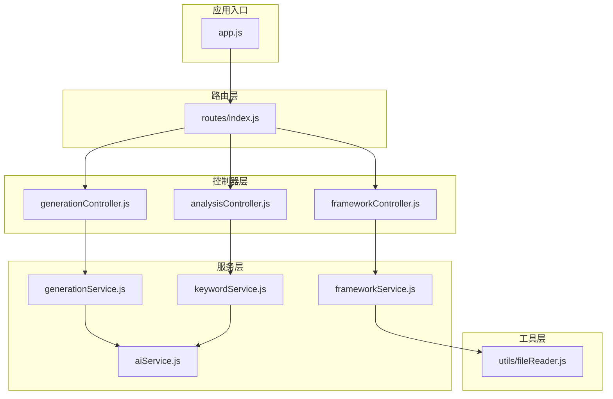
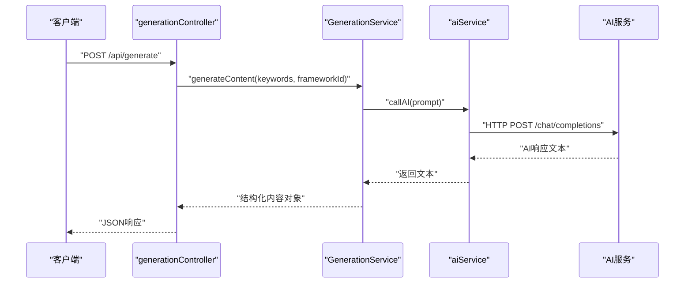
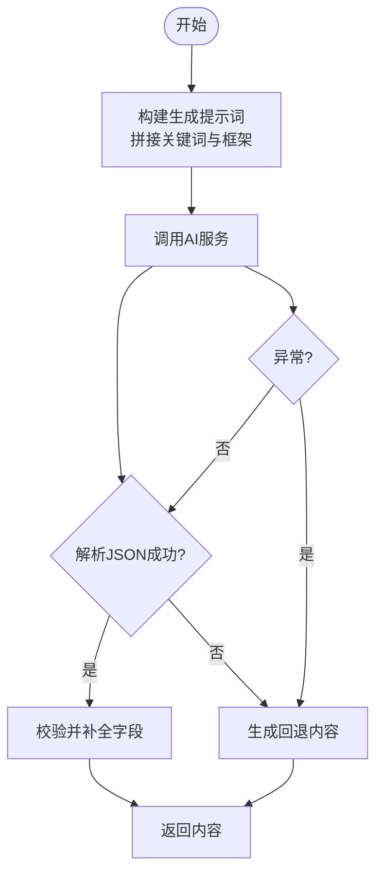
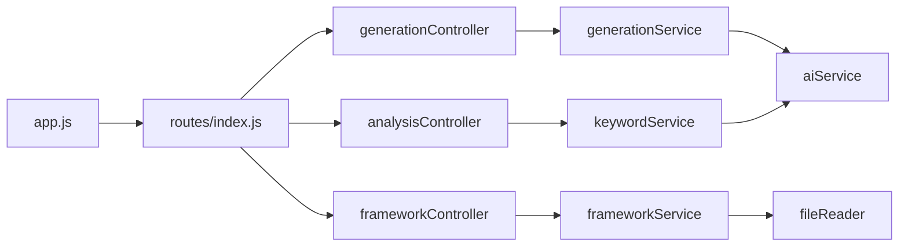

# 业务逻辑层

<cite>
**本文引用的文件列表**
- [backend/src/services/generationService.js](file://backend/src/services/generationService.js)
- [backend/src/services/aiService.js](file://backend/src/services/aiService.js)
- [backend/src/services/frameworkService.js](file://backend/src/services/frameworkService.js)
- [backend/src/services/keywordService.js](file://backend/src/services/keywordService.js)
- [backend/src/controllers/generationController.js](file://backend/src/controllers/generationController.js)
- [backend/src/controllers/analysisController.js](file://backend/src/controllers/analysisController.js)
- [backend/src/controllers/frameworkController.js](file://backend/src/controllers/frameworkController.js)
- [backend/src/utils/fileReader.js](file://backend/src/utils/fileReader.js)
- [backend/src/routes/index.js](file://backend/src/routes/index.js)
- [backend/src/app.js](file://backend/src/app.js)
- [backend/src/config/ai.config.js](file://backend/src/config/ai.config.js)
- [小红书爆款框架.md](file://小红书爆款框架.md)
</cite>

## 目录
1. [引言](#引言)
2. [项目结构](#项目结构)
3. [核心组件](#核心组件)
4. [架构总览](#架构总览)
5. [详细组件分析](#详细组件分析)
6. [依赖关系分析](#依赖关系分析)
7. [性能考量](#性能考量)
8. [故障排查指南](#故障排查指南)
9. [结论](#结论)
10. [附录](#附录)

## 引言
本文件聚焦于后端业务逻辑层，系统性阐述服务层的设计与实现，包括 generationService、aiService、frameworkService、keywordService 的职责划分与协作关系；解释内容生成算法、AI 服务调用、框架应用逻辑与质量分析流程；梳理数据验证机制与异常处理策略；给出服务层接口规范与典型业务流程示例，帮助开发者与产品人员快速理解并扩展系统能力。

## 项目结构
后端采用典型的 Express + MVC 分层架构：
- 控制器层负责请求解析、参数校验与响应封装
- 服务层承载核心业务逻辑，包括内容生成、AI 调用、框架匹配与关键词分析
- 工具层提供文件读取等基础能力
- 路由层统一暴露 REST 接口
- 应用入口负责中间件与端口监听

图表来源
- [backend/src/app.js](file://backend/src/app.js#L1-L26)
- [backend/src/routes/index.js](file://backend/src/routes/index.js#L1-L21)
- [backend/src/controllers/generationController.js](file://backend/src/controllers/generationController.js#L1-L100)
- [backend/src/controllers/frameworkController.js](file://backend/src/controllers/frameworkController.js#L1-L49)
- [backend/src/controllers/analysisController.js](file://backend/src/controllers/analysisController.js#L1-L37)
- [backend/src/services/generationService.js](file://backend/src/services/generationService.js#L1-L194)
- [backend/src/services/aiService.js](file://backend/src/services/aiService.js#L1-L55)
- [backend/src/services/frameworkService.js](file://backend/src/services/frameworkService.js#L1-L64)
- [backend/src/services/keywordService.js](file://backend/src/services/keywordService.js#L1-L85)
- [backend/src/utils/fileReader.js](file://backend/src/utils/fileReader.js#L1-L49)

章节来源
- [backend/src/app.js](file://backend/src/app.js#L1-L26)
- [backend/src/routes/index.js](file://backend/src/routes/index.js#L1-L21)

## 核心组件
- generationService：负责内容生成与质量分析，内置提示词模板与回退策略，确保输出结构化数据
- aiService：封装外部 AI 服务调用，统一错误处理与超时控制
- frameworkService：从本地框架文档加载并解析框架元信息，支持关键字匹配与排序
- keywordService：对关键词进行意图与框架推荐分析，辅助选择合适的内容框架
- generationController / frameworkController / analysisController：参数校验、调用服务层并返回标准化响应

章节来源
- [backend/src/services/generationService.js](file://backend/src/services/generationService.js#L1-L194)
- [backend/src/services/aiService.js](file://backend/src/services/aiService.js#L1-L55)
- [backend/src/services/frameworkService.js](file://backend/src/services/frameworkService.js#L1-L64)
- [backend/src/services/keywordService.js](file://backend/src/services/keywordService.js#L1-L85)
- [backend/src/controllers/generationController.js](file://backend/src/controllers/generationController.js#L1-L100)
- [backend/src/controllers/frameworkController.js](file://backend/src/controllers/frameworkController.js#L1-L49)
- [backend/src/controllers/analysisController.js](file://backend/src/controllers/analysisController.js#L1-L37)

## 架构总览
服务层围绕“内容生成—AI调用—框架应用—质量分析”闭环展开，控制器层仅承担薄薄的编排职责，保证业务规则集中在服务层，便于测试与演进。

图表来源
- [backend/src/controllers/generationController.js](file://backend/src/controllers/generationController.js#L10-L33)
- [backend/src/services/generationService.js](file://backend/src/services/generationService.js#L63-L94)
- [backend/src/services/aiService.js](file://backend/src/services/aiService.js#L14-L53)

## 详细组件分析

### generationService 组件
职责与边界
- 内容生成：根据关键词与框架 ID 生成标题、正文、图片与标签
- 质量分析：对已生成内容进行钩子、框架、结构与吸引力评分
- 回退策略：当 AI 返回非 JSON 或异常时，生成合理默认内容/分析

关键实现要点
- 提示词模板集中管理，确保输出结构化 JSON
- 输出字段完整性校验与默认填充，避免空字段
- 异常捕获与回退，保证服务可用性

图表来源
- [backend/src/services/generationService.js](file://backend/src/services/generationService.js#L63-L112)
- [backend/src/services/generationService.js](file://backend/src/services/generationService.js#L114-L162)

章节来源
- [backend/src/services/generationService.js](file://backend/src/services/generationService.js#L1-L194)

### aiService 组件
职责与边界
- 统一封装外部 AI 服务调用，屏蔽网络细节
- 超时控制与错误日志记录
- 标准化响应提取与异常抛出

关键实现要点
- 使用 axios 发送 POST 请求至指定端点
- 严格校验响应内容，缺失时抛出明确错误
- 记录状态码与响应体，便于诊断

章节来源
- [backend/src/services/aiService.js](file://backend/src/services/aiService.js#L1-L55)
- [backend/src/config/ai.config.js](file://backend/src/config/ai.config.js#L1-L18)

### frameworkService 组件
职责与边界
- 加载本地框架文档，提取标题、简介与全文
- 根据关键词匹配框架并计算匹配分数
- 提供按名称查询与全量列表查询

关键实现要点
- 文件读取具备回退策略，兼容不同部署路径
- 匹配采用关键词集合交集计数，支持排序
- 描述截取限定长度，保证简洁性

章节来源
- [backend/src/services/frameworkService.js](file://backend/src/services/frameworkService.js#L1-L64)
- [backend/src/utils/fileReader.js](file://backend/src/utils/fileReader.js#L1-L49)

### keywordService 组件
职责与边界
- 对用户输入的关键词进行意图分析与主题识别
- 推荐最合适的写作框架及其匹配度

关键实现要点
- 提示词模板包含多种框架说明
- 解析失败时提供默认推荐
- 异常时回退到通用推荐

章节来源
- [backend/src/services/keywordService.js](file://backend/src/services/keywordService.js#L1-L85)

### 控制器层组件
职责与边界
- generationController：内容生成与质量分析接口，参数校验与响应封装
- frameworkController：框架列表与详情接口，参数校验与响应封装
- analysisController：关键词分析接口，参数校验与响应封装

关键实现要点
- 统一 400/500 错误处理与 JSON 响应结构
- 生成分析接口中构造框架对象用于后续分析

章节来源
- [backend/src/controllers/generationController.js](file://backend/src/controllers/generationController.js#L1-L100)
- [backend/src/controllers/frameworkController.js](file://backend/src/controllers/frameworkController.js#L1-L49)
- [backend/src/controllers/analysisController.js](file://backend/src/controllers/analysisController.js#L1-L37)

## 依赖关系分析
- generationController 依赖 generationService
- generationService 依赖 aiService
- keywordService 依赖 aiService
- frameworkController 依赖 frameworkService
- frameworkService 依赖 utils/fileReader
- app.js 注册路由，暴露 /api 下各端点

图表来源
- [backend/src/app.js](file://backend/src/app.js#L1-L26)
- [backend/src/routes/index.js](file://backend/src/routes/index.js#L1-L21)
- [backend/src/controllers/generationController.js](file://backend/src/controllers/generationController.js#L1-L100)
- [backend/src/controllers/frameworkController.js](file://backend/src/controllers/frameworkController.js#L1-L49)
- [backend/src/controllers/analysisController.js](file://backend/src/controllers/analysisController.js#L1-L37)
- [backend/src/services/generationService.js](file://backend/src/services/generationService.js#L1-L194)
- [backend/src/services/aiService.js](file://backend/src/services/aiService.js#L1-L55)
- [backend/src/services/frameworkService.js](file://backend/src/services/frameworkService.js#L1-L64)
- [backend/src/services/keywordService.js](file://backend/src/services/keywordService.js#L1-L85)
- [backend/src/utils/fileReader.js](file://backend/src/utils/fileReader.js#L1-L49)

## 性能考量
- AI 调用超时设置：建议在生产环境根据 SLA 调整超时阈值，避免阻塞请求线程
- 输出缓存：对于高频关键词与框架组合，可在服务层引入轻量缓存减少重复调用
- JSON 解析与回退：回退逻辑成本较低，但需监控回退频率，及时修复上游提示词或模型稳定性
- 图片代理：代理下载时注意流式传输与超时控制，避免占用过多内存

## 故障排查指南
常见问题与处理
- AI 服务不可用或响应为空：检查鉴权头、端点与超时设置；查看日志中的状态码与响应体
- 关键词分析返回非 JSON：确认提示词模板与模型输出格式一致性；必要时调整提示词约束
- 框架文档读取失败：确认框架文件名与路径；检查回退逻辑是否生效
- 控制器参数缺失：400 错误，检查前端请求体字段与 Content-Type

章节来源
- [backend/src/services/aiService.js](file://backend/src/services/aiService.js#L45-L52)
- [backend/src/controllers/generationController.js](file://backend/src/controllers/generationController.js#L14-L19)
- [backend/src/controllers/analysisController.js](file://backend/src/controllers/analysisController.js#L10-L15)
- [backend/src/utils/fileReader.js](file://backend/src/utils/fileReader.js#L16-L26)

## 结论
业务逻辑层通过清晰的职责分离与稳健的回退策略，实现了从关键词到内容再到质量分析的完整闭环。服务层集中承载业务规则，控制器层保持薄编排，有利于扩展与维护。建议在生产环境中进一步完善缓存、可观测性与弹性策略，持续提升稳定性与性能。

## 附录

### 服务层接口文档

- 生成内容
  - 方法：POST
  - 路径：/api/generate
  - 请求体
    - keywords: 字符串或数组，必填
    - frameworkId: 字符串，必填
  - 响应
    - success: 布尔值
    - data: 内容对象（包含 title、body、images、tags）
  - 失败
    - 400：缺少必填字段
    - 500：内部错误

- 生成分析
  - 方法：POST
  - 路径：/api/generate/analysis
  - 请求体
    - content: 对象，必填（包含 title、body）
    - frameworkId: 字符串，必填
  - 响应
    - success: 布尔值
    - data: 分析对象（包含 hook、framework、structure、appeal）
  - 失败
    - 400：缺少必填字段
    - 500：内部错误

- 关键词分析
  - 方法：POST
  - 路径：/api/analyze
  - 请求体
    - keywords: 字符串，必填
  - 响应
    - success: 布尔值
    - data: 分析对象（包含 intent、topic、targetAudience、recommendedFrameworks）
  - 失败
    - 400：缺少必填字段
    - 500：内部错误

- 获取框架列表
  - 方法：GET
  - 路径：/api/frameworks
  - 响应
    - success: 布尔值
    - data: 框架数组（包含 id、name、title、description、fullContent）

- 获取框架详情
  - 方法：GET
  - 路径：/api/frameworks/:name
  - 参数
    - name: 字符串，必填
  - 响应
    - success: 布尔值
    - data: 框架对象
  - 失败
    - 404：未找到框架
    - 500：内部错误

- 图片代理下载
  - 方法：GET
  - 路径：/api/proxy-image
  - 查询参数
    - url: 字符串，必填
  - 响应
    - 流式图片数据（带跨域头）
  - 失败
    - 400：缺少 URL
    - 500：代理失败

章节来源
- [backend/src/controllers/generationController.js](file://backend/src/controllers/generationController.js#L10-L94)
- [backend/src/controllers/analysisController.js](file://backend/src/controllers/analysisController.js#L6-L30)
- [backend/src/controllers/frameworkController.js](file://backend/src/controllers/frameworkController.js#L8-L45)
- [backend/src/routes/index.js](file://backend/src/routes/index.js#L11-L16)

### 业务流程示例

- 内容生成流程
  1) 客户端发送关键词与框架 ID
  2) 控制器校验参数并调用生成服务
  3) 生成服务拼装提示词并调用 AI 服务
  4) AI 返回文本，生成服务解析为结构化对象
  5) 若解析失败或异常，生成回退内容
  6) 控制器返回 JSON 响应

- 质量分析流程
  1) 客户端发送内容与框架 ID
  2) 控制器构造框架对象并调用生成服务
  3) 生成服务拼装分析提示词并调用 AI 服务
  4) AI 返回分析 JSON，生成服务补全缺失字段
  5) 若解析失败或异常，生成回退分析
  6) 控制器返回 JSON 响应

章节来源
- [backend/src/controllers/generationController.js](file://backend/src/controllers/generationController.js#L10-L64)
- [backend/src/services/generationService.js](file://backend/src/services/generationService.js#L63-L162)