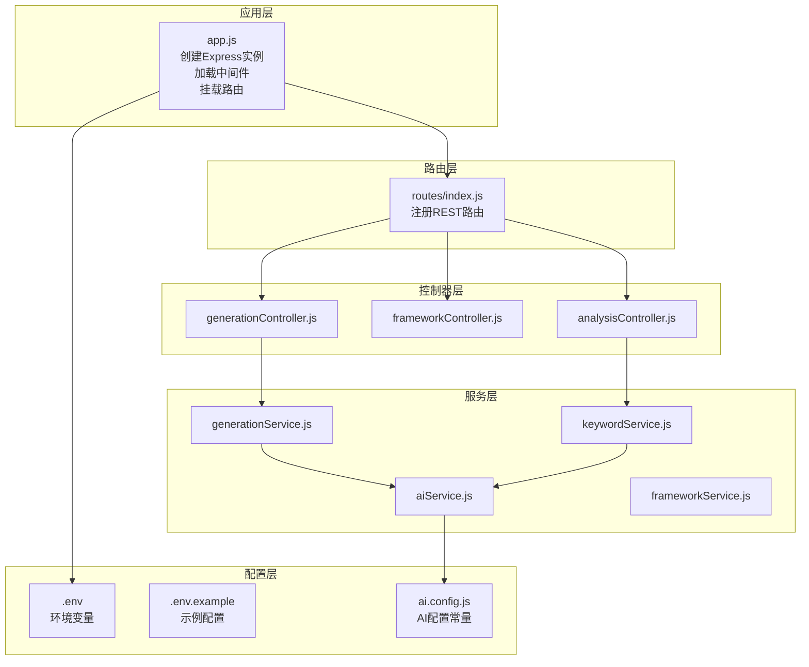
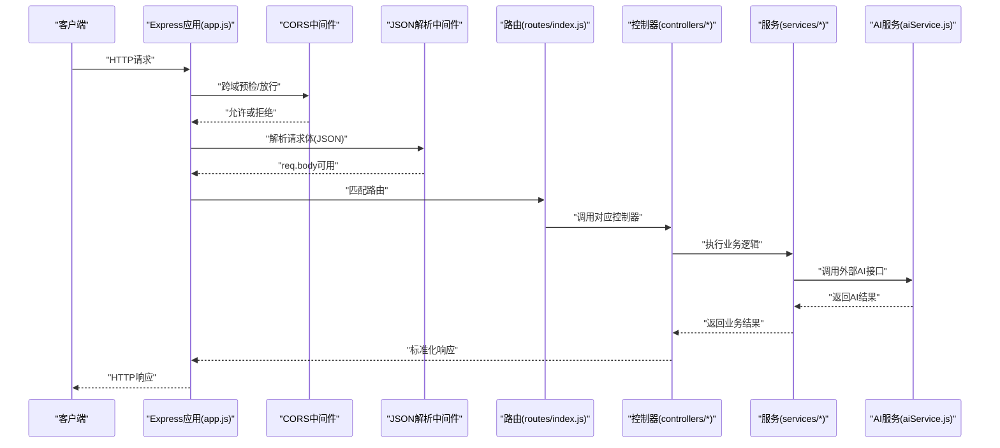
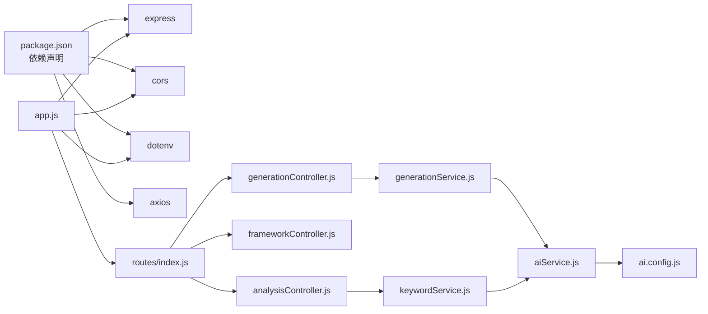

# 中间件系统

<cite>
**本文引用的文件**
- [backend/src/app.js](file://backend/src/app.js)
- [backend/.env](file://backend/.env)
- [backend/.env.example](file://backend/.env.example)
- [backend/package.json](file://backend/package.json)
- [backend/src/routes/index.js](file://backend/src/routes/index.js)
- [backend/src/controllers/generationController.js](file://backend/src/controllers/generationController.js)
- [backend/src/controllers/frameworkController.js](file://backend/src/controllers/frameworkController.js)
- [backend/src/controllers/analysisController.js](file://backend/src/controllers/analysisController.js)
- [backend/src/services/aiService.js](file://backend/src/services/aiService.js)
- [backend/src/services/generationService.js](file://backend/src/services/generationService.js)
- [backend/src/services/frameworkService.js](file://backend/src/services/frameworkService.js)
- [backend/src/services/keywordService.js](file://backend/src/services/keywordService.js)
- [backend/src/config/ai.config.js](file://backend/src/config/ai.config.js)
</cite>

## 目录
1. [简介](#简介)
2. [项目结构](#项目结构)
3. [核心组件](#核心组件)
4. [架构总览](#架构总览)
5. [详细组件分析](#详细组件分析)
6. [依赖关系分析](#依赖关系分析)
7. [性能考虑](#性能考虑)
8. [故障排查指南](#故障排查指南)
9. [结论](#结论)
10. [附录](#附录)

## 简介
本文件系统化梳理后端中间件体系，重点覆盖：
- Express中间件的配置与使用
- CORS中间件的配置、安全策略与调试方法
- JSON解析中间件的作用、请求体解析、大小限制与错误处理
- 环境变量配置（端口、跨域来源、AI服务密钥）
- 中间件执行顺序与生命周期（请求处理流程与响应生成）
- 中间件扩展与自定义中间件开发指南
- 中间件在请求处理管道中的作用与影响

## 项目结构
后端采用模块化Express应用，核心入口位于应用层，路由集中于路由层，控制器与服务层分离职责，AI服务封装于独立模块，便于中间件与业务解耦。

图表来源
- [backend/src/app.js](file://backend/src/app.js#L1-L26)
- [backend/src/routes/index.js](file://backend/src/routes/index.js#L1-L21)
- [backend/src/controllers/generationController.js](file://backend/src/controllers/generationController.js#L1-L100)
- [backend/src/controllers/frameworkController.js](file://backend/src/controllers/frameworkController.js#L1-L49)
- [backend/src/controllers/analysisController.js](file://backend/src/controllers/analysisController.js#L1-L37)
- [backend/src/services/aiService.js](file://backend/src/services/aiService.js#L1-L55)
- [backend/src/services/generationService.js](file://backend/src/services/generationService.js#L1-L194)
- [backend/src/services/frameworkService.js](file://backend/src/services/frameworkService.js#L1-L64)
- [backend/src/services/keywordService.js](file://backend/src/services/keywordService.js#L1-L85)
- [backend/src/config/ai.config.js](file://backend/src/config/ai.config.js#L1-L18)
- [backend/.env](file://backend/.env#L1-L5)
- [backend/.env.example](file://backend/.env.example#L1-L3)

章节来源
- [backend/src/app.js](file://backend/src/app.js#L1-L26)
- [backend/src/routes/index.js](file://backend/src/routes/index.js#L1-L21)

## 核心组件
- 应用入口与中间件装配：在应用入口中加载dotenv、初始化Express实例、配置CORS与JSON解析中间件，并挂载路由。
- 路由与控制器：路由集中注册各API端点，控制器负责参数校验、调用服务层并返回标准化响应。
- 服务层与AI集成：服务层封装业务逻辑，统一通过AI服务调用外部大模型，确保中间件与业务解耦。
- 环境变量与配置：端口、跨域来源、AI服务密钥等通过环境变量注入，避免硬编码。

章节来源
- [backend/src/app.js](file://backend/src/app.js#L9-L24)
- [backend/src/routes/index.js](file://backend/src/routes/index.js#L11-L16)
- [backend/src/controllers/generationController.js](file://backend/src/controllers/generationController.js#L10-L33)
- [backend/src/services/aiService.js](file://backend/src/services/aiService.js#L14-L53)
- [backend/.env](file://backend/.env#L3-L4)

## 架构总览
下图展示从客户端请求到响应返回的完整路径，以及中间件在请求处理管道中的位置与作用。

图表来源
- [backend/src/app.js](file://backend/src/app.js#L14-L20)
- [backend/src/routes/index.js](file://backend/src/routes/index.js#L11-L16)
- [backend/src/controllers/generationController.js](file://backend/src/controllers/generationController.js#L10-L33)
- [backend/src/services/aiService.js](file://backend/src/services/aiService.js#L14-L53)

## 详细组件分析

### CORS中间件配置与安全策略
- 配置来源：CORS中间件在应用入口中通过origin选项从环境变量读取跨域来源，默认回退到本地开发地址。
- 安全策略：
  - 明确指定origin，避免通配符带来的安全风险。
  - 在需要时可启用credentials、methods、allowedHeaders等细粒度控制。
  - 建议仅允许受信任域名，生产环境禁止使用通配符。
- 调试方法：
  - 启用浏览器开发者工具Network面板查看CORS响应头。
  - 关注preflight请求（OPTIONS），确认预检通过。
  - 若出现跨域错误，检查CORS配置与浏览器同源策略。

章节来源
- [backend/src/app.js](file://backend/src/app.js#L14-L16)
- [backend/.env](file://backend/.env#L4-L4)
- [backend/.env.example](file://backend/.env.example#L2-L2)

### JSON解析中间件
- 作用：将客户端发送的JSON请求体解析为JavaScript对象，供控制器访问。
- 错误处理：当请求体非合法JSON或过大时，Express会抛出错误；建议在应用层捕获并返回标准错误响应。
- 大小限制：默认限制通常为100kb，可通过express.json({limit})进行调整；结合业务场景合理设置，避免内存压力与DDoS风险。

章节来源
- [backend/src/app.js](file://backend/src/app.js#L18-L18)
- [backend/src/controllers/generationController.js](file://backend/src/controllers/generationController.js#L14-L19)
- [backend/src/controllers/analysisController.js](file://backend/src/controllers/analysisController.js#L10-L15)

### 环境变量配置
- 端口设置：PORT用于指定服务器监听端口，若未设置则回退至默认值。
- CORS_ORIGIN：用于配置允许访问的前端域名，建议与实际部署域名一致。
- AI服务密钥：当前实现中，AI密钥在服务层直接硬编码，建议迁移到环境变量并通过dotenv注入，避免泄露风险。

章节来源
- [backend/src/app.js](file://backend/src/app.js#L12-L12)
- [backend/.env](file://backend/.env#L3-L4)
- [backend/.env.example](file://backend/.env.example#L1-L2)
- [backend/src/services/aiService.js](file://backend/src/services/aiService.js#L5-L7)

### 中间件执行顺序与生命周期
- 执行顺序：CORS -> JSON解析 -> 路由匹配 -> 控制器 -> 服务 -> AI调用 -> 返回响应。
- 生命周期：
  - 请求进入：中间件按声明顺序依次执行。
  - 控制器阶段：完成参数校验与业务处理。
  - 响应阶段：控制器返回标准化JSON，Express将其序列化并发送。
- 影响：中间件的顺序决定其对后续中间件与业务逻辑的影响；例如CORS必须在路由之前，JSON解析必须在控制器读取req.body之前。

章节来源
- [backend/src/app.js](file://backend/src/app.js#L14-L20)
- [backend/src/controllers/generationController.js](file://backend/src/controllers/generationController.js#L10-L33)

### 自定义中间件开发指南
- 设计原则：单一职责、可复用、无副作用。
- 开发步骤：
  - 定义函数：接收(req, res, next)三个参数。
  - 处理逻辑：可在next之前进行鉴权、日志、限流等，在next之后进行响应后处理。
  - 错误处理：通过next(err)将错误传递给错误处理中间件。
  - 注册位置：在路由注册前调用app.use(...)，或在特定路由上使用app.use('/path', middleware)。
- 示例场景：鉴权中间件、日志中间件、速率限制中间件、响应压缩中间件。

章节来源
- [backend/src/app.js](file://backend/src/app.js#L14-L20)

### 中间件在请求处理管道中的作用
- CORS：确保跨域请求被正确放行，避免浏览器阻止。
- JSON解析：将请求体转换为可操作的数据结构，支撑控制器参数校验与业务逻辑。
- 路由：将请求分发到对应的控制器，形成清晰的REST API结构。
- 控制器与服务：执行业务逻辑，调用AI服务，返回标准化响应。
- 影响：中间件的缺失或顺序不当会导致请求无法到达控制器、参数不可用、跨域失败等问题。

章节来源
- [backend/src/app.js](file://backend/src/app.js#L14-L20)
- [backend/src/routes/index.js](file://backend/src/routes/index.js#L11-L16)
- [backend/src/controllers/generationController.js](file://backend/src/controllers/generationController.js#L10-L33)

## 依赖关系分析

图表来源
- [backend/package.json](file://backend/package.json#L10-L15)
- [backend/src/app.js](file://backend/src/app.js#L4-L7)
- [backend/src/routes/index.js](file://backend/src/routes/index.js#L4-L7)
- [backend/src/controllers/generationController.js](file://backend/src/controllers/generationController.js#L7-L8)
- [backend/src/controllers/analysisController.js](file://backend/src/controllers/analysisController.js#L4-L4)
- [backend/src/services/generationService.js](file://backend/src/services/generationService.js#L1-L1)
- [backend/src/services/keywordService.js](file://backend/src/services/keywordService.js#L2-L2)
- [backend/src/services/aiService.js](file://backend/src/services/aiService.js#L3-L7)
- [backend/src/config/ai.config.js](file://backend/src/config/ai.config.js#L6-L16)

章节来源
- [backend/package.json](file://backend/package.json#L10-L15)
- [backend/src/app.js](file://backend/src/app.js#L4-L7)

## 性能考虑
- CORS预检缓存：合理设置预检缓存时间，减少重复OPTIONS请求。
- JSON解析限制：根据业务场景设置合理的请求体大小上限，避免内存占用过高。
- 超时与重试：对外部AI服务调用设置超时与重试策略，避免阻塞请求线程。
- 日志与监控：在中间件层加入请求耗时统计与错误埋点，便于定位性能瓶颈。
- 资源释放：对于流式响应（如图片代理），确保资源正确关闭，避免内存泄漏。

## 故障排查指南
- CORS相关问题：
  - 症状：浏览器报跨域错误。
  - 排查：确认CORS_ORIGIN与前端域名一致；检查预检请求是否通过；避免使用通配符origin。
- JSON解析错误：
  - 症状：请求体无法解析或返回400。
  - 排查：检查Content-Type是否为application/json；确认请求体为合法JSON；适当增大解析上限。
- 端口占用：
  - 症状：启动失败或端口被占用。
  - 排查：修改.env中的PORT或释放占用端口。
- AI服务异常：
  - 症状：调用失败或响应为空。
  - 排查：检查AI密钥与网络连通性；查看服务层错误日志；必要时降级为本地默认响应。

章节来源
- [backend/src/app.js](file://backend/src/app.js#L12-L16)
- [backend/src/controllers/generationController.js](file://backend/src/controllers/generationController.js#L14-L19)
- [backend/src/services/aiService.js](file://backend/src/services/aiService.js#L45-L52)

## 结论
本中间件系统以Express为核心，通过CORS与JSON解析两大基础中间件，配合路由与控制器，实现了清晰的请求处理链路。建议进一步完善：
- 将AI密钥迁移至环境变量，避免硬编码风险；
- 引入统一的错误处理中间件与日志中间件；
- 对外网访问增加鉴权与限流机制；
- 在生产环境细化CORS配置，避免通配符origin。

## 附录
- 环境变量示例：参考.env.example，按需在.env中补充实际值。
- 路由清单：GET /api/frameworks、GET /api/frameworks/:name、POST /api/analyze、POST /api/generate、POST /api/generate/analysis、GET /api/proxy-image。

章节来源
- [backend/.env.example](file://backend/.env.example#L1-L3)
- [backend/src/routes/index.js](file://backend/src/routes/index.js#L11-L16)