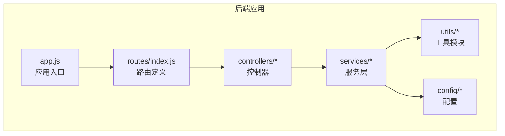
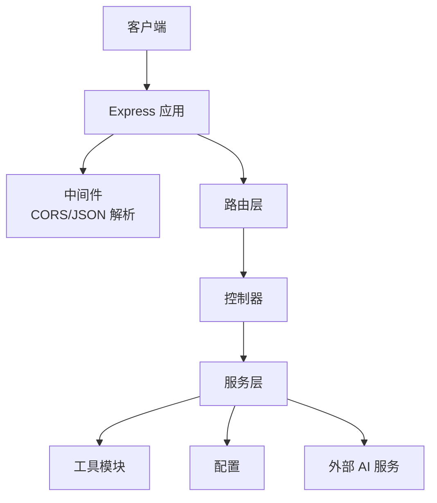
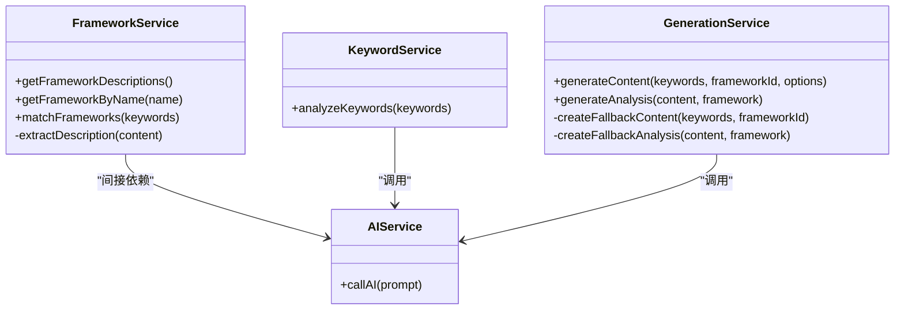
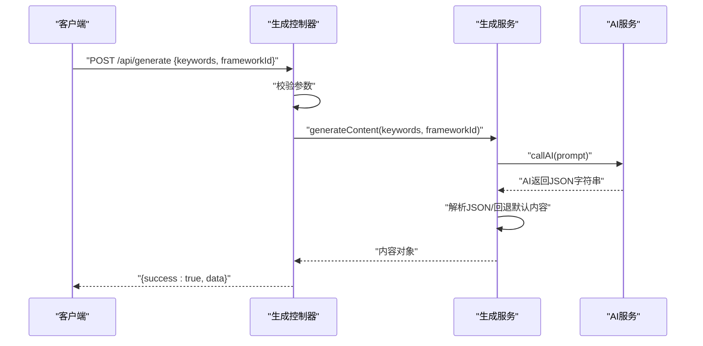
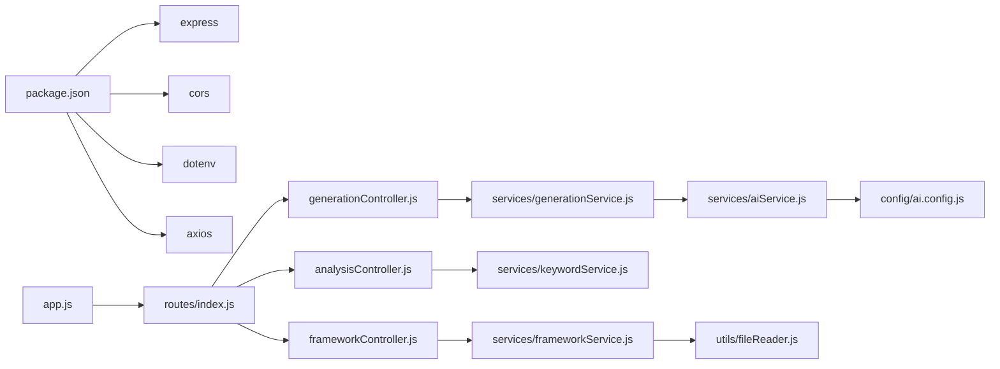

# 后端架构

<cite>
**本文引用的文件**
- [backend/src/app.js](file://backend/src/app.js)
- [backend/src/routes/index.js](file://backend/src/routes/index.js)
- [backend/src/controllers/frameworkController.js](file://backend/src/controllers/frameworkController.js)
- [backend/src/controllers/analysisController.js](file://backend/src/controllers/analysisController.js)
- [backend/src/controllers/generationController.js](file://backend/src/controllers/generationController.js)
- [backend/src/services/frameworkService.js](file://backend/src/services/frameworkService.js)
- [backend/src/services/aiService.js](file://backend/src/services/aiService.js)
- [backend/src/services/generationService.js](file://backend/src/services/generationService.js)
- [backend/src/services/keywordService.js](file://backend/src/services/keywordService.js)
- [backend/src/utils/fileReader.js](file://backend/src/utils/fileReader.js)
- [backend/src/config/ai.config.js](file://backend/src/config/ai.config.js)
- [backend/package.json](file://backend/package.json)
- [backend/.env.example](file://backend/.env.example)
- [backend/.env](file://backend/.env)
</cite>

## 目录
1. [简介](#简介)
2. [项目结构](#项目结构)
3. [核心组件](#核心组件)
4. [架构总览](#架构总览)
5. [组件详解](#组件详解)
6. [依赖关系分析](#依赖关系分析)
7. [性能与可靠性](#性能与可靠性)
8. [故障排查指南](#故障排查指南)
9. [结论](#结论)
10. [附录](#附录)

## 简介
本项目为一个基于 Node.js + Express 的后端服务，面向“小红书内容生成”场景，提供关键词分析、内容生成、内容质量分析以及框架资源读取等能力。系统采用经典的 MVC 架构模式，将路由、控制器、服务层清晰分离；通过统一的中间件机制实现 CORS、JSON 解析与基础路由挂载；通过服务层封装外部 AI 能力与本地文件读取逻辑，确保业务逻辑可测试、可扩展。

## 项目结构
后端采用按职责分层的目录组织方式：
- config：集中存放配置项（如 AI 服务配置）
- controllers：控制器层，负责接收请求、参数校验、调用服务并返回标准化响应
- routes：路由层，定义 RESTful 端点并绑定到对应控制器
- services：服务层，封装业务逻辑与外部 API 集成
- utils：通用工具模块（如文件读取）
- app.js：应用入口，初始化 Express、加载中间件、挂载路由并启动服务
- package.json：依赖与脚本定义
- .env / .env.example：运行时环境变量

图表来源
- [backend/src/app.js](file://backend/src/app.js#L1-L26)
- [backend/src/routes/index.js](file://backend/src/routes/index.js#L1-L21)

章节来源
- [backend/src/app.js](file://backend/src/app.js#L1-L26)
- [backend/src/routes/index.js](file://backend/src/routes/index.js#L1-L21)
- [backend/package.json](file://backend/package.json#L1-L17)

## 核心组件
- 应用入口与中间件
  - 初始化 Express 实例，加载 .env，启用 CORS 与 JSON 解析，挂载 /api 前缀路由，监听端口并启动服务。
- 路由层
  - 定义 GET/POST 端点，分别映射到框架查询、关键词分析、内容生成、内容分析与图片代理。
- 控制器层
  - 对请求参数进行基础校验，调用服务层执行业务逻辑，统一返回 { success, data|error } 结构。
- 服务层
  - 封装 AI 调用、内容生成、关键词分析、框架匹配与文件读取等业务逻辑。
- 工具与配置
  - 文件读取工具负责从指定路径读取框架 Markdown 文档；AI 配置集中于配置文件或硬编码常量。

章节来源
- [backend/src/app.js](file://backend/src/app.js#L1-L26)
- [backend/src/routes/index.js](file://backend/src/routes/index.js#L1-L21)
- [backend/src/controllers/frameworkController.js](file://backend/src/controllers/frameworkController.js#L1-L49)
- [backend/src/controllers/analysisController.js](file://backend/src/controllers/analysisController.js#L1-L37)
- [backend/src/controllers/generationController.js](file://backend/src/controllers/generationController.js#L1-L100)
- [backend/src/services/frameworkService.js](file://backend/src/services/frameworkService.js#L1-L64)
- [backend/src/services/aiService.js](file://backend/src/services/aiService.js#L1-L55)
- [backend/src/services/generationService.js](file://backend/src/services/generationService.js#L1-L194)
- [backend/src/services/keywordService.js](file://backend/src/services/keywordService.js#L1-L85)
- [backend/src/utils/fileReader.js](file://backend/src/utils/fileReader.js#L1-L49)
- [backend/src/config/ai.config.js](file://backend/src/config/ai.config.js#L1-L18)

## 架构总览
系统遵循 MVC 架构：
- Model：由服务层封装的数据模型与外部接口交互（如 AI 接口）
- View：此处由控制器统一输出 JSON 响应
- Controller：路由绑定到控制器函数，负责参数校验与错误处理
- 中间件：CORS、JSON 解析、路由挂载

图表来源
- [backend/src/app.js](file://backend/src/app.js#L1-L26)
- [backend/src/routes/index.js](file://backend/src/routes/index.js#L1-L21)
- [backend/src/controllers/generationController.js](file://backend/src/controllers/generationController.js#L1-L100)
- [backend/src/services/aiService.js](file://backend/src/services/aiService.js#L1-L55)

## 组件详解

### 应用入口与中间件
- 初始化与环境加载
  - 通过 dotenv 加载环境变量，支持动态端口与 CORS 来源配置
- 中间件
  - CORS：允许来自配置来源的跨域请求
  - JSON 解析：解析请求体为 JSON
- 路由挂载
  - 将 /api 前缀下的路由注册到 Express 实例
- 启动监听
  - 在配置端口上启动服务

章节来源
- [backend/src/app.js](file://backend/src/app.js#L1-L26)
- [backend/.env.example](file://backend/.env.example#L1-L3)
- [backend/.env](file://backend/.env#L1-L5)

### 路由层设计
- 端点设计
  - GET /api/frameworks：获取所有框架列表
  - GET /api/frameworks/:name：按名称获取框架详情
  - POST /api/analyze：关键词分析
  - POST /api/generate：内容生成
  - POST /api/generate/analysis：内容质量分析
  - GET /api/proxy-image：图片下载代理（解决前端跨域）
- 设计原则
  - 使用 RESTful 资源命名与动词组合，语义清晰
  - 将复杂业务拆分为多个端点，便于前端调用与缓存控制

章节来源
- [backend/src/routes/index.js](file://backend/src/routes/index.js#L1-L21)

### 控制器层设计
- 框架控制器
  - 获取全部框架：调用服务层读取并解析框架描述，返回统一结构
  - 按名称获取：若未找到返回 404，否则返回框架详情
- 关键词分析控制器
  - 校验必填参数，调用关键词分析服务，返回统一结构
- 内容生成控制器
  - 校验关键词与框架 ID，调用生成服务，返回统一结构
  - 内容分析：构造框架对象，调用生成分析服务
  - 图片代理：校验 URL，使用 axios 流式下载并转发响应头
- 错误处理策略
  - 显式返回 400/404/500 状态码与统一错误结构
  - 控制器内捕获异常并返回标准化错误响应

章节来源
- [backend/src/controllers/frameworkController.js](file://backend/src/controllers/frameworkController.js#L1-L49)
- [backend/src/controllers/analysisController.js](file://backend/src/controllers/analysisController.js#L1-L37)
- [backend/src/controllers/generationController.js](file://backend/src/controllers/generationController.js#L1-L100)

### 服务层设计
- 框架服务
  - 读取框架 Markdown 文件，提取标题、描述与全文
  - 支持按名称匹配与关键词匹配，计算匹配分数
- 关键词分析服务
  - 通过提示词驱动 AI，返回关键词意图、主题、受众与推荐框架
  - 若 AI 返回非 JSON 或失败，回退到默认规则
- 内容生成服务
  - 通过提示词驱动 AI 生成内容 JSON，包含标题、正文、图片与标签
  - 若 AI 返回非 JSON 或失败，回退到默认内容
  - 内容分析服务：对已有内容进行质量分析，返回钩子、框架、结构与吸引力评分
- AI 服务
  - 统一封装外部 AI 接口调用，设置超时、头部与错误日志
  - 对空响应进行显式错误抛出，便于上层回退

图表来源
- [backend/src/services/frameworkService.js](file://backend/src/services/frameworkService.js#L1-L64)
- [backend/src/services/keywordService.js](file://backend/src/services/keywordService.js#L1-L85)
- [backend/src/services/generationService.js](file://backend/src/services/generationService.js#L1-L194)
- [backend/src/services/aiService.js](file://backend/src/services/aiService.js#L1-L55)

章节来源
- [backend/src/services/frameworkService.js](file://backend/src/services/frameworkService.js#L1-L64)
- [backend/src/services/keywordService.js](file://backend/src/services/keywordService.js#L1-L85)
- [backend/src/services/generationService.js](file://backend/src/services/generationService.js#L1-L194)
- [backend/src/services/aiService.js](file://backend/src/services/aiService.js#L1-L55)

### 外部 API 集成与配置管理
- AI 配置
  - 配置文件集中存放基础地址、密钥、模型与端点
  - 也可在服务中直接使用常量，便于快速集成
- 请求头与超时
  - 统一设置 Content-Type、Authorization、HTTP-Referer、X-Title 等头部
  - 设置合理超时时间，避免阻塞
- 回退策略
  - 当 AI 返回非 JSON 或异常时，服务层提供默认内容/分析，保证可用性

章节来源
- [backend/src/config/ai.config.js](file://backend/src/config/ai.config.js#L1-L18)
- [backend/src/services/aiService.js](file://backend/src/services/aiService.js#L1-L55)
- [backend/src/services/generationService.js](file://backend/src/services/generationService.js#L1-L194)
- [backend/src/services/keywordService.js](file://backend/src/services/keywordService.js#L1-L85)

### 数据验证与异常处理
- 参数校验
  - 控制器对必填字段进行显式校验，缺失时返回 400
  - 未找到资源时返回 404
- 异常捕获
  - 控制器与服务层均进行 try/catch 包裹，统一返回 { success, data|error }
  - 记录错误日志，便于定位问题
- 回退机制
  - AI 失败或返回非 JSON 时，使用默认内容/分析，避免服务中断

章节来源
- [backend/src/controllers/frameworkController.js](file://backend/src/controllers/frameworkController.js#L1-L49)
- [backend/src/controllers/analysisController.js](file://backend/src/controllers/analysisController.js#L1-L37)
- [backend/src/controllers/generationController.js](file://backend/src/controllers/generationController.js#L1-L100)
- [backend/src/services/generationService.js](file://backend/src/services/generationService.js#L1-L194)
- [backend/src/services/keywordService.js](file://backend/src/services/keywordService.js#L1-L85)

### 中间件机制
- CORS 配置
  - 通过环境变量动态配置允许来源，避免硬编码
- JSON 解析
  - 自动解析 application/json 请求体，供控制器读取
- 路由挂载
  - 所有 API 路由统一前缀 /api，便于扩展与版本化

章节来源
- [backend/src/app.js](file://backend/src/app.js#L1-L26)
- [backend/src/routes/index.js](file://backend/src/routes/index.js#L1-L21)

### API 设计图
以下序列图展示了“内容生成”的完整流程，体现控制器、服务层与外部 AI 的协作：

图表来源
- [backend/src/controllers/generationController.js](file://backend/src/controllers/generationController.js#L1-L100)
- [backend/src/services/generationService.js](file://backend/src/services/generationService.js#L1-L194)
- [backend/src/services/aiService.js](file://backend/src/services/aiService.js#L1-L55)

## 依赖关系分析
- 模块耦合
  - 控制器仅依赖服务层接口，低耦合、高内聚
  - 服务层依赖工具模块与配置，必要时依赖外部 API
- 外部依赖
  - express：Web 框架
  - cors：跨域支持
  - dotenv：环境变量加载
  - axios：HTTP 客户端，用于 AI 与图片代理
- 运行脚本
  - start：生产启动
  - dev：开发热重载

图表来源
- [backend/package.json](file://backend/package.json#L1-L17)
- [backend/src/app.js](file://backend/src/app.js#L1-L26)
- [backend/src/routes/index.js](file://backend/src/routes/index.js#L1-L21)
- [backend/src/controllers/frameworkController.js](file://backend/src/controllers/frameworkController.js#L1-L49)
- [backend/src/controllers/analysisController.js](file://backend/src/controllers/analysisController.js#L1-L37)
- [backend/src/controllers/generationController.js](file://backend/src/controllers/generationController.js#L1-L100)
- [backend/src/services/frameworkService.js](file://backend/src/services/frameworkService.js#L1-L64)
- [backend/src/services/keywordService.js](file://backend/src/services/keywordService.js#L1-L85)
- [backend/src/services/generationService.js](file://backend/src/services/generationService.js#L1-L194)
- [backend/src/services/aiService.js](file://backend/src/services/aiService.js#L1-L55)
- [backend/src/utils/fileReader.js](file://backend/src/utils/fileReader.js#L1-L49)
- [backend/src/config/ai.config.js](file://backend/src/config/ai.config.js#L1-L18)

章节来源
- [backend/package.json](file://backend/package.json#L1-L17)

## 性能与可靠性
- 超时与并发
  - AI 调用设置合理超时，避免长时间阻塞
  - 图片代理设置超时，防止大文件下载导致资源占用
- 回退策略
  - AI 返回非 JSON 或异常时，使用默认内容/分析，保证服务可用
- 日志与可观测性
  - 控制台记录错误与响应状态，便于定位问题
- 资源限制
  - 建议在生产环境中配合进程管理器与限流策略，避免单实例过载

## 故障排查指南
- 端口与 CORS
  - 确认 .env 中 PORT 与 CORS_ORIGIN 配置正确，前后端端口一致
- 参数缺失
  - 关键词分析与内容生成需携带必填字段，否则返回 400
- 资源不存在
  - 框架名称不匹配时返回 404
- AI 调用失败
  - 查看控制台错误日志，确认网络连通与密钥有效
- 图片代理失败
  - 检查 URL 是否有效，代理是否超时

章节来源
- [backend/.env](file://backend/.env#L1-L5)
- [backend/src/controllers/analysisController.js](file://backend/src/controllers/analysisController.js#L1-L37)
- [backend/src/controllers/generationController.js](file://backend/src/controllers/generationController.js#L1-L100)
- [backend/src/services/aiService.js](file://backend/src/services/aiService.js#L1-L55)

## 结论
本后端服务以清晰的 MVC 分层、统一的中间件与标准化响应结构，实现了关键词分析、内容生成与质量分析等核心功能。通过服务层封装外部 AI 与本地文件读取，既保证了业务可扩展性，也提供了稳健的回退策略。建议后续引入单元测试、统一错误码与日志规范，进一步提升可维护性与可观测性。

## 附录
- 环境变量
  - PORT：服务监听端口
  - CORS_ORIGIN：允许跨域访问的来源
- 脚本命令
  - start：生产启动
  - dev：开发热重载

章节来源
- [backend/.env.example](file://backend/.env.example#L1-L3)
- [backend/package.json](file://backend/package.json#L1-L17)