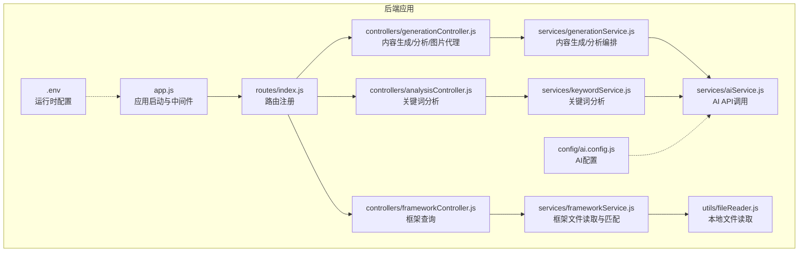
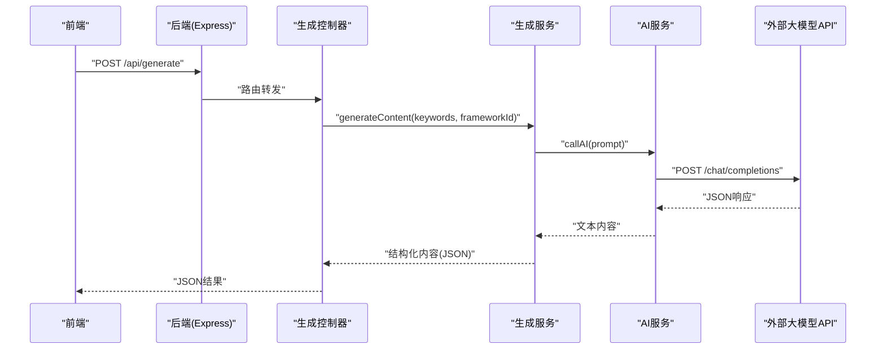
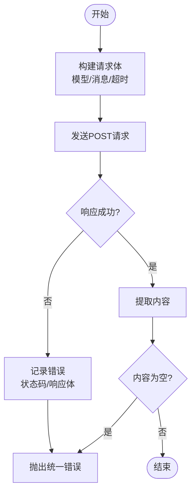
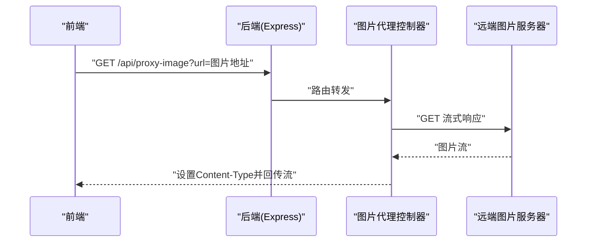
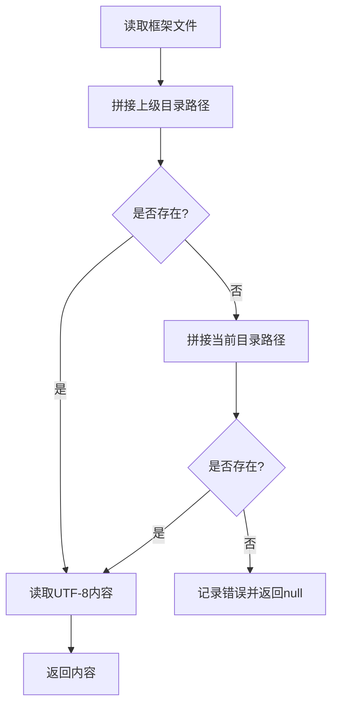
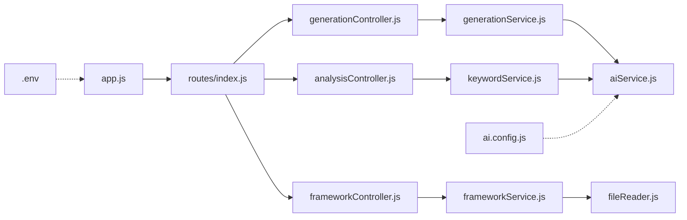

# 外部服务集成

<cite>
**本文引用的文件**
- [backend/src/app.js](file://backend/src/app.js)
- [backend/src/routes/index.js](file://backend/src/routes/index.js)
- [backend/src/controllers/generationController.js](file://backend/src/controllers/generationController.js)
- [backend/src/controllers/frameworkController.js](file://backend/src/controllers/frameworkController.js)
- [backend/src/controllers/analysisController.js](file://backend/src/controllers/analysisController.js)
- [backend/src/services/aiService.js](file://backend/src/services/aiService.js)
- [backend/src/services/generationService.js](file://backend/src/services/generationService.js)
- [backend/src/services/keywordService.js](file://backend/src/services/keywordService.js)
- [backend/src/services/frameworkService.js](file://backend/src/services/frameworkService.js)
- [backend/src/utils/fileReader.js](file://backend/src/utils/fileReader.js)
- [backend/src/config/ai.config.js](file://backend/src/config/ai.config.js)
- [backend/.env](file://backend/.env)
- [backend/package.json](file://backend/package.json)
- [docs/GUIDE.md](file://docs/GUIDE.md)
</cite>

## 目录
1. [简介](#简介)
2. [项目结构](#项目结构)
3. [核心组件](#核心组件)
4. [架构总览](#架构总览)
5. [详细组件分析](#详细组件分析)
6. [依赖关系分析](#依赖关系分析)
7. [性能考量](#性能考量)
8. [故障排查指南](#故障排查指南)
9. [结论](#结论)
10. [附录](#附录)

## 简介
本文件面向后端与外部服务集成的实现，重点涵盖以下方面：
- AI服务集成：大模型API调用、非流式响应处理、错误重试与降级策略
- 图片服务集成：代理下载、跨域处理与超时控制
- 配置管理：AI服务配置、API密钥管理、环境变量适配
- 外部API调用示例：请求构建、响应处理与超时控制
- 错误处理策略：网络异常、API限流与降级方案
- 文件读取与处理工具：本地文件操作与资源管理

## 项目结构
后端采用Express框架，路由集中于统一入口，控制器负责请求处理，服务层封装业务逻辑与外部API调用，工具模块提供文件读取能力。

图表来源
- [backend/src/app.js](file://backend/src/app.js#L1-L26)
- [backend/src/routes/index.js](file://backend/src/routes/index.js#L1-L21)
- [backend/src/controllers/generationController.js](file://backend/src/controllers/generationController.js#L1-L100)
- [backend/src/controllers/frameworkController.js](file://backend/src/controllers/frameworkController.js#L1-L49)
- [backend/src/controllers/analysisController.js](file://backend/src/controllers/analysisController.js#L1-L37)
- [backend/src/services/aiService.js](file://backend/src/services/aiService.js#L1-L55)
- [backend/src/services/generationService.js](file://backend/src/services/generationService.js#L1-L194)
- [backend/src/services/keywordService.js](file://backend/src/services/keywordService.js#L1-L85)
- [backend/src/services/frameworkService.js](file://backend/src/services/frameworkService.js#L1-L64)
- [backend/src/utils/fileReader.js](file://backend/src/utils/fileReader.js#L1-L49)
- [backend/src/config/ai.config.js](file://backend/src/config/ai.config.js#L1-L18)
- [backend/.env](file://backend/.env#L1-L5)

章节来源
- [backend/src/app.js](file://backend/src/app.js#L1-L26)
- [backend/src/routes/index.js](file://backend/src/routes/index.js#L1-L21)

## 核心组件
- 应用入口与中间件：初始化CORS、解析JSON、挂载路由
- 路由层：暴露框架查询、关键词分析、内容生成、内容分析、图片代理接口
- 控制器层：参数校验、调用服务层、统一错误处理
- 服务层：
  - AI服务：封装外部大模型API调用，含超时与错误日志
  - 生成服务：拼装提示词、调用AI、解析JSON、降级回退
  - 关键词分析服务：基于AI的关键词意图与框架推荐
  - 框架服务：读取本地框架Markdown并提取描述
- 工具层：文件读取与回退路径处理
- 配置层：AI基础配置（域名、模型、端点、头部）
- 环境配置：端口、CORS来源

章节来源
- [backend/src/app.js](file://backend/src/app.js#L1-L26)
- [backend/src/routes/index.js](file://backend/src/routes/index.js#L1-L21)
- [backend/src/controllers/generationController.js](file://backend/src/controllers/generationController.js#L1-L100)
- [backend/src/controllers/frameworkController.js](file://backend/src/controllers/frameworkController.js#L1-L49)
- [backend/src/controllers/analysisController.js](file://backend/src/controllers/analysisController.js#L1-L37)
- [backend/src/services/aiService.js](file://backend/src/services/aiService.js#L1-L55)
- [backend/src/services/generationService.js](file://backend/src/services/generationService.js#L1-L194)
- [backend/src/services/keywordService.js](file://backend/src/services/keywordService.js#L1-L85)
- [backend/src/services/frameworkService.js](file://backend/src/services/frameworkService.js#L1-L64)
- [backend/src/utils/fileReader.js](file://backend/src/utils/fileReader.js#L1-L49)
- [backend/src/config/ai.config.js](file://backend/src/config/ai.config.js#L1-L18)
- [backend/.env](file://backend/.env#L1-L5)

## 架构总览
后端通过Express提供REST接口，前端通过这些接口完成内容生成、分析与图片代理下载。AI服务调用采用非流式同步响应；图片代理通过服务端向目标地址发起GET请求并以流形式回传，解决前端跨域限制。

图表来源
- [backend/src/routes/index.js](file://backend/src/routes/index.js#L14-L16)
- [backend/src/controllers/generationController.js](file://backend/src/controllers/generationController.js#L10-L33)
- [backend/src/services/generationService.js](file://backend/src/services/generationService.js#L64-L94)
- [backend/src/services/aiService.js](file://backend/src/services/aiService.js#L14-L53)

## 详细组件分析

### AI服务集成
- 调用方式：非流式同步请求，使用JSON格式消息体
- 请求构建：指定模型、消息数组（用户角色）、超时时间
- 认证与头部：Authorization携带API Key，附加Referer与标题头
- 响应处理：提取choices[0].message.content，若为空则抛错
- 错误处理：捕获异常并记录状态码与响应体，抛出统一错误
- 重试与降级：当前未实现自动重试，但生成/分析服务具备JSON解析失败与调用异常的降级回退逻辑

图表来源
- [backend/src/services/aiService.js](file://backend/src/services/aiService.js#L14-L53)

章节来源
- [backend/src/services/aiService.js](file://backend/src/services/aiService.js#L1-L55)
- [backend/src/config/ai.config.js](file://backend/src/config/ai.config.js#L6-L17)

### 图片服务集成（代理下载）
- 接口：GET /api/proxy-image?url=xxx
- 功能：解决前端直接下载跨域问题，服务端作为代理拉取图片并以流形式回传
- 超时：30秒
- 响应头：转发原始Content-Type，允许任意来源访问
- 错误处理：捕获异常并返回500

图表来源
- [backend/src/routes/index.js](file://backend/src/routes/index.js#L16)
- [backend/src/controllers/generationController.js](file://backend/src/controllers/generationController.js#L69-L94)

章节来源
- [backend/src/controllers/generationController.js](file://backend/src/controllers/generationController.js#L69-L94)

### 配置管理
- 运行时配置：端口、CORS来源
- AI配置：基础URL、模型、端点、请求头（含动态Authorization）
- 包依赖：axios、cors、dotenv、express
- 环境适配：通过dotenv加载环境变量，Express监听端口与CORS来源

章节来源
- [backend/.env](file://backend/.env#L1-L5)
- [backend/src/config/ai.config.js](file://backend/src/config/ai.config.js#L6-L17)
- [backend/src/app.js](file://backend/src/app.js#L9-L16)
- [backend/package.json](file://backend/package.json#L10-L15)

### 外部API调用示例（请求/响应/超时）
- 请求构建：模型名、消息数组、超时毫秒数
- 响应处理：解析choices[0].message.content为字符串
- 超时控制：AI调用60秒，图片代理30秒
- 错误处理：打印状态码与响应体，抛出统一错误

章节来源
- [backend/src/services/aiService.js](file://backend/src/services/aiService.js#L16-L37)
- [backend/src/controllers/generationController.js](file://backend/src/controllers/generationController.js#L77-L82)

### 错误处理策略
- 网络异常：捕获axios异常，记录状态码与响应体
- API限流：当前未实现重试与退避，建议在调用层增加指数退避与最大重试次数
- 降级方案：生成/分析服务在JSON解析失败或调用异常时，返回结构化默认值
- CORS与跨域：图片代理设置Access-Control-Allow-Origin为*，前端可直接访问

章节来源
- [backend/src/services/aiService.js](file://backend/src/services/aiService.js#L45-L52)
- [backend/src/services/generationService.js](file://backend/src/services/generationService.js#L70-L93)
- [backend/src/services/keywordService.js](file://backend/src/services/keywordService.js#L44-L54)
- [backend/src/controllers/generationController.js](file://backend/src/controllers/generationController.js#L84-L86)

### 文件读取与处理工具
- 作用：从上级目录与当前目录读取框架Markdown，提取标题与描述
- 回退机制：若上级目录不存在，尝试当前目录
- 输出：返回包含名称、标题、描述、全文的数组

图表来源
- [backend/src/utils/fileReader.js](file://backend/src/utils/fileReader.js#L9-L27)

章节来源
- [backend/src/utils/fileReader.js](file://backend/src/utils/fileReader.js#L1-L49)
- [backend/src/services/frameworkService.js](file://backend/src/services/frameworkService.js#L9-L58)

## 依赖关系分析
- 控制器依赖服务层，服务层依赖工具与配置
- Express应用依赖路由与环境配置
- AI服务依赖axios与配置模块
- 框架服务依赖文件读取工具

图表来源
- [backend/src/app.js](file://backend/src/app.js#L1-L26)
- [backend/src/routes/index.js](file://backend/src/routes/index.js#L1-L21)
- [backend/src/controllers/generationController.js](file://backend/src/controllers/generationController.js#L1-L100)
- [backend/src/controllers/frameworkController.js](file://backend/src/controllers/frameworkController.js#L1-L49)
- [backend/src/controllers/analysisController.js](file://backend/src/controllers/analysisController.js#L1-L37)
- [backend/src/services/generationService.js](file://backend/src/services/generationService.js#L1-L194)
- [backend/src/services/keywordService.js](file://backend/src/services/keywordService.js#L1-L85)
- [backend/src/services/frameworkService.js](file://backend/src/services/frameworkService.js#L1-L64)
- [backend/src/utils/fileReader.js](file://backend/src/utils/fileReader.js#L1-L49)
- [backend/src/config/ai.config.js](file://backend/src/config/ai.config.js#L1-L18)
- [backend/.env](file://backend/.env#L1-L5)

## 性能考量
- 超时设置：AI调用60秒，图片代理30秒，避免长时间占用连接
- 非流式响应：简化实现，但无法实时增量渲染；如需流式，可在上游引入SSE或WebSocket
- 降级策略：JSON解析失败与调用异常时返回默认结构，保证可用性
- 跨域代理：图片代理减少前端跨域限制，但会增加服务端带宽与CPU开销

## 故障排查指南
- AI服务调用失败
  - 检查Authorization是否正确注入
  - 确认模型与端点配置是否匹配外部API要求
  - 观察响应状态码与错误日志
- 图片代理失败
  - 确认目标URL有效且可访问
  - 检查超时设置与网络连通性
  - 查看Access-Control-Allow-Origin是否生效
- 框架文件读取失败
  - 确认Markdown文件存在于上级或当前目录
  - 检查文件编码与路径拼接逻辑

章节来源
- [backend/src/services/aiService.js](file://backend/src/services/aiService.js#L45-L52)
- [backend/src/controllers/generationController.js](file://backend/src/controllers/generationController.js#L84-L93)
- [backend/src/utils/fileReader.js](file://backend/src/utils/fileReader.js#L13-L26)

## 结论
本项目已实现后端与外部AI服务的稳定集成与图片代理下载功能。通过统一的服务层封装与降级策略，系统在异常情况下仍能返回可用结果。建议后续增强：
- 在AI调用层加入指数退避与最大重试次数
- 引入流式响应以支持实时渲染
- 增强配置项的动态化与密钥轮换机制

## 附录
- 开发指南与部署流程可参考开发文档中的指引

章节来源
- [docs/GUIDE.md](file://docs/GUIDE.md#L344-L381)