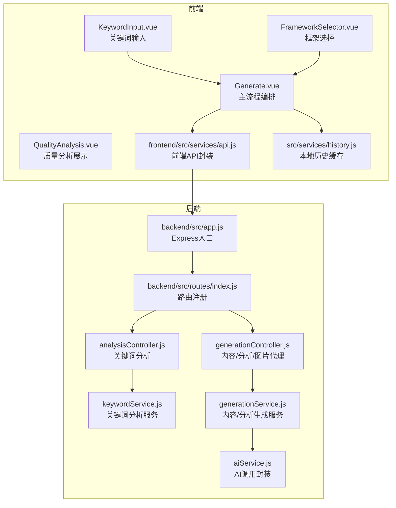
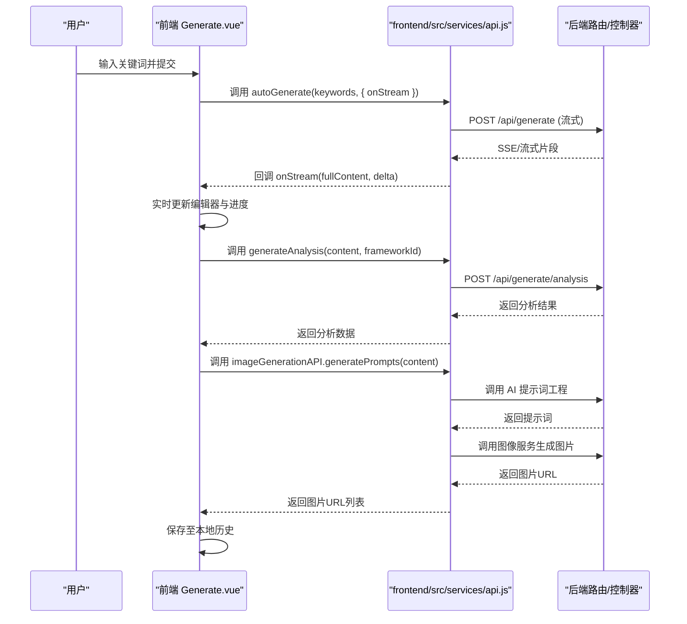
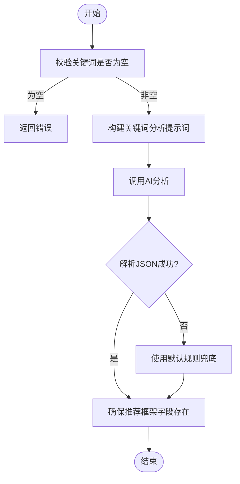
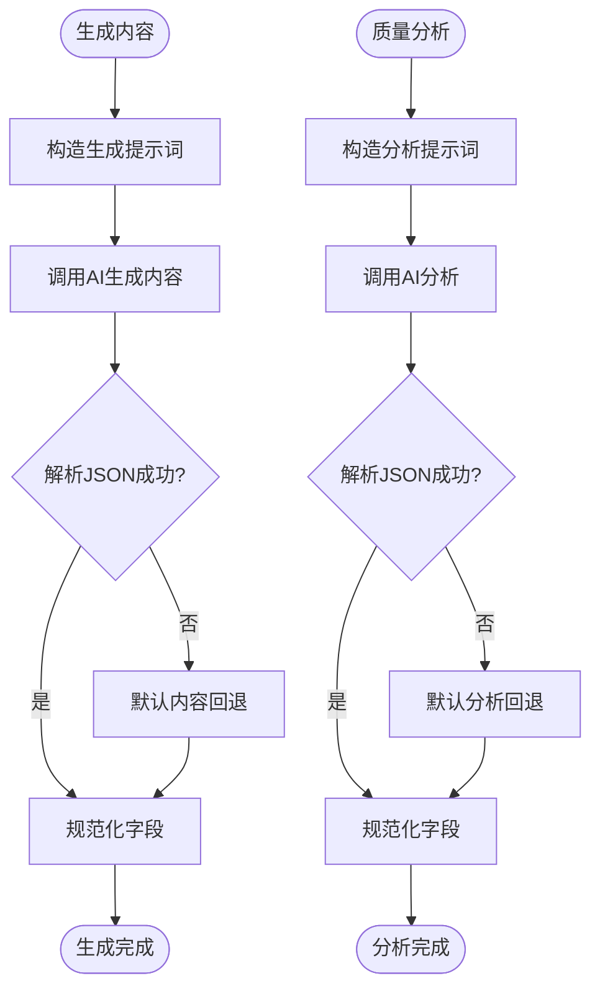
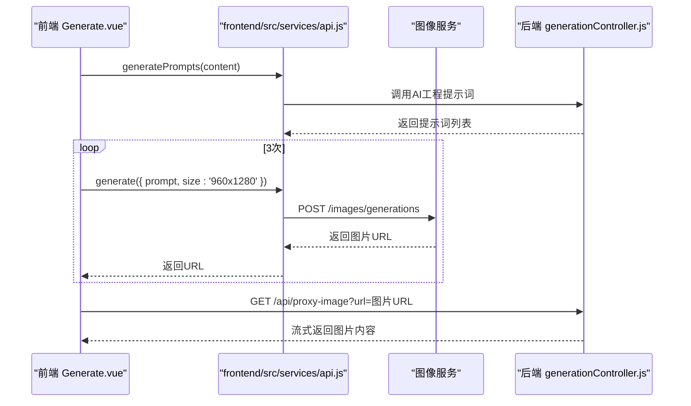
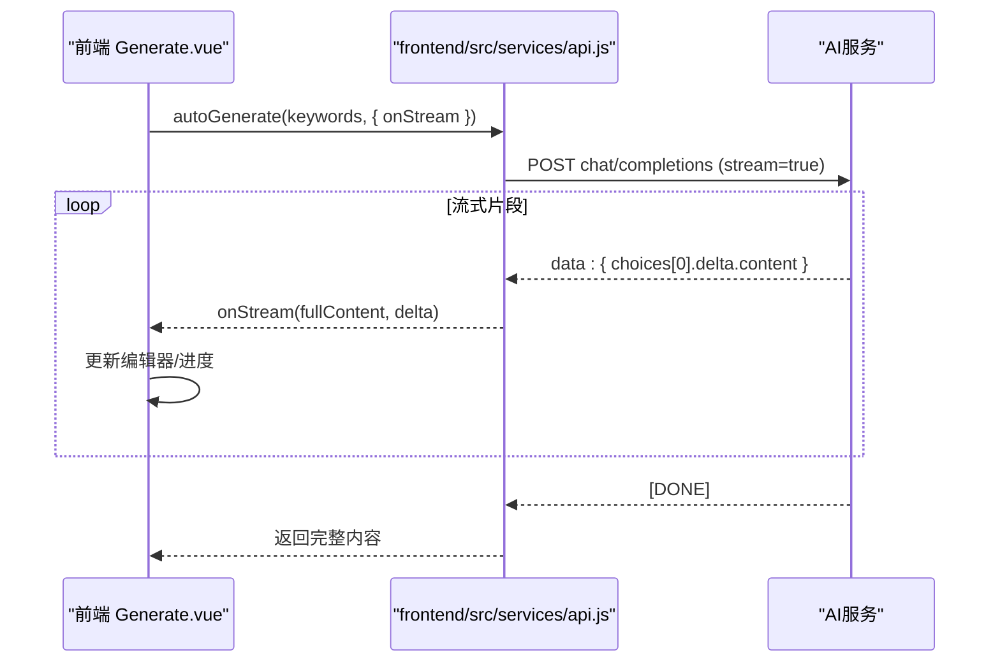
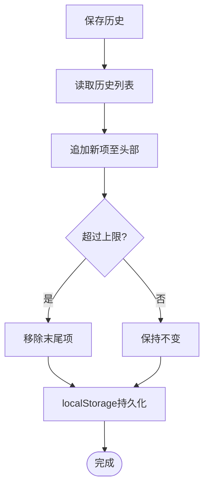
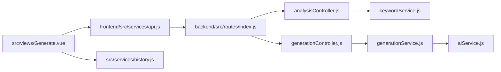

# 数据流设计

<cite>
**本文引用的文件**
- [backend/src/app.js](file://backend/src/app.js)
- [backend/src/routes/index.js](file://backend/src/routes/index.js)
- [backend/src/controllers/analysisController.js](file://backend/src/controllers/analysisController.js)
- [backend/src/controllers/generationController.js](file://backend/src/controllers/generationController.js)
- [backend/src/services/aiService.js](file://backend/src/services/aiService.js)
- [backend/src/services/keywordService.js](file://backend/src/services/keywordService.js)
- [backend/src/services/generationService.js](file://backend/src/services/generationService.js)
- [frontend/src/services/api.js](file://frontend/src/services/api.js)
- [src/services/history.js](file://src/services/history.js)
- [src/views/Generate.vue](file://src/views/Generate.vue)
- [src/components/KeywordInput.vue](file://src/components/KeywordInput.vue)
- [src/components/FrameworkSelector.vue](file://src/components/FrameworkSelector.vue)
- [src/components/QualityAnalysis.vue](file://src/components/QualityAnalysis.vue)
</cite>

## 目录
1. [简介](#简介)
2. [项目结构](#项目结构)
3. [核心组件](#核心组件)
4. [架构总览](#架构总览)
5. [详细组件分析](#详细组件分析)
6. [依赖关系分析](#依赖关系分析)
7. [性能考量](#性能考量)
8. [故障排查指南](#故障排查指南)
9. [结论](#结论)
10. [附录](#附录)

## 简介
本文件为“小红书爆款文案生成工具”的数据流设计文档，面向开发者与产品人员，系统性阐述从用户输入到最终输出的完整数据流程，覆盖关键词处理、AI 内容生成、质量分析、图片配套生成、实时数据传输（流式）、数据验证与转换、缓存与本地存储、历史记录管理、数据安全与隐私保护、性能优化等主题。文中提供多幅流程图与时序图，帮助快速理解系统数据处理逻辑。

## 项目结构
该项目采用前后端分离架构：
- 后端基于 Express，提供 REST API，负责关键词分析、内容生成、质量分析与图片代理。
- 前端基于 Vue 3 + Naive UI，负责用户交互、实时流式渲染、历史记录管理与图片生成调度。
- 数据在前端与后端之间通过 HTTP API 通信；图片生成通过第三方图像服务完成。

图表来源
- [backend/src/app.js](file://backend/src/app.js#L1-L26)
- [backend/src/routes/index.js](file://backend/src/routes/index.js#L1-L21)
- [backend/src/controllers/analysisController.js](file://backend/src/controllers/analysisController.js#L1-L37)
- [backend/src/controllers/generationController.js](file://backend/src/controllers/generationController.js#L1-L100)
- [backend/src/services/keywordService.js](file://backend/src/services/keywordService.js#L1-L85)
- [backend/src/services/generationService.js](file://backend/src/services/generationService.js#L1-L194)
- [backend/src/services/aiService.js](file://backend/src/services/aiService.js#L1-L55)
- [frontend/src/services/api.js](file://frontend/src/services/api.js#L1-L454)
- [src/services/history.js](file://src/services/history.js#L1-L89)
- [src/views/Generate.vue](file://src/views/Generate.vue#L1-L668)
- [src/components/KeywordInput.vue](file://src/components/KeywordInput.vue#L1-L265)
- [src/components/FrameworkSelector.vue](file://src/components/FrameworkSelector.vue#L1-L241)
- [src/components/QualityAnalysis.vue](file://src/components/QualityAnalysis.vue#L1-L138)

章节来源
- [backend/src/app.js](file://backend/src/app.js#L1-L26)
- [backend/src/routes/index.js](file://backend/src/routes/index.js#L1-L21)
- [frontend/src/services/api.js](file://frontend/src/services/api.js#L1-L454)
- [src/services/history.js](file://src/services/history.js#L1-L89)
- [src/views/Generate.vue](file://src/views/Generate.vue#L1-L668)

## 核心组件
- 关键词分析服务：接收关键词，返回意图、主题、受众与推荐框架列表。
- 内容生成服务：根据关键词与框架生成文案正文、标题、标签与图片建议。
- 质量分析服务：对生成内容进行结构、钩子、框架契合度与平台适配度评估。
- 图片配套生成：将文案中的配图建议转化为专业提示词，并调用图像服务生成图片。
- 前端 API 封装：统一处理流式与非流式响应、错误与超时、图像生成与提示词工程。
- 历史记录服务：基于本地存储的生成历史缓存与管理。

章节来源
- [backend/src/services/keywordService.js](file://backend/src/services/keywordService.js#L1-L85)
- [backend/src/services/generationService.js](file://backend/src/services/generationService.js#L1-L194)
- [backend/src/services/aiService.js](file://backend/src/services/aiService.js#L1-L55)
- [frontend/src/services/api.js](file://frontend/src/services/api.js#L1-L454)
- [src/services/history.js](file://src/services/history.js#L1-L89)

## 架构总览
系统采用“前端事件驱动 + 后端服务编排”的模式：
- 用户在前端输入关键词，触发关键词分析与内容生成。
- 生成过程中，前端通过流式接口逐步渲染内容，同时异步生成图片与质量分析。
- 生成完成后，前端将结果写入本地历史缓存，便于回溯与复用。

图表来源
- [src/views/Generate.vue](file://src/views/Generate.vue#L257-L324)
- [frontend/src/services/api.js](file://frontend/src/services/api.js#L256-L320)
- [backend/src/controllers/generationController.js](file://backend/src/controllers/generationController.js#L10-L33)
- [backend/src/services/generationService.js](file://backend/src/services/generationService.js#L114-L162)

## 详细组件分析

### 关键词处理与推荐
- 输入校验：后端控制器对关键词进行必填校验，前端也进行输入提示与防抖。
- AI 分析：调用 AI 服务，返回关键词意图、主题、受众与推荐框架列表。
- 备选策略：若 AI 返回非 JSON 或为空，采用默认规则兜底。

图表来源
- [backend/src/controllers/analysisController.js](file://backend/src/controllers/analysisController.js#L6-L30)
- [backend/src/services/keywordService.js](file://backend/src/services/keywordService.js#L39-L84)

章节来源
- [backend/src/controllers/analysisController.js](file://backend/src/controllers/analysisController.js#L1-L37)
- [backend/src/services/keywordService.js](file://backend/src/services/keywordService.js#L1-L85)

### AI 内容生成与质量分析
- 内容生成：根据关键词与框架构造提示词，调用 AI 生成 JSON 结构化内容；若失败则回退到默认内容。
- 质量分析：对生成内容进行钩子、框架契合度、结构与平台适配度分析；失败时回退到默认分析。
- 输出规范：标题、正文、图片建议、标签等字段标准化，保证后续图片生成与展示一致性。

图表来源
- [backend/src/services/generationService.js](file://backend/src/services/generationService.js#L63-L194)
- [backend/src/services/aiService.js](file://backend/src/services/aiService.js#L14-L53)

章节来源
- [backend/src/services/generationService.js](file://backend/src/services/generationService.js#L1-L194)
- [backend/src/services/aiService.js](file://backend/src/services/aiService.js#L1-L55)

### 图片配套生成与代理
- 提示词工程：将文案内容转化为 3 个专业绘图提示词，支持清理编号与截断。
- 图片生成：调用图像服务生成 960x1280 的图片（小红书推荐比例），并返回 URL。
- 图片代理：后端提供代理接口，解决前端跨域下载问题，透传响应头与流式传输。

图表来源
- [frontend/src/services/api.js](file://frontend/src/services/api.js#L417-L448)
- [backend/src/controllers/generationController.js](file://backend/src/controllers/generationController.js#L69-L94)

章节来源
- [frontend/src/services/api.js](file://frontend/src/services/api.js#L369-L449)
- [backend/src/controllers/generationController.js](file://backend/src/controllers/generationController.js#L1-L100)

### 实时数据传输与流式渲染
- 流式生成：前端通过 onStream 回调逐段接收 AI 输出，实时更新编辑器与进度条。
- 非流式接口：部分分析接口仍使用非流式请求，避免不必要的复杂度。
- 错误处理：对流式解析失败、HTTP 错误进行捕获与提示。

图表来源
- [src/views/Generate.vue](file://src/views/Generate.vue#L282-L294)
- [frontend/src/services/api.js](file://frontend/src/services/api.js#L123-L177)

章节来源
- [src/views/Generate.vue](file://src/views/Generate.vue#L257-L324)
- [frontend/src/services/api.js](file://frontend/src/services/api.js#L88-L177)

### 数据验证与转换
- 输入校验：后端对关键词、内容、框架 ID 进行必填校验；前端对空输入进行提示。
- 格式转换：AI 返回内容统一解析为 JSON；若失败则回退默认结构，确保字段完整性。
- 数据清洗：提示词工程对编号与多余换行进行清理，保证图像服务输入质量。

章节来源
- [backend/src/controllers/analysisController.js](file://backend/src/controllers/analysisController.js#L6-L30)
- [backend/src/controllers/generationController.js](file://backend/src/controllers/generationController.js#L10-L33)
- [backend/src/services/generationService.js](file://backend/src/services/generationService.js#L64-L112)
- [frontend/src/services/api.js](file://frontend/src/services/api.js#L417-L448)

### 缓存策略、本地存储与历史记录
- 本地缓存：前端使用 localStorage 存储生成历史，限制最大长度，支持增删查清。
- 历史管理：生成完成后自动保存；支持加载、删除与清空操作；历史项包含关键词、内容、图片与分析结果。
- 后端无持久化：后端不保存历史，所有历史均在前端本地维护。

图表来源
- [src/services/history.js](file://src/services/history.js#L14-L41)

章节来源
- [src/services/history.js](file://src/services/history.js#L1-L89)
- [src/views/Generate.vue](file://src/views/Generate.vue#L390-L422)

### 数据安全与隐私保护
- CORS 与请求头：后端启用 CORS，前端设置必要的 HTTP-Referer 与 X-Title 请求头以满足某些路由服务要求。
- 本地存储：历史记录仅保存在浏览器 localStorage，不上传至服务器。
- API 密钥：后端 AI 调用使用服务端密钥，前端未暴露敏感信息；图像服务调用在前端完成，需确保环境变量安全。

章节来源
- [backend/src/app.js](file://backend/src/app.js#L14-L16)
- [frontend/src/services/api.js](file://frontend/src/services/api.js#L16-L25)
- [backend/src/services/aiService.js](file://backend/src/services/aiService.js#L5-L7)

## 依赖关系分析
- 控制器依赖服务：analysisController 依赖 keywordService；generationController 依赖 generationService。
- 服务依赖 AI：generationService 与 keywordService 均依赖 aiService。
- 前端依赖后端：frontend/src/services/api.js 通过 /api 前缀调用后端接口；Generate.vue 协调各模块流程。
- 历史依赖本地存储：history.js 仅依赖浏览器 localStorage。

图表来源
- [backend/src/routes/index.js](file://backend/src/routes/index.js#L4-L18)
- [backend/src/controllers/analysisController.js](file://backend/src/controllers/analysisController.js#L1-L37)
- [backend/src/controllers/generationController.js](file://backend/src/controllers/generationController.js#L1-L100)
- [backend/src/services/keywordService.js](file://backend/src/services/keywordService.js#L1-L85)
- [backend/src/services/generationService.js](file://backend/src/services/generationService.js#L1-L194)
- [backend/src/services/aiService.js](file://backend/src/services/aiService.js#L1-L55)
- [frontend/src/services/api.js](file://frontend/src/services/api.js#L1-L454)
- [src/views/Generate.vue](file://src/views/Generate.vue#L1-L668)
- [src/services/history.js](file://src/services/history.js#L1-L89)

章节来源
- [backend/src/routes/index.js](file://backend/src/routes/index.js#L1-L21)
- [frontend/src/services/api.js](file://frontend/src/services/api.js#L1-L454)
- [src/views/Generate.vue](file://src/views/Generate.vue#L1-L668)

## 性能考量
- 超时与并发：AI 与图像服务调用设置合理超时；图片生成采用并发 Promise.all，缩短等待时间。
- 流式渲染：前端按流式片段增量渲染，显著改善首屏与交互体验。
- 回退策略：AI 解析失败与接口异常均有默认回退，避免阻塞主线程。
- 本地缓存：历史记录本地化，减少重复请求与网络开销。

章节来源
- [frontend/src/services/api.js](file://frontend/src/services/api.js#L24-L37)
- [src/views/Generate.vue](file://src/views/Generate.vue#L337-L342)
- [backend/src/services/generationService.js](file://backend/src/services/generationService.js#L90-L94)

## 故障排查指南
- 关键词分析失败：检查关键词是否为空；确认 AI 服务可用与响应格式；查看回退逻辑是否生效。
- 内容生成失败：检查提示词构造与 AI 返回内容；确认 JSON 解析与字段规范化逻辑。
- 质量分析失败：检查内容结构与框架 ID；确认分析提示词构造。
- 图片生成失败：检查提示词工程输出；确认图像服务可用与返回格式；检查代理接口跨域设置。
- 历史记录异常：检查 localStorage 是否被清理或容量限制；确认序列化/反序列化是否正确。

章节来源
- [backend/src/controllers/analysisController.js](file://backend/src/controllers/analysisController.js#L6-L30)
- [backend/src/controllers/generationController.js](file://backend/src/controllers/generationController.js#L10-L33)
- [backend/src/services/generationService.js](file://backend/src/services/generationService.js#L114-L162)
- [frontend/src/services/api.js](file://frontend/src/services/api.js#L417-L448)
- [src/services/history.js](file://src/services/history.js#L14-L41)

## 结论
本系统通过前后端协同，实现了从关键词到爆款图文的完整数据流闭环：前端负责交互与实时渲染，后端负责 AI 与图像服务编排。通过严格的输入校验、格式转换与回退策略，结合本地历史缓存与流式渲染，系统在可用性与性能上达到良好平衡。建议后续在后端引入轻量级缓存与审计日志，进一步提升可观测性与稳定性。

## 附录
- 关键词输入组件：提供热词推荐与工具开关，支持一键填充与快捷分析。
- 框架选择组件：多选框架卡片，支持推荐标识与选中态展示。
- 质量分析组件：支持折叠展开与评分展示，便于快速定位优化点。

章节来源
- [src/components/KeywordInput.vue](file://src/components/KeywordInput.vue#L1-L265)
- [src/components/FrameworkSelector.vue](file://src/components/FrameworkSelector.vue#L1-L241)
- [src/components/QualityAnalysis.vue](file://src/components/QualityAnalysis.vue#L1-L138)