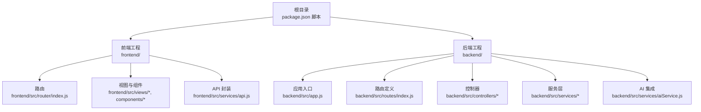
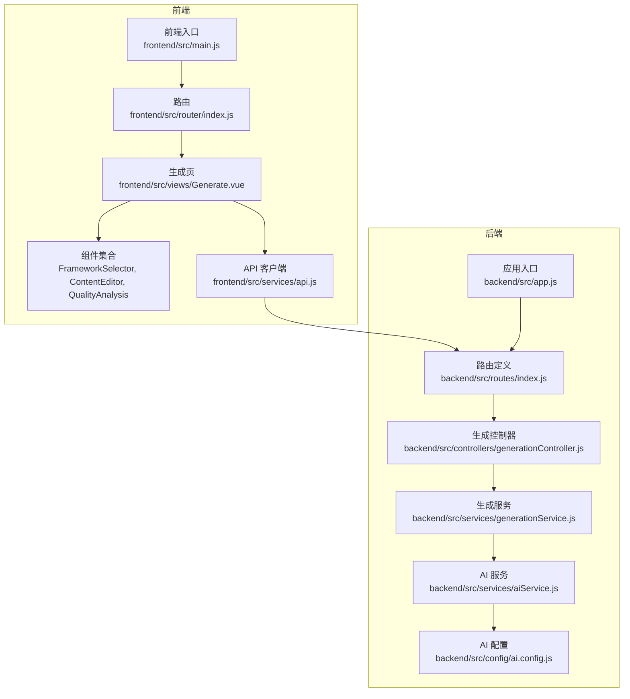
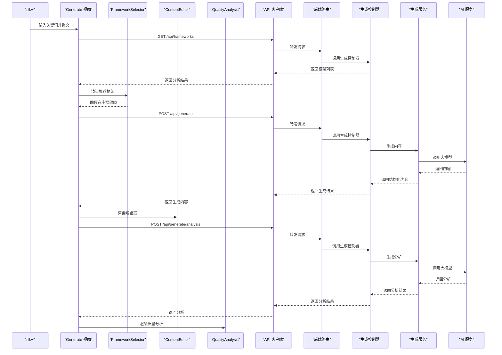
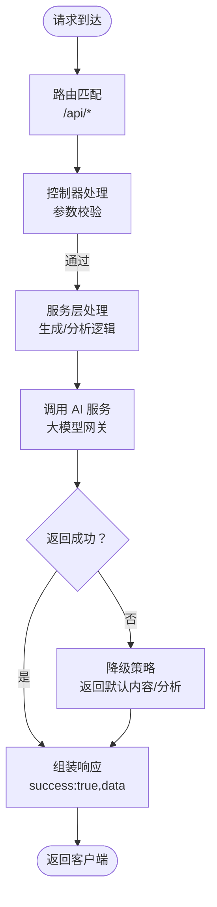
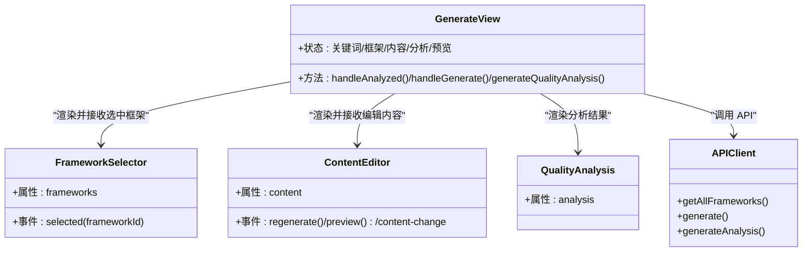
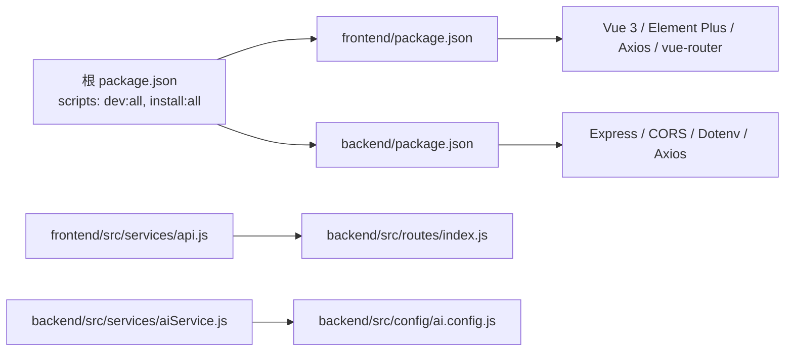

# 整体设计

<cite>
**本文引用的文件**
- [README.md](file://README.md)
- [package.json](file://package.json)
- [backend/package.json](file://backend/package.json)
- [frontend/package.json](file://frontend/package.json)
- [backend/src/app.js](file://backend/src/app.js)
- [backend/src/routes/index.js](file://backend/src/routes/index.js)
- [backend/src/controllers/generationController.js](file://backend/src/controllers/generationController.js)
- [backend/src/controllers/frameworkController.js](file://backend/src/controllers/frameworkController.js)
- [backend/src/services/generationService.js](file://backend/src/services/generationService.js)
- [backend/src/services/aiService.js](file://backend/src/services/aiService.js)
- [backend/src/config/ai.config.js](file://backend/src/config/ai.config.js)
- [frontend/src/main.js](file://frontend/src/main.js)
- [frontend/src/router/index.js](file://frontend/src/router/index.js)
- [frontend/src/views/Generate.vue](file://frontend/src/views/Generate.vue)
- [frontend/src/components/FrameworkSelector.vue](file://frontend/src/components/FrameworkSelector.vue)
- [frontend/src/components/ContentEditor.vue](file://frontend/src/components/ContentEditor.vue)
- [frontend/src/components/QualityAnalysis.vue](file://frontend/src/components/QualityAnalysis.vue)
- [frontend/src/services/api.js](file://frontend/src/services/api.js)
</cite>

## 目录
1. [简介](#简介)
2. [项目结构](#项目结构)
3. [核心组件](#核心组件)
4. [架构总览](#架构总览)
5. [详细组件分析](#详细组件分析)
6. [依赖分析](#依赖分析)
7. [性能考虑](#性能考虑)
8. [故障排查指南](#故障排查指南)
9. [结论](#结论)
10. [附录](#附录)

## 简介
本项目是面向小红书（Xiaohongshu）创作者的智能图文生成工具，提供“爆款文案生成 + 框架选择 + 质量分析 + 实时预览”的一体化工作台。系统采用前后端分离架构：前端基于 Vue 3 + Vite 构建交互界面与组件化流程；后端基于 Node.js + Express 提供 REST API，封装 AI 生成与分析能力。通过模块化设计，前端负责用户交互与视图编排，后端负责业务逻辑与外部服务集成，二者通过统一的 API 协议协同工作。

## 项目结构
项目采用多包结构，根目录提供统一的开发脚本与构建配置，分别管理前端与后端的独立依赖与启动方式。核心目录与职责如下：
- backend：后端服务，提供 REST 接口、控制器、服务层与 AI 集成
- frontend：前端工程，包含路由、视图、组件与 API 服务封装
- src：根目录下的通用资源与布局（与当前工作台页面解耦）
- docs：产品与使用说明文档

图表来源
- [package.json](file://package.json#L6-L13)
- [frontend/src/router/index.js](file://frontend/src/router/index.js#L6-L22)
- [frontend/src/services/api.js](file://frontend/src/services/api.js#L8-L11)
- [backend/src/app.js](file://backend/src/app.js#L11-L24)
- [backend/src/routes/index.js](file://backend/src/routes/index.js#L9-L18)
- [backend/src/controllers/generationController.js](file://backend/src/controllers/generationController.js#L10-L33)
- [backend/src/services/aiService.js](file://backend/src/services/aiService.js#L14-L53)

章节来源
- [README.md](file://README.md#L13-L22)
- [package.json](file://package.json#L6-L13)

## 核心组件
- 前端核心
  - 应用入口与路由：应用挂载于根节点，使用 History 模式路由，默认指向生成页
  - 视图与组件：生成页作为主流程容器，内含关键词输入、框架选择、内容编辑、质量分析与预览组件
  - API 封装：统一前缀 /api 的请求客户端，按功能拆分框架、分析与生成接口
- 后端核心
  - 应用入口：加载 CORS、JSON 解析与路由中间件，监听端口
  - 路由定义：暴露框架查询、关键词分析、内容生成、质量分析与图片代理等接口
  - 控制器：接收请求参数，调用服务层处理，返回标准化响应
  - 服务层：封装 AI 调用与内容生成/分析逻辑，包含提示词模板与降级策略
  - AI 集成：封装第三方大模型网关的认证与请求参数

章节来源
- [frontend/src/main.js](file://frontend/src/main.js#L10-L13)
- [frontend/src/router/index.js](file://frontend/src/router/index.js#L6-L22)
- [frontend/src/views/Generate.vue](file://frontend/src/views/Generate.vue#L56-L154)
- [frontend/src/services/api.js](file://frontend/src/services/api.js#L8-L37)
- [backend/src/app.js](file://backend/src/app.js#L11-L24)
- [backend/src/routes/index.js](file://backend/src/routes/index.js#L9-L18)
- [backend/src/controllers/generationController.js](file://backend/src/controllers/generationController.js#L10-L94)
- [backend/src/services/generationService.js](file://backend/src/services/generationService.js#L63-L193)
- [backend/src/services/aiService.js](file://backend/src/services/aiService.js#L14-L53)

## 架构总览
系统采用典型的前后端分离架构，前端负责用户交互与视图编排，后端负责业务处理与外部服务对接。核心交互链路包括：前端发起请求 -> 后端路由分发 -> 控制器校验参数 -> 服务层调用 AI -> 返回结构化数据。

图表来源
- [frontend/src/main.js](file://frontend/src/main.js#L10-L13)
- [frontend/src/router/index.js](file://frontend/src/router/index.js#L6-L22)
- [frontend/src/views/Generate.vue](file://frontend/src/views/Generate.vue#L56-L154)
- [frontend/src/services/api.js](file://frontend/src/services/api.js#L8-L37)
- [backend/src/app.js](file://backend/src/app.js#L11-L24)
- [backend/src/routes/index.js](file://backend/src/routes/index.js#L9-L18)
- [backend/src/controllers/generationController.js](file://backend/src/controllers/generationController.js#L10-L33)
- [backend/src/services/generationService.js](file://backend/src/services/generationService.js#L63-L94)
- [backend/src/services/aiService.js](file://backend/src/services/aiService.js#L14-L53)
- [backend/src/config/ai.config.js](file://backend/src/config/ai.config.js#L6-L17)

## 详细组件分析

### 前端组件与视图编排
- Generate 视图：串联关键词分析、框架选择、内容生成、质量分析与预览，负责状态管理与事件流转
- FrameworkSelector：从分析结果中展示推荐框架，支持选择并回传框架 ID
- ContentEditor：对生成内容进行可视化编辑，支持标签增删与预览触发
- QualityAnalysis：折叠面板展示钩子、框架、结构与吸引力四个维度的质量分析
- API 客户端：统一前缀 /api，封装框架查询、关键词分析、内容生成与分析接口

图表来源
- [frontend/src/views/Generate.vue](file://frontend/src/views/Generate.vue#L75-L135)
- [frontend/src/components/FrameworkSelector.vue](file://frontend/src/components/FrameworkSelector.vue#L54-L60)
- [frontend/src/components/ContentEditor.vue](file://frontend/src/components/ContentEditor.vue#L97-L105)
- [frontend/src/components/QualityAnalysis.vue](file://frontend/src/components/QualityAnalysis.vue#L135-L143)
- [frontend/src/services/api.js](file://frontend/src/services/api.js#L13-L37)
- [backend/src/routes/index.js](file://backend/src/routes/index.js#L11-L16)
- [backend/src/controllers/generationController.js](file://backend/src/controllers/generationController.js#L10-L64)
- [backend/src/services/generationService.js](file://backend/src/services/generationService.js#L63-L162)
- [backend/src/services/aiService.js](file://backend/src/services/aiService.js#L14-L53)

章节来源
- [frontend/src/views/Generate.vue](file://frontend/src/views/Generate.vue#L56-L154)
- [frontend/src/components/FrameworkSelector.vue](file://frontend/src/components/FrameworkSelector.vue#L42-L61)
- [frontend/src/components/ContentEditor.vue](file://frontend/src/components/ContentEditor.vue#L80-L133)
- [frontend/src/components/QualityAnalysis.vue](file://frontend/src/components/QualityAnalysis.vue#L131-L144)
- [frontend/src/services/api.js](file://frontend/src/services/api.js#L8-L37)

### 后端服务与数据流
- 应用入口：启用 CORS、JSON 中间件与路由挂载，统一监听端口
- 路由定义：暴露框架查询、关键词分析、内容生成、分析生成与图片代理接口
- 控制器：对请求参数进行必要校验，调用服务层并返回标准响应
- 服务层：封装提示词模板与降级策略，确保返回结构化数据
- AI 服务：封装第三方大模型网关的认证与请求参数，统一错误处理

图表来源
- [backend/src/app.js](file://backend/src/app.js#L11-L24)
- [backend/src/routes/index.js](file://backend/src/routes/index.js#L9-L18)
- [backend/src/controllers/generationController.js](file://backend/src/controllers/generationController.js#L10-L94)
- [backend/src/services/generationService.js](file://backend/src/services/generationService.js#L63-L193)
- [backend/src/services/aiService.js](file://backend/src/services/aiService.js#L14-L53)

章节来源
- [backend/src/app.js](file://backend/src/app.js#L11-L24)
- [backend/src/routes/index.js](file://backend/src/routes/index.js#L9-L18)
- [backend/src/controllers/generationController.js](file://backend/src/controllers/generationController.js#L10-L94)
- [backend/src/services/generationService.js](file://backend/src/services/generationService.js#L63-L193)
- [backend/src/services/aiService.js](file://backend/src/services/aiService.js#L14-L53)

### 组件关系与职责划分
- 前端
  - Generate 视图：协调流程与状态，负责调用 API 并驱动组件渲染
  - FrameworkSelector：负责框架选择与回传
  - ContentEditor：负责内容编辑与变更通知
  - QualityAnalysis：负责分析结果的可视化展示
  - API 客户端：负责统一的请求封装与错误提示
- 后端
  - 路由层：负责 URL 到控制器的映射
  - 控制器层：负责参数校验与响应包装
  - 服务层：负责业务逻辑与 AI 调用
  - AI 层：负责外部服务集成与错误处理

图表来源
- [frontend/src/views/Generate.vue](file://frontend/src/views/Generate.vue#L56-L154)
- [frontend/src/components/FrameworkSelector.vue](file://frontend/src/components/FrameworkSelector.vue#L42-L61)
- [frontend/src/components/ContentEditor.vue](file://frontend/src/components/ContentEditor.vue#L80-L133)
- [frontend/src/components/QualityAnalysis.vue](file://frontend/src/components/QualityAnalysis.vue#L131-L144)
- [frontend/src/services/api.js](file://frontend/src/services/api.js#L13-L37)

章节来源
- [frontend/src/views/Generate.vue](file://frontend/src/views/Generate.vue#L56-L154)
- [frontend/src/components/FrameworkSelector.vue](file://frontend/src/components/FrameworkSelector.vue#L42-L61)
- [frontend/src/components/ContentEditor.vue](file://frontend/src/components/ContentEditor.vue#L80-L133)
- [frontend/src/components/QualityAnalysis.vue](file://frontend/src/components/QualityAnalysis.vue#L131-L144)
- [frontend/src/services/api.js](file://frontend/src/services/api.js#L13-L37)

## 依赖分析
- 根目录脚本：提供一键安装与同时启动前后端的能力，便于本地联调
- 前端依赖：Vue 3、Element Plus、Axios、vue-router 等，用于构建交互界面与网络请求
- 后端依赖：Express、CORS、Dotenv、Axios 等，用于搭建 Web 服务与跨域支持
- 集成点：前端通过 /api 前缀访问后端接口；后端通过配置文件注入 AI 网关地址与密钥

图表来源
- [package.json](file://package.json#L6-L13)
- [frontend/package.json](file://frontend/package.json#L10-L19)
- [backend/package.json](file://backend/package.json#L10-L15)
- [frontend/src/services/api.js](file://frontend/src/services/api.js#L8-L11)
- [backend/src/routes/index.js](file://backend/src/routes/index.js#L9-L18)
- [backend/src/services/aiService.js](file://backend/src/services/aiService.js#L14-L53)
- [backend/src/config/ai.config.js](file://backend/src/config/ai.config.js#L6-L17)

章节来源
- [package.json](file://package.json#L6-L13)
- [frontend/package.json](file://frontend/package.json#L10-L19)
- [backend/package.json](file://backend/package.json#L10-L15)
- [frontend/src/services/api.js](file://frontend/src/services/api.js#L8-L11)
- [backend/src/routes/index.js](file://backend/src/routes/index.js#L9-L18)
- [backend/src/services/aiService.js](file://backend/src/services/aiService.js#L14-L53)
- [backend/src/config/ai.config.js](file://backend/src/config/ai.config.js#L6-L17)

## 性能考虑
- 请求超时与降级：前端 API 客户端设置合理超时；后端服务层在 AI 返回异常或非预期格式时采用降级策略，保证可用性
- 跨域与代理：后端提供图片代理接口，避免前端直连跨域导致的下载限制
- 模块化与职责分离：前后端均采用分层设计，便于按需扩展与优化
- 建议
  - 对高频接口引入缓存（如框架描述、常见关键词分析结果）
  - 对大模型调用增加重试与熔断机制
  - 前端对长文本与图片懒加载，减少首屏压力

## 故障排查指南
- 常见问题
  - 无法访问后端接口：检查前端 baseURL 是否正确，后端是否在指定端口启动
  - 生成失败：查看后端控制台日志，确认 AI 服务是否可达；检查密钥与网关地址配置
  - 质量分析为空：确认已生成内容后再调用分析接口
  - 图片无法显示：使用后端代理接口下载图片，避免跨域问题
- 排查步骤
  - 前端：打开浏览器开发者工具 Network 面板，确认 /api 请求状态码与响应体
  - 后端：查看控制台输出，定位控制器与服务层抛出的异常
  - AI：检查密钥、网关地址与超时设置，确认第三方服务可用性

章节来源
- [frontend/src/services/api.js](file://frontend/src/services/api.js#L8-L11)
- [backend/src/controllers/generationController.js](file://backend/src/controllers/generationController.js#L69-L94)
- [backend/src/services/aiService.js](file://backend/src/services/aiService.js#L45-L53)

## 结论
本系统通过前后端分离与模块化设计，实现了从关键词输入到内容生成、质量分析与预览的完整工作流。前端以组件化方式组织交互，后端以服务层封装业务与外部集成，二者通过统一 API 协同。该架构具备良好的可维护性与扩展性，便于后续接入更多 MCP 工具与内容框架。

## 附录
- 系统边界
  - 前端边界：仅负责用户交互与视图编排，不直接处理业务逻辑
  - 后端边界：负责业务处理、外部服务集成与数据返回
- 集成模式
  - 前端通过 /api 前缀调用后端接口
  - 后端通过配置文件注入 AI 网关地址与密钥
- 扩展点
  - 新增内容框架：在服务层补充提示词模板与降级策略
  - 新增 MCP 工具：在后端新增控制器与服务层方法，前端新增组件与调用
  - 新增分析维度：在生成服务与前端分析组件中扩展字段与展示