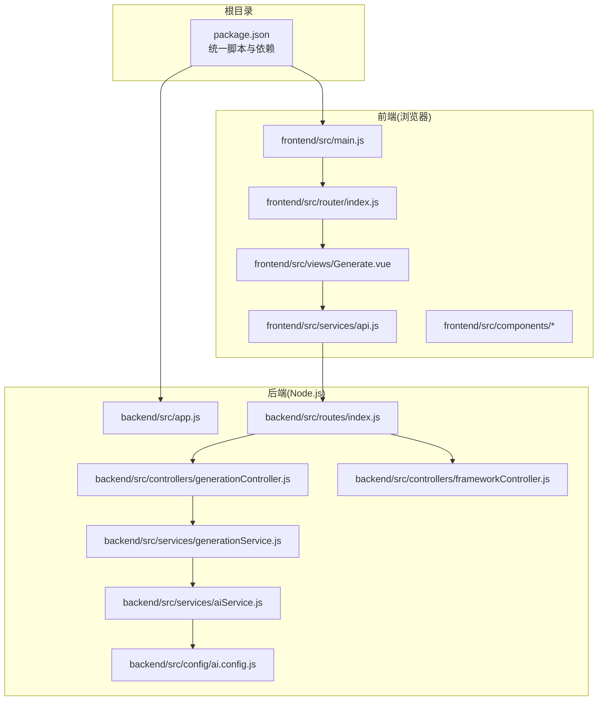
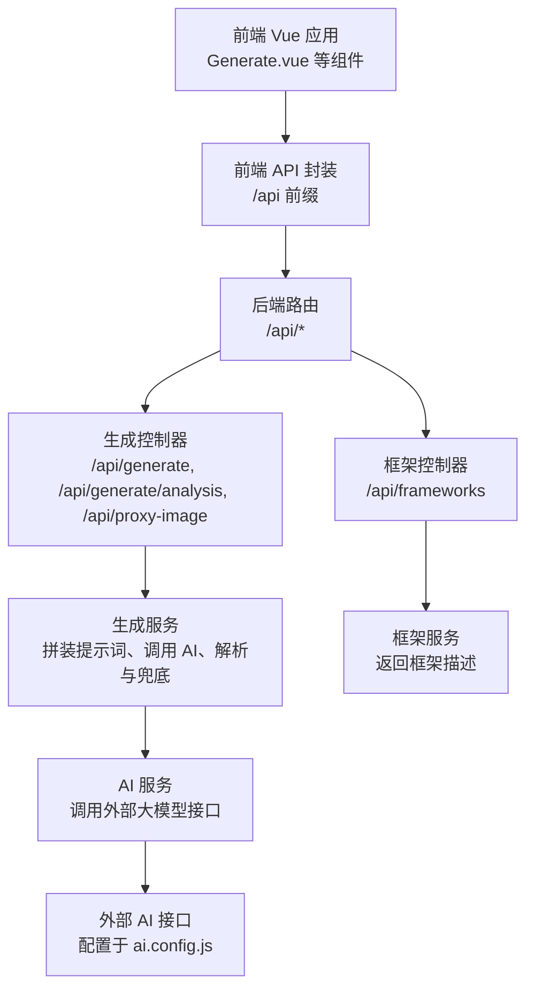
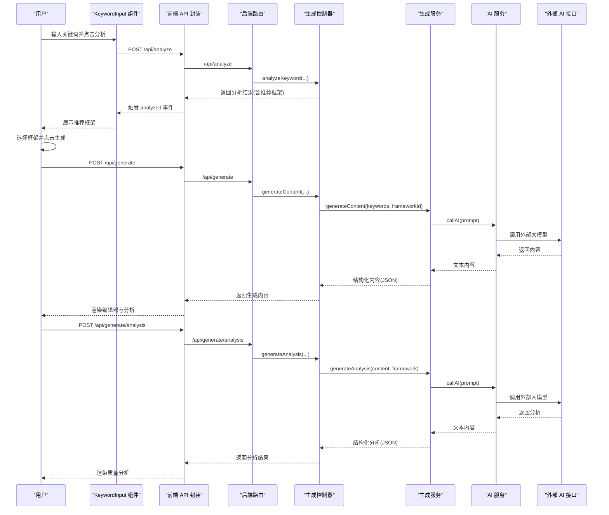
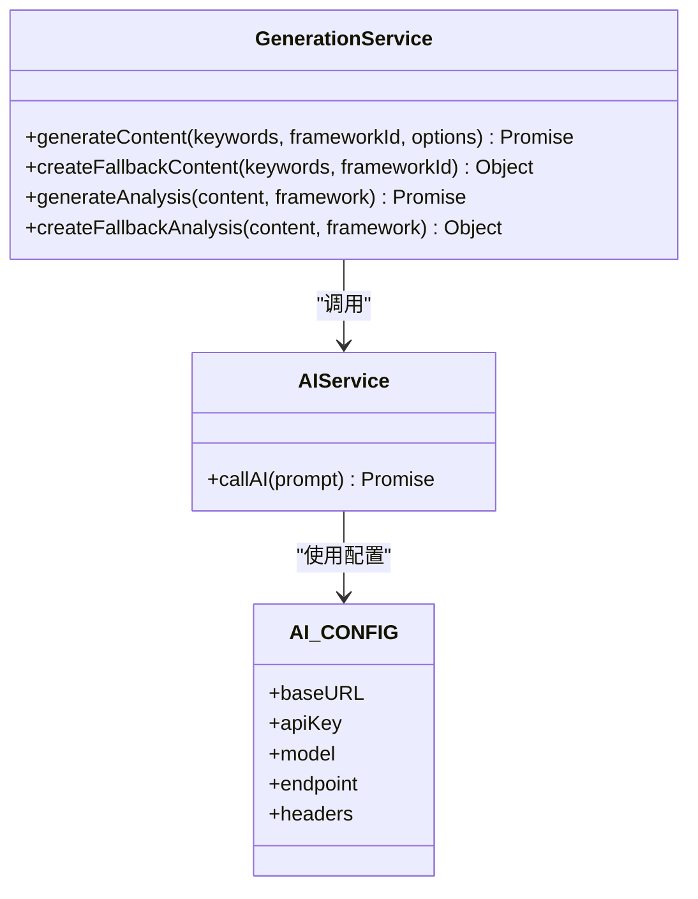
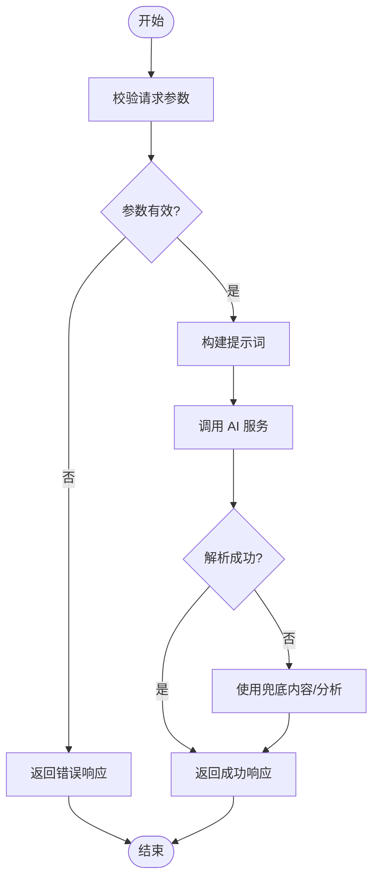
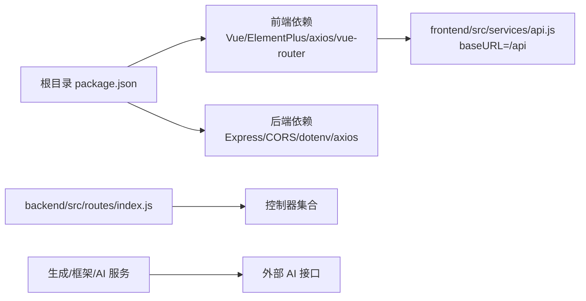

# 系统架构

<cite>
**本文引用的文件**
- [README.md](file://README.md)
- [package.json](file://package.json)
- [backend/src/app.js](file://backend/src/app.js)
- [backend/src/routes/index.js](file://backend/src/routes/index.js)
- [backend/src/controllers/generationController.js](file://backend/src/controllers/generationController.js)
- [backend/src/controllers/frameworkController.js](file://backend/src/controllers/frameworkController.js)
- [backend/src/services/generationService.js](file://backend/src/services/generationService.js)
- [backend/src/services/aiService.js](file://backend/src/services/aiService.js)
- [backend/src/config/ai.config.js](file://backend/src/config/ai.config.js)
- [frontend/src/main.js](file://frontend/src/main.js)
- [frontend/src/router/index.js](file://frontend/src/router/index.js)
- [frontend/src/views/Generate.vue](file://frontend/src/views/Generate.vue)
- [frontend/src/services/api.js](file://frontend/src/services/api.js)
- [frontend/src/components/KeywordInput.vue](file://frontend/src/components/KeywordInput.vue)
- [frontend/src/components/FrameworkSelector.vue](file://frontend/src/components/FrameworkSelector.vue)
</cite>

## 目录
1. [简介](#简介)
2. [项目结构](#项目结构)
3. [核心组件](#核心组件)
4. [架构总览](#架构总览)
5. [详细组件分析](#详细组件分析)
6. [依赖分析](#依赖分析)
7. [性能考虑](#性能考虑)
8. [故障排查指南](#故障排查指南)
9. [结论](#结论)
10. [附录](#附录)

## 简介
本项目是面向小红书（Xiaohongshu）创作者的智能图文生成工具，提供“智能文案生成、MCP工具集成、实时效果预览、全自动配图、质量分析诊断”等能力。系统采用前后端分离架构：前端基于 Vue 3 + Vite 构建交互界面与路由；后端基于 Node.js + Express 提供 REST API，封装 AI 生成与分析能力。

- 前端负责用户交互、内容编辑、质量分析与预览展示。
- 后端负责接收请求、编排业务流程、调用外部 AI 接口、返回结构化内容与分析结果。
- 通过统一的 /api 前缀路由，前后端解耦协作，便于独立开发与部署。

章节来源
- file://README.md#L1-L76
- file://package.json#L1-L32

## 项目结构
项目采用“根目录多包管理 + 前后端分离”的组织方式：
- 根目录 package.json 提供统一脚本，支持一键安装与并行启动前后端。
- backend 目录：Express 应用、路由、控制器、服务层与 AI 配置。
- frontend 目录：Vue 3 应用、路由、视图与组件、API 封装。

图表来源
- [package.json](file://package.json#L6-L13)
- [backend/src/app.js](file://backend/src/app.js#L1-L26)
- [backend/src/routes/index.js](file://backend/src/routes/index.js#L1-L21)
- [backend/src/controllers/generationController.js](file://backend/src/controllers/generationController.js#L1-L100)
- [backend/src/controllers/frameworkController.js](file://backend/src/controllers/frameworkController.js#L1-L49)
- [backend/src/services/generationService.js](file://backend/src/services/generationService.js#L1-L194)
- [backend/src/services/aiService.js](file://backend/src/services/aiService.js#L1-L55)
- [backend/src/config/ai.config.js](file://backend/src/config/ai.config.js#L1-L18)
- [frontend/src/main.js](file://frontend/src/main.js#L1-L15)
- [frontend/src/router/index.js](file://frontend/src/router/index.js#L1-L26)
- [frontend/src/views/Generate.vue](file://frontend/src/views/Generate.vue#L1-L189)
- [frontend/src/services/api.js](file://frontend/src/services/api.js#L1-L40)

章节来源
- file://README.md#L13-L22
- file://package.json#L6-L13

## 核心组件
- 前端应用入口与路由
  - 应用入口：注册 Element Plus、Vue Router，挂载根组件。
  - 路由：单页路由，首页指向生成页面。
- 生成页面与组件
  - 关键词输入组件：支持手动输入与快捷标签，触发分析。
  - 框架选择组件：展示推荐框架与匹配度。
  - 生成动作卡片：选择框架后触发生成。
  - 内容编辑器、质量分析、预览组件：生成后展示与交互。
- 后端应用与路由
  - Express 应用：启用 CORS、JSON 解析、挂载 /api 路由。
  - 路由：提供框架查询、关键词分析、内容生成、质量分析、图片代理等接口。
- 服务层
  - 生成服务：拼装提示词、调用 AI、解析与兜底处理。
  - AI 服务：封装外部大模型 API 调用与错误处理。
  - 框架控制器：提供框架列表与详情查询。
  - 生成控制器：接收参数、调用服务、返回结构化结果；提供图片代理。

章节来源
- file://frontend/src/main.js#L1-L15
- file://frontend/src/router/index.js#L1-L26
- file://frontend/src/views/Generate.vue#L1-L189
- file://frontend/src/components/KeywordInput.vue#L1-L148
- file://frontend/src/components/FrameworkSelector.vue#L1-L121
- file://backend/src/app.js#L1-L26
- file://backend/src/routes/index.js#L1-L21
- file://backend/src/controllers/generationController.js#L1-L100
- file://backend/src/controllers/frameworkController.js#L1-L49
- file://backend/src/services/generationService.js#L1-L194
- file://backend/src/services/aiService.js#L1-L55
- file://backend/src/config/ai.config.js#L1-L18

## 架构总览
系统采用典型的前后端分离架构：
- 前端通过 axios 发起 /api 前缀请求，后端统一暴露 REST 接口。
- 后端内部按 MVC 分层：路由 -> 控制器 -> 服务 -> 外部 AI。
- 数据流从用户输入（关键词）开始，经分析推荐框架，再生成内容与分析，最终返回给前端渲染。

图表来源
- [frontend/src/views/Generate.vue](file://frontend/src/views/Generate.vue#L56-L155)
- [frontend/src/services/api.js](file://frontend/src/services/api.js#L8-L37)
- [backend/src/routes/index.js](file://backend/src/routes/index.js#L11-L16)
- [backend/src/controllers/generationController.js](file://backend/src/controllers/generationController.js#L10-L94)
- [backend/src/controllers/frameworkController.js](file://backend/src/controllers/frameworkController.js#L8-L45)
- [backend/src/services/generationService.js](file://backend/src/services/generationService.js#L63-L194)
- [backend/src/services/aiService.js](file://backend/src/services/aiService.js#L14-L53)
- [backend/src/config/ai.config.js](file://backend/src/config/ai.config.js#L6-L17)

## 详细组件分析

### 前端组件交互序列
从前端视角，用户从关键词输入开始，到生成内容与质量分析的完整流程如下：

图表来源
- [frontend/src/components/KeywordInput.vue](file://frontend/src/components/KeywordInput.vue#L81-L102)
- [frontend/src/services/api.js](file://frontend/src/services/api.js#L22-L35)
- [backend/src/routes/index.js](file://backend/src/routes/index.js#L13-L15)
- [backend/src/controllers/generationController.js](file://backend/src/controllers/generationController.js#L10-L64)
- [backend/src/services/generationService.js](file://backend/src/services/generationService.js#L63-L194)
- [backend/src/services/aiService.js](file://backend/src/services/aiService.js#L14-L53)

章节来源
- file://frontend/src/components/KeywordInput.vue#L1-L148
- file://frontend/src/views/Generate.vue#L75-L135
- file://frontend/src/services/api.js#L1-L40
- file://backend/src/controllers/generationController.js#L1-L100
- file://backend/src/services/generationService.js#L1-L194
- file://backend/src/services/aiService.js#L1-L55

### 后端服务类关系
后端服务层采用类与静态方法组织，职责清晰、易于扩展。

图表来源
- [backend/src/services/generationService.js](file://backend/src/services/generationService.js#L63-L194)
- [backend/src/services/aiService.js](file://backend/src/services/aiService.js#L1-L55)
- [backend/src/config/ai.config.js](file://backend/src/config/ai.config.js#L6-L17)

章节来源
- file://backend/src/services/generationService.js#L1-L194
- file://backend/src/services/aiService.js#L1-L55
- file://backend/src/config/ai.config.js#L1-L18

### 关键流程：内容生成与质量分析
- 内容生成流程
  - 前端提交关键词与框架 ID。
  - 后端控制器校验参数，调用生成服务。
  - 生成服务拼装提示词，调用 AI 服务，解析返回内容；若非 JSON 或失败则回退到兜底内容。
  - 返回结构化内容（标题、正文、图片、标签）。
- 质量分析流程
  - 前端提交已生成内容与框架 ID。
  - 后端控制器校验参数，调用生成服务进行分析。
  - 生成服务调用 AI 服务，解析返回分析；若失败则回退到兜底分析。
  - 返回结构化的质量分析（钩子、框架、结构、吸引力评分等）。

图表来源
- [backend/src/controllers/generationController.js](file://backend/src/controllers/generationController.js#L10-L64)
- [backend/src/services/generationService.js](file://backend/src/services/generationService.js#L63-L194)
- [backend/src/services/aiService.js](file://backend/src/services/aiService.js#L14-L53)

章节来源
- file://backend/src/controllers/generationController.js#L1-L100
- file://backend/src/services/generationService.js#L1-L194
- file://backend/src/services/aiService.js#L1-L55

## 依赖分析
- 前端依赖
  - Vue 3、Element Plus、vue-router、axios。
  - 通过统一 baseURL 为 /api，简化跨域与代理配置。
- 后端依赖
  - Express、CORS、dotenv、axios。
  - 路由集中暴露 /api/*，控制器与服务解耦。
- 根目录脚本
  - 提供一键安装与并行启动前后端的能力，提升开发效率。

图表来源
- [package.json](file://package.json#L15-L31)
- [frontend/src/services/api.js](file://frontend/src/services/api.js#L8-L11)
- [backend/src/routes/index.js](file://backend/src/routes/index.js#L1-L21)
- [backend/src/services/aiService.js](file://backend/src/services/aiService.js#L1-L55)

章节来源
- file://package.json#L1-L32
- file://frontend/src/services/api.js#L1-L40
- file://backend/src/routes/index.js#L1-L21

## 性能考虑
- 请求超时与响应头设置
  - 前端 API 默认超时时间适中，避免长时间阻塞。
  - 后端图片代理设置合理超时与响应头，保证跨域图片加载稳定。
- AI 调用稳定性
  - 生成服务与分析服务均包含 JSON 解析与兜底策略，避免因外部接口异常导致整链路失败。
- 路由与中间件
  - 后端启用 CORS 与 JSON 中间件，减少跨域与解析问题。
- 建议
  - 对高频接口增加缓存（如框架描述、热门关键词），降低重复请求。
  - 对 AI 调用增加重试与熔断机制，提升鲁棒性。
  - 对图片代理增加本地缓存与缩略图策略，减少带宽占用。

章节来源
- file://frontend/src/services/api.js#L8-L11
- file://backend/src/controllers/generationController.js#L69-L94
- file://backend/src/services/generationService.js#L63-L194
- file://backend/src/app.js#L14-L18

## 故障排查指南
- 常见问题与定位
  - 无法连接后端：检查前端 baseURL 是否正确映射至 /api；确认后端是否在监听指定端口。
  - 生成失败：查看后端控制器与服务层错误处理日志；确认 AI 接口可用与鉴权头正确。
  - 质量分析异常：确认传入内容与框架 ID 参数；检查 AI 返回内容是否为期望 JSON。
  - 图片跨域问题：使用后端代理接口下载图片，确保 URL 参数有效。
- 建议的日志与监控
  - 记录请求参数、AI 返回内容摘要与错误堆栈。
  - 对关键接口增加超时与重试策略，必要时引入熔断与降级。

章节来源
- file://frontend/src/services/api.js#L8-L11
- file://backend/src/controllers/generationController.js#L10-L33
- file://backend/src/services/generationService.js#L63-L94
- file://backend/src/services/aiService.js#L45-L52

## 结论
本系统通过前后端分离架构实现了清晰的职责划分与良好的扩展性。前端专注于用户体验与内容编辑，后端专注业务编排与 AI 能力集成。通过统一的 /api 路由与服务层抽象，系统具备较强的可维护性与可演进性。后续可在缓存、重试与监控等方面进一步增强稳定性与可观测性。

## 附录
- 快速启动
  - 根目录一键安装与并行启动：npm run install:all 与 npm run dev:all。
  - 单独启动前端与后端：分别在根目录与 backend 目录执行相应脚本。
- 使用说明
  - 进入工作台后，输入关键词并分析，选择推荐框架，一键生成内容与质量分析。

章节来源
- file://README.md#L24-L56
- file://package.json#L12-L13