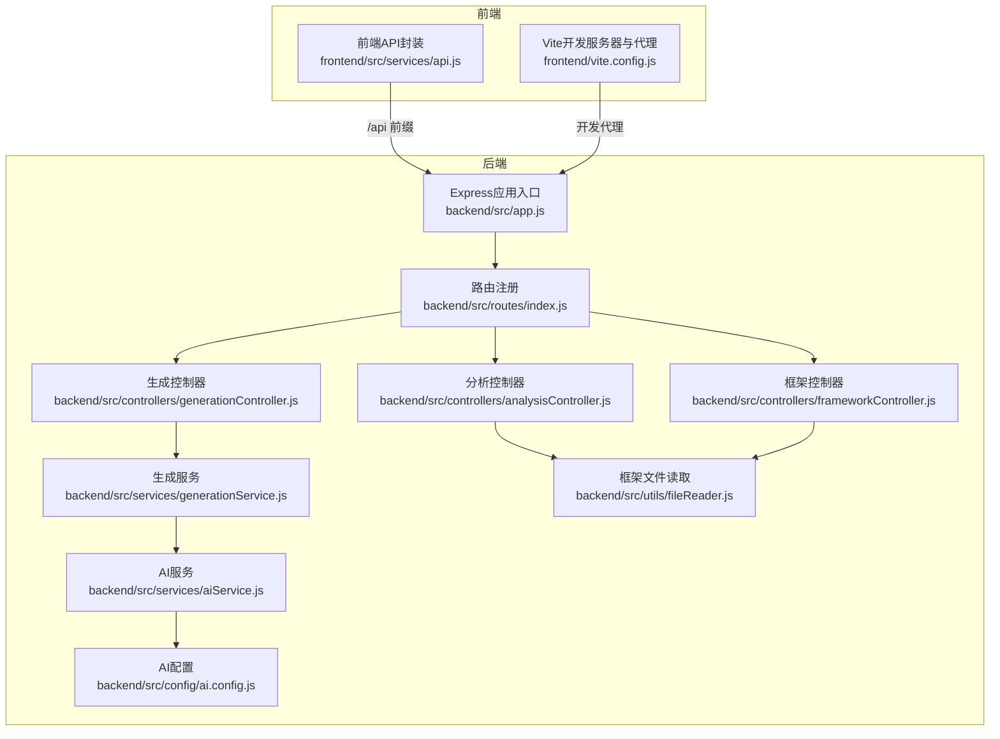
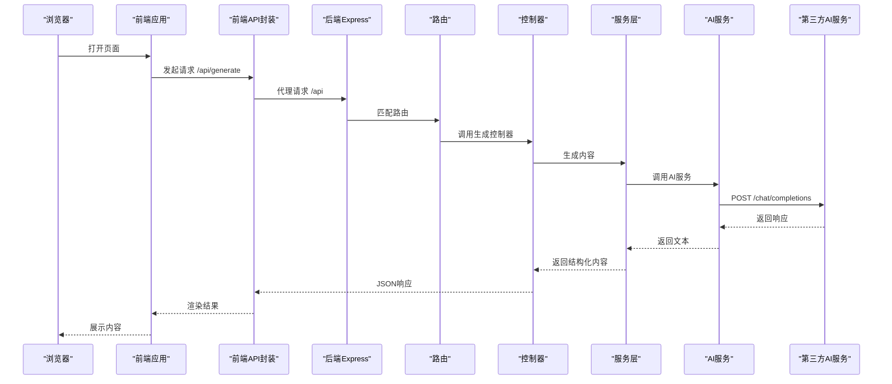
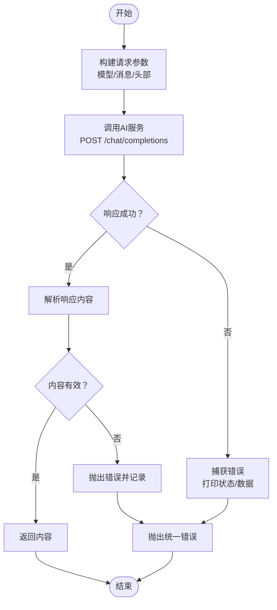
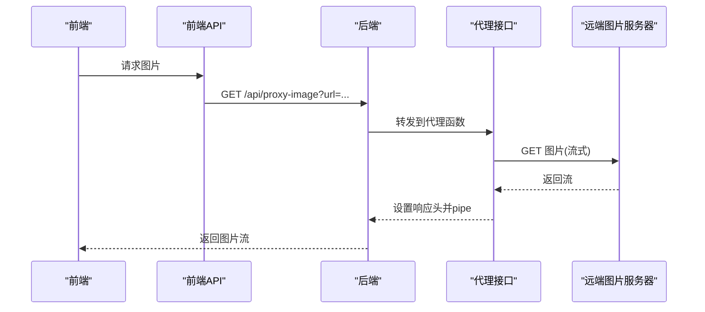
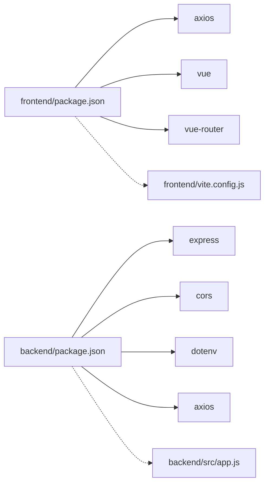

# 集成模式

<cite>
**本文引用的文件**
- [backend/src/app.js](file://backend/src/app.js)
- [backend/.env](file://backend/.env)
- [backend/src/config/ai.config.js](file://backend/src/config/ai.config.js)
- [backend/src/services/aiService.js](file://backend/src/services/aiService.js)
- [backend/src/routes/index.js](file://backend/src/routes/index.js)
- [backend/src/controllers/generationController.js](file://backend/src/controllers/generationController.js)
- [backend/src/controllers/analysisController.js](file://backend/src/controllers/analysisController.js)
- [backend/src/controllers/frameworkController.js](file://backend/src/controllers/frameworkController.js)
- [backend/src/services/generationService.js](file://backend/src/services/generationService.js)
- [backend/src/services/frameworkService.js](file://backend/src/services/frameworkService.js)
- [backend/src/utils/fileReader.js](file://backend/src/utils/fileReader.js)
- [backend/package.json](file://backend/package.json)
- [frontend/src/services/api.js](file://frontend/src/services/api.js)
- [frontend/vite.config.js](file://frontend/vite.config.js)
- [frontend/package.json](file://frontend/package.json)
</cite>

## 目录
1. [简介](#简介)
2. [项目结构](#项目结构)
3. [核心组件](#核心组件)
4. [架构总览](#架构总览)
5. [详细组件分析](#详细组件分析)
6. [依赖关系分析](#依赖关系分析)
7. [性能考量](#性能考量)
8. [故障排查指南](#故障排查指南)
9. [结论](#结论)
10. [附录](#附录)

## 简介
本文件面向开发者与运维人员，系统化阐述“小红书爆款文案生成工具”的外部系统集成模式。重点覆盖：
- AI服务集成策略：大模型API调用、非流式响应处理与错误处理
- 第三方API集成：图片下载代理、跨域资源访问
- 配置管理机制：环境变量、密钥与动态配置
- 安全集成考虑：认证、加密与访问控制
- 集成测试策略、监控告警与故障恢复
- 集成架构图与API调用流程图，帮助快速理解系统外部集成设计

## 项目结构
后端采用Express框架，提供REST接口；前端基于Vue+Vite，通过反向代理访问后端API；AI服务通过独立配置与服务模块封装。

图表来源
- [backend/src/app.js](file://backend/src/app.js#L1-L26)
- [backend/src/routes/index.js](file://backend/src/routes/index.js#L1-L21)
- [backend/src/controllers/generationController.js](file://backend/src/controllers/generationController.js#L1-L100)
- [backend/src/controllers/analysisController.js](file://backend/src/controllers/analysisController.js#L1-L37)
- [backend/src/controllers/frameworkController.js](file://backend/src/controllers/frameworkController.js#L1-L49)
- [backend/src/services/generationService.js](file://backend/src/services/generationService.js#L1-L194)
- [backend/src/services/aiService.js](file://backend/src/services/aiService.js#L1-L55)
- [backend/src/config/ai.config.js](file://backend/src/config/ai.config.js#L1-L18)
- [backend/src/utils/fileReader.js](file://backend/src/utils/fileReader.js#L1-L49)
- [frontend/src/services/api.js](file://frontend/src/services/api.js#L1-L40)
- [frontend/vite.config.js](file://frontend/vite.config.js#L1-L19)

章节来源
- [backend/src/app.js](file://backend/src/app.js#L1-L26)
- [frontend/vite.config.js](file://frontend/vite.config.js#L1-L19)

## 核心组件
- 后端应用与中间件
  - CORS跨域：基于环境变量配置允许来源
  - JSON解析：统一处理请求体
  - 路由挂载：统一前缀/api
- 控制器层
  - 生成内容与质量分析：参数校验、调用生成服务
  - 框架查询：读取本地框架文件并返回描述
  - 图片代理：解决前端下载跨域问题
- 服务层
  - 生成服务：拼装提示词、调用AI服务、容错回退
  - AI服务：封装大模型API调用，设置超时与错误处理
  - 框架服务：读取框架文件、提取描述、匹配关键词
- 前端API封装
  - 统一baseURL为/api，简化跨域与部署迁移
- 配置与环境
  - .env：端口、CORS来源
  - ai.config.js：AI服务基础地址、模型、请求头等

章节来源
- [backend/src/app.js](file://backend/src/app.js#L14-L24)
- [backend/src/controllers/generationController.js](file://backend/src/controllers/generationController.js#L10-L64)
- [backend/src/controllers/frameworkController.js](file://backend/src/controllers/frameworkController.js#L8-L45)
- [backend/src/services/generationService.js](file://backend/src/services/generationService.js#L63-L194)
- [backend/src/services/aiService.js](file://backend/src/services/aiService.js#L14-L53)
- [backend/src/services/frameworkService.js](file://backend/src/services/frameworkService.js#L9-L64)
- [frontend/src/services/api.js](file://frontend/src/services/api.js#L8-L37)
- [backend/.env](file://backend/.env#L3-L5)
- [backend/src/config/ai.config.js](file://backend/src/config/ai.config.js#L6-L17)

## 架构总览
系统采用前后端分离架构，前端通过代理访问后端API，后端统一接入AI服务与本地资源。下图展示从浏览器到AI服务的关键路径与集成点。

图表来源
- [frontend/src/services/api.js](file://frontend/src/services/api.js#L8-L37)
- [backend/src/app.js](file://backend/src/app.js#L18-L20)
- [backend/src/routes/index.js](file://backend/src/routes/index.js#L11-L16)
- [backend/src/controllers/generationController.js](file://backend/src/controllers/generationController.js#L10-L33)
- [backend/src/services/generationService.js](file://backend/src/services/generationService.js#L63-L94)
- [backend/src/services/aiService.js](file://backend/src/services/aiService.js#L14-L53)

## 详细组件分析

### AI服务集成策略
- 大模型API调用
  - 基础地址与模型在配置中集中管理，便于切换与审计
  - 请求体包含模型名、消息数组、是否流式等参数
  - 请求头包含鉴权、来源与标题等必要字段
- 流式响应处理
  - 当前实现为非流式调用，适合稳定与可控的响应格式
  - 若未来需要实时渲染或长文本增量输出，可在现有封装上扩展为流式处理
- 错误重试机制
  - 当前未实现自动重试；建议在AI服务层引入指数退避重试与最大重试次数限制
  - 对网络异常、超时、空响应进行分类处理与日志记录

图表来源
- [backend/src/services/aiService.js](file://backend/src/services/aiService.js#L14-L53)

章节来源
- [backend/src/config/ai.config.js](file://backend/src/config/ai.config.js#L6-L17)
- [backend/src/services/aiService.js](file://backend/src/services/aiService.js#L14-L53)

### 第三方API集成与跨域处理
- 图片下载代理
  - 后端提供代理接口，接收前端传入的图片URL，以流式方式下载并转发
  - 设置响应头以兼容图片类型，并开放跨域访问
  - 适用于前端直连受限或跨域受限场景
- 跨域资源访问
  - 后端启用CORS中间件，允许来源来自环境变量配置
  - 前端开发阶段通过Vite代理将/api前缀转发至后端，避免跨域问题

图表来源
- [backend/src/controllers/generationController.js](file://backend/src/controllers/generationController.js#L69-L94)
- [frontend/src/services/api.js](file://frontend/src/services/api.js#L28-L35)

章节来源
- [backend/src/controllers/generationController.js](file://backend/src/controllers/generationController.js#L69-L94)
- [backend/src/app.js](file://backend/src/app.js#L14-L16)
- [frontend/vite.config.js](file://frontend/vite.config.js#L10-L15)

### 配置管理机制
- 环境变量配置
  - 后端：端口、CORS来源
  - 前端：开发服务器端口与代理目标
- 密钥管理
  - AI服务密钥在配置文件中硬编码，建议迁移到环境变量或安全密钥管理服务
- 动态配置更新
  - 当前未实现运行时热更新；建议引入配置中心或监听文件变更的机制

章节来源
- [backend/.env](file://backend/.env#L3-L5)
- [backend/src/app.js](file://backend/src/app.js#L9-L16)
- [backend/src/config/ai.config.js](file://backend/src/config/ai.config.js#L8-L8)
- [frontend/vite.config.js](file://frontend/vite.config.js#L8-L16)

### 安全集成考虑
- API认证
  - AI服务使用Bearer Token进行鉴权，建议从环境变量注入并定期轮换
- 数据加密
  - 建议对敏感数据在传输与存储层面启用TLS与最小权限原则
- 访问控制
  - 后端已启用CORS白名单；建议结合IP白名单、速率限制与API网关策略

章节来源
- [backend/src/services/aiService.js](file://backend/src/services/aiService.js#L29-L34)
- [backend/src/app.js](file://backend/src/app.js#L14-L16)

### 集成测试策略
- 单元测试
  - 对AI服务调用进行Mock，验证错误分支与超时处理
  - 对生成服务进行输入/输出断言，确保回退逻辑可用
- 接口测试
  - 使用代理链路验证CORS与跨域代理功能
  - 验证框架读取与描述提取的正确性
- 回归测试
  - 在配置变更（如模型、密钥）后执行回归，确保集成稳定性

章节来源
- [backend/src/services/aiService.js](file://backend/src/services/aiService.js#L14-L53)
- [backend/src/services/generationService.js](file://backend/src/services/generationService.js#L63-L194)
- [backend/src/utils/fileReader.js](file://backend/src/utils/fileReader.js#L29-L45)

### 监控告警与故障恢复
- 监控指标
  - AI服务调用成功率、延迟、错误码分布
  - 代理接口的下载成功率与响应时间
- 告警策略
  - 连续失败阈值、超时比例阈值触发告警
- 故障恢复
  - 自动重试与熔断降级（如AI不可用时走本地模板）
  - 快速切换至备用模型或服务节点

章节来源
- [backend/src/services/aiService.js](file://backend/src/services/aiService.js#L45-L52)
- [backend/src/services/generationService.js](file://backend/src/services/generationService.js#L90-L94)

## 依赖关系分析
- 前端依赖
  - axios用于HTTP请求，element-plus与vue-router提供UI与路由能力
  - Vite开发服务器配置了/api代理
- 后端依赖
  - express提供Web框架，cors与dotenv提供跨域与环境变量支持
  - axios用于调用第三方AI服务与图片代理

图表来源
- [frontend/package.json](file://frontend/package.json#L10-L15)
- [backend/package.json](file://backend/package.json#L10-L15)
- [frontend/vite.config.js](file://frontend/vite.config.js#L8-L16)
- [backend/src/app.js](file://backend/src/app.js#L4-L7)

章节来源
- [frontend/package.json](file://frontend/package.json#L1-L21)
- [backend/package.json](file://backend/package.json#L1-L17)

## 性能考量
- 超时与并发
  - AI服务与代理接口均设置了合理超时，避免阻塞线程
  - 建议引入连接池与并发上限，防止突发流量压垮下游
- 缓存策略
  - 对框架描述与常见关键词分析结果进行缓存，减少重复计算
- 响应优化
  - 代理接口采用流式传输，降低内存占用与首包延迟

章节来源
- [backend/src/services/aiService.js](file://backend/src/services/aiService.js#L35-L35)
- [backend/src/controllers/generationController.js](file://backend/src/controllers/generationController.js#L81-L81)

## 故障排查指南
- AI服务调用失败
  - 检查密钥与模型配置是否正确
  - 查看错误日志中的状态码与响应体
  - 验证网络连通性与超时设置
- 跨域与代理问题
  - 确认CORS来源与代理配置一致
  - 检查代理目标端口与路径
- 框架读取异常
  - 确认框架文件存在且可读
  - 检查文件编码与路径回退逻辑

章节来源
- [backend/src/services/aiService.js](file://backend/src/services/aiService.js#L45-L52)
- [backend/src/app.js](file://backend/src/app.js#L14-L16)
- [frontend/vite.config.js](file://frontend/vite.config.js#L10-L15)
- [backend/src/utils/fileReader.js](file://backend/src/utils/fileReader.js#L13-L26)

## 结论
本系统通过清晰的分层与集中配置实现了与AI服务及第三方资源的稳定集成。建议后续在密钥管理、自动重试、监控告警与动态配置方面进一步完善，以提升安全性与可维护性。

## 附录
- 关键流程图：见“架构总览”与“AI服务集成策略”中的流程图
- API定义（基于现有实现）
  - 获取全部框架：GET /api/frameworks
  - 获取指定框架：GET /api/frameworks/:name
  - 关键词分析：POST /api/analyze
  - 生成内容：POST /api/generate
  - 生成分析：POST /api/generate/analysis
  - 图片代理：GET /api/proxy-image?url=...

章节来源
- [backend/src/routes/index.js](file://backend/src/routes/index.js#L11-L16)
- [frontend/src/services/api.js](file://frontend/src/services/api.js#L13-L35)