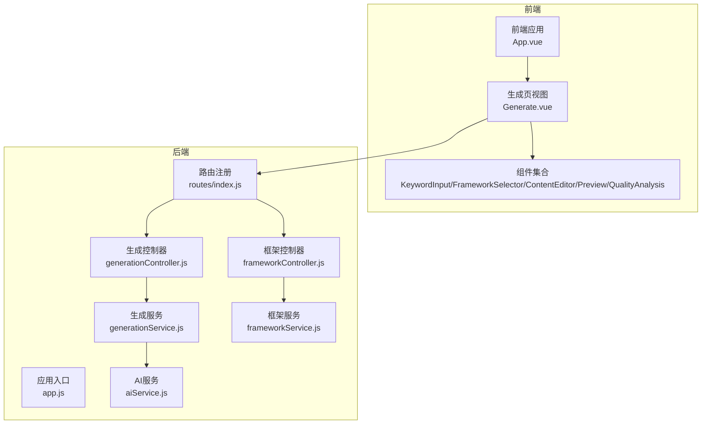
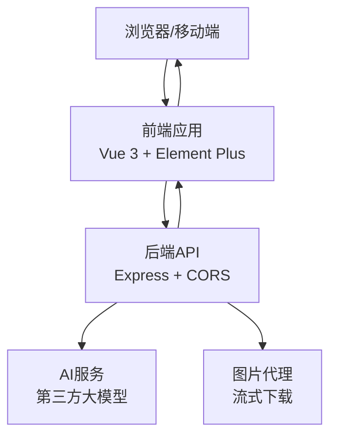
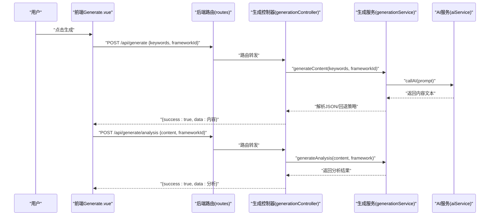
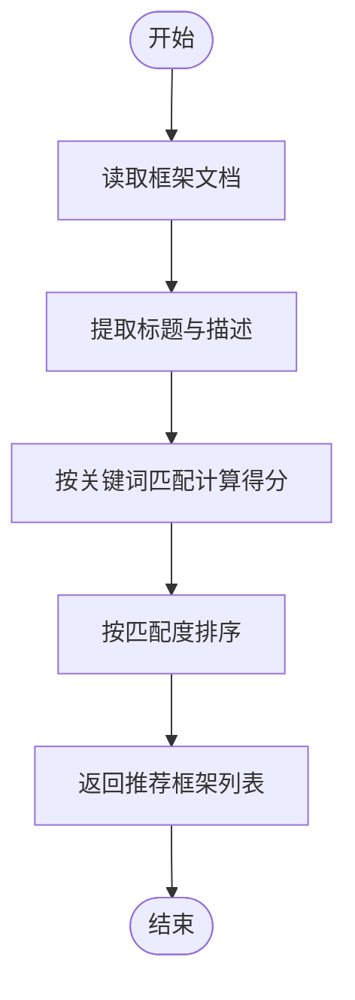
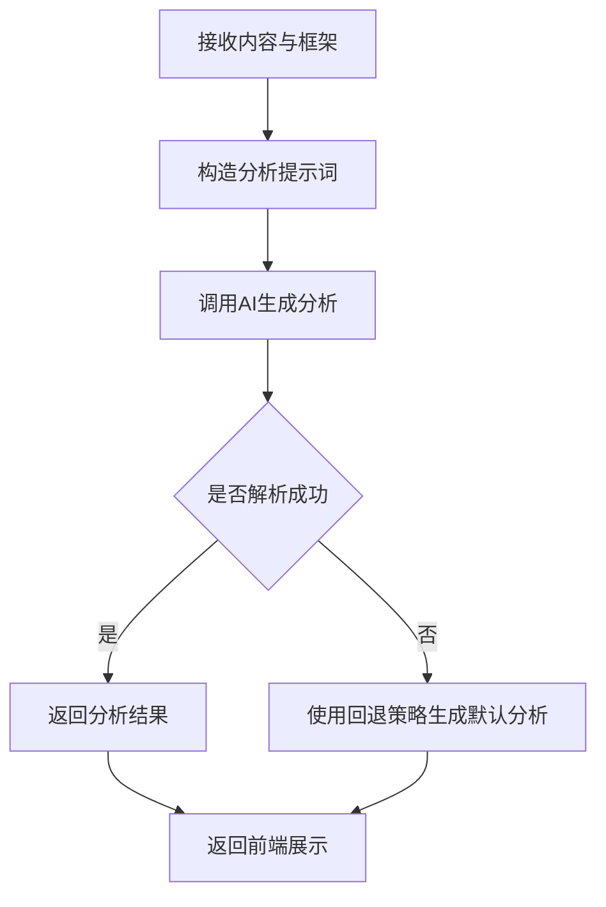
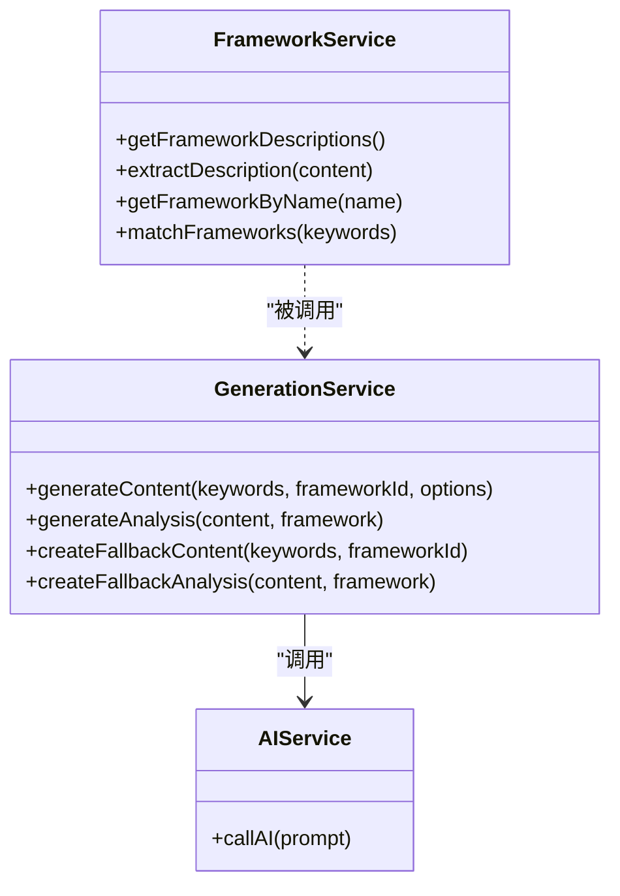
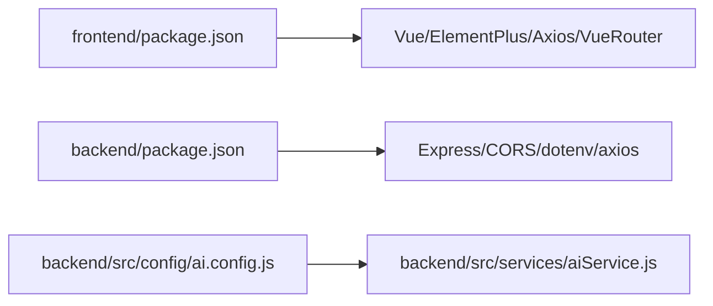

# 项目概述

<cite>
**本文引用的文件**
- [README.md](file://README.md)
- [PROJECT_HIGHLIGHTS.md](file://PROJECT_HIGHLIGHTS.md)
- [backend/src/app.js](file://backend/src/app.js)
- [backend/src/routes/index.js](file://backend/src/routes/index.js)
- [backend/src/controllers/generationController.js](file://backend/src/controllers/generationController.js)
- [backend/src/services/generationService.js](file://backend/src/services/generationService.js)
- [backend/src/services/aiService.js](file://backend/src/services/aiService.js)
- [backend/src/controllers/frameworkController.js](file://backend/src/controllers/frameworkController.js)
- [backend/src/services/frameworkService.js](file://backend/src/services/frameworkService.js)
- [backend/src/config/ai.config.js](file://backend/src/config/ai.config.js)
- [frontend/src/App.vue](file://frontend/src/App.vue)
- [frontend/src/views/Generate.vue](file://frontend/src/views/Generate.vue)
- [frontend/src/main.js](file://frontend/src/main.js)
- [frontend/package.json](file://frontend/package.json)
- [backend/package.json](file://backend/package.json)
- [docs/GUIDE.md](file://docs/GUIDE.md)
- [docs/EXAMPLES.md](file://docs/EXAMPLES.md)
</cite>

## 目录
1. [引言](#引言)
2. [项目结构](#项目结构)
3. [核心组件](#核心组件)
4. [架构总览](#架构总览)
5. [详细组件分析](#详细组件分析)
6. [依赖关系分析](#依赖关系分析)
7. [性能考量](#性能考量)
8. [故障排查指南](#故障排查指南)
9. [结论](#结论)
10. [附录](#附录)

## 引言
本项目是面向小红书（Xiaohongshu）创作者的智能图文生成工具，旨在通过集成多种爆款营销框架与AI能力，帮助创作者一键生成高质量、高转化率的种草笔记。项目以“方法论驱动+AI生成+可视化预览”为核心定位，强调“所见即所得”的双端适配体验，并提供质量分析与自动配图能力，满足从入门到进阶的多样化使用需求。

- 项目愿景：让每一位创作者都能拥有顶级运营的思维，让内容生产从“苦差事”变成“一键触发”的艺术。
- 目标用户：小红书图文创作者、运营人员、品牌方内容团队。
- 市场价值：在信息过载的社交平台上，提供“可复用、可落地”的爆款内容生产范式，显著降低创作门槛与试错成本。

**章节来源**
- [README.md](file://README.md#L1-L76)
- [PROJECT_HIGHLIGHTS.md](file://PROJECT_HIGHLIGHTS.md#L1-L38)

## 项目结构
项目采用前后端分离架构，分为后端API服务与前端工作台界面两大主体，配合文档与框架素材资源，形成完整的创作工作台生态。

- 后端（Node.js + Express）
  - 路由层：统一挂载在 /api 前缀，提供框架查询、关键词分析、内容生成、质量分析与图片代理等接口。
  - 控制器层：负责请求参数校验、调用服务层并返回标准化响应。
  - 服务层：封装AI调用、内容生成、框架匹配与质量分析等业务逻辑。
  - 配置：集中管理第三方AI服务的接入参数。
- 前端（Vue 3 + Element Plus）
  - 视图层：以“生成页”为核心工作流，串联关键词输入、框架选择、内容生成、编辑与预览。
  - 组件层：包含关键词输入、框架选择器、内容编辑器、质量分析面板与预览组件。
  - 路由与入口：基于 Vue Router 管理页面导航；Element Plus 提供UI基础能力。
- 文档与资源
  - 开发指南与示例文档，覆盖页面创建、组件使用、主题定制与构建发布流程。
  - 多个框架文档（AIDA、SCQA、黄金圈等），作为内容结构化的知识基座。

**图表来源**
- [frontend/src/App.vue](file://frontend/src/App.vue#L1-L50)
- [frontend/src/views/Generate.vue](file://frontend/src/views/Generate.vue#L1-L189)
- [backend/src/app.js](file://backend/src/app.js#L1-L26)
- [backend/src/routes/index.js](file://backend/src/routes/index.js#L1-L21)
- [backend/src/controllers/generationController.js](file://backend/src/controllers/generationController.js#L1-L100)
- [backend/src/services/generationService.js](file://backend/src/services/generationService.js#L1-L194)
- [backend/src/services/aiService.js](file://backend/src/services/aiService.js#L1-L55)
- [backend/src/controllers/frameworkController.js](file://backend/src/controllers/frameworkController.js#L1-L49)
- [backend/src/services/frameworkService.js](file://backend/src/services/frameworkService.js#L1-L64)

**章节来源**
- [README.md](file://README.md#L13-L22)
- [frontend/src/App.vue](file://frontend/src/App.vue#L1-L50)
- [frontend/src/views/Generate.vue](file://frontend/src/views/Generate.vue#L1-L189)
- [backend/src/app.js](file://backend/src/app.js#L1-L26)
- [backend/src/routes/index.js](file://backend/src/routes/index.js#L1-L21)

## 核心组件
- 智能文案生成
  - 输入：关键词、内容框架ID
  - 输出：标题、正文、图片描述与标签的结构化内容
  - 特性：AI生成失败时的降级回退策略，确保可用性
- 质量分析诊断
  - 输入：生成内容、框架信息
  - 输出：钩子类型与有效性、框架适用性、结构与互动性、情感/价值/行动评分与综合评价
- 框架服务
  - 功能：读取框架文档、提取描述、按关键词匹配推荐框架
- 图片代理
  - 解决跨域下载问题，将远端图片流式转发至前端
- 前端工作流
  - 关键词输入 → 框架选择 → 一键生成 → 编辑优化 → 质量分析 → 双端预览

**章节来源**
- [backend/src/services/generationService.js](file://backend/src/services/generationService.js#L63-L194)
- [backend/src/controllers/generationController.js](file://backend/src/controllers/generationController.js#L10-L100)
- [backend/src/services/frameworkService.js](file://backend/src/services/frameworkService.js#L9-L64)
- [backend/src/controllers/frameworkController.js](file://backend/src/controllers/frameworkController.js#L8-L45)
- [frontend/src/views/Generate.vue](file://frontend/src/views/Generate.vue#L56-L155)

## 架构总览
项目采用典型的前后端分离架构，前端通过Axios调用后端REST接口，后端以Express提供API，AI能力通过独立服务封装在服务层中，便于替换与扩展。

**图表来源**
- [frontend/src/main.js](file://frontend/src/main.js#L1-L15)
- [backend/src/app.js](file://backend/src/app.js#L1-L26)
- [backend/src/services/aiService.js](file://backend/src/services/aiService.js#L1-L55)
- [backend/src/controllers/generationController.js](file://backend/src/controllers/generationController.js#L69-L94)

**章节来源**
- [README.md](file://README.md#L71-L76)
- [frontend/package.json](file://frontend/package.json#L1-L21)
- [backend/package.json](file://backend/package.json#L1-L17)

## 详细组件分析

### 生成流程（前端到后端）
从前端发起生成请求，后端控制器进行参数校验，调用生成服务，生成服务拼装提示词并调用AI服务，最终返回结构化内容与质量分析。

**图表来源**
- [frontend/src/views/Generate.vue](file://frontend/src/views/Generate.vue#L88-L135)
- [backend/src/routes/index.js](file://backend/src/routes/index.js#L13-L16)
- [backend/src/controllers/generationController.js](file://backend/src/controllers/generationController.js#L10-L64)
- [backend/src/services/generationService.js](file://backend/src/services/generationService.js#L63-L122)
- [backend/src/services/aiService.js](file://backend/src/services/aiService.js#L14-L53)

**章节来源**
- [frontend/src/views/Generate.vue](file://frontend/src/views/Generate.vue#L56-L155)
- [backend/src/controllers/generationController.js](file://backend/src/controllers/generationController.js#L10-L64)
- [backend/src/services/generationService.js](file://backend/src/services/generationService.js#L63-L122)

### 框架匹配与推荐
框架服务从本地框架文档中提取描述，计算关键词匹配度，返回推荐框架列表，前端据此展示并允许用户选择。

**图表来源**
- [backend/src/services/frameworkService.js](file://backend/src/services/frameworkService.js#L9-L58)

**章节来源**
- [backend/src/services/frameworkService.js](file://backend/src/services/frameworkService.js#L9-L58)

### 质量分析算法（简化版）
生成服务对内容进行质量分析，输出钩子类型、框架适用性、结构与互动性、情感/价值/行动评分与综合评价。

**图表来源**
- [backend/src/services/generationService.js](file://backend/src/services/generationService.js#L114-L162)

**章节来源**
- [backend/src/services/generationService.js](file://backend/src/services/generationService.js#L114-L162)

### 类关系图（核心服务）

**图表来源**
- [backend/src/services/generationService.js](file://backend/src/services/generationService.js#L63-L194)
- [backend/src/services/frameworkService.js](file://backend/src/services/frameworkService.js#L9-L64)
- [backend/src/services/aiService.js](file://backend/src/services/aiService.js#L14-L53)

**章节来源**
- [backend/src/services/generationService.js](file://backend/src/services/generationService.js#L63-L194)
- [backend/src/services/frameworkService.js](file://backend/src/services/frameworkService.js#L9-L64)
- [backend/src/services/aiService.js](file://backend/src/services/aiService.js#L14-L53)

## 依赖关系分析
- 前端依赖
  - Vue 3、Element Plus、Vue Router、Axios，构成工作台界面与交互基础。
- 后端依赖
  - Express、CORS、dotenv、axios，提供API服务、跨域支持与外部调用能力。
- AI配置
  - 集中式配置文件管理第三方大模型服务地址、密钥与模型标识，便于切换与维护。

**图表来源**
- [frontend/package.json](file://frontend/package.json#L1-L21)
- [backend/package.json](file://backend/package.json#L1-L17)
- [backend/src/config/ai.config.js](file://backend/src/config/ai.config.js#L6-L17)
- [backend/src/services/aiService.js](file://backend/src/services/aiService.js#L5-L7)

**章节来源**
- [frontend/package.json](file://frontend/package.json#L1-L21)
- [backend/package.json](file://backend/package.json#L1-L17)
- [backend/src/config/ai.config.js](file://backend/src/config/ai.config.js#L6-L17)

## 性能考量
- 流式与增量体验
  - 项目强调“沉浸式流式体验”，通过增量展示降低感知延迟，提升交互流畅度。
- 回退与容错
  - AI返回非JSON或异常时，生成服务提供回退策略，保证功能可用性。
- 跨域与图片代理
  - 图片代理接口采用流式转发，避免前端跨域限制，提高图片加载效率。
- 前后端分离
  - 前端专注交互与预览，后端专注AI与业务逻辑，职责清晰，便于横向扩展。

**章节来源**
- [PROJECT_HIGHLIGHTS.md](file://PROJECT_HIGHLIGHTS.md#L27-L31)
- [backend/src/services/generationService.js](file://backend/src/services/generationService.js#L70-L94)
- [backend/src/controllers/generationController.js](file://backend/src/controllers/generationController.js#L69-L94)

## 故障排查指南
- 启动与端口
  - 后端默认监听端口可在环境变量中调整；若端口占用，需修改配置或释放端口。
- CORS与跨域
  - 后端已启用CORS，若前端无法访问，请检查CORS允许的来源与端口配置。
- AI服务调用
  - 若AI调用失败，检查密钥、模型标识与网络连通性；必要时查看服务日志与响应状态。
- 图片代理
  - 若图片无法显示，确认代理接口传入URL有效且可访问，检查响应头与超时设置。
- 前端构建与预览
  - 构建失败时，优先检查依赖安装与Vite配置；预览阶段可使用内置预览命令验证产物。

**章节来源**
- [backend/src/app.js](file://backend/src/app.js#L14-L16)
- [backend/src/services/aiService.js](file://backend/src/services/aiService.js#L45-L52)
- [backend/src/controllers/generationController.js](file://backend/src/controllers/generationController.js#L76-L93)
- [docs/GUIDE.md](file://docs/GUIDE.md#L342-L381)

## 结论
本项目以“方法论+AI+可视化”三位一体的方式，为小红书内容创作者提供从“选题—结构—文案—配图—分析—预览”的全链路解决方案。其前后端分离、模块化服务与可扩展的AI集成能力，既适合初学者快速上手，也为有经验的开发者提供了清晰的架构与决策背景。通过持续优化框架匹配与质量分析算法，项目有望在内容规模化与质量稳定之间取得平衡，成为创作者的智能创作伙伴。

## 附录
- 快速开始
  - 自动安装并启动：在项目根目录执行一键安装与启动脚本，分别启动前后端开发服务器。
  - 手动分步启动：先在后端目录安装依赖并启动服务，再在根目录安装前端依赖并启动前端开发服务器。
- 使用场景示例
  - 选品创作中心：从推荐产品出发，结合关键词与框架生成内容。
  - 关键词创作：输入关键词（如“夏季穿搭”、“数码测评”），选择合适框架一键生成。
  - 质量优化：参考质量分析报告，针对钩子、结构与互动性进行针对性优化。
  - 双端预览：在编辑器中实时查看不同设备下的展示效果，确保发布一致性。

**章节来源**
- [README.md](file://README.md#L24-L70)
- [docs/EXAMPLES.md](file://docs/EXAMPLES.md#L20-L129)