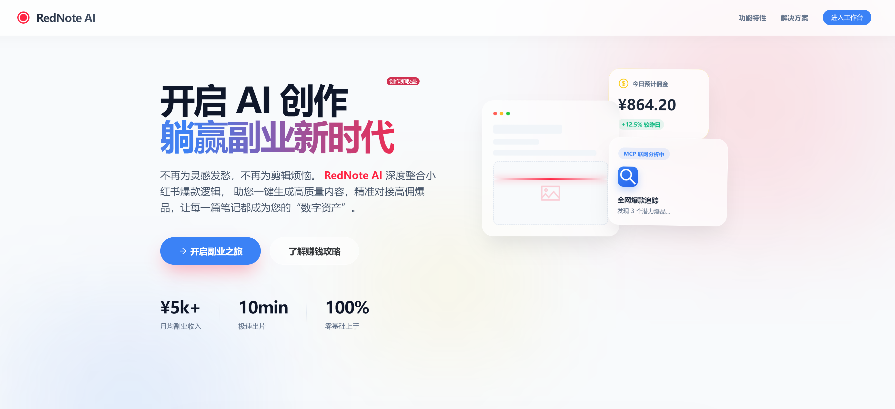

# Nixtio AI 智能创作工作台



> **专为小红书创作者打造的 AI 智能体 (Agent) 协作平台**
> 
> 集成多模态视觉分析、智能文案生成、自动化配图与质量评估闭环，帮助创作者一键生成高质量、高转化率的种草笔记。

## 🌟 核心亮点

### 🤖 强大的 Agent 智能体
不同于简单的模版填充，Nixtio AI 采用先进的 **Agent 架构**，具备自主规划与执行能力：
- **智能规划 (Auto Mode)**: 根据用户输入（关键词/图片/需求）动态规划执行路径。
- **多模态感知**: 支持上传参考图，AI 自动分析构图、色彩、风格与氛围，实现"图生文"与"图生图"。
- **自我修正闭环**: 内置质量评估系统，评分未达标（<7分）自动触发自我修正与重写。
- **长期记忆系统**: 拥有基于向量的记忆库，能够检索并参考历史高分文案，越用越懂你。

### 🎨 全流程自动化
1. **视觉分析**: 深度解析参考图，提取美学特征。
2. **框架匹配**: 自动匹配最适合的爆款文案框架（如 AIDA, SCQA, 黄金圈等）。
3. **文案创作**: 生成不仅限于文字，更包含大量 Emoji 与小红书特有排版的"墨迹"感文案。
4. **智能配图**: 支持 **文生图 (Text-to-Image)** 与 **图生图 (Image-to-Image)**，自动生成与文案风格统一的配图。

## 🧠 Agent 工作流程

```mermaid
graph TD
    Start([开始创作]) --> CheckAction{智能规划}
    
    CheckAction -- 自动模式 --> AutoPlan[LLM 动态规划步骤]
    
    subgraph CoreProcess [核心生成链路]
        direction TB
        AutoPlan --> MultiModal[视觉感知: 分析参考图]
        MultiModal --> Memory[记忆检索: 召回高分案例]
        Memory --> Framework[框架匹配]
        Framework --> Generation[文案生成]
        Generation --> Quality[质量评估]
        
        Quality --> CheckScore{评分 >= 7?}
        CheckScore -- No --> SelfCorrect[LLM 自我修正]
        SelfCorrect --> Quality
        
        CheckScore -- Yes --> SaveMemory[存入记忆库]
    end
    
    SaveMemory --> ImagePrompt[生成绘画提示词]
    ImagePrompt --> ImageGen[智能配图 (文生图/图生图)]
    ImageGen --> End([输出最终笔记])
```

## 🛠 技术栈

### Frontend (前端)
- **Framework**: Vue 3 (Composition API)
- **Build Tool**: Vite
- **UI Library**: Naive UI + Element Plus
- **Icons**: @vicons/antd
- **HTTP**: Axios

### Backend (后端)
- **Runtime**: Node.js
- **Framework**: Express.js
- **AI Orchestration**: LangChain (Agent 逻辑编排)
- **Models**: 
  - LLM: GLM-4 / GPT-4
  - Vision: Qwen-VL (多模态分析)
  - Image: Volcengine (火山引擎) / Doubao

## 🚀 快速启动

### 1. 环境准备
确保您的环境已安装：
- Node.js (v18+)
- npm 或 pnpm

### 2. 配置环境变量
在 `backend` 目录下创建 `.env` 文件（参考 `.env.example`）：
```ini
PORT=8080
CORS_ORIGIN=http://localhost:8001

# AI 模型配置
SHENGSUAN_VISION_API_KEY=your_key_here
# 其他 API Key...
```

在根目录下创建 `.env` 文件用于前端配置：
```ini
VITE_AI_BASE_URL=...
VITE_AI_API_KEY=...
```

### 3. 一键启动 (推荐)
在项目根目录运行：

```bash
# 1. 安装所有依赖 (前端 + 后端)
npm run install:all

# 2. 同时启动前后端服务
npm run dev:all
```

启动成功后访问: [http://localhost:8001](http://localhost:8001)

### 4. 手动分步启动

**后端服务:**
```bash
cd backend
npm install
npm run dev
# Server running on http://localhost:8080
```

**前端界面:**
```bash
# 回到根目录
npm install
npm run dev
# Client running on http://localhost:8001
```

## 📂 项目结构

```text
.
├── backend/                 # Node.js 后端服务
│   ├── src/
│   │   ├── agents/         # LangChain Agent 核心逻辑
│   │   │   ├── tools/      # Agent 工具集 (视觉/文案/图像/记忆)
│   │   │   └── xiaohongshuAgent.js # 主 Agent 类
│   │   ├── controllers/    # API 控制器
│   │   ├── services/       # 基础服务 (Vision, API)
│   │   └── app.js          # 入口文件
├── src/                     # Vue 3 前端源码
│   ├── components/         # 业务组件 (KeywordInput, Preview...)
│   ├── views/
│   │   └── AgentWorkbench.vue # 智能创作工作台 (核心界面)
│   └── services/           # 前端 API 封装
├── public/                  # 静态资源
└── vite.config.js          # Vite 配置 (含 Proxy)
```

## 📝 使用指南

1. **进入工作台**: 访问首页，点击"智能创作工作台"。
2. **上传参考图 (可选)**: 
   - 支持上传本地图片。
   - Agent 会自动分析图片风格（如：清新、复古、赛博朋克）并应用到后续创作中。
3. **输入需求**:
   - 填写核心关键词（如：夏季穿搭、显瘦）。
   - 简述创作需求（如：语气活泼，适合学生党）。
4. **一键生成**:
   - 点击"开始智能创作"。
   - 观察右侧的 **Agent 执行日志**，实时查看 AI 的思考过程（规划->分析->生成->评估->修正）。
5. **结果预览**:
   - 查看生成的文案、质量评分及自动生成的配图。
   - 支持手机/电脑双端预览效果。

---
*Powered by Nixtio AI Team · 2026*
