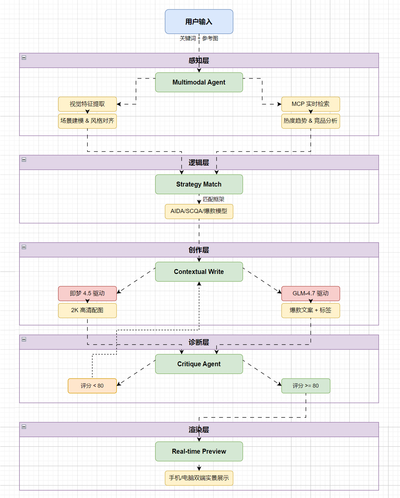

# Nixtio AI：基于多代理协同与多模态感知的小红书爆款创作 Agent 技术报告

> **项目定位**：深度适配小红书生态的序贯流水线内容生成引擎
> **核心技术**：Sequential Pipeline Agent, Multimodal Perception, Jimeng 4.5, Schema Enforcement

---

## 0. 项目综述：从“文本工具”到“多模态专家”的跨越

在当前 AIGC 领域，传统的“单次对话式生成”往往面临内容同质化、逻辑松散等问题。Nixtio AI 通过构建 **Sequential Pipeline Agent (序贯流水线代理)**，实现了从单一文本生成到 **多模态感知（图像+文字双向输入）** 的跨越。系统不仅能理解文字需求，更能通过 **即梦 4.5 (Doubao-Seedream)** 模型实现文案与视觉的深度语义对齐，将模糊的意图转化为具备营销逻辑、平台适配度 100% 的爆款内容。

---

## 1. 架构设计：五层序贯流水线引擎

我们采用了先进的多模态状态机架构，确保 Agent 能够同时消化文字指令与视觉参考，实现内容的每一个字节都经过逻辑推导。

### 1.1 系统工作流拓扑图



### 1.2 核心层级解析
- **感知层 (Multimodal Perception)**：**本项目重大升级**。Agent 不再仅处理文字，而是支持用户上传参考图。通过多模态感知，Agent 能自动识别图片中的主体、构图与氛围，从而生成更具连贯性的文案。
- **诊断层 (Critique Agent)**：**技术护城河**。引入独立的影子 Agent 进行 Self-Correction。它会从“视觉冲击力”、“文案钩子”、“平台适配度”等维度进行闭环量化评估，并输出诊断报告。

---

## 2. Prompt 工程：深度约束与结构化注入

为了确保 GLM-4.7 等大模型在复杂任务下的输出稳定性，我们研发了一套结构化 Prompt 注入方案。

| 策略名称 | 技术实现 | 解决痛点 |
| :--- | :--- | :--- |
| **Schema Enforcement** | 强制 JSON Schema 输出 | 规避 Markdown 干扰，提升 API 解析成功率至 99.9% |
| **Negative Constraints** | 负向约束逻辑 (No Bold, No Markdown) | 解决小红书 App 对加粗语法不兼容导致的乱码问题 |
| **Few-shot Injection** | 黄金比例 Emoji 注入 | 避免 AI 感过强，模拟真人“呼吸感”分段 |
| **CoT Chain** | 策略自述 (Strategy Self-Disclosure) | 引导模型先思考营销路径，再输出文案，提升内容深度 |

---

## 3. 工程健壮性：Bad Cases 治理与容错

在开发过程中，我们通过工程手段抹平了 AI 输出的不确定性，确保系统在极端情况下依然稳健。

### 3.1 典型坑位与解决方案

- **Case 1: 格式溢出**
  - **现象**：模型偶尔在 JSON 外包裹 ```json 代码块。
  - **方案**：开发 **Regex Post-Processor**，在数据流进入解析器前进行正则清洗。
- **Case 2: 平台语法冲突与“墨迹”缺失**
  - **现象**：LLM 习惯用 `*` 或 `**` 进行列表和加粗，且 Emoji 密度不足，导致文案缺乏小红书原生的“墨迹”感。
  - **方案**：
    - **Prompt 强化**：在 System Prompt 中强制要求“必须插入大量贴切 Emoji”，并明令禁止所有 Markdown 符号。
    - **语法转换网关**：在 `getAIResponse` 中集成 **Cleanup Pipeline**，通过正则自动将 `*` 列表转换为 Emoji 或圆点，并彻底剔除残留的星号杂质。
- **Case 3: 上下文漂移**
  - **现象**：长文本生成时，模型忘记初始的营销框架。
  - **方案**：采用**增量式 Prompt 注入**，在每一轮 Pipeline 迭代中重新注入核心约束。

---

## 4. 模型实战评价：双引擎驱动

基于本项目数百次生成测试，我们对双引擎的表现总结如下：

### 4.1 语言模型：GLM-4.7
- **优势**：极强的中文语境理解力和 JSON 遵循精度。在处理小红书特有的“种草”语境时，展现了极高的原生理解力。

### 4.2 图像模型：即梦 4.5 (Doubao-Seedream)
- **优势**：
  - **极致美感**：生成的图片自带“小红书电影感”，在光影和质感上大幅领先于传统模型。
  - **语义对齐**：能精准执行文案中隐含的视觉需求，实现真正的“图文一体”。
  - **超清输出**：默认支持 360万像素以上的 2K 高清渲染，满足平台高质量笔记要求。

---

## 5. 未来演进：自动化矩阵与账号矩阵

目前我们已实现图文深度对齐与多模态输入。下一步，我们将引入 **Account Agent**，实现从内容生产到 **多账号自动发布、评论区智能维护** 的全自动化运营闭环，打造真正意义上的 AI MCN。

---
*幻境突围团队 · 2026年1月18日*
