# 幻境突围小队-小红书Outputs内容展示

---

## 上海武康路半日逛吃指南，要求标注拍照机位和甜品店人均消费，文风带松弛感标签。

### 📝 文案内容

\# 需求：上海武康路半日逛吃指南，要求标注拍照机位和甜品店人均消费，文风带“松弛感”标签。

上海的浪漫，有一半都藏在武康路的梧桐树影里。不用赶时间，就在这里虚度半日，把生活调成慢倍速。

今天不谈攻略，只谈感受。从武康大楼开始，一路慢悠悠地晃到安福路。不是为了打卡而打卡，只是想感受一下风吹过树叶的声音，和那种恰到好处的法式慵懒。

📸 治愈系拍照机位

武康大楼最佳机位：不要挤在马路边！去对面的余庆路路口，利用红绿灯做前景，人少景全，还能拍到车流穿梭的电影感。记得穿低饱和度的衣服，和红砖墙最配。

巴金故居门口：那扇铁门和斑驳的墙，下午三四点的阳光洒下来，侧身回眸，胶片感拉满。不需要看镜头，假装在看树上的叶子。

各种不知名的小弄堂：不要刻意摆拍，抓拍走路时的背影，或者低头看树叶的瞬间，最自然。光影是最好的滤镜。

🍰 逛吃补给站

RAC Bar：安福路上的老网红了。坐在外摆区看来来往往的人，点一份可丽饼加咖啡，看着云朵发呆。人均：60r。

Sunflair：就在武康大楼旁边，冰淇淋造型很好看，拿着冰淇淋对着大楼拍，经典出片。味道也很浓郁。人均：40r。

Gentle Maker：一家很低调的咖啡店，木质装修很温暖，适合躲进去避避暑。手冲咖啡很香，配一块巴斯克蛋糕刚刚好。人均：50r。

在上海，最不缺的就是精致，但难得的是这份偷得浮生半日闲的惬意。下次来武康路，试着走慢一点，你会发现不一样的风景。

\#上海 #武康路 #Citywalk #松弛感 #上海探店 #周末去哪儿 #武康路拍照

### 🖼️ 图片展示

 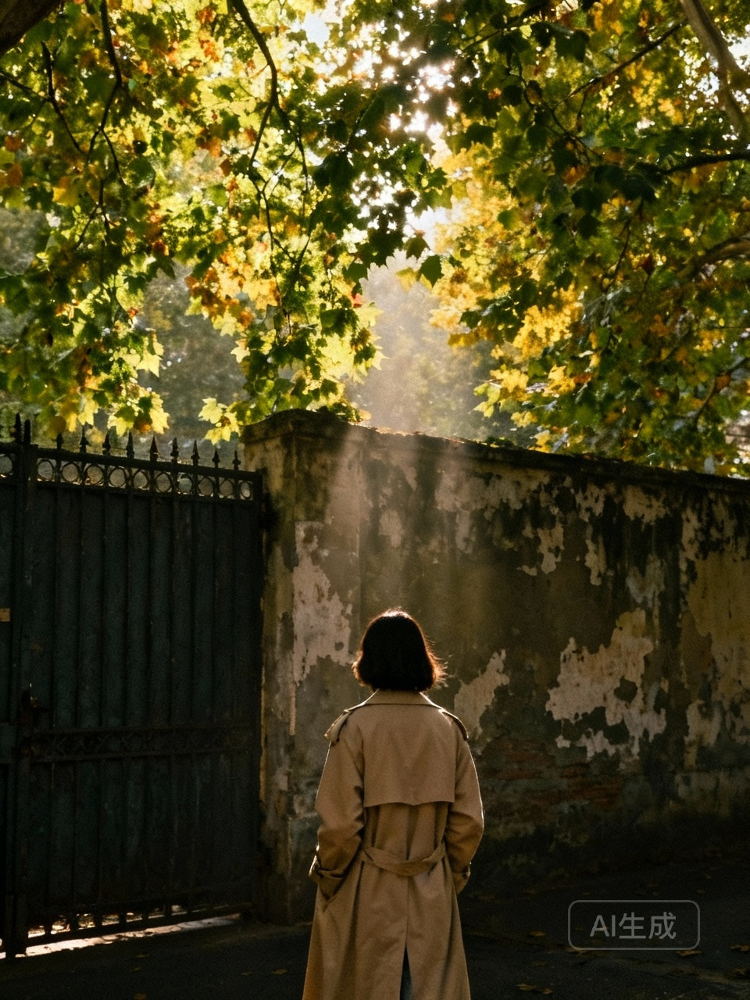 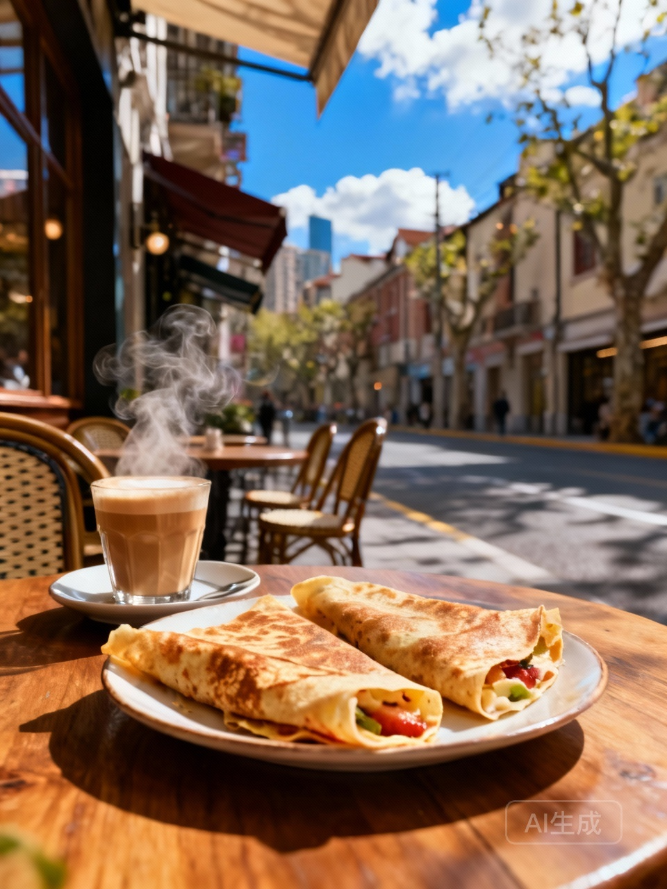 

 

---

 

## 周末露营装备清单 需按收纳顺序排列 强调轻量化和必备安全物品 附装备实拍图

### 📝 文案内容

\# 需求：周末露营装备清单 需按收纳顺序排列 强调“轻量化”和必备安全物品 附装备实拍图

终于整理出来啦！周末去露营，真的不想背大包小包，累死个人！🤯 这次我把我的轻量化装备清单按收纳顺序全公开，主打一个精致又轻松！🌿✨ 每一样都是我精挑细选的，照着买绝对不踩雷！💖

🎒 收纳第一层：大件打底
1️⃣ 帐篷：一定要选轻量化帐！我这款才1.5kg，搭建超快，防雨性也一级棒！⛺️🌧️
2️⃣ 睡袋：信封式睡袋最舒服，压缩后只有手掌大，晚上睡觉暖暖的！🛌🔥
3️⃣ 防潮垫：抛弃沉重的充气垫吧，EVA蛋槽垫才是轻量化的神，还能保暖！🥚✨

🍱 收纳第二层：野餐快乐源泉
1️⃣ 炉具：卡式炉搭配高山气罐，煮咖啡、煎牛排一气呵成，幸福感爆棚！☕️🥩
2️⃣ 餐具：钛合金杯子和碗，虽然贵一点点，但是真的轻！而且拍照超级有质感！🥤📸
3️⃣ 食物：带些半成品，洗切好的蔬菜、腌制好的肉类，省时又省力！🥗🍖

👕 收纳第三层：衣物与杂物
1️⃣ 衣物：速干衣裤是标配，早晚温差大，带件轻薄羽绒马甲准没错！🧥🌬️
2️⃣ 照明：复古煤油灯氛围感拉满，头灯是晚上上厕所的安全卫士！💡🔦
3️⃣ 椅子：为了减负，我换成了超轻折叠椅，坐在草地上看夕阳简直太美了！🪑🌅

🚨 收纳第四层：必备安全物品（重中之重！）
1️⃣ 急救包：创可贴、碘伏棉签、止泻药、抗过敏药，野外生病真的很难搞！💊🩹
2️⃣ 工具：多功能工兵铲，既能搭帐篷天幕，又能防身，安全感满满！⛏️🛡️
3️⃣ 电源：大容量户外电源或充电宝，保持手机有电，关键时刻能救命！🔋📱
4️⃣ 驱蚊水：夏天的草地是蚊子的天堂，不想被咬成包一定要带！🦟🚫

这套装备背起来毫无压力，周末逃离城市计划通！🏃‍♀️🌲 大家还有什么私藏的轻量化装备吗？快在评论区告诉我呀！💬👇

\#露营 #周末去哪儿 #露营装备 #轻量化露营 #露营清单 #户外 #新手露营 #安全露营 #露营装备分享

### 🖼️ 图片展示

   

 

---

 

## 在家自制健康减脂餐一周食谱 要求标注每餐卡路里和准备时间 重点推荐十分钟快手菜

### 📝 文案内容

\# 需求：在家自制健康减脂餐一周食谱 要求标注每餐卡路里和准备时间 重点推荐“十分钟快手菜”

姐妹们！👋 谁说减脂餐只能吃草？谁说没时间做饭就不能瘦？🤔 今天给大伙儿整理了一份【在家自制健康减脂餐一周食谱】📝，亲测有效，好吃不胖！🥗 尤其是咱们打工人和学生党，一定要看过来！👀 重点来了！全是【十分钟快手菜】⏰，手残党也能轻松搞定！👩‍🍳

✅ 周一：元气满满开启新的一周
🥗 菜品：黑椒牛柳滑蛋饭
🔥 热量：约 380 大卡
⏰ 时间：10 分钟
👉 做法：牛柳切条加黑胡椒腌制，鸡蛋打散，锅里少油炒熟牛柳，倒入蛋液滑熟即可，盖在杂粮饭上！绝绝子！😋

✅ 周二：清爽低卡日
🥗 菜品：虾仁滑蛋豆腐
🔥 热量：约 320 大卡
⏰ 时间：10 分钟
👉 做法：嫩豆腐切块，虾仁去线，一起炒熟，最后淋上少许生抽，嫩滑到不行！🍤

✅ 周三：解馋抗饿
🥗 菜品：低脂版鸡胸肉三明治
🔥 热量：约 350 大卡
⏰ 时间：8 分钟
👉 做法：全麦面包夹上煎好的鸡胸肉、生菜片和番茄片，挤一点低脂沙拉酱，咬一口超满足！🥪

✅ 周四：简单快手
🥗 菜品：蚝油生菜配煎蛋
🔥 热量：约 280 大卡
⏰ 时间：5 分钟
👉 做法：生菜焯水淋蚝油，鸡蛋单面煎，简单又健康，懒人必备！🥬

✅ 周五：海鲜大餐
🥗 菜品：芦笋炒鱿鱼
🔥 热量：约 300 大卡
⏰ 时间：10 分钟
👉 做法：鱿鱼焯水切圈，芦笋切段，大火爆炒，鲜味十足！🦑

✅ 周六：周末犒劳
🥗 菜品：香煎三文鱼配时蔬
🔥 热量：约 450 大卡
⏰ 时间：12 分钟
👉 做法：三文鱼煎至两面金黄，搭配西兰花和胡萝卜，颜值高营养好！🐟

✅ 周日：清肠排毒
🥗 菜品：番茄金针菇豆腐汤
🔥 热量：约 200 大卡
⏰ 时间：10 分钟
👉 做法：番茄炒出沙，加水煮开，放入金针菇和豆腐，酸爽开胃！🍅

💡 减脂小贴士：
1️⃣ 油盐要控制，尽量用橄榄油或不粘锅少油烹饪！🥘
2️⃣ 每天喝够 2000ml 水，提高代谢！💧
3️⃣ 细嚼慢咽，给大脑一点反应时间！🧠

姐妹们，这套食谱真的太适合咱们这种又想瘦又没时间的人了！🏃‍♀️ 赶紧点赞收藏🌟，这周就开始安排上！期待你们的打卡反馈哦！💖 看到这里不点个关注嘛？以后每天给你们分享健康美食！👇

\#减脂餐 #健康减脂 #一周食谱 #十分钟快手菜 #低卡料理 #减脂日记 #在家减脂 #健康饮食 #减脂打卡 #掉秤

### 🖼️ 图片展示

   

 

---

 

## 复古胶片感调色教程 针对城市街景和人像分别提供参数 需用具体APP演示步骤

### 📝 文案内容

\# 需求：复古胶片感调色教程 针对城市街景和人像分别提供参数 需用具体APP演示步骤

哇！终于整理出来了！📸 大家一直私信轰炸问我的那种复古胶片感到底是怎么调出来的，今天毫无保留地全部分享给你们！✨ 真的超级有氛围感，随便拍拍都像电影画面一样🎬。不管是扫街还是拍人像，这套参数都绝绝子！🔥 赶紧码住，不然刷着刷着就找不到啦！💖

我们今天用到的APP是醒图📱，因为它真的太好用了，而且参数调整很细腻，新手也能秒上手！💯 保姆级教程来咯，手把手教大家调出那种日系复古胶片风！🎞️

1️⃣ 城市街景篇 🏙️
街景的重点在于那种陈旧的质感和光影的对比，要有那种90年代的街头故事感！🌆
📷 第一步：光感 -20，亮度 +10（稍微压暗一点，画面质感立马提升）
📷 第二步：对比度 +15，高光 -30，阴影 +20（拉大光比，保留暗部细节）
📷 第三步：色温 +15，色调 -10（整体偏暖黄一点点，阴影带点青调）
📷 第四步：HUI调整，橙色色相 -5，饱和度 -10（让建筑和街道的颜色更耐看，不刺眼）
📷 第五步：颗粒 +25，锐化 +10（这一步是灵魂！增加胶片的粗糙感，绝了！）
调完之后，那种老电影的滤镜感立马就出来了！🛵 真的太爱了！💕

2️⃣ 人像篇 👩🎨
人像要温柔一点，皮肤质感要通透，不能像街景那么粗砺，要带点朦胧美！🌸
📷 第一步：光感 +15，亮度 +5（让脸蛋看起来白皙透亮）
📷 第二步：对比度 -10，高光 -15（柔化光线，自带柔光滤镜效果）
📷 第三步：色温 +10，色调 +5（整体氛围暖洋洋的，显得人很温柔）
📷 第四步：HUI调整，橙色明度 +20（这是关键！皮肤瞬间白一个度，黄皮救星！）
📷 第五步：褪色 +15，颗粒 +20（营造那种旧照片的回忆感，氛围感拉满）
这样调出来的人像，那种日杂模特的感觉一下子就有了！📚 谁拍谁好看！😭

是不是超级简单！😜 宝子们赶紧去试试看！记得要根据原图的光线情况微调哦☀️。如果觉得有用，记得给我点个小红心❤️，收藏起来慢慢练！📂 也可以把你们调好的图发在评论区，我来帮看！👀 关注我，下期分享更多修图干货！🎁

\#复古胶片 #醒图教程 #调色参数 #城市街拍 #人像摄影 #拍照姿势 #修图教程 #胶片感 #氛围感 #拍照技巧 #手机摄影 #复古滤镜

### 🖼️ 图片展示

   

 

---

 

## 大理洱海自驾vlog脚本框架，包含网红S弯定位、民宿窗景对比、民族风披肩穿搭建议。

### 📝 文案内容

\# 需求：大理洱海自驾vlog脚本框架，包含网红S弯定位、民宿窗景对比、民族风披肩穿搭建议。

谁懂啊家人们！在大理环海自驾真的太治愈了，随手一拍就是电影感大片！这次整理了一份超详细的Vlog脚本框架，包含机位、穿搭和避雷指南，建议先收藏再出发，不然划走就找不到啦！

🚗 关于自驾路线与氛围感
租一辆甲壳虫或者smart，一定要选晴天出发！沿着环海西路慢慢开，把车窗降下来，风灌进来的那一刻，Vlog的开头就有了。不用刻意找景，左手苍山右手洱海，BGM配上轻快的民谣，这就是自由的味道。

📍 网红S弯拍摄机位
定位直接搜：磻溪村S弯。
这里真的太出片了，但是人多！一定要早起，早上8点前到达，整个S弯都是你的。
*   运镜技巧：镜头低角度仰拍，把骑行的人和海平线放在同一个画面里。
*   动态捕捉：不要摆拍，假装在看海，或者背对着镜头慢慢走，让摄影师抓拍风吹头发的瞬间。

🏠 民宿窗景对比美学
选民宿真的有讲究，窗景直接决定了Vlog的质感！
*   避雷：不要只看滤镜图，一定要问清楚是不是“一线无遮挡海景”。
*   拍摄技巧：把纱帘拉一半，制造朦胧感。人坐在窗边看书或者发呆，逆光拍摄，那种慵懒的氛围感瞬间拉满。记得准备一杯咖啡或者鲜花做道具。

🧣 民族风披肩穿搭公式
来大理不披个披肩等于没来！但是颜色选错真的很显黑。
*   显白首选：克莱因蓝、酒红色、藏青色。
*   穿搭公式：白T恤+牛仔裤+亮色披肩。
*   创意玩法：披肩不要老老实实披在肩上，试着当头巾，或者系在腰间当半身裙。拍摄时把披肩扬起来，抓拍最自然的那一帧，绝绝子！

大理的风是自由的，你也是。带上这份脚本，去记录属于你的夏天吧！还有什么想知道的，评论区告诉我呀～

\#大理旅行 #洱海自驾 #vlog教程 #大理穿搭 #治愈系风景 #小众旅行地 #摄影技巧

### 🖼️ 图片展示

 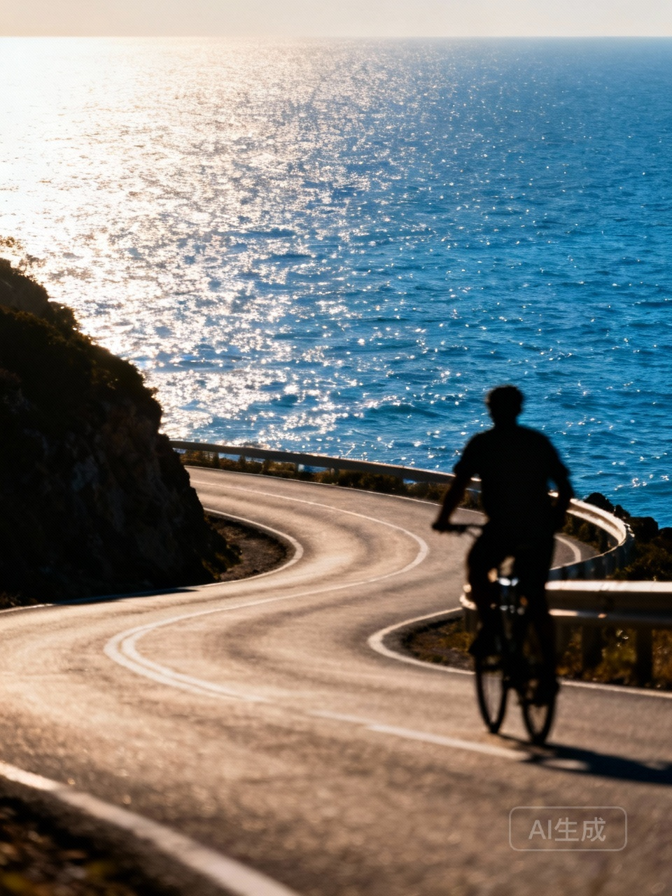 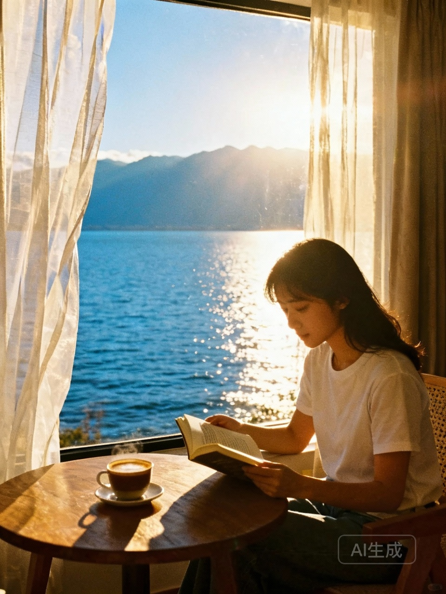 

 

---

 

## 宠物猫咪居家摄影指南 需包含自然光拍摄技巧、常见玩具互动抓拍方法 结尾添加猫咪表情包制作教程

### 📝 文案内容

\# 需求：宠物猫咪居家摄影指南 需包含自然光拍摄技巧、常见玩具互动抓拍方法 结尾添加“猫咪表情包”制作教程

姐妹们！谁懂啊！😭 每次想给家里的逆子拍美照，结果全是糊糊的煤球？🐈💨 别气别气！今天把压箱底的居家猫咪摄影秘籍都交出来！📸✨ 只要有手机，也能拍出ins风大片，还能顺便自制专属表情包！🎉

✨ 自然光才是最好的滤镜 ✨
1️⃣ 窗边大法好：家里的落地窗就是天然影棚！🪟 把猫咪抱到窗边，利用侧逆光，毛流感瞬间拉满，那个光泽感简直绝绝子！🌟
2️⃣ 黄金拍摄时间：避开正午的大太阳！🙅‍♀️ 早上9-11点或者下午3-5点，光线最柔和，拍出来的猫咪皮肤粉嫩嫩的，眼神光也是亮晶晶的！💎
3️⃣ 坚决不开闪光灯：这一点千万要记住！❌ 闪光灯不仅会吓到主子，还容易拍出恐怖的红眼怪，我们要的是自然美！🚫👻

🎾 玩具互动抓拍小技巧 🎾
1️⃣ 逗猫棒悬空法：把逗猫棒举在手机镜头上方，让猫咪盯着看，这样就能抓拍到它专注又犀利的眼神！🐦👀 简直帅炸了！
2️⃣ 连拍模式走起：猫咪动作太快？别犹豫，直接打开连拍！📱 咔咔咔一顿按，不管是扑咬还是起飞，总有一张能封神！🚀
3️⃣ 趴下拍更有爱：一定要蹲下甚至趴在地上！🐾 和猫咪保持同一视线高度，这样拍出来的画面更有故事感，仿佛进入了它的奇妙世界！🌍💖

🎉 结尾彩蛋：猫咪表情包制作教程 🎉
想不想拥有独一无二的猫咪表情包？手把手教你！👇
1️⃣ 疯狂抓拍：趁猫咪打哈欠、翻白眼、发呆或者做鬼脸的时候，手机时刻准备着！😴🤪 越丑越真实越好笑！
2️⃣ 简单修图：打开修图软件（比如黄油相机、美图秀秀），加上大号的花字！📝 文案要搞怪，比如“你瞅啥”、“朕乏了”、“铲屎的快滚”。💬
3️⃣ 保存斗图：一键保存，发给闺蜜和对象斗图，快乐就是这么简单！🤣🔥

快去试试吧！拍完记得来交作业哦！📥 看看谁家的主子最上镜！💖

\#猫咪摄影 #宠物摄影 #拍照技巧 #猫咪日常 #萌宠出道 #新手养猫 #手机摄影 #表情包制作

### 🖼️ 图片展示

   

 

---

 

## 小众书店探店合集 要求标注各区代表性书店的装修风格和选书特点 结尾添加书籍盲盒彩蛋

### 📝 文案内容

\# 需求：小众书店探店合集 要求标注各区代表性书店的装修风格和选书特点 结尾添加书籍盲盒彩蛋

姐妹们！周末不知道去哪儿玩吗？🤔 别再去人挤人的网红咖啡馆啦！🙅‍♀️ 今天整理了一份超全的小众书店探店合集，每一个都是我私藏的精神避难所！📚✨ 真的太好拍了，而且书单质量超高！快艾特你的读书搭子一起来看吧！👯‍♀️💖

📍 1️⃣ 老城区里的时光胶囊 🕰️
这家店藏在一条不起眼的巷子里，推开门就像穿越了一样！🚪 装修是那种浓浓的复古南洋风，深色木质书架配上暖黄的灯光，氛围感直接拉满！🌟🕯️ 每一个角落都摆放着老式打字机和黑胶唱片，真的太有味道了！🎶📻
📖 选书特点：这里主打绝版书和旧书，特别是关于城市历史和人文社科类的，淘到就是赚到！📜🧐 很多书外面都买不到哦！

📍 2️⃣ 艺术区的工业风美学 🏭🎨
极简主义爱好者的天堂！🖤 高挑的层高，巨大的落地窗，水泥灰的墙面，随手一拍都是大片！📸🖼️ 这里甚至还有个专门的咖啡烘焙区，书香混合着咖啡香，简直绝绝子！☕️😋
📖 选书特点：艺术、设计、建筑类书籍超级全，还有很多外文原版杂志，视觉控绝对会爱惨这里！👁️🌍 想找灵感的宝子们一定要来！

📍 3️⃣ 街角的治愈系小屋 🏡🌿
像是宫崎骏动画里的场景，原木色的家具，到处都摆满了绿植，阳光洒进来的时候真的太温柔了！☀️🌻 店里还有两只可爱的猫咪，会陪着你一起看书哦！🐱🐈
📖 选书特点：以散文、诗歌和治愈系小说为主，还有很多独立出版的绘本，读起来心里暖暖的！🥰🍵 适合下午发呆放空！

🎁 彩蛋时间！书籍盲盒大放送！🎁
既然看到这里了，怎么能没有福利呢！🎉 我在评论区藏了一个“书籍盲盒”，只要你在评论区留下你最近想读的一本书，我就随机抽一位宝子送出一份神秘书单！📚💌 或者直接去店里问问店员有没有隐藏款盲盒哦！🤫✨ 据说盲盒里藏着老板的私藏书单呢！🤫📝

好啦，今天的分享就到这里！希望能给你的周末增添一点书香气息！💨📚 记得点赞收藏，不然划走就找不到啦！❤️🔔 我们下期见！👋

\#小众书店 #周末去哪儿 #书店探店 #我的私人书单 #阅读 #治愈系风景 #城市漫游 #书籍盲盒 #宝藏店铺 #氛围感

### 🖼️ 图片展示

   

 

---

 

## 新手健身房入门跟练计划，需周课表+器械使用图解，警告提示常见错误姿势。

### 📝 文案内容

\# 需求：新手健身房入门跟练计划，需周课表+器械使用图解，警告提示“常见错误姿势”。

去了健身房只会跑步？看着一堆铁疙瘩不敢动？怕练出大肌肉腿或者练废了腰？

别慌！这篇【新手小白健身房保姆级攻略】一定要码住！从周课表到器械使用，再到那些让你受伤的“致命错误”，一次性给你讲明白！照着练，不出一个月，你就能自信地在健身房横着走！

📅 新手一周跟练计划（建议收藏截图）

周一：胸+三头（推为主）
- 哑铃卧推 4组x12次
- 坐姿推胸 4组x12次
- 绳索下压 4组x15次

周二：有氧+核心（燃脂日）
- 椭圆机或爬坡 30分钟
- 平板支撑 4组x45秒
- 卷腹 4组x20次

周三：背+二头（拉为主）
- 高位下拉 4组x12次
- 坐姿划船 4组x12次
- 哑铃弯举 4组x12次

周四：休息日（好好睡觉，多吃蛋白质）

周五：腿+臀（举铁日）
- 倒蹬机 4组x12次
- 哑铃深蹲 4组x12次
- 臀桥 4组x15次

周六：户外活动或瑜伽（放松身心）

周日：休息日（准备下周循环）

🏋️‍♀️ 常用器械使用口诀

坐姿推胸：椅子高度适中，手肘微屈，推到顶峰停顿1秒，感受胸肌收缩。

高位下拉：挺胸沉肩，下拉到锁骨位置，不要耸肩！是用背的力量，不是手臂硬拉。

倒蹬机：脚放踏板中间，屁股紧贴椅背，膝盖不要锁死，下放要有控制，不要直接砸下去。

⚠️ 警告！这些错误姿势千万别做

> 深蹲时膝盖内扣
这是大忌！膝盖一定要和脚尖方向一致，不然膝盖真的会废。想象两腿中间夹着一个纸团，不要把它挤扁。

> 硬拉弓背
腰背一定要挺直，核心收紧！如果你感觉腰酸背痛，说明姿势错了，立刻停止，降低重量。记住：宁轻勿假！

> 做卷腹脖子用力
手只是轻轻扶着耳朵，不要抱头硬拉！是用腹肌的力量把身体卷起来，不是用脖子把头拉起来。做完脖子酸说明你做错了。

💡 给新手的碎碎念

刚开始去健身房真的不用害怕，大家都在忙着照镜子看自己呢，根本没人注意你！穿得舒服点，带上耳机，拿起哑铃，你就是最酷的崽！

还没想好明天练什么的，评论区扣1，我来监督你！

\#健身房新手 #健身计划 #女生健身 #减脂 #健身房器械 #新手健身 #健身打卡 #运动日常 #减肥逆袭

### 🖼️ 图片展示

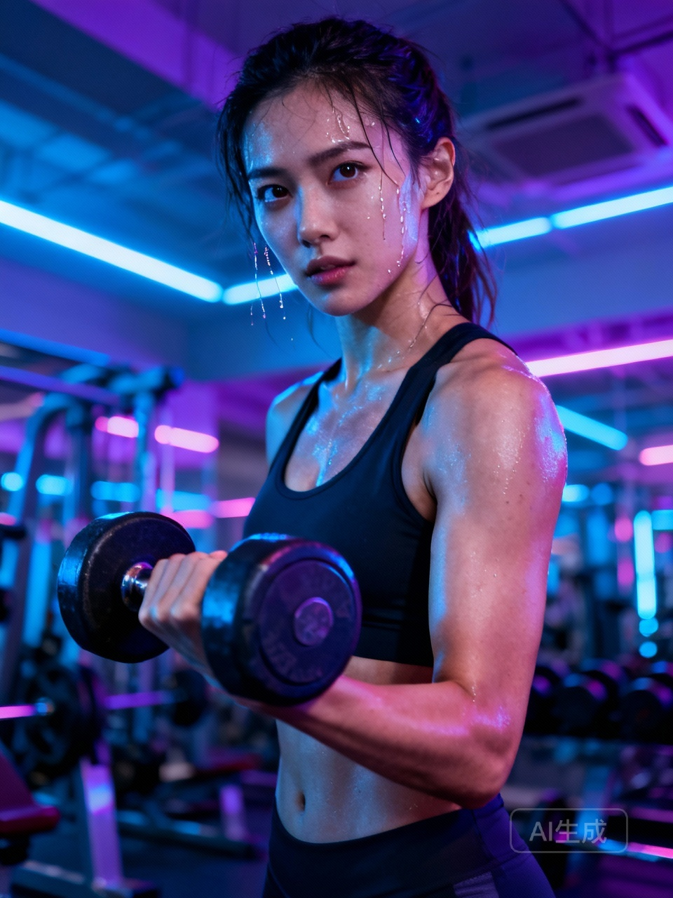 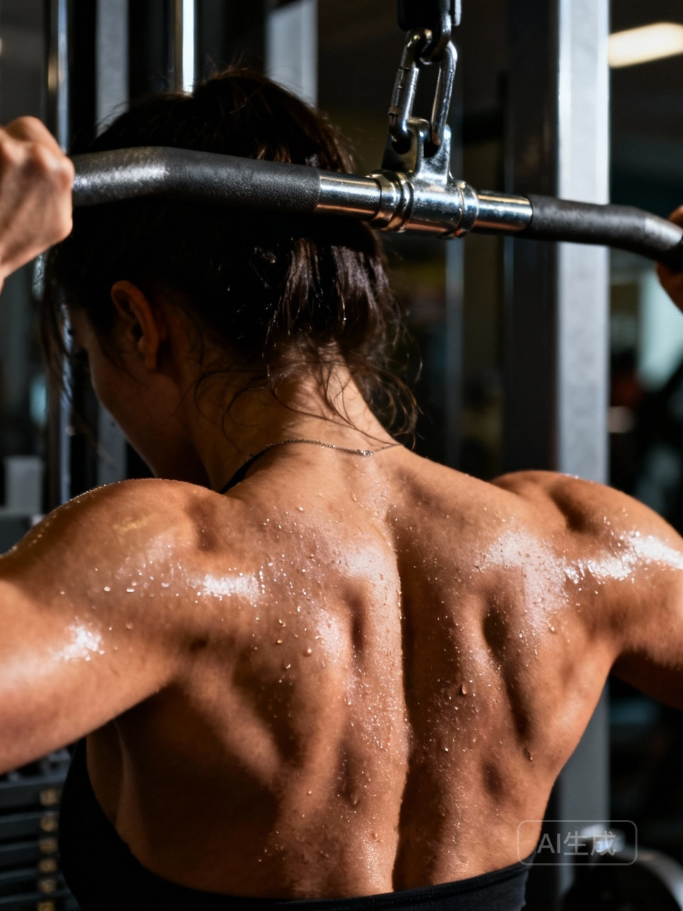 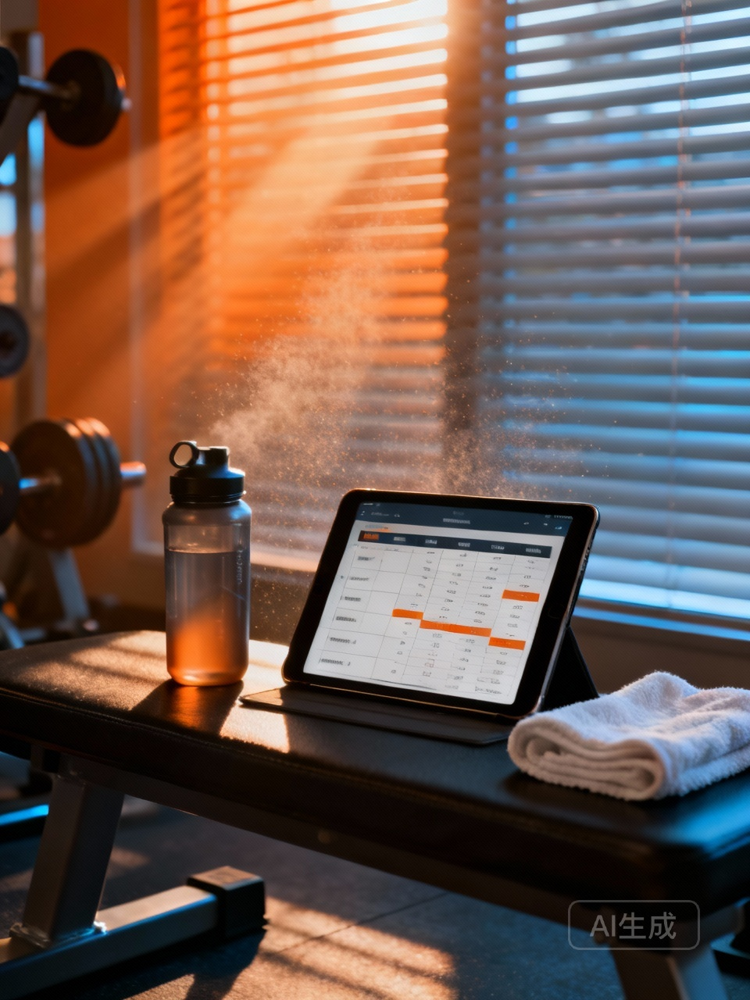 

 

---

 

## 梨形身材职场通勤穿搭合集，要求标注单品品牌和价格区间，封面图需纵向拼图展示。

### 📝 文案内容

\# 需求：梨形身材职场通勤穿搭合集，要求标注单品品牌和价格区间，封面图需纵向拼图展示。

梨形身材的姐妹们，是不是每次买裤子都要哭？胯宽、假胯宽、大腿粗，明明上半身很瘦，下半身却像两个秤砣？

其实梨形身材穿好了真的很有女人味！只要掌握扬长避短的公式，职场通勤也能穿出纸片人的既视感。今天整理了4套我私藏的梨形显瘦穿搭，从百元到轻奢都有，直接照抄作业！

Look 1：藏肉神器 A字裙套装
这套真的谁穿谁瘦！重点在于上宽下窄，利用挺括的西装外套增加肩部量感，完美平衡宽胯，A字裙直接把大腿肉肉藏得严严实实。

单品：
西装外套：Massimo Dutti（500-800元）
内搭吊带：Uniqlo U系列（99元）
高腰A字半裙：Zara（299元）
鞋子：黑色乐福鞋（300元左右）

Look 2：干练大女主衬衫配直筒裤
不想穿裙子的时候，直筒裤就是梨形的本命！一定要选垂坠感好的面料，千万别选紧身包臀的。把衬衫扎进裤子里，腰线拉高，腿长一米八。

单品：
垂感衬衫：COS（600-900元）
直筒西装裤：Theory（1000-1500元）
极简腰带：H&M（99元）
包包：Polene（800-1200元）

Look 3：温柔针织配阔腿裤
周五或者见客户的时候，这套既温柔又有气场。V领设计拉长脖子线条，阔腿裤直接把腿型拉直，走路带风。

单品：
V领针织衫：Sandro（800-1200元）
高腰阔腿裤：UR（300-400元）
尖头高跟鞋：Stuart Weitzman（1500-2000元）

Look 4：马甲叠穿显高挑
小个子梨形看过来！马甲能增加上半身的量感，视觉上平衡宽胯，百褶裙灵动又减龄，通勤也不会显得太幼稚。

单品：
白T恤：Basic House（150元）
西装马甲：H&M（200-300元）
百褶长裙：优衣库（299元）

梨形身材穿搭核心口诀：
1. 提高腰线，制造三七分比例
2. 适当露出最细的脚踝
3. 增加肩部线条，平衡下半身量感

这四套你们最喜欢哪一套？评论区告诉我，或者把你的尺码困扰发出来，我来帮你参谋！

\#梨形身材 #职场穿搭 #通勤穿搭 #显瘦穿搭 #梨形身材穿搭 #ootd #我的穿搭日记 #职场打工人 #微胖穿搭 #胶囊衣橱

### 🖼️ 图片展示

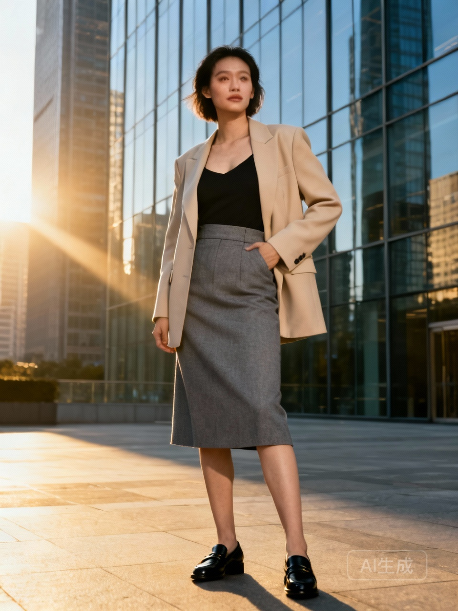 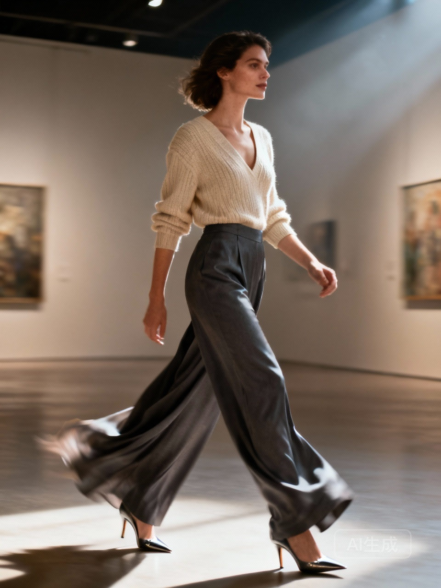 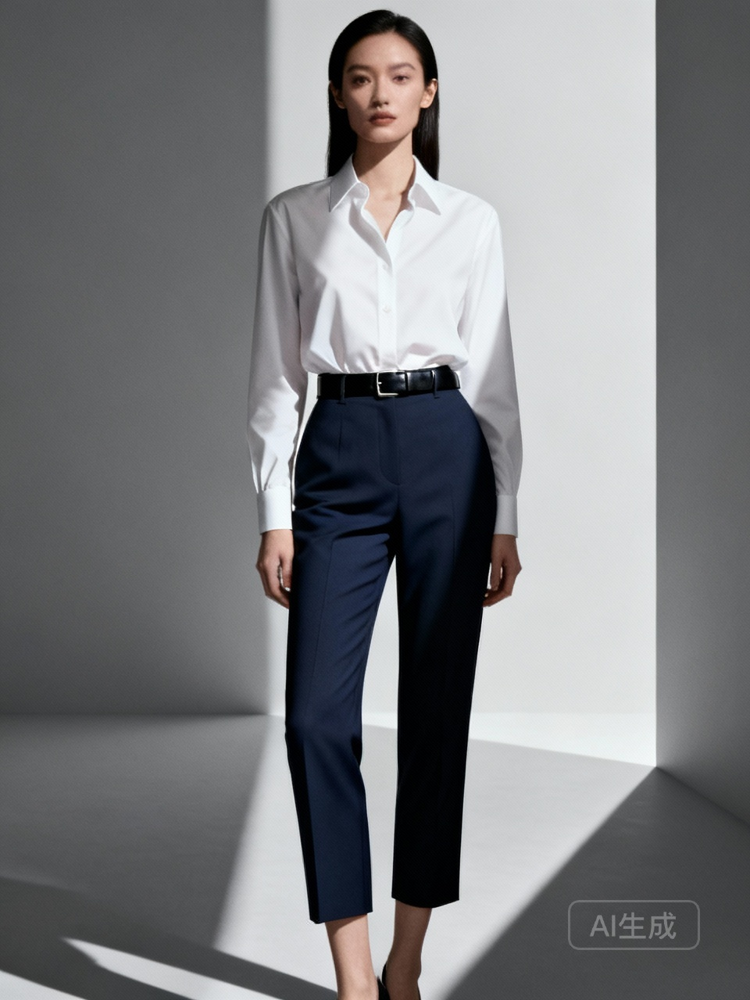 

 

---

 

## 租房改造ins风卧室教程，列明PDD采购清单和改造耗时，重点标注百元好物链接。

### 📝 文案内容

\# 需求：租房改造ins风卧室教程，列明PDD采购清单和改造耗时，重点标注“百元好物”链接。

谁懂啊家人们！终于把那个又暗又丑的出租屋，变成了我梦里的ins风奶油小窝！😭 真的太香了，每天下班只想立刻飞奔回家！

其实改造真的不需要花大钱，也不需要砸墙动土。只要选对软装，几十块钱就能让房间大变样！今天把我的压箱底攻略和PDD采购清单全部交出来，手把手教你低成本逆袭！👇

🛒 必入PDD采购清单（亲测好用）

1. 奶油风遮光窗帘
   租房神器！一定要选遮光率高的，瞬间提升房间私密感和质感。

2. 氛围感日落灯 [百元好物]
   这绝对是改造的灵魂！一开灯，整个房间瞬间有了电影滤镜，拍照巨出片，几十块钱的快乐谁懂！

3. 蜜桃色/奶咖色四件套
   床品占据了卧室的一半视觉，一定要选纯棉的，颜色要耐看，那种慵懒感一下子就出来了。

4. 长毛地毯 [百元好物]
   铺在床边，光脚踩上去软乎乎的，幸福感爆棚！而且还能遮住地板原本的瑕疵。

5. 免打孔洞洞板
   收纳神器，用来放耳机、钥匙、发圈，墙上也不空了，还省了买收纳架的钱。

⏰ 改造耗时记录

真的超级简单！我一个人只花了一个周六的下午，大概3个小时左右。
擦灰整理1小时 + 铺床品挂窗帘1.5小时 + 调整装饰细节0.5小时。
完全不需要请师傅，女生也能轻松搞定！

💡 改造小Tips

尽量统一房间色调，比如我就选了奶白色+原木色，这样看起来空间更大更整洁。
灯光是关键，主灯可以关掉，多用台灯、落地灯、灯串来营造氛围。

租房不是将就，生活是自己的！希望这篇笔记能给你一点灵感，赶紧动起来吧！✨

\#租房改造 #ins风 #卧室改造 #平价好物 #租房 #软装搭配 #我的装修记录 #PDD好物 #百元好物

### 🖼️ 图片展示

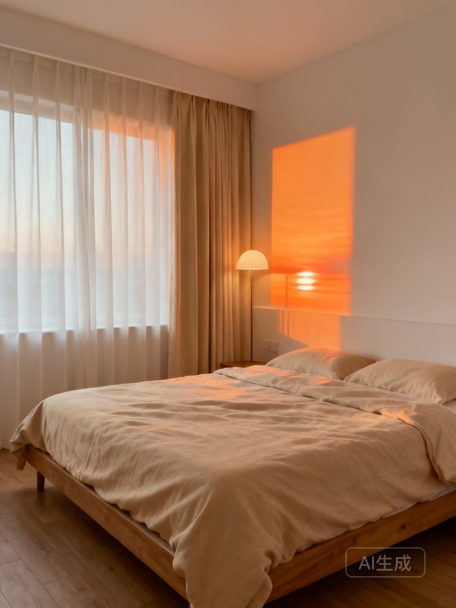  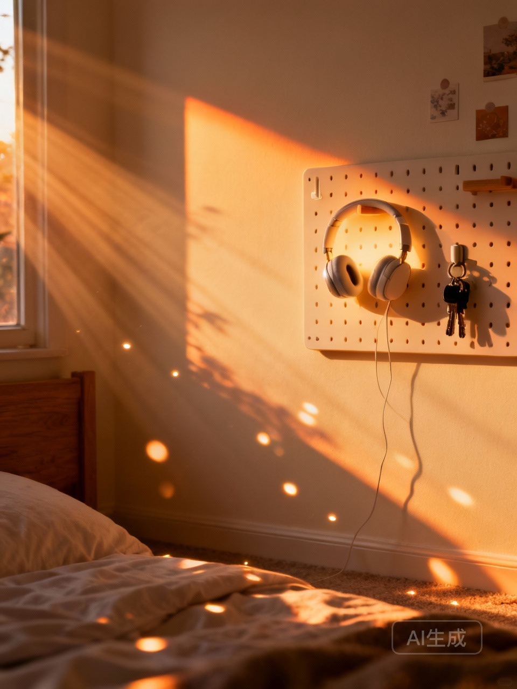 

 

---

 

## 考研自习室好物推荐，需包含计时器、降噪耳机等实物测评，结尾加励志语录卡片。

### 📝 文案内容

\# 需求：考研自习室好物推荐，需包含计时器、降噪耳机等实物测评，结尾加励志语录卡片。

考研人最怕什么？不是题太难，而是心太乱！
自习室里翻书声、咳嗽声、甚至隔壁桌的抖腿声，都在疯狂试探你的底线。今天把压箱底的「沉浸式备考神器」掏出来，帮你把效率拉满，拒绝无效内耗！

🎧 降噪耳机：物理隔绝外界的结界
别买那种只听个响的，要选ANC主动降噪强的！
戴上的一瞬间，世界仿佛按下了静音键，只剩下笔尖在纸上摩擦的沙沙声，这种安全感真的绝了。
推荐头戴式，虽然夏天稍微热点，但包裹感无敌，戴久了耳朵完全不疼。
重点：千万不要连蓝牙听歌！纯降噪模式才是yyds，实在不行就听白噪音，歌词绝对是专注力的天敌。

⏳ 实体计时器：把时间具象化
千万别用手机倒计时！看一眼时间，顺便回个消息，半小时就没了。
这种复古的番茄钟，拧一下就开始，看着红色的倒计时一点点减少，紧迫感瞬间拉满。
有的带滴答声，有的可以静音，看个人喜好。
当你把时间变成看得见的进度条，你会发现，原来自己一天真的能专注10个小时。

✨ 还有一些提升幸福感的小细节
比如一个贴合腰部的坐垫，久坐不累，脑子才能转得快；
再比如一支速干的笔，写题不脏手，心情都会变好。

最后，送给正在坚持的你：

> “星光不问赶路人，时光不负有心人。
> 你背单词时，阿拉斯加的鳕鱼正跃出水面；
> 你算数学时，太平洋彼岸的海鸥振翅掠过。
> 请相信，那些看似不起眼的日复一日，
> 终会在将来的某一天，突然让你看到坚持的意义。”

大家还有什么私藏的备考神器？评论区互相安利一下！
加油，岸上见！

\#考研 #考研自习室 #备考好物 #沉浸式学习 #考研加油 #自律 #降噪耳机 #计时器 #学习日常 #研究生考试

### 🖼️ 图片展示

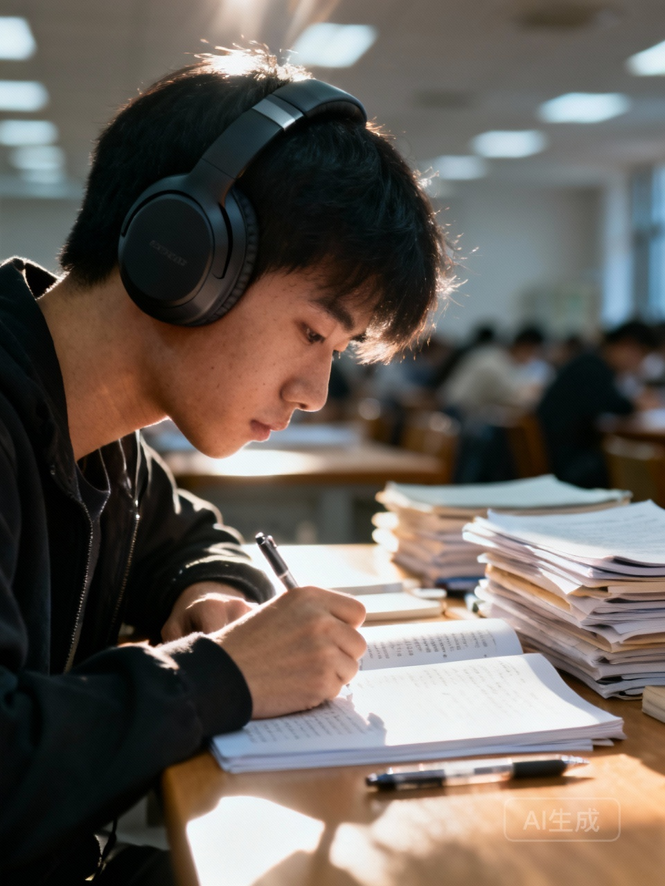   

 

---

 

## 职场新人通勤包选购攻略 对比托特包、双肩包、腋下包的容量和材质 标注品牌和价格区间

### 📝 文案内容

\# 需求：职场新人通勤包选购攻略 对比托特包、双肩包、腋下包的容量和材质 标注品牌和价格区间

宝子们！早八通勤真的太痛苦了😭 每天背着像砖头一样的包挤地铁，肩膀都要断了💔 作为刚入职场的打工人，选对通勤包真的太重要了！今天就来给姐妹们扒一扒，到底哪种包包才是职场新人的本命通勤包🎒 让我们告别沉重，优雅上班✨

1️⃣ 托特包：容量王者，装得下全世界🌍
托特包真的是打工人最离不开的！能装电脑、能装文件、甚至能装健身衣👕 但是！一定要注意自重！有些皮质托特包自重比电脑还重，那是真的要命🚫
✅ 优点：容量巨大，取物方便，气场干练💼
❌ 缺点：包身软塌容易变形，重物多了肩膀痛
👜 品牌推荐：
Longchamp 尼龙系列：轻便耐用，防水好打理，价格 500-1000r💰
Celine 凯旋门老花：皮质硬挺，贵气十足，适合预算充足的姐妹，价格 15000r+💸
Zara/UR 平价款：款式多，适合过渡期，价格 100-300r🏷️

2️⃣ 双肩包：解放双手，护脊神器💆‍♀️
如果你通勤距离长，或者需要带电脑，双肩包绝对是首选🚀 现在的双肩包设计都很简约，完全不会显得幼稚哦👶
✅ 优点：受力均匀，解放双手，防水耐磨🛡️
❌ 缺点：夏天背容易出汗，有时候显得不够正式
🎒 品牌推荐：
Rains 防水背包：下雨天也不怕，极简风，颜值超高，价格 800-1200r🌧️
Freitag 独一无二：环保回收材质，每个包都不同，个性十足，价格 1000-2000r♻️
Doughnut/JanSport：性价比之王，学生党过渡首选，颜色多，价格 200-500r🌈

3️⃣ 腋下包：精致时髦，气场全开💃
这种包真的太显气质了！上班开会背它，立马感觉气场两米八👠 但是容量真的感人，只能装下iPad mini和补妆包💄
✅ 优点：造型感强，提升穿搭精致度，轻便小巧🧚‍♀️
❌ 缺点：容量极小，带不了电脑，肩带细容易勒
👛 品牌推荐：
Polène Numéro Dix：法式慵懒，皮质软糯，设计感绝了，价格 2000-3000r🇫🇷
By Far：复古漆皮，很有辨识度，适合凹造型，价格 1500-2500r🍒
Songmont 菜篮子：国货之光，容量稍微大一点，自重轻，价格 500-1000r🇨🇳

总结一下给姐妹们📝
📍 需要带电脑+挤地铁：选轻便双肩包，护腰护肩最重要！
📍 办公文件多+追求气质：选皮质硬挺的托特包，能装又好看！
📍 轻办公+注重穿搭：选精致的腋下包，上班也能美美的！

宝子们你们现在的通勤包是哪一种呀？快在评论区告诉我吧👇 我也要去蹲蹲好物推荐！别忘了点赞收藏哦，不然划走就找不到啦❤️

\#职场通勤 #通勤包 #职场穿搭 #包包推荐 #双肩包 #托特包 #腋下包 #打工人 #入职好物 #职场新人 #好物分享 #我的平价好物 #通勤穿搭

### 🖼️ 图片展示

   

 

---

 

## 迪士尼玲娜贝儿互动全攻略，包含预约技巧、拍照动作模板，结尾添加魔法用语彩蛋。

### 📝 文案内容

\# 需求：迪士尼玲娜贝儿互动全攻略，包含预约技巧、拍照动作模板，结尾添加“魔法用语”彩蛋。

终于见到我的小狐狸女儿了！这次去迪士尼真的做足了功课，不仅成功约到了见面会，还拿到了超多独家互动！整理出来的保姆级攻略，一定要码住，不然刷着刷着就找不到啦！

关于预约，真的不能佛系！

一定要提前下载好上海迪士尼度假区APP，绑定好门票。
每天早上7点准时蹲守，不要等到7点01分，好位置真的秒没！
如果显示约满了，不要马上退出，多刷几次，有时候会有候补名额掉落。
记得选早上的场次，贝儿刚上班状态最好，互动也最积极！

怎么让贝儿一眼看到你？

穿搭尽量选粉色系或者带有狐狸元素的，贝儿对同色系的小朋友特别偏爱！
一定要带礼物！手工做的花朵、画着她的画，或者她最爱的蝴蝶结。当她看到你的礼物时，那个惊喜的眼神真的能融化心！
互动的时候可以稍微大声一点喊她的名字，或者挥挥手，她真的很喜欢被关注的感觉。

拍照不想尴尬？试试这几个万能动作：

摸鼻杀：贝儿超级喜欢摸鼻子，你也跟着摸，同款可爱get！
牵手手：伸出手，她会主动过来牵你，那一刻真的心跳加速！
比心歪头：贝儿歪头杀太绝了，你也跟着歪头比心，默契度满分。
假装惊讶：当她送你飞吻或者做动作时，捂住嘴巴假装惊讶，抓拍最自然。

最后是大家最想要的魔法用语彩蛋！

见到她的时候，试着大声说：“贝儿，看这里！”或者“贝儿，飞一个！”
如果她心情好，你还可以说：“贝儿，你的耳朵好可爱呀！”她可能会害羞地捂住耳朵哦！

去迪士尼见贝儿真的是治愈心灵的旅程。希望大家都能和女儿拥有完美的约会！记得点赞收藏，下次去的时候直接照着做！

\#迪士尼 #玲娜贝儿 #迪士尼攻略 #上海迪士尼 #玲娜贝儿见面会 #迪士尼拍照 #迪士尼乐园

### 🖼️ 图片展示

   

 

---

 

## 需要一篇春日野餐攻略笔记，附穿搭和滤镜建议，标题带氛围感关键词，3张图+文字模板。

### 📝 文案内容

\# 需求：需要一篇春日野餐攻略笔记，附穿搭和滤镜建议，标题带“氛围感”关键词，3张图+文字模板。

抓住春天的尾巴，去赴一场浪漫的约会吧。阳光、草地、微风，这才是春天该有的样子呀。整理了一份超全的春日野餐攻略，包括穿搭和滤镜参数，姐妹们赶紧码住！

关于野餐布置的小心思

*   选址：一定要找有树荫的草坪，阳光透过树叶洒下来的斑驳光影，是营造氛围感的关键。
*   餐具：带点藤编的篮子、透明的玻璃杯，再买一束自己喜欢的鲜花，随便一摆就是大片。
*   食物：准备一些颜色鲜艳的水果、三明治和起泡酒，不仅好吃，更是最好的拍照道具。

超好拍的春日穿搭建议

*   风格：法式复古风或者韩系温柔风最出片。
*   单品：白色连衣裙是永远的神，或者浅色针织衫搭配牛仔裤，清新又自然。
*   配饰：草帽、珍珠项链、墨镜，这些小细节能瞬间提升精致度。

保姆级拍照滤镜教程

*   时间：下午3点到5点，光线最柔和，自带柔光滤镜。
*   角度：俯拍全景展示氛围，或者侧身抓拍，不看镜头最自然。
*   滤镜参数（醒图）：
    *   滤镜：奶油+50
    *   调节：亮度+10，对比度-5，色温+5，颗粒+15，高光-10

在这个美好的季节，约上三五好友，或者一个人去享受独处的时光，去感受春天的气息吧。

这个周末你打算去哪里踏青呢？评论区告诉我呀～

\#春日野餐 #氛围感 #春游 #拍照姿势 #OOTD #春日穿搭 #野餐攻略 #滤镜调色

### 🖼️ 图片展示

   

 

---

 

## 面试妆容教程 突出亲和力和专业感 列出化妆品清单并标注防水防脱妆技巧

### 📝 文案内容

\# 需求：面试妆容教程 突出“亲和力”和“专业感” 列出化妆品清单并标注防水防脱妆技巧

宝子们！面试季真的来啦！是不是还在纠结化什么妆去面试？太浓显得不稳重，太淡又没气色😰 今天手把手教大家打造那种一看就很靠谱但又很好相处的面试妆！HR看了都想加你微信的那种！😍 这种妆容的精髓就是：伪素颜 + 提气色！我们要的是那种妈生好皮的感觉，让面试官觉得你精力充沛，做事干练✨

📝 面试必备化妆品清单请查收：

1️⃣ 底妆类：选那种清透持久的粉底液，色号一定要选跟脖子颜色最接近的，千万别假白哦！假面感太重会显得不真诚🙅‍♀️ 遮瑕力中等偏上就可以，重点遮一下黑眼圈和痘印，整个人看起来精神百倍！

2️⃣ 眉笔：一定要选灰棕色或者深咖色！千万别用死黑色！画出根根分明的毛流感，野生眉最显亲和力，看起来温柔又好相处🌿

3️⃣ 眼影：大地色盘yyds！只晕染眼尾和双眼皮褶皱内，消肿又深邃，绝对不要带闪片！低调才是王道👁️

4️⃣ 眼线：棕色眼线笔填充睫毛根部，眼尾自然拉出一点点即可，不要上挑太夸张，内双的姐妹可以省略这一步👀

5️⃣ 口红：豆沙色或者干枯玫瑰色是首选！薄涂就是温柔本人，厚涂气场也在线，显得唇色饱满但不张扬💄

6️⃣ 散粉：透明散粉定妆，打造磨皮质感，拒绝油光满面，清爽干练才是职场人的标配💨

🌧️ 防水防脱秘籍大公开，关键时刻绝对不能掉链子：

✅ 妆前乳不能少！尤其是混油皮的姐妹，控油做好了，底妆才扒得牢，就算紧张出汗也不怕斑驳🧴

✅ 三明治定妆法！粉底前喷一层定妆喷雾，上完粉底再喷一层，最后压上散粉，这招真的绝绝子，锁妆力满分💯

✅ 烘焙定妆法！用粉扑厚厚铺一层散粉在眼下和T区，静置几分钟后扫掉，带妆一整天都不怕脱，卡粉拜拜👋

✅ 眼线和口红一定要选防水的！面试万一紧张出汗了，也不怕变成小花猫，时刻保持优雅🐱

✅ 出门前最后再喷一层定妆喷雾，这可是封印妆容的最后一步，带妆十小时都没压力⏰

赶紧收藏起来照着画，调整好心态，自信的你最美丽！祝大家都能顺利拿到心仪的Offer，我们岸上见呀！冲鸭！🚀

\#面试妆容 #职场新人 #妆容分享 #面试技巧 #伪素颜妆容 #防脱妆 #亲和力妆容 #专业感 #今日妆容 #职场化妆

### 🖼️ 图片展示

   

 

---

 

**幻境突围团队 · 2026年1月18日**
