# 项目内容整理汇总

> 本文档自动汇总了各个文件夹下的文案内容与已下载的图片。

---

## 不同城市天空颜色的对比记录

### 📝 文案内容

\# 需求：不同城市天空颜色的对比记录

谁懂啊家人们！我真的有在认真收集每一座城市的天空颜色！🌈 就像把不同城市的浪漫都装进了口袋里一样，每一次抬头都是惊喜！✨ 原来天空真的有性格，每座城市都有自己的专属滤镜，真的太绝了！🎨 感觉每一抹颜色都在诉说着当地的故事，太治愈了！💖

📍 北京的黄昏是那种厚重的鎏金，带着皇城的威严，一眼万年！🏯
📍 上海的暮色是魔幻的蓝紫调，霓虹灯亮起的时候，真的像电影画面！🌆
📍 大理的蓝天是那种纯净的克莱因蓝，看着就想深呼吸，太通透了！☁️
📍 成都的晚霞是温柔的粉橘色，软绵绵的，像这里的慢生活一样舒服！🥟
📍 沿海城市的海风蓝，清清爽爽，看着心情瞬间变好！🌊

每当翻看相册里的这些天空，当时的空气味道、耳边听到的声音、甚至当时的心情，全都涌上来了！🎒 这就是旅行的意义吧，把美好都定格在这一方小小的屏幕里！📸 真的建议大家都要养成抬头看天空的习惯，你会发现生活里的小确幸其实就在身边！🌟

宝子们，你们所在的城市天空是什么颜色的呀？快在评论区告诉我，或者晒出你拍到的绝美天空吧！👇 让我们一起拼凑出一张中国天空地图！🗺️

\#治愈系风景 #天空 #旅行日记 #城市色彩 #摄影 #我的小确幸 #每一帧都是热爱 #日落 #云朵收集者 #风景照

### 🖼️ 图片展示

 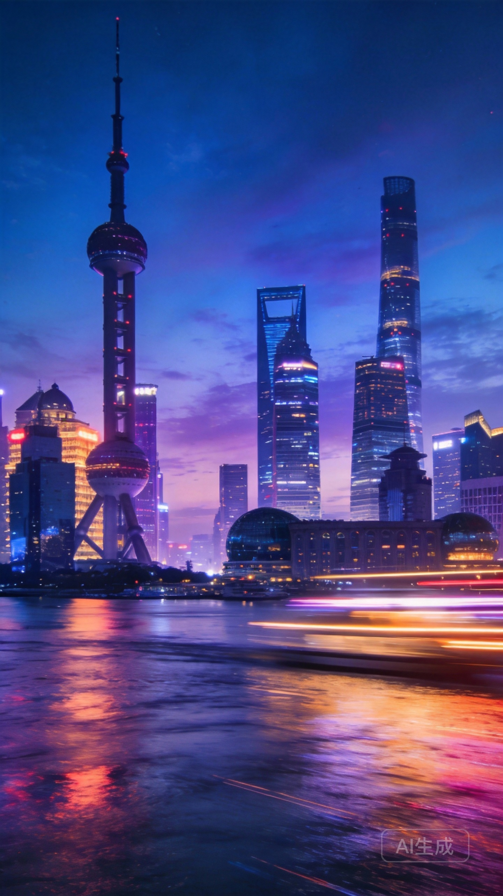  

 

---

 

## 失败菜谱意外创造出的惊喜味道

### 📝 文案内容

\# 需求：失败菜谱意外创造出的惊喜味道

救命🆘！本来想做舒芙蕾结果塌了，心态崩了💔！但是！咬了一口之后……我宣布这是本世纪最伟大的发明🤯！真的没想到翻车现场能变成神仙吃法✨！

事情是这样的👉，周末心血来潮想搞个高颜值早餐☀️，结果蛋白打发不到位，加上手抖牛奶倒多了🥛，原本蓬松的舒芙蕾直接变成了“一滩烂泥”🤮。本来想倒进垃圾桶的🗑️，但是本着不浪费粮食的原则（其实是穷😂），我还是把它倒进了平底锅🍳。

没想到啊没想到！出锅的那一刻香气直接冲天🌪️！虽然它长得丑丑的🥴，但是口感绝了！外皮焦脆，里面软糯像布丁🍮，蛋奶香超级浓郁🥚！完全没有失败的苦涩，只有惊喜的甜味🍯！这哪里是翻车，这简直是新大陆🌍！

给姐妹们复盘一下这个“意外惊喜”的做法👇，真的有手就会👏：

1️⃣ 准备两个鸡蛋🥚，加入适量牛奶🥛和低筋面粉🌾，搅拌到没有颗粒就行（不用打发！不用打发！这是重点📝）。
2️⃣ 锅里刷一点点油🧈，小火慢煎🔥，看到表面冒泡泡凝固就可以翻面啦🥞。
3️⃣ 两面金黄后出锅，淋上蜂蜜或者酸奶🍯，再撒点坚果碎🥜，颜值瞬间拉满💯！

真的姐妹们，有时候做饭不用太循规蹈矩🚫，意外的味道可能更惊艳💥！这道“失败版舒芙蕾”真的巨巨巨好吃😋！你们有没有过这种翻车变美食的经历呀🤔？快在评论区告诉我，让我笑一下（不是）👇！

\#翻车现场 #神仙吃法 #美食日常 #早餐吃什么 #懒人食谱 #意外惊喜 #厨房小白 #我的私藏美食 #治愈系美食

### 🖼️ 图片展示

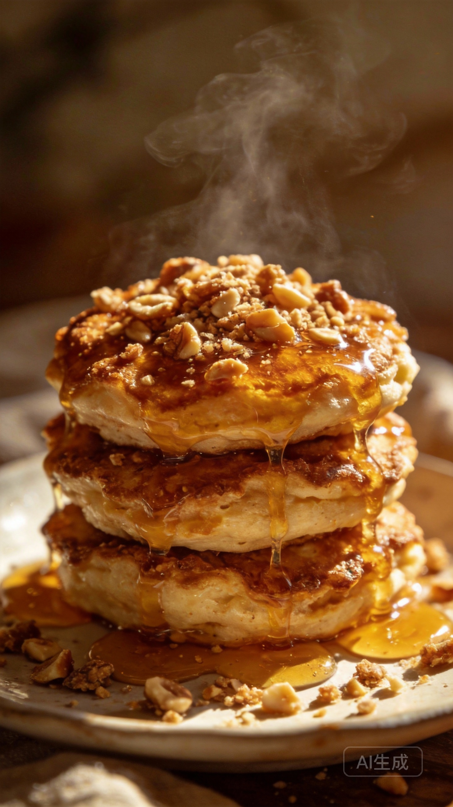 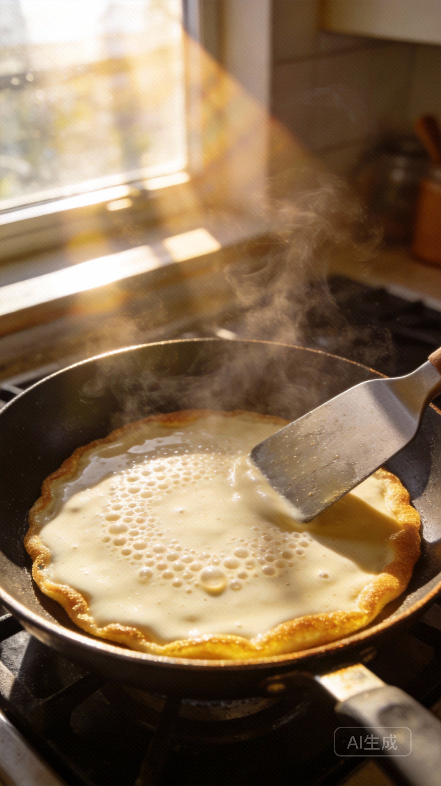 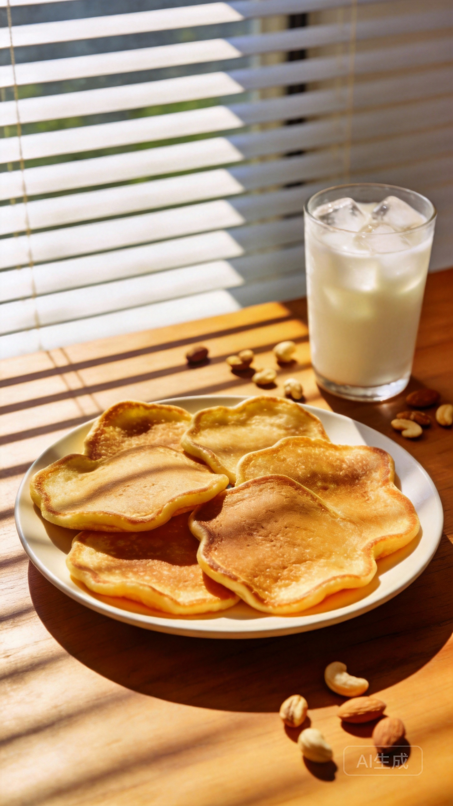 

 

---

 

## 收到一束花从盛开到干枯的全过程

### 📝 文案内容

\# 需求：收到一束花从盛开到干枯的全过程

宝子们！谁懂啊！收到花的那一刻真的会被治愈到！💐✨ 就像是平淡生活里突然闯入的一束光，瞬间照亮了整个房间，连空气里都弥漫着甜甜的味道～🏠💡🍬

刚收到的时候，每一朵都开得那么热烈，花瓣上还带着清晨的露珠💧，那种鲜活的生命力真的太迷人了！🌷💖 放在床头，连做梦都是粉红色的，感觉整个人都被爱意包围着！🛌💕

但是呀，花期总是有限的。🥀 看着它们一点点垂下头，颜色慢慢变深，边缘开始卷曲，其实心里有一点点小失落，但也觉得这是时间的魔法呀！⏳🪄 我不舍得就这样丢掉，于是决定把它们倒挂起来，做成干花！🪝🌿

你们看！现在的它们虽然失去了水分，却多了一种复古的质感！🎞️🍂 变成了那种淡淡的莫兰迪色系，像是被时光滤镜处理过一样，挂在墙上或者插在瓶子里，简直就是氛围感神器！🖼️🕯️ 比起鲜娇欲滴，我好像更迷恋这种经过岁月沉淀后的温柔～🥺🤎

📍 1️⃣ 收到花的时候是惊喜，满心欢喜 🎁
📍 2️⃣ 盛开的时候是陪伴，享受当下 🌸
📍 3️⃣ 枯萎的时候是告别，学会释怀 🍃
📍 4️⃣ 做成干花的时候是永恒，留住记忆 📸

其实花谢了也没关系，因为它们换了一种方式继续陪伴我。🌸➡️🍂 就像生活里的很多事情，虽然结果不如意，但过程中的美好已经足够温暖我们很久很久了。🔥❤️ 把浪漫做成标本，让时间都慢下来，这种感觉真的太棒啦！🕰️💫

你们收到花以后会怎么做呢？是扔掉还是也做成干花呀？快在评论区告诉我吧！👇💬 我也想看看大家的干花作品，互相取取经！👀🤳

\#鲜花 #干花 #生活碎片 #治愈系 #仪式感 #我的浪漫 #记录生活 #倒挂干花 #花艺 #氛围感 #时间标本 #生活美学 #收到花的快乐 #小红书爆款

### 🖼️ 图片展示

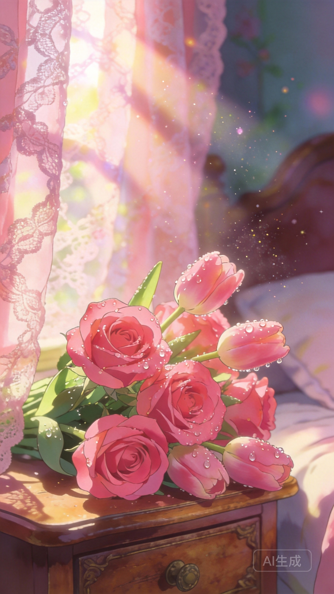 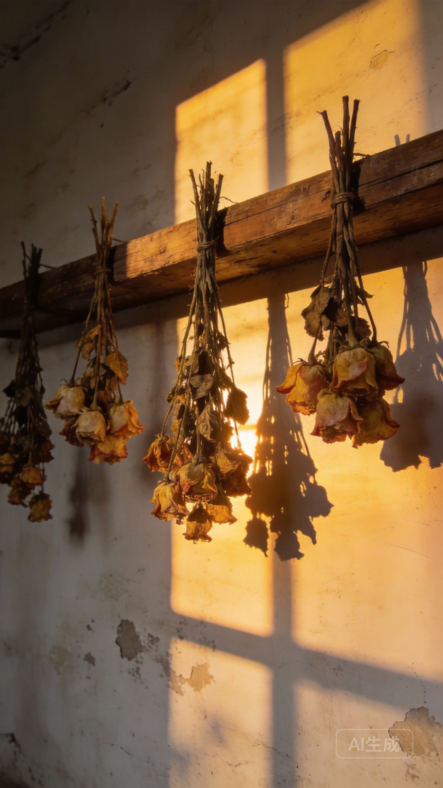 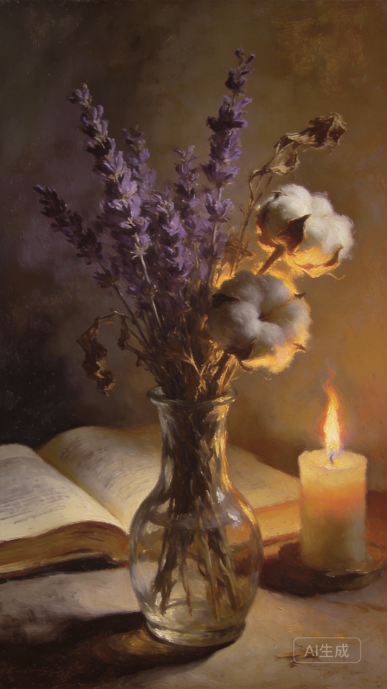 

 

---

 

## 旧物改造赋予物品第二次生命

### 📝 文案内容

\# 需求：旧物改造赋予物品第二次生命

家人们，真的别急着扔东西呀！✋ 哪怕是一个破旧的纸箱，一件不再穿的旧毛衣，只要稍微动动手，就能拥有全新的生命！🌿 今天要跟大家分享的，不仅仅是改造，更是一场关于“惜物”的治愈之旅～💖

每一件旧物都藏着时光的痕迹🕰️，它们陪伴我们走过了一段路，就这样丢进垃圾桶真的太可惜了😭。赋予它们第二次生命，其实也是在治愈我们自己呀✨。看着原本不起眼甚至要被丢弃的东西，一点点变成家里最亮眼的风景，那种成就感真的爆棚了！🚀

分享几个我私藏的改造小心得，手残党也能轻松拿捏👇

1️⃣ 善用“换色大法”🎨：不管是旧柜子还是玻璃瓶，只要刷上一层莫兰迪色系的漆，瞬间高级感拉满！🌸

2️⃣ 布料是灵魂🧵：把旧衣服上的蕾丝、纽扣剪下来，缝在旧抱枕上，复古风这不就来了吗？💃

3️⃣ 拼接的艺术🧩：碎掉的镜子不要扔，拼一拼贴在旧桌子上，波西米亚风简直绝绝子！🪞

改造后的这个角落，现在是我最爱待的地方☕️。阳光洒在上面的时候，仿佛能听到物品在说谢谢🥺。这种独一无二的设计，可是花多少钱都买不到的限量版哦！💎

姐妹们，你们家里有没有那种想扔又舍不得的东西呢？🤔 赶紧在评论区告诉我，说不定下一个改造灵感就来自你！👇 动手试试吧，真的很解压！💪

\#旧物改造 #变废为宝 #生活美学 #DIY手工 #家居好物 #治愈系 #环保生活 #我的改造日记

### 🖼️ 图片展示

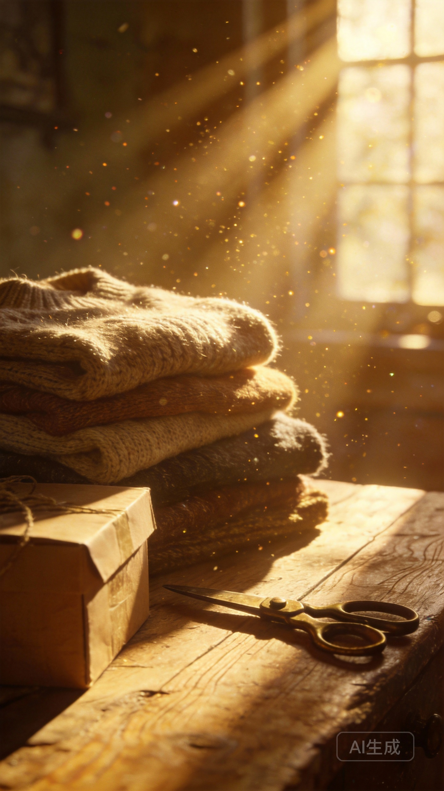 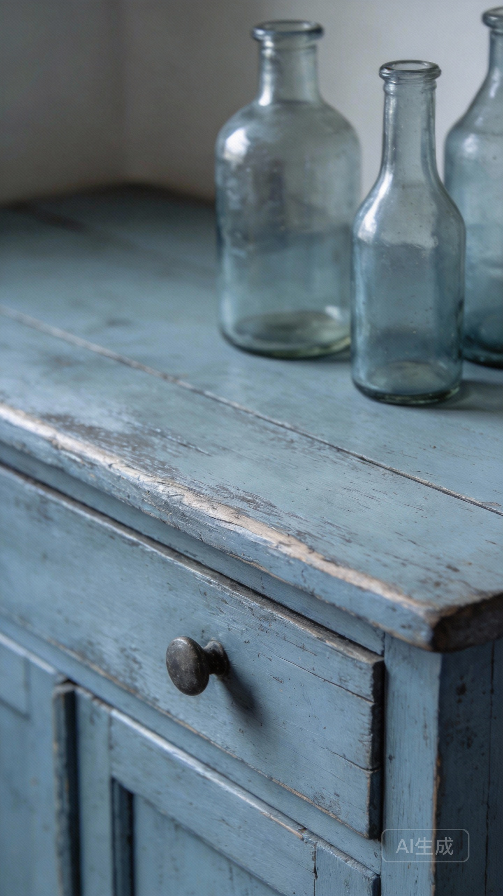 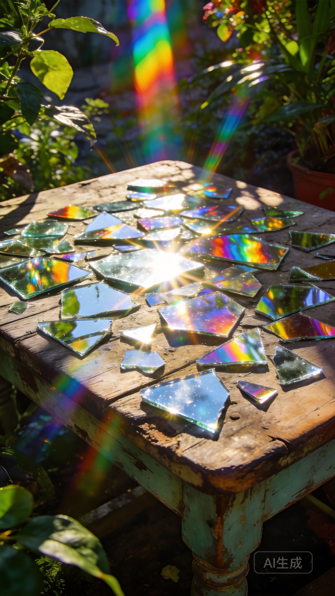 

 

---

 

## 菜市场里发现的季节限定食材

### 📝 文案内容

\# 需求：菜市场里发现的季节限定食材

姐妹们！今天去逛菜市场简直是挖到宝了！那种扑面而来的新鲜感，真的只有在这个季节才能体会到！🌿✨ 感觉整个春天的生命力都藏在摊位上了！🥬🛒

走进菜市场的那一刻，真的被满眼的绿色治愈了！🌱 空气里都是泥土和蔬菜混合的清香，这就是最真实的人间烟火气呀！🔥 每一个摊位都像是在开盲盒，不知道下一个转角会遇到什么惊喜！🎁👀

今天特意整理了我在角落里发现的这几样季节限定，错过真的要等一年！📅🚫

📍 1. 春笋：真的太嫩了！剥开壳里面白白胖胖的，看着就忍不住想咬一口！🦷💦 用来油焖或者炖肉，鲜掉眉毛！🤤
📍 2. 蚕豆：现在的蚕豆是最好吃的季节！外壳绿得发亮，豆仁软糯香甜！🫛💚 简单清炒一下就是顶级美味！
📍 3. 香椿：虽然价格小贵，但是这个味道真的无法替代！🌳💰 摊头阿姨说再不吃就要老了，赶紧抓了一把回去炒鸡蛋！🍳🥚
📍 4. 荠菜：野生荠菜的香味真的太绝了！🌼🍃 包饺子或者做豆腐羹，鲜到心里去了！🥟🥣

提着满满一大袋战利品回家，洗洗切切下锅，厨房里瞬间飘满了鲜甜的味道！🏠🍲 这种不时不食的仪式感，真的太让人满足了！😋✨ 感觉吃进嘴里的每一口都是大自然的馈赠！🌍🎋

你们最近逛菜市场有没有发现什么宝藏食材呀？🤔 快在评论区告诉我，我们一起去抄作业！📝💬 也可以晒出你买的时令菜哦！📸👇

\#菜市场 #人间烟火气 #季节限定 #不时不食 #我的美食日记 #菜市场里的宝藏 #春日美食 #治愈系风景 #今天吃什么 #逛菜市场

### 🖼️ 图片展示

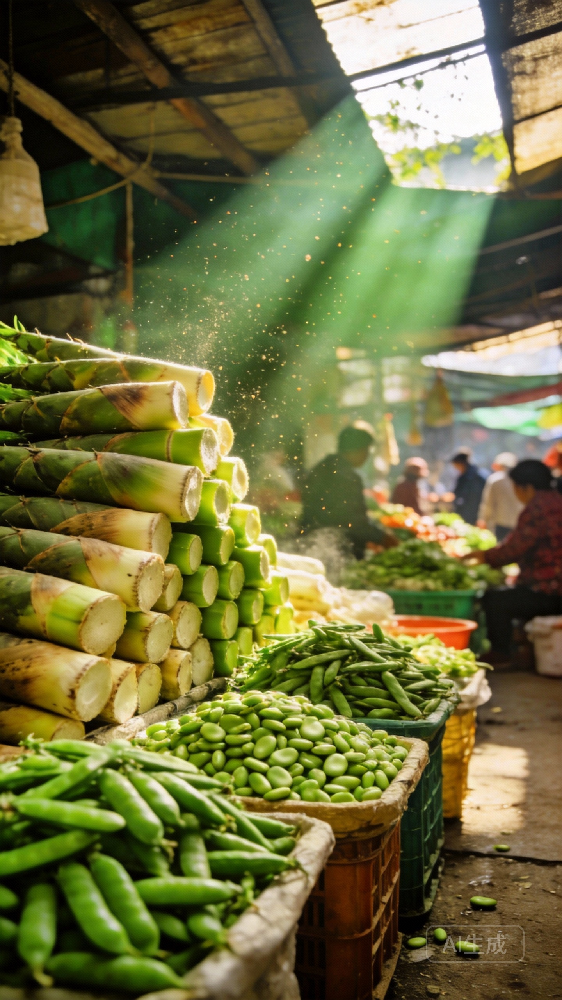 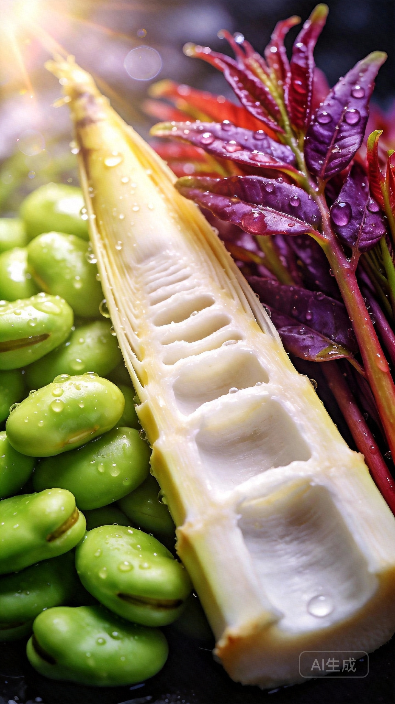 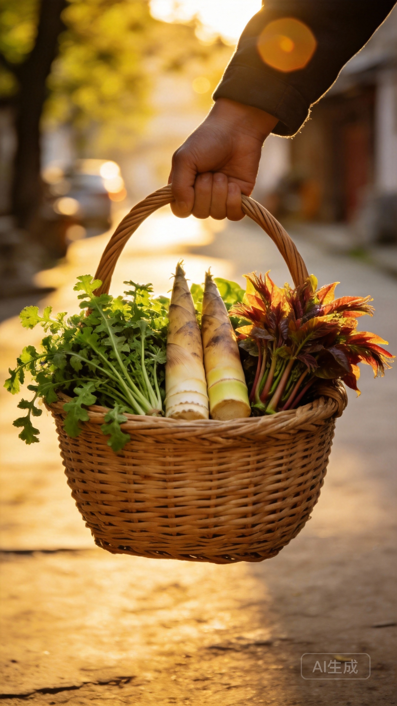 

 

---

 

## 行李箱里暗藏的收纳哲学

### 📝 文案内容

\# 需求：行李箱里暗藏的收纳哲学

宝子们！谁懂啊！以前每次出门打包都像打仗，箱子乱得像垃圾场，找件衣服要把整个箱子翻个底朝天！😭 直到我悟出了这套行李箱收纳哲学，现在的我，24寸箱子能装下半个家，而且拿取东西超级丝滑！✨ 今天就把我的压箱底秘籍统统交出来，赶紧码住！📝

1️⃣ 做减法是第一步！真的不要把衣柜搬空！出门前先列好清单，按穿搭公式来，一衣多穿才是王道！👗 我习惯把衣服按上身、下身、内衣分类，这样不仅找起来快，还能避免箱子里的衣服乱跑。🧥

2️⃣ 卷卷法真的yyds！T恤、裤子卷起来不仅省空间，还不容易起皱！👕 像这种软塌塌的衣服，一定要卷得紧紧的。外套和大衣我就用干洗袋套好放在最上面，防止弄脏。🧼 还有！一定要用各种尺寸的收纳袋！把零碎的小物件统统装进去，瞬间强迫症都被治愈了！💊

3️⃣ 缝隙里全是黄金！鞋子里一定要塞满袜子或者数据线，不然就是浪费空间！👟 洗漱包这种硬硬的东西，就塞在箱子的四个角落，或者轮子上面的凹槽里，完美卡位！🪥 哪怕是一根充电线，也要卷好固定好，不要让它们在箱子里缠成一团乱麻！🔌

其实收纳不仅仅是整理物品，更是整理心情。当你打开行李箱，看到所有东西都井井有条，那种幸福感真的爆棚！🥰 出门在外，一个整洁的箱子能给你满满的安全感！🔒

你们有什么独家打包小妙招吗？快在评论区告诉我，我要去偷师！👇 喜欢这篇笔记的宝子记得点个小心心哦！❤️

\#行李箱收纳 #旅行打包 #收纳整理 #生活小妙招 #提升幸福感 #出门在外 #强迫症治愈 #我的收纳哲学

### 🖼️ 图片展示

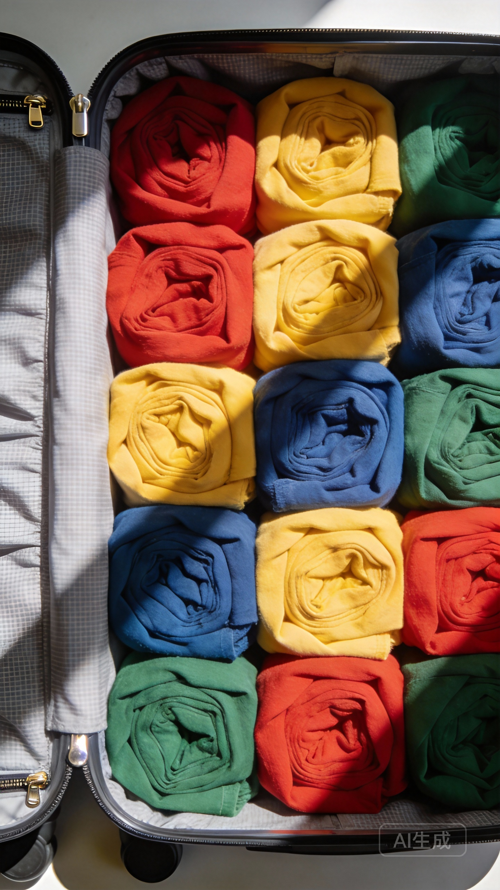  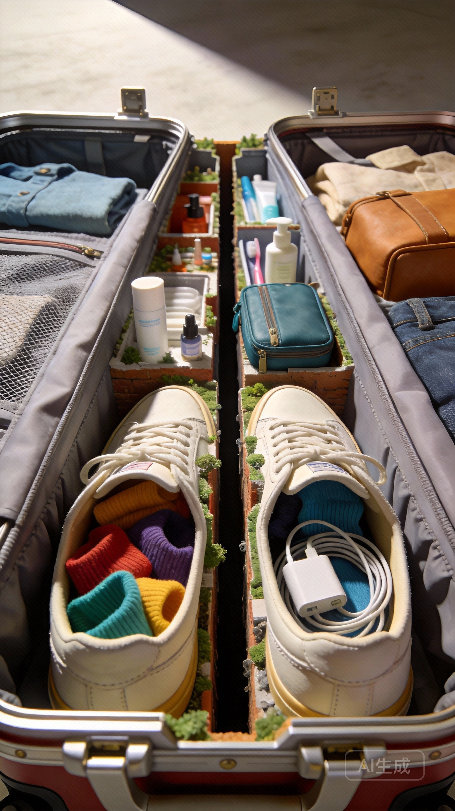 

 

---

 

